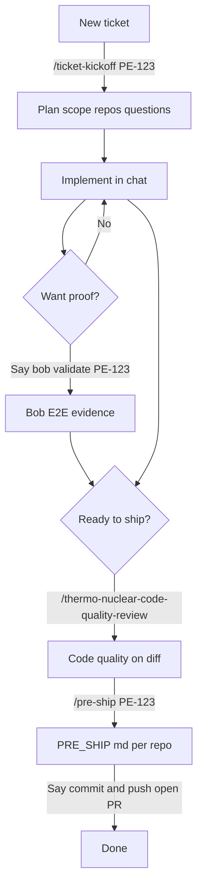

# Ashutosh - Novopay workflow (one page)

**Flowchart legend:** `/command` = slash command (exact sample) | **Say ...** = type in chat (natural language)

## Happy path (ticket to PR)

## If you want this, use this

| I want to... | Do this |
|--------------|---------|
| Start a ticket | `/ticket-kickoff PE-123` |
| Explain scope / raw idea | Normal chat, or kickoff above |
| Prove it works (API + DB + logs) | Say **"bob validate PE-123"** or **"bob let's test"** |
| Big diff before merge | `/thermo-nuclear-code-quality-review` |
| PR description files (diagrams, UTs, cross-repo) | `/pre-ship PE-123` |
| Commit / push / PR | Say **"commit and push"** or **"open PR"** |
| Prod logs grep pack | `/rca-logs` then describe issue in same message |
| Full incident doc (git history, when it broke) | Say **"root cause for PE-123"** |
| Unit tests for CC change | `/cc-backend-test-generation` (optional) |

## Prod incident (side path)

## Rules you do not need to remember

- Bob **never** auto-runs after a code fix - only when you ask to test.
- Hooks handle chat hygiene / memory - no commands for that.
- Glass automations under `novopay/.cursor/automations/` are optional - use `/` commands instead.

## Where config lives (this repo)

| Need | Path in cursor-markdowns |
|------|--------------------------|
| This cheat sheet | `WORKFLOW.md` |
| Slash commands | `novopay/.cursor/commands/` |
| Incident RCA format | `user/.cursor/rules/incident-analysis-format.mdc` |
| Orchestrator prefs | `user/.cursor/rules/novopay-orchestrator.mdc` |
| Sync backup | `python sync-cursor-backup.py` |
