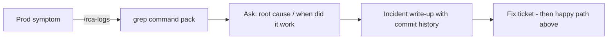

# Ashutosh - Novopay workflow (one page)

**Type `/` in Agent chat** for commands. Everything else is normal chat.

## Happy path (ticket to PR)

```mermaid
flowchart TD
  A[New ticket] -->|"/ticket-kickoff ID"| B[Plan: scope, repos, open questions]
  B --> C[Implement in chat - one ticket per chat]
  C --> D{Want proof?}
  D -->|No| C
  D -->|"bob let's test" or "/prove-ticket ID"| E[Bob E2E + evidence in docs/tdd-runs/ID/]
  E --> F{Ready to ship?}
  C --> F
  F -->|"/thermo-nuclear-code-quality-review"| G[Code quality pass on diff]
  G -->|"/pre-ship ID"| H[PRE_SHIP_*.md per repo - paste into GitHub PR]
  H --> I[You say: commit / push / open PR]
```

## If you want this, use this

| I want to... | Do this |
|--------------|---------|
| Start a ticket | `/ticket-kickoff PE-123` |
| Explain scope / raw idea | Normal chat, or kickoff above |
| Prove it works (API + DB + logs) | **Only when you choose:** "bob validate PE-123" or `/prove-ticket PE-123` |
| Big diff before merge | `/thermo-nuclear-code-quality-review` |
| PR description files (diagrams, UTs, cross-repo) | `/pre-ship PE-123` |
| Commit / push / PR | Ask explicitly - agent never auto-commits |
| Prod logs grep pack | `/rca-logs` + service, date, mobile/stan |
| Full incident doc (git history, when it broke) | Ask: "root cause for ..." (incident rule applies) |
| Unit tests for CC change | `/cc-backend-test-generation` (optional) |

## Prod incident (side path)



## Rules you do not need to remember

- Bob **never** auto-runs after a code fix - only when you ask to test.
- Hooks handle chat hygiene / memory - no commands for that.
- Glass automations under `novopay/.cursor/automations/` are optional - use `/` commands instead.

## Where config lives (this repo)

| Need | Path in cursor-markdowns |
|------|--------------------------|
| This cheat sheet | `WORKFLOW.md` |
| Slash commands | `novopay/.cursor/commands/` |
| Incident RCA format | `user/.cursor/rules/incident-analysis-format.mdc` |
| Orchestrator prefs | `user/.cursor/rules/novopay-orchestrator.mdc` |
| Sync backup | `python sync-cursor-backup.py` |
