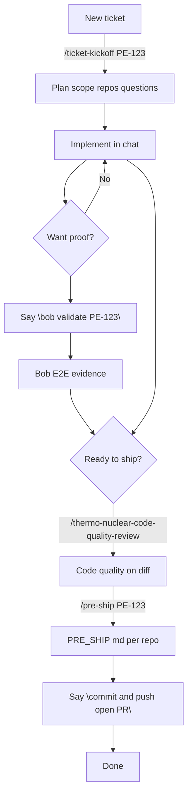
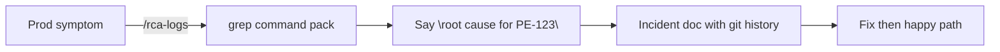

# Ashutosh - Novopay workflow (one page)

**Flowchart legend:** `/command` = slash command (exact sample) | **Say "..."** boxes = type that phrase in chat

## Happy path (ticket to PR)

```mermaid
flowchart TD
  A[New ticket] -->|/ticket-kickoff PE-123| B[Plan scope repos questions]
  B --> C[Implement in chat]
  C --> D{Want proof?}
  D -->|No| C
  D --> S1["Say \"bob validate PE-123\""]
  S1 --> E[Bob E2E evidence]
  E --> F{Ready to ship?}
  C --> F
  F -->|/thermo-nuclear-code-quality-review| G[Code quality on diff]
  G -->|/pre-ship PE-123| H[PRE_SHIP md per repo]
  H --> S2["Say \"commit and push open PR\""]
  S2 --> I[Done]
```

## If you want this, use this

| I want to... | Do this |
|--------------|---------|
| Start a ticket | `/ticket-kickoff PE-123` |
| Explain scope / raw idea | Normal chat, or kickoff above |
| Scoped compile/lint (no full rebuild) | `npm run validate -- <service-dir>` or `npm run lint -- <webapp-dir>` (see root README) |
| Prove it works (API + DB + logs) | Say **"bob validate PE-123"** or **"bob let's test"** |
| Big diff before merge | `/thermo-nuclear-code-quality-review` |
| PR description files (diagrams, UTs, cross-repo) | `/pre-ship PE-123` |
| Commit / push / PR | Say **"commit and push open PR"** |
| Prod logs grep pack | `/rca-logs` then describe issue in same message |
| Paste huge logs in chat | Same as always - agent runs `bob shrink-logs` automatically |
| Convert bank PDF/Word/Excel to Markdown | Enable MCP `markitdown` in Settings - attachments auto-convert; or `/markitdown` |
| Full incident doc (git history, when it broke) | Say **"root cause for PE-123"** |
| Unit tests for CC change | `/cc-backend-test-generation` (optional) |
| View agent output / approve from phone | **Cursor Mobile Relay** - see `Desktop/cursor-mobile-relay` |

## Mobile: view and approve Cursor from phone ($0)

All execution stays on your PC. Phone is read + approve only.

1. Cursor shortcut: append `--remote-debugging-port=9222`
2. Run relay: `Desktop/cursor-mobile-relay/scripts/start.ps1`
3. Tailscale + `tailscale serve --bg --https=443 http://127.0.0.1:8787`
4. Phone: `https://YOUR-PC.tailnet.ts.net/?token=RELAY_PASSWORD`

Full doc: `cursor-markdowns/MOBILE_RELAY.md` (mirrored from relay README).

## Prod incident (side path)

```mermaid
flowchart LR
  P[Prod symptom] -->|/rca-logs| Q[grep command pack]
  Q --> S1["Say \"root cause for PE-123\""]
  S1 --> R[Incident doc with git history]
  R --> S[Fix then happy path]
```

## Rules you do not need to remember

- Bob **never** auto-runs after a code fix - only when you ask to test.
- Hooks handle chat hygiene / memory - no commands for that.
- Ignore `novopay/.cursor/automations/` unless you saved Glass webhooks yourself.

## Backup copy

Same file mirrored in `Desktop/cursor-markdowns/WORKFLOW.md`.
