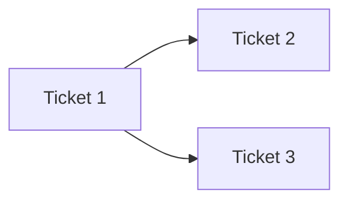

# Ticket Breakdown Templates (Copy Structure)

Use these structures for every sub-ticket. Replace placeholders only.

---

## Sub-ticket: Product ticket

**Title:** `<TICKET_ID>: <Short outcome-focused title>`

**Description:**

<Plain-language description of what and why. Use bullets for rules, scope, and behavior.>

**Acceptance criteria:**

- <Testable bullet 1>
- <Testable bullet 2>
- <Testable bullet 3>

**Depends on:** `<None | Ticket IDs>`

**Jira journey field - select these (multiple):**

- <Journey 1>
- <Journey 2>

**Do not select:** <Journey X>, <Journey Y>

**Journeys impacted:**

| Journey | Who | What changes |
| --- | --- | --- |
| <Journey name> | <Actor> | <What changes in business terms> |

**Estimation**

| Subtask | Est (hrs) | Why this size / justification |
| --- | ---:| --- |
| <Subtask 1> | <hrs> | <Why> |
| <Subtask 2> | <hrs> | <Why> |

---

## Sub-ticket: Engineering reference

Paste as Jira comment titled **Technical reference** (or team convention).

**Journey / flow map:**

| Flow | API / entry | Module |
| --- | --- | --- |
| <Flow> | <API or batch name> | <module/repo> |

**Frontend (`<branch>`):** `<path or N/A - read-only validation>`

**Modules:** `<comma-separated list>`

**Baseline patterns to reuse:**

- `<ClassOrFile>` — <one-line why>

**Implementation:**

1. <Step 1>
2. <Step 2>
3. <Step 3>

**Schema / config (if applicable):**

- `<table or config keys>`

---

## Sub-ticket: QA reference

Paste as Jira comment titled **QA reference**.

**Pre-requisites:** <env, data, access, dependencies>

**Test data setup (minimum):**

| # | <Dimension 1> | <Dimension 2> | <Dimension 3> | Expected |
| --- | --- | --- | --- | --- |
| A | | | | |
| B | | | | |

**Functional tests:**

1. <Scenario name> — <steps and expected result>
2. ...

**DB checks (sample):**

```sql
-- <purpose>
SELECT ...
```

**Regression:** <what must still work>

**Out of scope for this ticket:** <explicit exclusions>

**Depends on:** <ticket IDs for QA execution>

---

## Epic rollup sections

### Estimation summary

| Ticket | Total Est (hrs) | Notes |
| --- | ---:| --- |
| <ID> | | |

### Justification table

| Split decision | Justification |
| --- | --- |
| | |

### Delivery order



1. Ticket 1 — ...
2. Ticket 2 — ...

### Sign-off (OPEN items)

| ID | Blocker? | Question | Owner | Decision |
| --- | --- | --- | --- | --- |
| O1 | Y/N | | | |
