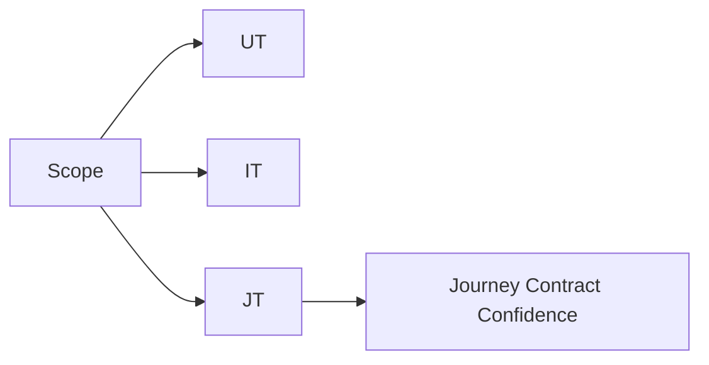

# CC Backend Test Generation

## When To Use

Use this skill when changes affect:

- `manageCreditCardApplication` orchestration
- LOC processors and loan-on-card journeys
- Bulk upload / batch validate / Kafka consumer flows
- Add-on card (AOC) services/processors/controllers
- Validation, audit status transitions, or `ExecutionContext` mapping
- Any flow where the ORDER of steps matters and must be protected from future regressions

## Default Scope Guardrail

Unless user explicitly requests a broad scan, work in **diff-only mode**:

- Generate tests only for changed files/classes and direct impacted collaborators.
- Do not inventory or test the full repo by default.
- Use Mode B (codebase scan) only when user explicitly asks for it (for example: "scan full repo" or "broad coverage pass").

## Inputs Required

### Mandatory knowledge/doc directory input (Mode A and Mode B)

For **bug-fix** and **codebase-scan** work, always ask for a directory path that may contain raw thought notes / KT docs / design notes. This is mandatory input unless the user explicitly says "no docs available".

Ask exactly:

```text
Share docs/thought directory path (can contain multiple files):
5) Docs path (raw thoughts / KT / notes) — e.g. C:\path\to\docs
```

How to use this directory:

- Treat docs as hints only; code remains source of truth
- Read multiple files from the provided directory and extract candidate scenarios
- Mark assumptions as `DOC-DERIVED` until verified against code
- If docs conflict with code, follow code and log `DOC CONFLICT`

For bug-driven work, collect:

1. Bug/Jira summary
2. Files changed or diff
3. Root cause (if known)
4. Impacted flow (`manageCC`, `bulk`, `add-on (AOC)`, `LOC`, etc.)

If missing, ask:

```text
Share:
1) Bug description/Jira
2) Files changed or diff
3) Root cause (if known)
4) Impacted flow (manageCC / bulk / add-on (AOC) / LOC)
5) Docs path (raw thoughts / KT / notes; can contain multiple files)
```

For codebase-scan work (no bug id), collect:

1. Scope (`full repo` or selected packages/classes)
2. Priority (`critical flows first` or `broad coverage`)
3. Test budget (small/medium/large batch in one pass)

If missing, ask:

```text
Share:
1) Scope (full repo or specific package/class)
2) Priority (critical flow first or broad coverage)
3) Test batch size (small/medium/large)
4) Docs path (raw thoughts / KT / notes; can contain multiple files)
```

## Operating Modes

### Mode A: Bug-Fix Certification

Use this when bug/Jira or explicit defect context exists.

- Derive tests from symptom + RCA + diff
- Include bug reproduction and before/after intent
- Prioritize failure-path assertions and regression safety

### Mode B: Codebase Scan Coverage (No Bug ID)

Use this only when user explicitly asks to scan and generate UTs/ITs proactively.

- Discover untested/high-risk classes and endpoints
- Create behavior-contract tests from current logic
- Prioritize coverage by business impact and failure risk
- Produce tests in batches with clear backlog ordering

### Mode C: Journey / Flow Contract Tests

Use this when:

- User asks for flow tests, journey tests, or sequence contract tests
- A flow spans multiple classes/processors and the ORDER of steps must be protected
- Any future reordering, removal, or insertion of a step should cause tests to fail visibly

Mode C always runs alongside Mode A or B — it is not a replacement for unit tests, it adds a sequence-enforcement layer on top.

**Two sub-steps in Mode C:**

**Step C1 — Flow Discovery (always do this first)**

Before writing any journey test, extract the actual ordered call sequence from code. Do not trust docs alone.

```
For each flow in scope, produce:

  Flow: [FlowName]
  Step | Class | Method | Calls next | Side effect (audit/attr/kafka/db)
  -----|-------|--------|------------|----------------------------------
  1    | ...   | ...    | ...        | ...

Rules:
  - Read actual method bodies, not just class names
  - Note every downstream call (internal API, Kafka publish, DB write, audit update)
  - Note where ExecutionContext values are SET vs READ
  - Flag any step where docs say X but code does Y
  - Note conditional steps and their branch conditions
```

**Step C2 — Journey Test Generation**

After the flow table is produced, generate journey tests from it using the JT1/JT2/JT3 matrix below.

## Knowledge Source Priority (docs vs code)

External onboarding notes and KT docs are valid reference input, but not authoritative.

Use this strict priority order at all times:

1. Current repo code and orchestration XML
2. Current repo config/build files
3. KT docs / supplemental docs (for context hints and terminology only)

If docs conflict with code:

- Trust code/config behavior
- Note the discrepancy briefly in output: `// DOC CONFLICT: docs say X, code does Y`
- Generate tests only from executable behavior in this repo, not from what docs describe

## Repo Map (CC Service)

Base: `novopay-platform-creditcard-management`

- Controllers: `src/main/java/in/novopay/creditcard/controller`
- Orchestration XML: `deploy/application/orchestration/*.xml`
- Processors: `src/main/java/in/novopay/creditcard/transaction/processor`
- Bulk services: `src/main/java/in/novopay/creditcard/bulk`
- Kafka consumer: `src/main/java/in/novopay/creditcard/consumers/BulkUploadLeadsConsumer.java`
- Internal API orchestration caller: `src/main/java/in/novopay/creditcard/service/CreditCardApplicationService.java`
- Existing tests: `src/test/java/in/novopay/creditcard/**`

## Canonical Flow Map (for test design)

Use this as the planning model, then verify exact class-level behavior in code before asserting.

1. Gateway receives request with tenant/user/channel/stan context
2. Request context is initialized and propagated
3. API name routes request to internal service/orchestration
4. XML validators and `Control` branch logic execute (`function_code`, `function_sub_code`, `run_mode`)
5. Processor/service logic performs side effects (audit updates, downstream calls, queue publish)
6. Response contract is mapped from execution outcome
7. Async flows continue via consumer paths when applicable

Journey anchors (verify sequence in code for each):

- **CC manage flow**: create -> update -> submit branch validation -> audit/result assertions
- **AOC (add-on card) flow**: create -> OTP generate/validate -> summary/eligibility -> recipient -> submit
- **LOC flow**: eligibility -> offers -> submit -> history/summary
- **Bulk flow**: upload -> validate/promote -> publish -> consumer calls (manage/consent/resume)

## Flow Anchors To Verify

### 1) Manage CC orchestration

Check `common_manageCreditCardApplication.xml` branches:

- `function_code`: `CREATE | UPDATE | SUBMIT | TRANSACTION`
- `function_sub_code`: `DEFAULT | UPDATE | FAIL`
- `run_mode`: `REAL | TRIAL`

Critical rule:

- `client_reference_number` must be alphanumeric and length 4-32

### 2) Bulk flow

- `BulkFileUploadController` -> `BulkFileUploadService`
- `BatchValidateLeadsService` updates UPLOADED -> VALIDATED, then Kafka publish (after commit)
- `BulkUploadLeadsConsumer` invokes manageCC + consent + resume APIs

#### Bulk upload / batch validate — contract minimums (Mode B)

When improving `in.novopay.creditcard.bulk`, optimize for **behavior contracts** (JT/T matrix below), not line coverage alone.

| Area | Class / focus | Minimum coverage intent |
|------|----------------|-------------------------|
| Upload orchestration | `BulkFileUploadService` | `CC` product gate; empty/missing file; unsupported type / read errors; max rows; “no row persisted” aggregate; happy path counts; **compensation** via `BulkFileUploadRollbackService` when a later chunk fails after prior chunk IDs were committed |
| Chunk persistence | `BulkFileUploadChunkWriter` | `persistChunk` vs `persistRejectedChunk`: `TransactionAudit` + `CCAdditionalTxnData` bulk marker (`ipaStatus` on rejects), co-brand attrs, optional context attrs, `EntityManager.flush` / `clear` |
| Rollback | `BulkFileUploadRollbackService` | Null/empty no-op; batched deletes using `ROLLBACK_BATCH_SIZE`; correct repository order |
| Audit rows | `BulkLeadAuditBuilder` | `stanFromHeader` (blank base → millis-based STAN, length cap with suffix); `build` vs `buildFileIngestReject` (FAIL, result codes, long `internalTxnDesc` / `transactionResultDescription` truncation) |
| Kafka UI merge | `BulkUploadExecutionContextSupport` | `mergeBulkContextForKafka` (co-brand from attrs + optional bulk keys); `parsePersistedMap` / `stringVal` null and malformed JSON |
| Batch validate | `BatchValidateLeadsService` | Tenant / `PlatformTenant` / `product_type` guards; empty lead list; skip invalid `client_reference_code`; main loop → `PendingKafkaPublish` + **after-commit** `TransactionSynchronization` (executor runs publish); keep `publishWithRetries` exhaust / success tests separate |

**JT anchors (bulk):** upload → per-chunk persist → (failure) rollback; batch validate → `UPLOADED` → `VALIDATED` + scheduled Kafka after commit.

### 3) Add-on card (AOC) flow

- `AddOnCardController` / `AddRecipientController`
- Service-level behavior (recipient-wise success/failure, attr updates) is key

**JT anchors (AOC):** create/OTP -> summary or eligibility -> recipient -> submit; assert per-recipient outcomes and attribute/audit side effects at the right step.

### 4) LOC flow

Primary LOC processors under `src/main/java/in/novopay/creditcard/loc/processors`:

- `InquireCardEligibilityProcessor`
- `LoanOffersProcessor`
- `SubmitLoanOnCardsProcessor`
- `GetLoanOnCardTransactionHistoryProcessor`
- `CardSummaryProcessor`
- `CreateOrUpdateLoanTransactionProcessor`

Use LOC orchestration anchors from `deploy/application/orchestration/common_loanOnCards.xml` and related LOC orchestration files.

LOC test focus:

- Required field and branch validation by function/sub-function
- Eligibility and offer mapping correctness
- Submit flow success/failure path assertions
- Transaction audit status/log updates and attribute persistence
- Side-effect behavior (no duplicate submits, expected downstream calls)

## Test Design Rules

### Independence First

Do not clone dev-written tests. Build from:

- Symptom
- RCA
- Diff behavior change
- Flow side effects
- Actual call sequence observed in code

### Scenario Matrix — Unit Tests (T series)

Create at least:

- `T1 Regression`: unaffected valid flow still works
- `T2 Fix`: original bug case
- `T3 Edge`: null/invalid/boundary and adjacent branch

Add `T4` for retry/idempotency/concurrency where applicable.

For Mode B (no bug id):

- `T1 Baseline Regression`: current happy path contract
- `T2 Guard Rails`: validation/required-header/error handling
- `T3 Edge`: null/blank/boundary/branch variants
- `T4 Resilience` (optional): retry/idempotency/concurrency

### Scenario Matrix — Journey Tests (JT series)

Every flow tested in Mode C must have at minimum JT1 and JT2. JT3 where branching exists.

**JT1 — Happy path journey sequence contract**

- Assert ALL steps run in correct order using Mockito `InOrder`
- Assert each side effect (audit status, attr update, Kafka publish) happens at the right step, not just somewhere
- End with `verifyNoMoreInteractions(...)` to catch unexpected extra calls added in future
- Use `@DisplayName("JT1: [FlowName] — full journey sequence contract")`

**JT2 — Journey breaks at step N**

- One test per critical step in the flow
- Simulate failure at step N (downstream throws, returns null, returns error response)
- Verify steps AFTER N are never called (`verifyNoInteractions` / `never()`)
- Verify correct error state / audit status is written for that failure point
- This is the primary guard against someone accidentally reordering steps

**JT3 — Branch journey**

- For each major branch (`REAL` vs `TRIAL`, `SUBMIT` vs `CREATE`, `function_sub_code` variants)
- Verify the correct sub-sequence runs for that branch
- Verify the OTHER branch's steps are never called

### Assertions Quality

Avoid status-only assertions. Verify:

- Response + payload
- Collaborator interactions in correct order
- Audit/attribute side effects at the right step
- No-call expectations for guarded failures and wrong-branch steps

## Unit Test Pattern (JUnit5 + Mockito)

Use:

- `@ExtendWith(MockitoExtension.class)`
- `@DisplayName(...)`
- Clear before/after comments in test body for bug-fix context

Template:

```java
@ExtendWith(MockitoExtension.class)
class CreditCardApplicationServiceTest {

    @Mock
    private NovopayInternalAPIClient apiClient;

    @InjectMocks
    private CreditCardApplicationService service;

    @Test
    @DisplayName("T2: invalid client_reference_number fails before orchestration")
    void shouldFailEarlyForInvalidClientReferenceNumber() {
        // BEFORE FIX: invalid value reached orchestration and failed deeper.
        // AFTER FIX: validation fails early and internal API is not called.
        var header = validHeader();
        var agent = validAgent();
        var lead = validLead();
        lead.setClientReferenceNumber("ab");

        assertThrows(IllegalArgumentException.class,
                () -> service.invokeManageApplicationAPI(header, agent, lead));
        verifyNoInteractions(apiClient);
    }
}
```

## Journey Test Pattern (JUnit5 + Mockito InOrder)

Use `InOrder` to enforce step sequence. Use `verifyNoMoreInteractions` to catch unexpected additions.

Every journey test class must open with a contract comment block describing the expected sequence.

Template:

```java
@ExtendWith(MockitoExtension.class)
class BulkUploadFlowJourneyTest {

    // FLOW CONTRACT: upload -> validate/promote -> kafka publish -> consumer (manageCC + consent + resume)
    // If this sequence changes, these tests MUST be reviewed and updated intentionally.
    // Source of truth: BatchValidateLeadsService.java + BulkUploadLeadsConsumer.java (verified YYYY-MM-DD)
    // DOC CONFLICT (if any): docs say X, code does Y — test follows code.

    @Mock private BulkFileUploadService uploadService;
    @Mock private BatchValidateLeadsService validateService;
    @Mock private KafkaTemplate<String, Object> kafkaTemplate;
    @Mock private CreditCardApplicationService manageCCService;
    @Mock private ConsentService consentService;
    @Mock private ResumeService resumeService;
    @Mock private AuditRepository auditRepo;

    @InjectMocks
    private BulkUploadLeadsConsumer consumer;

    @Test
    @DisplayName("JT1: bulk upload — full journey sequence contract (upload->validate->publish->consume)")
    void shouldExecuteFullBulkJourneyInCorrectOrder() {
        // Arrange
        var event = validBulkEvent();
        when(validateService.validate(any())).thenReturn(validatedResult());
        when(manageCCService.invokeManageApplicationAPI(any(), any(), any())).thenReturn(successResponse());

        // Act
        consumer.consume(event);

        // Assert sequence — order is enforced by InOrder
        InOrder inOrder = inOrder(validateService, kafkaTemplate, manageCCService, consentService, resumeService);
        inOrder.verify(validateService).validate(any());
        inOrder.verify(kafkaTemplate).send(eq("bulk-leads-topic"), any());
        inOrder.verify(manageCCService).invokeManageApplicationAPI(any(), any(), any());
        inOrder.verify(consentService).processConsent(any());
        inOrder.verify(resumeService).resume(any());

        // Assert side effect written at correct step
        ArgumentCaptor<AuditEntity> captor = ArgumentCaptor.forClass(AuditEntity.class);
        verify(auditRepo).save(captor.capture());
        assertEquals(AuditStatus.VALIDATED, captor.getValue().getStatus());

        // Guard against unexpected extra calls added in future
        verifyNoMoreInteractions(manageCCService, consentService, resumeService);
    }

    @Test
    @DisplayName("JT2: bulk journey breaks at validate step — downstream steps must not be called")
    void shouldNotPublishOrConsumeWhenValidationFails() {
        // Arrange
        var event = validBulkEvent();
        when(validateService.validate(any())).thenThrow(new ValidationException("invalid lead"));

        // Act + Assert
        assertThrows(ValidationException.class, () -> consumer.consume(event));

        // Steps after validate must not run
        verifyNoInteractions(kafkaTemplate);
        verifyNoInteractions(manageCCService);
        verifyNoInteractions(consentService);
        verifyNoInteractions(resumeService);
    }

    @Test
    @DisplayName("JT3: branch — TRIAL run_mode must not invoke manageCC or downstream steps")
    void shouldSkipManageCCForTrialRunMode() {
        // Arrange
        var event = trialRunBulkEvent(); // run_mode = TRIAL

        // Act
        consumer.consume(event);

        // Only validate and publish should run; no consumer downstream
        verify(validateService).validate(any());
        verifyNoInteractions(manageCCService);
        verifyNoInteractions(consentService);
        verifyNoInteractions(resumeService);
    }
}
```

## Integration Test Pattern (Controller/API)

Preferred in this repo:

- Standalone MockMvc/controller-slice tests for header/param validation + response contract
- Keep DB/network mocked unless persistence integration is explicitly required

Focus areas:

- Mandatory headers
- Request parameter constraints
- Multipart shape
- Output JSON fields
- Service invocation count/args

## Cucumber Guidance

This service currently uses JUnit/Mockito and does not include default Cucumber setup in `build.gradle`.

So:

- Produce Gherkin `.feature` specs only when requested
- Keep runnable automated coverage in JUnit unless Cucumber deps are added

## Project-Specific Test Standards

### Test layout and naming

- Keep tests under `src/test/java` mirroring production package paths
- Unit test class name: `<ClassName>Test`
- Integration-style class name: `<ControllerOrFlowName>IntegrationTest`
- Journey test class name: `<FlowName>JourneyTest`
- Test method naming: behavior + condition (`shouldXWhenY`)
- Use `@DisplayName` with T1/T2/T3 or JT1/JT2/JT3 prefix for scenario readability in reports

### Unit test style (Mockito + JUnit5)

- Use `@ExtendWith(MockitoExtension.class)`
- Follow Arrange-Act-Assert in each test
- Mock only external boundaries (DB/HTTP/Kafka/internal API clients), keep pure mapping/value objects real
- Prefer explicit verification of business side effects:
  - audit status changes
  - attribute persistence
  - downstream API invocation count
  - no-call checks on guarded failures (`verifyNoInteractions`, `never()`)
- Use `ArgumentCaptor` when output is passed to collaborators

### Journey test style (Mockito InOrder)

- Use `InOrder` across all collaborators in the flow to enforce call sequence
- Always add contract comment block at top of class describing expected sequence and source file verified
- Always end JT1 with `verifyNoMoreInteractions(...)` across all mocked collaborators
- Use `ArgumentCaptor` to assert side effects (audit status, attr values) happened at the right step
- One JT2 test per critical step — simulate failure there, assert all downstream steps are skipped
- Keep journey tests at unit level (no Spring context boot) — all deps mocked, fast execution

### Integration-style API test style

- Prefer standalone MockMvc/controller-slice tests for contracts
- Validate mandatory headers, request params/body, and response JSON shape
- Cover positive + negative validation paths (missing headers, bad params, malformed payload)
- Only use full Spring context when contract cannot be validated via slice/standalone tests

### What not to do

- Do not test private methods directly
- Do not assert only HTTP 200 without payload/side-effect assertions
- Do not over-mock domain objects or simple DTOs
- Do not couple tests to log messages or fragile implementation details
- Do not share mutable state across tests
- Do not write journey tests without first extracting the actual sequence from code (run C1 first)
- Do not use `@SpringBootTest` for journey tests — they must be fast unit-level tests

### Reliability and determinism

- Avoid time/random/network dependence in unit tests; inject or stub where needed
- Use fixed inputs for boundary tests (`null`, blank, min/max length, invalid enum/value)
- Keep tests isolated and repeatable; no ordering dependencies

### Security and validation coverage

- Add negative tests for input validation in controllers/services
- Add tests for authorization/context-required checks when logic depends on tenant/user/actor headers
- For API-invoking services, verify sensitive fields are not silently dropped or wrongly mapped

### Performance and scope guidance

- Prioritize tests on orchestration-critical and high-branch code first
- Keep unit and journey tests fast; avoid heavy context boot for pure service logic
- Use targeted Gradle test runs while iterating; run broader suite before finalizing

## Execution Checklist

### Bug-fix checklist (Mode A)

1. Map bug to one flow anchor
2. Write T1/T2/T3 matrix
3. Add unit tests for root-cause class
4. Add controller integration tests for API contract (if endpoint touched)
5. Assert side effects (audit, attr, call counts, no-calls)
6. If the bug was a sequence/ordering issue, add JT2 journey test for that step
7. Run targeted Gradle tests
8. Report pass/fail and residual risk

### Codebase-scan checklist (Mode B)

1. Inventory candidate classes/endpoints in scope
2. Rank by risk:
   - Orchestration-critical (`manageCC`, LOC submit/eligibility, bulk/kafka, add-on (AOC) submit paths)
   - Complex branching/validation
   - External side effects (audit/db/kafka/internal API)
3. Pick top N targets based on requested test batch size
4. For each target, define T1/T2/T3 matrix from code behavior (no bug assumption)
5. Implement UTs first, then API integration tests for touched controllers
6. Run targeted tests and report:
   - Tests added
   - Uncovered risky areas (next backlog)
   - Residual risks

### Journey test checklist (Mode C)

1. Run C1 (flow discovery) — produce ordered step table from code for each flow in scope
2. Note any doc vs code conflicts; mark them in output
3. For each flow write JT1 (full sequence), JT2 (failure at each critical step), JT3 (branch variants)
4. Add contract comment block at top of every journey test class
5. Verify `InOrder` covers all collaborators in sequence
6. Verify `verifyNoMoreInteractions` is at the end of JT1
7. Verify `ArgumentCaptor` asserts side effects at the correct step (not just anywhere)
8. Run targeted Gradle tests for journey test classes
9. Report: flow sequence extracted, conflicts found, tests written, remaining backlog

## CI and Coverage Expectations

- Minimum loop while implementing:
  - Run changed test classes
  - Run impacted package tests
- Before completion:
  - Run relevant flow-level tests (`manageCC` / `LOC` / `bulk` / `add-on (AOC)`)
  - Run journey test classes for any flow touched
- If coverage tooling is available, mention high-risk uncovered branches explicitly (do not inflate with low-value tests)

## Commands

From repo root:

```bash
./gradlew test --tests "in.novopay.creditcard.*"
```

Single class:

```bash
./gradlew test --tests "in.novopay.creditcard.service.AOCSubmitApplicationServiceTest"
```

Journey tests only:

```bash
./gradlew test --tests "in.novopay.creditcard.*JourneyTest"
```

## Cursor IDE Usage

### Large-scale generation with subagents (parallelization)

When requested to generate tests for broad scope (many modules/classes), allow and encourage parallel subagent execution.

Use this decision rule:

- Small batch: 1 primary agent (no subagents)
- Medium batch: 2-4 parallel subagents by module/flow
- Large batch / full codebase: 5-10 parallel subagents in waves

Partition strategy:

- Split by module/flow first (`manageCC`, `bulk`, `LOC`, `add-on (AOC)`)
- Then split by package/class groups within each flow
- Keep each subagent output independent (own class list + tests + mini report)

Subagent execution contract:

1. Coordinator agent creates target list and assigns shards
2. Each subagent does:
   - C1 sequence discovery for assigned flow/classes (if journey applies)
   - T1/T2/T3 (and JT1/JT2/JT3 when applicable)
   - Targeted test execution
   - Per-shard metrics output
3. Coordinator merges outputs, resolves overlap/duplicates
4. Coordinator runs final impacted suite
5. Coordinator generates aggregated reports (`MD` + `CSV`)

Important guardrails:

- Never let two subagents write same test class
- Use deterministic shard boundaries (package prefixes)
- Require each subagent to list skipped/blocked items and reasons
- Merge only after duplicate-test-name check passes

Suggested prompt line for Cursor:

```text
This is a medium/large batch. Spawn parallel subagents by module and return a merged report with module/class/journey/codebase coverage metrics.
```

### How to invoke this skill in Cursor

Use Cursor's inline chat (`Cmd+K` / `Ctrl+K`) or chat panel (`Cmd+L`) with these prompt patterns:

**Bug-fix mode (Mode A):**
```
@SKILL.md Bug in bulk upload flow. Jira: NP-1234.
Root cause: BatchValidateLeadsService publishes Kafka before commit.
Files changed: BatchValidateLeadsService.java
Generate T1/T2/T3 test matrix and full unit test class.
```

**Codebase scan mode (Mode B):**
```
@SKILL.md Scan SubmitLoanOnCardsProcessor for missing unit test coverage.
Priority: critical paths. Batch size: medium.
```

**Journey/flow contract mode (Mode C):**
```
@SKILL.md @[FlowClass.java] @[ProcessorClass.java]
Mode C: generate journey contract tests for [FlowName].
Step C1 first: extract ordered call sequence from code, flag any doc conflicts.
Then Step C2: generate JT1/JT2/JT3 using InOrder + verifyNoMoreInteractions.
Source of truth = code, not KT docs.
```

### Cursor `@` context references to attach

Always attach relevant context when prompting:

| What you need | Cursor reference |
|---|---|
| Class under test | `@ClassName.java` |
| Existing test peer | `@ExistingTest.java` |
| Orchestration XML | `@common_manageCreditCardApplication.xml` |
| This skill | `@SKILL.md` |
| Full flow context | `@codebase` (use sparingly — expensive) |
| KT docs folder | Reference by path in prompt text, not `@` — treat as hints only |

### Cursor Composer (multi-file) workflow

For larger test batches (Mode B or C, medium/large):

1. Open Composer (`Cmd+Shift+I`)
2. Attach: `@SKILL.md` + target class(es)
3. Prompt: "Generate T1/T2/T3 unit tests and JT1/JT2/JT3 journey tests per SKILL.md for `[ClassName]`. Place output in `src/test/java/...` mirroring production path."
4. Review generated file before accepting — check InOrder sequence, verifyNoMoreInteractions, ArgumentCaptor assertions

### What Cursor does well here

- Autocompletes Mockito `when(...).thenReturn(...)`, `InOrder`, and `ArgumentCaptor` patterns
- Infers constructor args for `@InjectMocks` from the opened source file
- Suggests `@DisplayName` strings from method names automatically
- Detects missing `verifyNoInteractions` when a guard path is present

### What to watch in Cursor

- Cursor may generate `@SpringBootTest` (full context) when a controller-slice `@WebMvcTest` is sufficient — always prefer the slice
- It may copy existing test structure instead of reasoning independently — explicitly prompt: *"Do not mirror existing tests. Derive from behavior."*
- For journey tests, Cursor may skip `verifyNoMoreInteractions` — always check and add if missing
- For orchestration XML branches, paste the relevant XML snippet inline in the prompt — Cursor cannot navigate XML files as well as Java
- Cursor may trust KT docs over code — explicitly instruct: *"Trust code over docs. If they conflict, note it and follow code."*

## Cursor Prompt Templates

Copy-paste these directly into Cursor chat or Composer:

### Unit test from scratch

```
Using @SKILL.md standards:
- Class: @[TargetClass.java]
- Mode: B (no bug id)
- Generate T1 baseline, T2 guard rails, T3 edge tests
- Use JUnit5 + Mockito, @ExtendWith(MockitoExtension.class)
- Assert side effects: audit status, attribute persistence, downstream call counts
- Do NOT copy any existing test structure
```

### Bug reproduction test

```
Using @SKILL.md Mode A:
- Bug: [paste Jira summary]
- Root cause: [paste RCA]
- Changed file: @[ChangedFile.java]
- Generate T1 regression, T2 fix (reproduction), T3 edge
- Include before/after comments in T2 body
```

### Controller integration test

```
Using @SKILL.md integration test pattern:
- Controller: @[XyzController.java]
- Generate standalone MockMvc tests (no full Spring context)
- Cover: mandatory headers, bad params, malformed payload, response JSON shape
- Assert service invocation count and args
```

### Flow discovery (Mode C — Step C1)

```
Using @SKILL.md Mode C Step C1:
Attached: @codebase (or specific flow files)
KT docs at C:\Users\ashutosh.kumar\Desktop\KT — treat as hints only, not authoritative.

For each flow (manageCC / LOC / bulk / add-on (AOC)):
  Extract the ORDERED sequence of collaborator calls as they exist in code right now.
  Produce a step table: Step | Class | Method | Calls next | Side effect
  Flag any step where KT docs say X but code does Y.
  Note conditional steps and their branch conditions.

Do NOT write tests yet. Only produce the ordered flow tables.
```

### Journey contract tests (Mode C — Step C2)

```
Using @SKILL.md Mode C Step C2:
Attached: @[FlowClass.java] @[ProcessorClass.java] @SKILL.md
Flow sequence (from C1 output or paste here): [paste step table]

Generate journey contract tests for [FlowName]:

JT1 — Full happy path sequence
  - Use Mockito InOrder across all collaborators
  - Assert each side effect at the correct step using ArgumentCaptor
  - End with verifyNoMoreInteractions() to catch unexpected future additions
  - @DisplayName: "JT1: [FlowName] — full journey sequence contract"

JT2 — Failure at each critical step
  - One test per critical step
  - Simulate failure at that step (throw or error response)
  - Assert all downstream steps are never called
  - Assert correct audit/error state is written

JT3 — Branch variants
  - One test per major branch (REAL/TRIAL, SUBMIT/CREATE, etc.)
  - Assert correct sub-sequence runs
  - Assert wrong-branch steps are never called

Rules:
  - No @SpringBootTest — keep journey tests at unit level, all deps mocked
  - Add contract comment block at top of class with sequence and source file reference
  - Trust code over docs — if conflict found, add // DOC CONFLICT comment and follow code
  - Do NOT mirror existing tests — derive from code sequence
```

## Output Format

Return in this order:

1. Mode used (`Bug-Fix` / `Codebase-Scan` / `Journey-Contract`)
2. Scope/flow mapping (short)
3. For Mode C: flow sequence table extracted from code + any doc conflicts found
4. Scenario matrix (`T1/T2/T3[/T4]` for unit tests, `JT1/JT2/JT3` for journey tests)
5. Complete unit test class(es)
6. Journey test class(es) (Mode C)
7. Integration test class(es)
8. Optional feature file(s) if requested
9. Remaining high-priority test backlog
10. Coverage report artifacts generated (MD/CSV paths)
11. PR metrics markdown artifact path

## Reporting Artifacts (mandatory for medium/large batches)

After test generation, always produce machine-readable + management-readable reports.

Generate:

1. `TEST_COVERAGE_REPORT.md` (human readable, visual-first)
2. `TEST_COVERAGE_REPORT.csv` (tabular metrics, importable to Excel)
3. `PR_TEST_SUMMARY.md` (PR description body, metrics-first)

Recommended location:

- Repo root `reports/testing/` (create if missing)

### Minimum metric schema

Capture at least:

- Module coverage (% classes touched by new/updated tests)
- Class coverage (class-level test presence: UT/IT/JT)
- Journey coverage (flows with JT1/JT2/JT3 completeness)
- Endpoint contract coverage (controller integration test coverage)
- Branch/guard coverage count (critical guard paths covered)
- Bug reproduction coverage count (Mode A)
- High-risk uncovered items (count + list)
- Total tests added (`UT`, `IT`, `JT`, optional `BDD`)
- Pass/fail/skip counts from latest run

### `TEST_COVERAGE_REPORT.md` template

Use compact tables and simple diagrams (ASCII/mermaid) for fast executive scan.

Required sections:

1. Executive metrics snapshot
2. Module-wise table
3. Flow/journey contract status table
4. Risk heatmap (high/medium/low)
5. Residual gaps and next-batch backlog

Example skeleton:

````md
# Test Coverage Report

## Snapshot
| Metric | Value |
|---|---:|
| Modules in scope | 4 |
| Classes in scope | 62 |
| Classes covered by new tests | 31 (50.0%) |
| UT added | 84 |
| IT added | 19 |
| JT added | 16 |
| Journey flows fully covered (JT1+JT2+JT3) | 3/4 |
| High-risk uncovered items | 7 |

## Module Coverage
| Module | Classes in scope | Classes covered | Coverage % | UT | IT | JT | Risk |
|---|---:|---:|---:|---:|---:|---:|---|
| manageCC | 18 | 11 | 61.1 | 30 | 6 | 5 | Medium |
| LOC | 16 | 8 | 50.0 | 20 | 4 | 4 | High |

## Journey Coverage
| Flow | JT1 | JT2 | JT3 | Status |
|---|---|---|---|---|
| bulk | Yes | Yes | Yes | Complete |
| LOC submit | Yes | Partial | No | Partial |



### `TEST_COVERAGE_REPORT.csv` columns

Use one row per module + one aggregate row:

`timestamp,mode,scope,module,classes_in_scope,classes_covered,coverage_pct,ut_added,it_added,jt_added,bdd_specs_added,journey_flows_total,journey_flows_complete,high_risk_uncovered_count,tests_passed,tests_failed,tests_skipped`

### `PR_TEST_SUMMARY.md` requirements

This file should be metrics-heavy, low prose, easy to paste into PR description.

Required content:

- Short title and scope line
- Delta metrics table (before vs after when available)
- Added tests breakdown (UT/IT/JT/BDD)
- Journey contract completeness
- Validation commands run + result counts
- Residual risk table
- Reviewer checklist

Use this default format:

```md
# PR Test Summary

## Scope
`manageCC + LOC + bulk`

## Metrics Delta
| Metric | Before | After | Delta |
|---|---:|---:|---:|
| Classes with tests | 120 | 151 | +31 |
| Journey-covered flows | 1 | 3 | +2 |
| High-risk uncovered items | 14 | 7 | -7 |

## Tests Added
| Type | Count |
|---|---:|
| Unit (UT) | 84 |
| Integration (IT) | 19 |
| Journey (JT) | 16 |
| BDD feature specs | 2 |

## Journey Contract Status
| Flow | JT1 | JT2 | JT3 | Result |
|---|---|---|---|---|
| manageCC | Yes | Yes | Yes | Pass |
| LOC | Yes | Partial | No | Partial |

## Validation
| Command | Result |
|---|---|
| `./gradlew test --tests "in.novopay.creditcard.*JourneyTest"` | 16 passed |
| `./gradlew test --tests "in.novopay.creditcard.*"` | 121 passed, 3 failed |

## Residual Risks
| Priority | Area | Gap | Planned next batch |
|---|---|---|---|
| High | LOC submit retries | Missing idempotency JT2 step | Batch-2 |

## Reviewer Checklist
- [ ] Journey contracts match current code sequence
- [ ] No duplicate/overlapping tests from parallel shards
- [ ] High-risk gaps accepted or scheduled
```


## Should We Write BDD and UTs?

Default answer for this project: **UT + journey tests + integration tests first**, BDD optional.

Decision matrix:

- Service/processor fix: UT required, journey test recommended, integration optional, BDD optional
- Controller contract change: UT required, integration required, BDD optional
- Journey sign-off (`manageCC`/`LOC`/`bulk`/`add-on (AOC)`): UT required, journey test required, integration required, BDD recommended
- No Cucumber deps configured: UT + journey + integration required, BDD can be provided as non-runnable spec-only artifact

Given current repo setup (JUnit/Mockito active, no default Cucumber wiring in `build.gradle`):

- Do not replace runnable tests with feature text only
- If BDD is requested, provide `.feature` files in addition to runnable UT/IT/JT coverage

## Doc-Derived Test Checklist (verify in code first)

Use KT docs to suggest candidate tests, then verify each point in source before asserting:

1. Gateway/request context fields (`tenant_code`, `stan`, `channel_code`, `end_channel_code`, actor/user headers)
2. Orchestration branch logic (`function_code`, `function_sub_code`, `run_mode`)
3. Processor behavior under `ExecutionContext` local/shared values (assert externally observable outcomes)
4. LOC paths (eligibility, offers, submit, audit/log side effects)
5. v1 vs v2 request/response contract differences

If docs are unclear or stale, keep assumptions minimal and continue with code-first assertions.

## Mockito/JUnit Coding Standards

### Structure and naming

- Mirror source package path under `src/test/java`
- Unit: `<ClassName>Test`, Integration: `<FlowOrControllerName>IntegrationTest`, Journey: `<FlowName>JourneyTest`
- Method naming: behavior + condition (`shouldXWhenY`)

### Core Mockito patterns

- Use `@ExtendWith(MockitoExtension.class)`, `@Mock`, `@InjectMocks`
- Prefer deterministic stubs with `when(...).thenReturn(...)`
- Use `thenThrow(...)` for error-path behavior, `thenAnswer(...)` only when dynamic behavior is needed
- Use `ArgumentCaptor` for outbound request/context verification
- Verify side effects with `verify(...)`, `never()`, and `verifyNoInteractions(...)`
- Use `InOrder` for sequence enforcement in journey tests
- Use `verifyNoMoreInteractions(...)` at end of JT1 to guard against unexpected future additions

### Anti-patterns

- Over-mocking DTO/value objects
- Testing private methods directly
- Brittle assertions on internal implementation details or logs
- Large tests with mixed unrelated assertions
- Blanket exception assertions without validating mapped codes/messages
- Journey tests without `InOrder` (these are just regular UTs, not sequence contracts)
- Journey tests with `@SpringBootTest` — must remain fast and unit-level

### Edge/error/security expectations

- Cover happy, failure, and boundary cases (`null`, blank, invalid, min/max)
- Validate context/header handling for tenant/user/actor/stan where relevant
- Assert audit and attribute persistence side effects on success and failure paths

### Performance and CI practice

- Keep UTs and journey tests deterministic and fast (no real network/time randomness)
- Run targeted tests while iterating, then impacted flow-level and journey tests before finalizing
- Highlight high-risk uncovered branches instead of chasing raw coverage percentage

## Avoid

- Copying developer tests without independent reasoning
- Happy-path-only coverage
- Missing bug reproduction test
- API-only assertions without side-effect checks
- Adding Cucumber implementation without project support
- Accepting Cursor-generated `@SpringBootTest` when `@WebMvcTest` slice is sufficient
- Letting Cursor mirror existing test files — always prompt it to derive from behavior, not structure
- Writing journey tests without first running Step C1 (flow discovery from code)
- Writing journey tests without `InOrder` — without it they are not sequence contracts
- Trusting KT docs over code — always verify sequence in actual source files first
- Missing `verifyNoMoreInteractions` at end of JT1 — this is the guard against future unexpected additions
