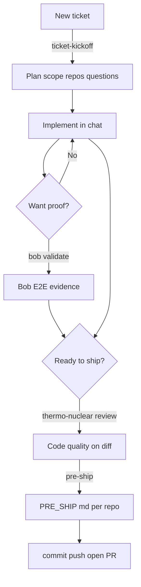
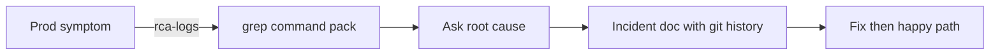

# Ashutosh - Novopay workflow (one page)

**Type `/` in Agent chat** for commands. Everything else is normal chat.

## Happy path (ticket to PR)

## If you want this, use this

| I want to... | Do this |
|--------------|---------|
| Start a ticket | `/ticket-kickoff PE-123` |
| Explain scope / raw idea | Normal chat, or kickoff above |
| Prove it works (API + DB + logs) | **Only when you choose:** "bob validate PE-123" or `/prove-ticket PE-123` |
| Big diff before merge | `/thermo-nuclear-code-quality-review` |
| PR description files (diagrams, UTs, cross-repo) | `/pre-ship PE-123` |
| Commit / push / PR | Ask explicitly - agent never auto-commits |
| Prod logs grep pack | `/rca-logs` + service, date, mobile/stan |
| Full incident doc (git history, when it broke) | Ask: "root cause for ..." (incident rule applies) |
| Unit tests for CC change | `/cc-backend-test-generation` (optional) |

## Prod incident (side path)

## Rules you do not need to remember

- Bob **never** auto-runs after a code fix - only when you ask to test.
- Hooks handle chat hygiene / memory - no commands for that.
- Ignore `novopay/.cursor/automations/` unless you saved Glass webhooks yourself.

## Backup copy

Same file mirrored in `Desktop/cursor-markdowns/WORKFLOW.md`.
