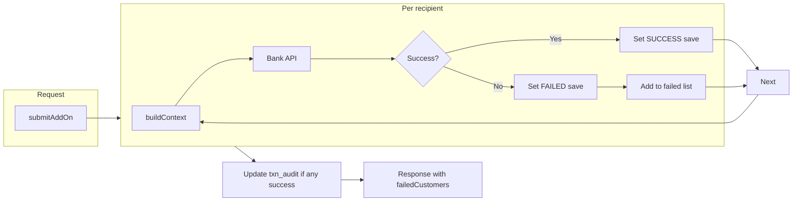

# Add-on card: per-customer processing, status, and failed-customer response

## Current state (commit c442e0d7)

- **[AOCSubmitApplicationService.java](novopay-platform-creditcard-management/src/main/java/in/novopay/creditcard/service/AOCSubmitApplicationService.java)** already processes recipients **one-by-one** in a `for` loop (lines 105–116) and calls `addOnCardService.submitAddOnCardApplication(ctx)` per member.
- If the bank call throws (e.g. `NovopayFatalException` from [SubmitAddOnCardApplicationService](novopay-platform-lib/infra-transaction-hdfc/src/main/java/in/novopay/infra/hdfc/api/loanoncard/util/SubmitAddOnCardApplicationService.java) when `replyCode != 0`), the **entire** submit fails and no per-customer status is stored.
- **[CustomerRelationshipDetails](novopay-platform-creditcard-management/src/main/java/in/novopay/creditcard/entity/CustomerRelationshipDetails.java)** and table `customer_relationship_details` have **no status column** for add-on submission outcome. Table schema is defined in [V000070](novopay-platform-creditcard-management/src/main/resources/sql/migrations/product/V000070__create_log_master_table_data.sql) and later altered in [V000073](novopay-platform-creditcard-management/src/main/resources/sql/migrations/product/V000073_update_customer_relationship_details.sql) (rename `mob` → `mobile_number`).
- **[SubmitAddOnDTO.Response](novopay-platform-creditcard-management/src/main/java/in/novopay/creditcard/service/dto/SubmitAddOnDTO.java)** returns `clientReferenceCode`, `externalReferenceNumber`, `cardVariant`, `address`, `recipientName` only—no failed-customer list.

## Target behaviour

1. **Process one by one** – Keep the existing loop; wrap each bank call in try-catch so one failure does not stop the rest.
2. **On success** – Set status **SUCCESS** for that row in `customer_relationship_details`; track last successful external ref for `transaction_audit` / AAN update.
3. **On failure** – Set status **FAILED** for that row; collect (name, mobile number) for the response; continue to the next recipient.
4. **Response** – Extend response with a list of failed customers (name, mobile) so the client can show retry (UI may change later).
5. **HTTP** – Return **200** with the (possibly partial) response; include `failedCustomers` when any recipient failed. Do not throw when at least one succeeded; only when *all* fail (or request/audit validation fails) keep current throw behaviour or define explicit contract (e.g. 200 + full failed list when all fail).

## Implementation plan

### 1. Add status column to `customer_relationship_details`

- **New Flyway migration** under `src/main/resources/sql/migrations/product/` (next version after V000074, e.g. **V000075**):
  - `ALTER TABLE customer_relationship_details ADD COLUMN add_on_card_submission_status VARCHAR(20) NULL COMMENT 'Add-on card bank submission outcome. Values: SUCCESS (bank accepted), FAILED (bank/submission failed). Null = not yet submitted.';`
  - Optional: index on `(transaction_audit_id, add_on_card_submission_status)` if you need to query by status.
- **Entity** [CustomerRelationshipDetails.java](novopay-platform-creditcard-management/src/main/java/in/novopay/creditcard/entity/CustomerRelationshipDetails.java):
  - Add field, e.g. `private String addOnCardSubmissionStatus;` with JPA `@Column(name = "add_on_card_submission_status")` and JavaDoc: *Allowed values: SUCCESS, FAILED. Null = not yet submitted.*

### 2. Per-customer try-catch and status persistence in AOCSubmitApplicationService

- In **AOCSubmitApplicationService.submit()**:
  - For the **with-recipients** branch (loop over `recipients`):
    - For each `member`, call `addOnCardService.submitAddOnCardApplication(ctx)` inside a **try** block.
    - **On success**: set `member.setAddOnCardSubmissionStatus("SUCCESS")`, `customerRelationshipDetailsDaoService.save(member)`, and update `lastBankExternalRef` / `lastExecutionContext` as today.
    - **On catch** of `NovopayFatalException` (and optionally `NovopayNonFatalException`): set `member.setAddOnCardSubmissionStatus("FAILED")`, save the entity, add a small DTO (name, mobile) to a `List<FailedCustomer>`; **do not rethrow**; continue loop.
  - For the **no-recipients** branch (single bank call): keep current behaviour; no row to update. Optionally leave status column null for that flow if it does not map to a row.
  - After the loop: update `transaction_audit` and AAN only when `lastBankExternalRef` is not blank (i.e. at least one success).
  - Pass the collected **failed list** into `buildResponse` and include it in the returned **Response**.

### 3. Response DTO: failed customers (name, mobile)

- **[SubmitAddOnDTO.java](novopay-platform-creditcard-management/src/main/java/in/novopay/creditcard/service/dto/SubmitAddOnDTO.java)**:
  - Add a small record, e.g. `record FailedCustomer(String name, String mobileNumber)` (or nested in Response).
  - Extend **Response** with `List<FailedCustomer> failedCustomers` (or `failedRecipients`). When none failed, return empty list.
- **buildResponse** in AOCSubmitApplicationService: add parameter `List<FailedCustomer> failedCustomers` and set it on the Response.

### 4. Controller and errors

- **SubmitAddOnController**: no change to HTTP status when service returns; service returns a Response (with optional `failedCustomers`). Only throw for request validation or audit-not-found (existing behaviour). For “all failed” scenario, either return 200 with all recipients in `failedCustomers` and no `externalReferenceNumber` update, or document and keep one consistent behaviour.
- **CreditCardExceptionHandler**: no change required for this feature.

### 5. Tests

- **AOCSubmitApplicationServiceTest**: add a test where one of three recipients throws `NovopayFatalException`: assert two successful bank calls, one save with SUCCESS, one save with FAILED, and response contains one failed customer with name/mobile. Optionally test all-three-fail scenario (response has three failed, no external ref update).
- Update existing tests that assert on Response to include the new `failedCustomers` field (empty list when all succeed).

### 6. JDBC / multi-schema note

- Recipient names are also read via JDBC (`SQL_RECIPIENT_NAMES`, `SQL_RECIPIENT_NAMES_DSA_SCHEMA`). Status is persisted via JPA (`CustomerRelationshipDetails`). If the same app uses both default and tenant (e.g. dsa) schema, ensure the status column is added in all schemas that have `customer_relationship_details` (Flyway may run per schema—follow existing migration workflow per README/flyway-migration-workflow).

## Summary of files to touch

| Area    | File                                                                                                                                                                                                                              |
| ------- | --------------------------------------------------------------------------------------------------------------------------------------------------------------------------------------------------------------------------------- |
| DB      | New Flyway script `V000075__add_add_on_card_submission_status_customer_relationship_details.sql` (or next available version)                                                                                                      |
| Entity  | [CustomerRelationshipDetails.java](novopay-platform-creditcard-management/src/main/java/in/novopay/creditcard/entity/CustomerRelationshipDetails.java) – add status field + comment                                               |
| Service | [AOCSubmitApplicationService.java](novopay-platform-creditcard-management/src/main/java/in/novopay/creditcard/service/AOCSubmitApplicationService.java) – try/catch per member, set status, collect failed, pass to buildResponse |
| DTO     | [SubmitAddOnDTO.java](novopay-platform-creditcard-management/src/main/java/in/novopay/creditcard/service/dto/SubmitAddOnDTO.java) – FailedCustomer record + Response.failedCustomers                                              |
| Tests   | [AOCSubmitApplicationServiceTest.java](novopay-platform-creditcard-management/src/test/java/in/novopay/creditcard/service/AOCSubmitApplicationServiceTest.java) – partial failure and all-failure cases, Response shape           |

## Flow (mermaid)

No changes to the HDFC infra (SubmitAddOnCardApplicationService) or to AddOnCardService interface are required; only the credit-card-management service and schema change.