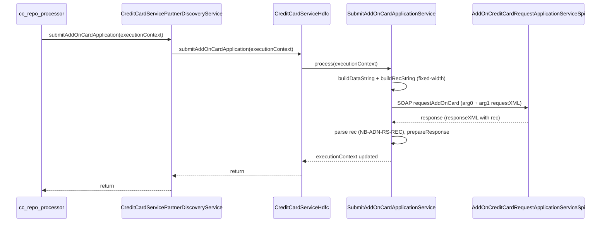

# AddOn Credit Card Request Application – Lib Service and CC Integration

## Context

- **Target API**: `AddOnCreditCardRequestApplicationServiceSpi` – SOAP operation `requestAddOnCard` with `arg0` (context) and `arg1` (requestXML CDATA containing fixed-width `emsg` / `rec` payload).
- **Reference in lib**: [SubmitInstaLoanService](novopay-platform-lib/infra-transaction-hdfc/src/main/java/in/novopay/infra/hdfc/api/loanoncard/SubmitInstaLoanService.java) – same pattern (context + requestXML with `buildDataString` / `buildRecString`, response parsing from `responseXML` rec).
- **SubmitAccountInfoService / AccountInfoBank**: Not present in the current workspace (possibly on another branch). This plan follows the **SubmitInstaLoanService** and **CreditCardService** pattern instead.
- **Spec**: Addon_API_Specs (from your image) – Request record **NB-ADN-RQ-REC** (total length 400: positions 1–334 + FILLER 335–400), Response **NB-ADN-RS-REC** (200 chars).

## Architecture

## 1. Lib: SOAP request/response POJOs (infra-transaction-hdfc)

Create a new package (e.g. `in.novopay.infra.hdfc.api.addoncard`) under [infra-transaction-hdfc](novopay-platform-lib/infra-transaction-hdfc/src/main/java/in/novopay/infra/hdfc/api/).

- **Request POJO** (mirroring [InstaLoanRequest](novopay-platform-lib/infra-transaction-hdfc/src/main/java/in/novopay/infra/hdfc/api/loanoncard/pojo/request/InstaLoanRequest.java)):
  - Root element: `requestAddOnCard` (namespace `http://transaction.service.cards.appx.cz.fc.ofss.com/`).
  - `arg0`: context (same shape as curl – bankCode, channel, transactionBranch, externalReferenceNo, userId, transactingPartyCode; optional: accessibleTargetUnits, allModeSelected, externalBatchNumber, externalSystemAuditTrailNumber).
  - `arg1`: single field `requestXML` (String) for the CDATA payload.
- **Response POJO** (mirroring [InstaLoanResponse](novopay-platform-lib/infra-transaction-hdfc/src/main/java/in/novopay/infra/hdfc/api/loanoncard/pojo/response/InstaLoanResponse.java)):
  - Root: `requestAddOnCardResponse`, with `return` containing `status` (replyCode, replyText) and `responseXML` (String).
- **ObjectFactory** (new or extend existing): `@XmlElementDecl` for `requestAddOnCard` with the same transaction namespace, returning `JAXBElement<AddOnCardRequest>`.

Reuse shared JAXB types for `status` (replyCode, replyText) if available in the same namespace; otherwise define a minimal Status inner class.

## 2. Lib: SubmitAddOnCardApplicationService (infra-transaction-hdfc)

New class: **SubmitAddOnCardApplicationService** extending **AbstractSOASoapService&lt;AddOnCardRequest, AddOnCardResponse&gt;** (same base as [SubmitInstaLoanService](novopay-platform-lib/infra-transaction-hdfc/src/main/java/in/novopay/infra/hdfc/api/loanoncard/SubmitInstaLoanService.java)).

- **Config**: Service URL (e.g. `hdfc.soap.addon.card.request.url` defaulting to the UAT endpoint from your curl), plus config for bankCode, channel, transactionBranch, userId, transactingPartyCode (and externalReferenceNo if not from context). Reuse same namespace constants as LOC (TRAN_NAMESPACE, CON_NAMESPACE) or add addon-specific constants.
- **configurations()**: setServiceURL, addNamespace for TRAN and CON; optionally use same `modifyRequestString` pattern (ns2 → con, ns3 → tran, unescape CDATA).
- **prepareRequest(ExecutionContext)**:
  - Build **header &lt;data&gt;** string from ExecutionContext (user_id, aan, etc.) – same style as `buildDataString` in SubmitInstaLoanService; align length with what the bank expects (from your first curl, the &lt;data&gt; segment is fixed-width).
  - Build **&lt;rec&gt;** string per Addon_API_Specs **NB-ADN-RQ-REC** (400 chars):
    - HIBIADN-FUNC (1–8): e.g. `"BBIADN "` or `"300 00300"` per spec.
    - HIBIADN-LEN (9–13): `00400` (or 00350 if spec is strict 350).
    - HIBIADN-ACCT (14–32), HIBIADN-PROC-CODE (33–35) `011`, HIBIADN-PROD-ID (36–40) `01101`, HIBIADN-ADD-ON-NAME (41–59), HIBIADN-CARD-TYPE (60) `N`, HIBIADN-PAN-CARD (61–70), HIBIADN-RELATIONSHIP (71–85), HIBIADN-DATE-OF-BIRTH (86–93), HIBIADN-MEM-CATEGORY (94–143), HIBIADN-MEM-SUB-CAT (144–193), HIBIADN-CASE-NBR (194–204), HIBIADN-CASE-STATUS (205) `Y`, HIBIADN-DEPT (206–255), HIBIADN-DATE (256–263), HIBIADN-TIME (264–269), HIBIADN-MOB-NBR (270–284), HIBIADN-EMAIL (285–334), FILLER (335–400).
  - Values come from ExecutionContext keys (e.g. `aan`, `addon_name`, `pan_card`, `relationship`, `date_of_birth`, `mem_category`, `mem_sub_cat`, `customer_id`/case_nbr, `dept`, `mobile_number`, `email`) and from config/defaults where specified (e.g. PROC-CODE, PROD-ID, DEPT "Net-banking").
  - Assemble `requestXML` as CDATA: `<?xml version="1.0"?><emsg><header><op>eCSF</op><version>2.0</version><data>...</data></header><msg><rec>...</rec></msg></emsg>`.
  - Set arg0 from config + ExecutionContext (e.g. transactingPartyCode, externalReferenceNo from context or sequence).
  - Return JAXBElement from ObjectFactory.
- **prepareResponse(AddOnCardResponse, ExecutionContext)**:
  - Read replyCode/replyText from response status; on non-zero replyCode throw NovopayFatalException (with optional error-code mapping).
  - Get `responseXML`, parse inner XML (e.g. reuse existing Emsg/Rec JAXB or substring), extract &lt;rec&gt; content (200 chars **NB-ADN-RS-REC**).
  - Parse fixed-width response (HIBVADN-PROC-FLG, HIBVADN-MOB-NBR, HIBVADN-EMAIL, etc.) and put required values back into ExecutionContext for the cc app (e.g. success flag, mobile, email).
- **modifyRequestString**: Same as SubmitInstaLoanService (replace ns2/ns3 with con/tran, unescape `&lt;`/`&gt;`) so the CDATA is sent correctly.

Validation from the spec (PAN vs logged-in customer, DOB match, numeric customer id, etc.) can be implemented either in this service (before building the request) or in the cc repo before calling the lib; the plan assumes critical validations are done in the service or in a prior step in cc.

## 3. Lib: Interface and discovery (infra-transaction-interface + infra-transaction-hdfc)

- **CreditCardService** ([CreditCardService.java](novopay-platform-lib/infra-transaction-interface/src/main/java/in/novopay/infra/transaction/service/CreditCardService.java)): Add method  
  `void submitAddOnCardApplication(ExecutionContext executionContext) throws NovopayFatalException, NovopayNonFatalException;`
- **CreditCardServicePartnerDiscoveryService** ([CreditCardServicePartnerDiscoveryService.java](novopay-platform-lib/infra-transaction-interface/src/main/java/in/novopay/infra/transaction/service/impl/CreditCardServicePartnerDiscoveryService.java)): Add override that delegates to `getBean(executionContext).submitAddOnCardApplication(executionContext)`.
- **CreditCardServiceHdfc** ([CreditCardServiceHdfc.java](novopay-platform-lib/infra-transaction-hdfc/src/main/java/in/novopay/infra/transaction/hdfc/service/impl/CreditCardServiceHdfc.java)): Inject **SubmitAddOnCardApplicationService** and implement `submitAddOnCardApplication` by calling `submitAddOnCardApplicationService.process(executionContext)`.

## 4. CC repo: Invoke lib for Submit Application

- **AddOnCardService** (or a dedicated processor) in [novopay-platform-creditcard-management](novopay-platform-creditcard-management/src/main/java/in/novopay/creditcard/service/AddOnCardService.java): When the flow reaches “Submit Application” (after consent or form submission), populate ExecutionContext with the keys expected by the lib (aan, addon_name, pan_card, relationship, date_of_birth, mem_category, mem_sub_cat, customer_id, dept, mobile_number, email, user_id, external_reference_no, transacting_party_code, etc.), then call **CreditCardServicePartnerDiscoveryService.submitAddOnCardApplication(executionContext)**.
- Alternatively, add a **SubmitAddOnCardApplicationProcessor** (similar to [SubmitLoanOnCardsProcessor](novopay-platform-creditcard-management/src/main/java/in/novopay/creditcard/loc/processors/SubmitLoanOnCardsProcessor.java)) that loads txn/audit data, sets ExecutionContext, and calls the partner discovery service; then wire this processor into the add-on card journey where “Submit Application” is triggered.

## 5. ExecutionContext keys contract

Document (in code or wiki) the ExecutionContext keys the lib expects for AddOn submit, so cc repo can set them consistently:

- **From spec / request**: aan, addon_name, pan_card, relationship, date_of_birth, mem_category, mem_sub_cat, customer_id (case_nbr), dept, mobile_number, email, user_id; optional: external_reference_no, transacting_party_code.
- **From config**: bankCode, channel, transactionBranch, userId, transactingPartyCode (if not from context).
- **Output**: e.g. addon_request_success, addon_response_mobile, addon_response_email (or as needed by cc).

## 6. Testing and config

- Add a unit test for **SubmitAddOnCardApplicationService** (mock or stub SOAP response, verify buildRecString/buildDataString lengths and key fields, and prepareResponse parsing).
- Add config keys for the AddOn SOAP URL and credentials in the same style as LOC (e.g. `hdfc.soap.addon.card.request.url`, and connection/socket timeouts by suffix if the abstract layer supports it).

## File summary

| Location | Action |
|----------|--------|
| **infra-transaction-hdfc** | New package `addoncard`: request/response POJOs, ObjectFactory entry (or new ObjectFactory), **SubmitAddOnCardApplicationService** with buildDataString, buildRecString, prepareRequest, prepareResponse, modifyRequestString. |
| **infra-transaction-interface** | CreditCardService: add `submitAddOnCardApplication`; CreditCardServicePartnerDiscoveryService: add delegation. |
| **infra-transaction-hdfc** | CreditCardServiceHdfc: inject SubmitAddOnCardApplicationService, implement submitAddOnCardApplication. |
| **cc repo** | Use CreditCardServicePartnerDiscoveryService.submitAddOnCardApplication(executionContext) from AddOnCardService or a new SubmitAddOnCardApplicationProcessor, with ExecutionContext populated from request/audit. |

## Spec and curl alignment

- Request &lt;rec&gt; length: Use **400** characters (spec FILLER 335–400); if the bank strictly expects 350, truncate or adjust FILLER and LEN accordingly.
- Header &lt;data&gt;: Match the length and field positions from your working curl (e.g. user id, aan, spaces) so the service produces the same shape as the sample.
- Response: Parse the 200-character **NB-ADN-RS-REC** (HIBVADN-* fields) and map to executionContext and/or error handling.

This yields a single, reusable “Submit Application” class in lib (SubmitAddOnCardApplicationService) mapped to the AddOn Credit Card Request Application SOAP API, and invoked from the cc repo via the existing CreditCardService discovery pattern, consistent with SubmitInstaLoanService and CreditCardServiceHdfc.
