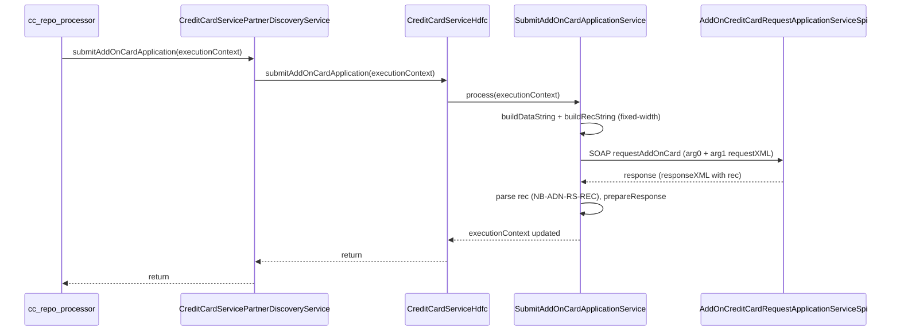

# AddOn Credit Card Request Application – Lib Service and CC Integration

## Reference class (correct)

- **SubmitAccountInfoService** – found on branch **`remotes/origin/ddp-fea-generic-consent`** (commits `a11f18cfd`, `c311ed228`).
- **Path in lib:** `infra-transaction-hdfc/src/main/java/in/novopay/infra/hdfc/api/loanoncard/util/SubmitAccountInfoService.java`
- **Why this reference:** Same SOAP operation shape as AddOn API – **requestAddOnCard** with **arg0** (EligibilityContext) and **arg1** (requestXML with emsg/header/data + msg/rec). It uses **buildDataString** + **buildRecString**, **RequestXMLBuilder** + a field-constants class (AccountInfoFields), **Emsg** + **ResponseXMLExtractor** for response, and **modifyRequestString** for namespaces and CDATA unescaping. AccountInfoRequest/AccountInfoResponse on that branch already use `requestAddOnCard` / `requestAddOnCardResponse` root elements.
- **AccountInfoBank:** Not present in any branch of the lib repo; ignore.

## Context

- **Target API:** `AddOnCreditCardRequestApplicationServiceSpi` – SOAP operation **requestAddOnCard** with `arg0` (context) and `arg1` (requestXML CDATA containing fixed-width emsg/rec payload).
- **Spec (Addon_API_Specs):** Request record **NB-ADN-RQ-REC** total length **400** (positions 1–334 + FILLER 335–400). Response **NB-ADN-RS-REC** **200** chars.

## Architecture

## 1. Lib: SOAP request/response POJOs (infra-transaction-hdfc)

Follow **AccountInfoRequest** / **AccountInfoResponse** from branch **ddp-fea-generic-consent** (they already have requestAddOnCard shape). Either reuse them in a dedicated addon flow or create addon-specific POJOs in a new package (e.g. `in.novopay.infra.hdfc.api.addoncard`).

- **Request POJO:** Root `requestAddOnCard` (namespace `http://transaction.service.cards.appx.cz.fc.ofss.com/`). **arg0:** EligibilityContext with accessibleTargetUnits, allModeSelected, bankCode, channel, externalBatchNumber, externalReferenceNo, externalSystemAuditTrailNumber, transactingPartyCode, transactionBranch, userId (all namespace `http://context.app.fc.ofss.com`). **arg1:** RequestData with single field `requestXML` (String).
- **Response POJO:** Root `requestAddOnCardResponse`. **return:** status (replyCode, replyText, etc. from `http://response.service.fc.ofss.com`) and responseXML (String).
- **ObjectFactory:** `@XmlElementDecl` for `requestAddOnCard` in transaction namespace, returning `JAXBElement<AddOnCardRequest>`. Add getter (e.g. `getAddOnCardRequest`) used in service.

## 2. Lib: Field constants and SubmitAddOnCardApplicationService

- **AddonCardFields (or AddOnCardRequestFields):** New constants class (same pattern as **AccountInfoFields** on ddp-fea-generic-consent) defining **FixedField** positions for:
  - **Header/data** (for `<data>`): user id, nbr req, channel, hdr acct, indicator, filler, etc., matching the length expected by the bank (from curl).
  - **Request rec NB-ADN-RQ-REC (400 chars):** HIBIADN-FUNC (1–8), HIBIADN-LEN (9–13), HIBIADN-ACCT (14–32), HIBIADN-PROC-CODE (33–35), HIBIADN-PROD-ID (36–40), HIBIADN-ADD-ON-NAME (41–59), HIBIADN-CARD-TYPE (60), HIBIADN-PAN-CARD (61–70), HIBIADN-RELATIONSHIP (71–85), HIBIADN-DATE-OF-BIRTH (86–93), HIBIADN-MEM-CATEGORY (94–143), HIBIADN-MEM-SUB-CAT (144–193), HIBIADN-CASE-NBR (194–204), HIBIADN-CASE-STATUS (205), HIBIADN-DEPT (206–255), HIBIADN-DATE (256–263), HIBIADN-TIME (264–269), HIBIADN-MOB-NBR (270–284), HIBIADN-EMAIL (285–334), FILLER (335–400).

- **SubmitAddOnCardApplicationService** – extend **AbstractSOASoapService&lt;AddOnCardRequest, AddOnCardResponse&gt;** (same as [SubmitAccountInfoService](novopay-platform-lib/infra-transaction-hdfc/src/main/java/in/novopay/infra/hdfc/api/loanoncard/util/SubmitAccountInfoService.java) on ddp-fea-generic-consent).
  - **Config:** Service URL (e.g. `hdfc.soap.addon.card.request.url`, default UAT from curl), bankCode, channel, transactionBranch, userId, transactingPartyCode, externalReferenceNo (or from context). Use same namespace constants as LOC (TRAN, CON, etc.).
  - **configurations():** setServiceURL, addNamespace(TRAN, CON, EXC, DAT, DOM), super.configurations().
  - **prepareRequest(ExecutionContext):** Build EligibilityContext from config + ExecutionContext. Build **data** string via **RequestXMLBuilder** + AddonCardFields (same pattern as SubmitAccountInfoService.buildDataString). Build **rec** string via RequestXMLBuilder + AddonCardFields for NB-ADN-RQ-REC (400 chars); source values from ExecutionContext (aan, addon_name, pan_card, relationship, date_of_birth, mem_category, mem_sub_cat, customer_id, dept, mobile_number, email, user_id) and defaults (e.g. PROC-CODE 011, PROD-ID 01101, CARD-TYPE N, CASE-STATUS Y, DEPT "Net-banking", DATE ddMMyyyy, TIME HHmmss). Assemble inner XML: `<?xml version="1.0"?><emsg><header><op>eCSF</op><version>2.0</version><data>...</data></header><msg><rec>...</rec></msg></emsg>`. Set RequestData.requestXML to this (no CDATA in bean; handle in modifyRequestString). Return ObjectFactory.getAddOnCardRequest(req).
  - **modifyRequestString:** Replace namespaces (ns1/ns2/ns3 → tran/con as needed for requestAddOnCard), unescape `&lt;`/`&gt;`/`&quot;` in requestXML, wrap requestXML in CDATA if not already (same as SubmitAccountInfoService).
  - **prepareResponse(AddOnCardResponse, ExecutionContext):** Check response.getResponse().getStatus().getReplyCode(); on non-zero throw NovopayFatalException. Get responseXML, parse with **Emsg** JAXB (existing loanoncard pojo), get rec content string. Parse 200-char **NB-ADN-RS-REC** (fixed positions for HIBVADN-PROC-FLG, HIBVADN-MOB-NBR, HIBVADN-EMAIL, etc.) and put values into ExecutionContext via **ResponseXMLExtractor** or equivalent substring extraction.

Validation (PAN vs logged-in customer, DOB match, numeric customer_id) can live in this service or in cc before calling; document expected ExecutionContext keys.

## 3. Lib: Interface and discovery

**Option A – CreditCardService (current branch pattern)**  
- **CreditCardService:** Add `void submitAddOnCardApplication(ExecutionContext executionContext) throws NovopayFatalException, NovopayNonFatalException;`  
- **CreditCardServicePartnerDiscoveryService:** Add override delegating to `getBean(executionContext).submitAddOnCardApplication(executionContext)`.  
- **CreditCardServiceHdfc:** Inject **SubmitAddOnCardApplicationService**, implement `submitAddOnCardApplication` by calling `submitAddOnCardApplicationService.process(executionContext)`.

**Option B – AddOnCardService (align with ddp-fea-generic-consent)**  
- On that branch there is **AddOnCardService** (interface with `accountInfo(ExecutionContext)`) and **AddOnCardServicePartnerDiscoveryService**. You can add `submitAddOnCardApplication(ExecutionContext)` to **AddOnCardService**, implement it in an HDFC AddOnCardService impl that delegates to SubmitAddOnCardApplicationService, and have cc repo call AddOnCardServicePartnerDiscoveryService. Use this if you merge or cherry-pick the AddOnCardService interface from ddp-fea-generic-consent.

## 4. CC repo: Invoke lib for Submit Application

- From **AddOnCardService** or a **SubmitAddOnCardApplicationProcessor** (similar to SubmitLoanOnCardsProcessor), populate ExecutionContext with: aan, addon_name, pan_card, relationship, date_of_birth, mem_category, mem_sub_cat, customer_id, dept, mobile_number, email, user_id; optional external_reference_no, transacting_party_code. Then call **CreditCardServicePartnerDiscoveryService.submitAddOnCardApplication(executionContext)** (or AddOnCardServicePartnerDiscoveryService if using Option B).

## 5. ExecutionContext keys contract

- **Input:** aan, addon_name, pan_card, relationship, date_of_birth, mem_category, mem_sub_cat, customer_id (case_nbr), dept, mobile_number, email, user_id; optional external_reference_no, transacting_party_code.  
- **Config (lib):** bankCode, channel, transactionBranch, userId, transactingPartyCode, externalReferenceNo (if not from context).  
- **Output (prepareResponse):** e.g. addon_request_success, addon_response_mobile, addon_response_email (or as needed by cc).

## 6. Testing and config

- Unit test for **SubmitAddOnCardApplicationService:** stub SOAP response, assert buildDataString/buildRecString lengths and key field values, and prepareResponse parsing (NB-ADN-RS-REC).  
- Config keys for AddOn SOAP URL and credentials (e.g. `hdfc.soap.addon.card.request.url`, timeouts by suffix if supported).

## File summary

| Location | Action |
|----------|--------|
| **infra-transaction-hdfc** | New package or reuse loanoncard: AddOnCardRequest, AddOnCardResponse (or reuse AccountInfo* from branch), AddonCardFields (FixedField positions), ObjectFactory entry, **SubmitAddOnCardApplicationService** (buildDataString, buildRecString, prepareRequest, prepareResponse, modifyRequestString). Reuse RequestXMLBuilder, Emsg, ResponseXMLExtractor, FixedField from loanoncard. |
| **infra-transaction-interface** | CreditCardService: add submitAddOnCardApplication; CreditCardServicePartnerDiscoveryService: add delegation. (Or AddOnCardService + AddOnCardServicePartnerDiscoveryService if using that branch.) |
| **infra-transaction-hdfc** | CreditCardServiceHdfc (or AddOnCardServiceHdfc): inject SubmitAddOnCardApplicationService, implement submitAddOnCardApplication. |
| **cc repo** | AddOnCardService or SubmitAddOnCardApplicationProcessor: set ExecutionContext, call partner discovery submitAddOnCardApplication. |

## Spec and curl alignment

- Request rec length: **400** characters (FILLER 335–400). HIBIADN-LEN in rec = `00400`.  
- Header data: Match length and positions from working curl (user id, aan, spaces).  
- Response: Parse 200-char **NB-ADN-RS-REC** (HIBVADN-* fields) into ExecutionContext and/or error handling.

This plan uses **SubmitAccountInfoService** (branch **ddp-fea-generic-consent**) as the single reference for structure, POJO shape, RequestXMLBuilder + field constants, and response parsing; and implements the AddOn “Submit Application” flow per Addon_API_Specs and your curl.
