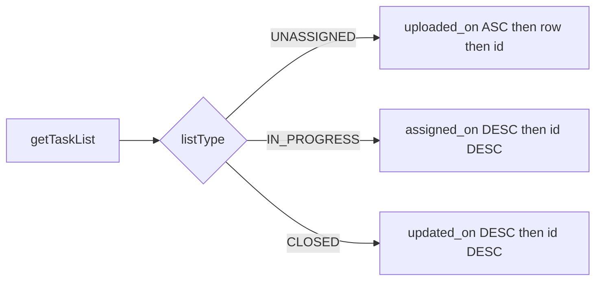

# ADM1 getTaskList per-tab sort (HDP-9003)

**Repo:** `trustt-platform-task-allocation` only. **Branch:** `ddp-fea-bkyc` (not the old `ddp-fea-HDP-9003-adm1-getTaskList` branch). **Ticket:** [HDP-9003](https://novopay.atlassian.net/browse/HDP-9003) [comment 400831](https://novopay.atlassian.net/browse/HDP-9003?focusedCommentId=400831).

No webapp / actor / Flyway. Request/response fields stay the same; only row order changes. Auto-assign FIFO ([HDP-8953](https://novopay.atlassian.net/browse/HDP-8953)) stays `task.created_on ASC, id ASC`. Date filters stay on `task.created_on`.

## Locked order



- **UNASSIGNED:** `COALESCE(task_file.uploaded_on, task.created_on) ASC`, then `COALESCE(source_file_row_number, Integer.MAX_VALUE) ASC`, then `id ASC`. Null `source_file_id` falls back to `created_on` / `id`.
- **IN_PROGRESS:** active `task_assignment.assigned_on DESC`, `id DESC`. Assign/reassign lands on page 1.
- **CLOSED:** keep today's `updated_on DESC, id DESC`.

**ASSUMPTION:** In Progress rows always have an active assignment. A leftover without one sorts with null `assigned_on` (MySQL DESC puts nulls first). Do not invent extra COALESCE unless product asks.

## Why the current code is wrong

[`AdminTaskListSpecifications.matching`](trustt-platform-task-allocation/src/main/java/com/trustt/taskallocation/task/dao/AdminTaskListSpecifications.java) applies one order for every tab:

```java
query.orderBy(cb.desc(root.get("updatedOn")), cb.desc(root.get("id")));
```

[`AdminTaskListCriteria`](trustt-platform-task-allocation/src/main/java/com/trustt/taskallocation/task/dao/AdminTaskListCriteria.java) has no `listType`, so the spec cannot pick a sort. Count query uses `toPredicate` only (no ORDER BY) - leave that path alone.

`TaskEntity` stores `sourceFileId` as a Long (no `@ManyToOne` to `task_file` or `task_assignment`). Do **not** add JPA associations. Use correlated subqueries in Criteria `ORDER BY` (same pattern as the existing assignment EXISTS filter).

## Code changes

1. Add `listType` to `AdminTaskListCriteria` (nullable on the count query; required on the page query).
2. Pass `listType` from [`AdminTaskService.getTaskList`](trustt-platform-task-allocation/src/main/java/com/trustt/taskallocation/task/service/AdminTaskService.java) only when building `pageCriteria`. Count criteria stays unsorted.
3. In `AdminTaskListSpecifications.matching`, switch `orderBy` on `listType`:
   - Unassigned: subquery `TaskFileEntity.uploadedOn` where `file.id = task.sourceFileId`; `cb.coalesce` with `createdOn`; then row number; then `id`.
   - In Progress: subquery `TaskAssignmentEntity.assignedOn` where `taskId` + `active`; `desc` then `id desc`.
   - Closed: keep `updatedOn desc, id desc`.
4. Put the `Integer.MAX_VALUE` row-number sentinel on [`AdminTaskListConstants`](trustt-platform-task-allocation/src/main/java/com/trustt/taskallocation/task/AdminTaskListConstants.java) (no new constants class).
5. Solution SoT: add a short **Sort** note under ADM1 in [`docs/task-allocation/solution-document.md`](trustt-platform-task-allocation/docs/task-allocation/solution-document.md) §7.4 (Deepankar will also update the Jira SQL). ASCII hyphens only.

## Tests (this change only)

- [`AdminTaskServiceTest`](trustt-platform-task-allocation/src/test/java/com/trustt/taskallocation/task/service/AdminTaskServiceTest.java): captor on `findAdminTasks` asserts page criteria carries `listType`; count call does not need it for sort.
- New `AdminTaskListSpecificationsTest`: three cases (one per tab) that build the spec and assert `orderBy` expressions via a small Hibernate `CriteriaBuilder` fixture **or**, if that is too heavy, extract a package-private `applyListOrder(...)` and assert which branch ran. Do not run the preexisting suite; `--tests` only the class(es) written.

## Out of scope

- Agent `getAgentTaskList`
- Upload history (`uploadedOn DESC`)
- Auto-assign / SMS FIFO
- FE (array order only)
- New Jira ticket (implement on HDP-9003 as Deepankar asked)

## Verify

`npm run validate -- trustt-platform-task-allocation` or `./gradlew compileJava` plus `--tests` the new/updated test class. No Bob unless you ask.
