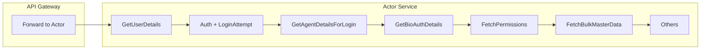

# Plan: Improve agentLogin (298 ms) Response Time

## Current flow (relevant path: REAL run_mode, MPIN/OTP success, do_login=YES)

Request hits **API Gateway** (session/create skip-list, no session validation), then **Actor** service. Orchestration is defined in tenant-specific XML (e.g. [ddp_agent_self_mgmt.xml](novopay-platform-actor/deploy/application/orchestration/ddp_agent_self_mgmt.xml)) and merges with base [ServiceOrchestrationXML.xml](novopay-platform-actor/deploy/application/orchestration/ServiceOrchestrationXML.xml). The success path runs many processors **sequentially**; several do multiple DB or internal HTTP calls.

**Main latency contributors identified:**

| Area                                    | What happens                                                          | Impact        |
| --------------------------------------- | --------------------------------------------------------------------- | ------------- |
| **GetAgentDetailsForLoginProcessor**    | 15+ DB calls; N+1 in address/hierarchy resolution                     | High          |
| **GetUserDetailsForLoginProcessor**     | 5–7 DB calls (handle, user, employee, corporate, attributes)          | Medium        |
| **AuthenticateAgentProcessor**          | 6+ DB + 1 cache (LoginAttempt); crypto + optional email               | Medium        |
| **FetchPermissionListForRoleProcessor** | 5+ DB + **internal HTTP** to authorization service                    | Medium        |
| **FetchAadhaarByAadhaarRefProcessor**   | External Aadhaar vault (BCA/BCFI only)                                | High when hit |
| **FetchBulkUniqueMasterData**           | Master data API/DB (e.g. preferred_language)                          | Low–medium    |
| **GetBioAuthDetails**                   | 2 DB calls                                                            | Low           |
| **Remaining processors**                | Multiple small DB/updates (last login, location, login details, etc.) | Cumulative    |

---

## 1. Remove N+1 in GetAgentDetailsForLoginProcessor (high impact, safe)

**File:** [GetAgentDetailsForLoginProcessor.java](novopay-platform-actor/src/main/java/in/novopay/actor/user/processor/GetAgentDetailsForLoginProcessor.java)

- **prepareAddressDetails**: For each `ActorAddressEntity`, it does `addressDAOService.findOneById`, `masterDataUtil.getUniqueMasterDataValue`, then for each hierarchy ID in a loop: `hierarchyElementDAOService.findOneById` and `hierarchyLevelDAOService.getHierarchyLevelDetails`. This is classic N+1.
- **Action:**  
  - Load all address IDs from `actoradressEntityList`, then **batch fetch** addresses (e.g. `addressDAOService.findAllById(addressIds)` if available, or single query with IN).  
  - Collect all hierarchy element IDs from addresses (including parent chain), then **batch fetch** hierarchy elements and hierarchy levels once (or minimal queries) and build an in-memory map; resolve names/levels from the map inside the loop instead of per-id DB calls.
- **Result:** Same response shape and values; far fewer round-trips (often 20+ → 3–5).

---

## 2. Reduce sequential DB calls in GetAgentDetailsForLoginProcessor

- **Current:** Many independent lookups: employee, corporate, office, branch product list, PAN/doc, parent corporate, corporate attribute, then address/hierarchy as above, last login.
- **Actions:**  
  - Where repositories support it, add or use **batch/findAllById** for related entities (e.g. corporate + parent corporate in one or two planned queries).  
  - **getAgentLastLoginTime**: Ensure `userLoginDetailsService.getLastLoginDetailsByUserId` uses an index on `(user_id, login_datetime DESC)` (or equivalent); add index if missing.  
  - Consider a **single DTO/query** for “agent details for login” that JOINs employee, corporate, parent corporate, office (and optionally last login) to reduce round-trips while keeping same data.
- **Result:** Fewer DB round-trips, same contract.

---

## 3. Cache hot, read-mostly data (medium impact, safe)

- **Master data / config:**  
  - Ensure **MasterDataUtil** / **getBulkUniqueMasterData** and **getUniqueMasterDataValue** use cache for types used in login (e.g. ADDRESS_TYPE, LOCALE, AGENT_LOGIN_CONFIG). If not already cached, add a short TTL cache (e.g. 5–15 min) in infra-masterdata or at call site for login-only keys.  
  - **ConfigValueUtil** (e.g. `user.session.timeout.alert.time.sec`) should be cached; verify and add if missing.
- **Corporate attributes by corporate ID:** Used in multiple processors (e.g. partner_id, enable_agent_journey, role keys). Consider caching by `(corporateId, attributeKey)` with short TTL to avoid repeated DB in the same request or across requests.  
- **Permission list by role:** If authorization service returns permission list by role_code, cache it (e.g. in Redis) with TTL to avoid internal HTTP call on every login for the same role.  
- **Result:** Same responses; fewer DB and internal HTTP calls.

---

## 4. Optimize internal HTTP and external call

- **FetchPermissionListForRoleProcessor:** Calls **NovopayInternalAPIClient** (authorization service). Ensure connection pooling and timeouts are set; consider caching permission list by role (see above).  
- **FetchAadhaarByAadhaarRefProcessor:** Only for BCA/BCFI; calls **AadhaarVaultServicePartnerDiscoveryService**. Ensure strict timeouts and, if business allows, consider returning login success first and loading Aadhaar in background or on next use; if not, at least ensure single call and no retries on critical path.  
- **Result:** Lower P99 and average when these run.

---

## 5. Database and connection tuning (low risk)

- **Indexes:** Verify/add indexes used on the login path:  
  - `user_handle`: (handle_type, handle_value) and/or (handle_value).  
  - `user_auth`: (user_id, auth_type).  
  - `user_login_details`: (user_id, login_datetime DESC).  
  - `employee`: (actor_id).  
  - `corporate`: (id), (parent_id) if used in lookups.
- **Connection pool:** Ensure Actor service DB pool size and timeouts are adequate for concurrency (so login does not wait for connections).  
- **Result:** Faster queries and no connection starvation.

---

## 6. Optional: Defer non-critical work (only if product accepts)

- **SaveLoginLocationProcessor:** Already conditional on config. If acceptable, run “save login location” **asynchronously** (e.g. fire-and-forget or queue) so it does not add to response time.  
- **updateLastLoginProcessor / updateUserLoginDetailsProcessor / createOrUpdateLoginDetailsProcessor:** These are important for correctness; only consider async if you have a proven pattern (e.g. event + eventual consistency) and product sign-off.  
- **Result:** Lower latency only where async is introduced; must not break consistency requirements.

---

## 7. API Gateway and network

- Keep **agentLogin** on session-create skip-list and avoid extra validation that adds latency.  
- Ensure gateway uses **connection pooling** when calling Actor service and that timeouts are reasonable (no unnecessary long waits).  
- **Result:** Minimal added latency from gateway.

---

## Implementation order (safest first)

1. **DB indexes** – Verify/add indexes (no code behavior change).
2. **GetAgentDetailsForLoginProcessor** – Remove N+1 (batch address + hierarchy); then reduce other sequential calls where straightforward.
3. **Caching** – Master data/config and corporate attributes; then permission list by role if authorization service is on critical path.
4. **Internal HTTP / Aadhaar** – Timeouts, pooling, optional cache/async as above.
5. **Optional async** – Only SaveLoginLocationProcessor (and others only with explicit product/architect approval).

---

## What we are not changing

- API request/response contract, error codes, or validation rules.  
- Security: auth, encryption, login attempt tracking (Redis), lockout behavior.  
- Orchestration order where it affects correctness (e.g. auth before agent details).  
- Tenant-specific flows (DDP vs others); optimizations should be in shared code or conditionally applied so no tenant behavior breaks.

---

## How to validate

- **Functional:** Existing agentLogin tests (e.g. [GetAgentDetailsForLoginProcessorTest](novopay-platform-actor/src/test/java/in/novopay/actor/user/processor/GetAgentDetailsForLoginProcessorTest.java), integration tests for login) must pass.  
- **Performance:** Measure p50/p95/p99 and average for `/actor/api/v1/agentLogin` before/after each change (same env and load).  
- **Target:** Meaningful reduction from 298 ms average (e.g. 30–50% from N+1 + caching + indexes), with no regressions in success rate or correctness.

