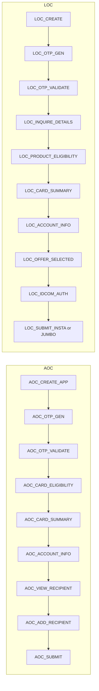

# AOC and LOC Journey Stage Capture and Documentation

## Context

- **Existing pattern (CC only):** [TransactionAuditUtil](novopay-platform-creditcard-management/src/main/java/in/novopay/creditcard/utils/TransactionAuditUtil.java) maps API name + function codes to [TransactionAuditStages](novopay-platform-creditcard-management/src/main/java/in/novopay/creditcard/enums/TransactionAuditStages.java); processors extending [AbstractCreditCardManager](novopay-platform-creditcard-management/src/main/java/in/novopay/creditcard/transaction/processor/AbstractCreditCardManager.java) call `createOrUpdateAuditLog()` which uses [TransactionAuditLogCapture.saveAuditTransactionLog()](novopay-platform-creditcard-management/src/main/java/in/novopay/creditcard/components/stages/TransactionAuditLogCapture.java) to persist one row per (transaction_audit_id, state) with status (SUCCESS/FAIL/NA/...) and attempt.
- **Reporting:** [TransactionListReportRowMapper](novopay-platform-creditcard-management/src/main/java/in/novopay/creditcard/dao/TransactionListReportRowMapper.java) derives "Current Lead Stage" from `draft_application.stage` (UI) or `transaction_audit_logs.state` (technical). LOC list uses [TransactionListLOCRowMapper](novopay-platform-creditcard-management/src/main/java/in/novopay/creditcard/dao/TransactionListLOCRowMapper.java) and only has `da.stage` (draft); no LOC technical stages are written today.
- **AOC:** [AddOnCardService](novopay-platform-creditcard-management/src/main/java/in/novopay/creditcard/service/AddOnCardService.java) only creates/updates `TransactionAudit` (sub_type AOC); no calls to `saveAuditTransactionLog`. [AOCCardSummaryService](novopay-platform-creditcard-management/src/main/java/in/novopay/creditcard/service/AOCCardSummaryService.java), [AddRecipientService](novopay-platform-creditcard-management/src/main/java/in/novopay/creditcard/service/AddRecipientService.java), [AOCSubmitApplicationService](novopay-platform-creditcard-management/src/main/java/in/novopay/creditcard/service/AOCSubmitApplicationService.java) do not record stages.
- **LOC:** Processors under `loc/processors` ([InquireCardEligibilityProcessor](novopay-platform-creditcard-management/src/main/java/in/novopay/creditcard/loc/processors/InquireCardEligibilityProcessor.java), [LoanOffersProcessor](novopay-platform-creditcard-management/src/main/java/in/novopay/creditcard/loc/processors/LoanOffersProcessor.java), [CardSummaryProcessor](novopay-platform-creditcard-management/src/main/java/in/novopay/creditcard/loc/processors/CardSummaryProcessor.java), [SubmitLoanOnCardsProcessor](novopay-platform-creditcard-management/src/main/java/in/novopay/creditcard/loc/processors/SubmitLoanOnCardsProcessor.java)) extend `AbstractProcessor`, not `AbstractCreditCardManager`; they use attributes and update txn audit but do not write to `transaction_audit_logs`. LOC OTP uses [CustomerOtpGenerationProcessor](novopay-platform-creditcard-management/src/main/java/in/novopay/creditcard/transaction/processor/CustomerOtpGenerationProcessor.java) / CustomerOtpValidationProcessor (which extend AbstractCreditCardManager and use `createOrUpdateAuditLog`); the resolved stage comes from `TransactionAuditUtil` (e.g. fintechOtp → ONE_FA_OTP_*), so LOC OTP is currently logged under the same CC OTP stage names.

---

## 1. Branch and repo

- In **novopay-platform-creditcard-management**: create branch from `ddp-fea-dsa-add-on` (e.g. `ddp-fea-dsa-aoc-loc-journey-stages`), checkout, and perform all code changes on that branch.
- If the repo is part of a multi-repo workspace, run git commands from the creditcard-management directory.

---

## 2. AOC journey stages (capture wherever missing)

Target stages (from your list):

| Step              | Stage name (suggested) | Where to capture                                                                                                                                                                                                                                                                                                                                                                                                                |
| ----------------- | ---------------------- | ------------------------------------------------------------------------------------------------------------------------------------------------------------------------------------------------------------------------------------------------------------------------------------------------------------------------------------------------------------------------------------------------------------------------------- |
| 1. Create app     | AOC_CREATE_APP         | [AddOnCardService](novopay-platform-creditcard-management/src/main/java/in/novopay/creditcard/service/AddOnCardService.java) after `insertTransactionAudit` (success); on consent API failure optionally FAIL.                                                                                                                                                                                                                  |
| 2. OTP generation | AOC_OTP_GENERATE       | If AOC uses same navigation as LOC, the shared OTP processor must record AOC-specific state when `transaction_sub_type == "AOC"` (see pluggability below).                                                                                                                                                                                                                                                                      |
| 3. OTP validation | AOC_OTP_VALIDATE       | Same as above.                                                                                                                                                                                                                                                                                                                                                                                                                  |
| 4. Card summary   | 4a–4d                  | [AOCCardSummaryService.getCardSummary](novopay-platform-creditcard-management/src/main/java/in/novopay/creditcard/service/AOCCardSummaryService.java): after inquireCardDetails → AOC_CARD_ELIGIBILITY (success/fail/AAN missing); after getCardSummary → AOC_CARD_SUMMARY; after submitAccountInfo → AOC_ACCOUNT_INFO; view recipient is just reading existing data → AOC_VIEW_RECIPIENT (can be set when returning response). |
| 5. Add recipient  | AOC_ADD_RECIPIENT      | [AddRecipientService.addRecipient](novopay-platform-creditcard-management/src/main/java/in/novopay/creditcard/service/AddRecipientService.java) success/fail.                                                                                                                                                                                                                                                                   |
| 6. Submit         | AOC_SUBMIT             | [AOCSubmitApplicationService](novopay-platform-creditcard-management/src/main/java/in/novopay/creditcard/service/AOCSubmitApplicationService.java) after submit (overall or per-recipient as needed for parity).                                                                                                                                                                                                                |

Implementation approach:

- Add AOC stage constants (enum or constants class used as `state` in `transaction_audit_logs`).
- Inject `TransactionAuditLogCapture` (or a new facade, see Section 5) into the AOC services; obtain `TransactionAudit` by client_reference_code where needed; call `saveAuditTransactionLog(transactionAudit, state, status, stan)` at the right points. Use FAIL on exceptions / business failures (e.g. ineligible, AAN missing) so "blocked after which step" is visible.
- Ensure OTP: if the same processor serves both CC and AOC/LOC, make stage resolution journey-aware (e.g. by transaction_sub_type) so AOC gets AOC_OTP_* and LOC gets LOC_OTP_* (see Section 4).

---

## 3. LOC journey stages (capture full journey and blockages)

From the [DSA Project - LOC flow PDF](c:\Users\ashutosh.kumar\AppData\Roaming\Cursor\User\workspaceStorage\587706ec1545aaf6861bcc58d83cc44d\pdfs\1c25ec56-326f-423b-9787-df54903bcd25\DSA Project - LOC flow.pdf) and your requirements:

- **Consent / create:** LOC_CREATE_APP (or equivalent) when LOC lead/consent is created.
- **OTP:** LOC_OTP_GENERATE, LOC_OTP_VALIDATE (success/fail) — distinct from CC/AOC so reports can filter by journey.
- **Inquire card details:**  
  - Success + AAN received → LOC_INQUIRE_DETAILS (SUCCESS).  
  - No AAN / stop → LOC_INQUIRE_DETAILS_AAN_MISSING (FAIL or dedicated state).  
  - SVC return = F (not eligible) → LOC_INQUIRE_DETAILS_SVC_RETURN_F (FAIL).  
  - API failure → LOC_INQUIRE_DETAILS_API_FAIL (FAIL); consider storing failure reason in `transaction_audit_attributes` (e.g. `loc_block_reason`) for "API failure reasons".
- **Product eligibility (inquire details API / product eligibility):**  
  - No offers → LOC_NO_OFFERS (FAIL).  
  - Offers returned (insta/jumbo) → LOC_PRODUCT_ELIGIBILITY (SUCCESS); optionally attribute which products (insta/jumbo) were offered.
- **Card summary / Account info:** LOC_CARD_SUMMARY, LOC_ACCOUNT_INFO.
- **Customer choice:** Which offer chosen (insta vs jumbo) — store in attributes (e.g. existing or new key); stage e.g. LOC_OFFER_SELECTED (SUCCESS) with attribute `loc_offer_type` = INSTA | JUMBO.
- **IDCOM auth:** LOC_IDCOM_AUTH (SUCCESS/FAIL).
- **Submit:** LOC_SUBMIT_INSTA / LOC_SUBMIT_JUMBO (SUCCESS/FAIL) and capture submit API failure reason in attributes if needed.

Implementation locations:

- [InquireCardEligibilityProcessor](novopay-platform-creditcard-management/src/main/java/in/novopay/creditcard/loc/processors/InquireCardEligibilityProcessor.java): after `inquireCardDetails`, branch on SVC_RETURN and AAN; write appropriate LOC_* state and status; on exception write LOC_INQUIRE_DETAILS_API_FAIL + reason in attributes.
- [LoanOffersProcessor](novopay-platform-creditcard-management/src/main/java/in/novopay/creditcard/loc/processors/LoanOffersProcessor.java): on empty product list → LOC_NO_OFFERS (FAIL); on success → LOC_PRODUCT_ELIGIBILITY (SUCCESS); on exception → LOC_PRODUCT_ELIGIBILITY_API_FAIL; use attributes for offer types if needed.
- [CardSummaryProcessor](novopay-platform-creditcard-management/src/main/java/in/novopay/creditcard/loc/processors/CardSummaryProcessor.java): after getCardSummary → LOC_CARD_SUMMARY (SUCCESS/FAIL).
- Account info: if in same flow as card summary, add LOC_ACCOUNT_INFO after account info API (in LOC flow; AOC already has it in AOCCardSummaryService).
- [SubmitLoanOnCardsProcessor](novopay-platform-creditcard-management/src/main/java/in/novopay/creditcard/loc/processors/SubmitLoanOnCardsProcessor.java): before/after submit by productCode (007 vs 010) → LOC_SUBMIT_INSTA / LOC_SUBMIT_JUMBO with SUCCESS/FAIL; store failure reason in attributes if applicable.
- IDCOM for LOC: identify where IDCOM is called in LOC flow and add LOC_IDCOM_AUTH there.
- OTP: make LOC use LOC_OTP_GENERATE / LOC_OTP_VALIDATE instead of ONE_FA_OTP_* when transaction_sub_type is LOC (Section 4).

Use `transaction_audit_attributes` for: `loc_block_reason`, `loc_offer_type`, `loc_inquire_svc_return`, and any API error code/msg so "customer did what, stuck where, why" is queryable.

---

## 4. Stage resolution for OTP (and optional API-name mapping)

Today `createOrUpdateAuditLog` uses `TransactionAuditUtil.getServiceStage(apiName, functionCode, functionSubCode)` which does not take journey type. So when LOC (or AOC) uses the same OTP API, the state is still ONE_FA_OTP_GENERATE / ONE_FA_OTP_VALIDATE.

- **Option A:** Extend `TransactionAuditUtil.getServiceStage` to accept an optional `transactionSubType` (or journey type) and return LOC_OTP_* / AOC_OTP_* when subType is LOC/AOC. Then in `AbstractCreditCardManager.createOrUpdateAuditLog` pass `transactionAudit.getTransactionSubType()` into the util.
- **Option B:** In the OTP processors (CustomerOtpGenerationProcessor, CustomerOtpValidationProcessor) after calling `createOrUpdateAuditLog`, if subType is LOC or AOC, call `transactionAuditLogCapture.saveAuditTransactionLog` again with the journey-specific state (so both the generic and journey-specific stage exist), or only call the journey-specific save when subType is LOC/AOC.

Recommendation: Option A (single source of truth in util, one row per logical stage per journey). Add LOC_OTP_GENERATE, LOC_OTP_VALIDATE, AOC_OTP_GENERATE, AOC_OTP_VALIDATE to the stage enum (or a shared constants class) and resolve in TransactionAuditUtil by (apiName, functionCode, functionSubCode, transactionSubType).

---

## 5. Pluggability and performance (architectural improvements)

**Pluggability for other journeys**

- **Journey-agnostic capture API:** Introduce a small facade (e.g. `JourneyStageCapture` in `components/stages`) with a method like `capture(TransactionAudit audit, String stage, TransactionAuditLogsStatus status, String stan)` (and optionally `captureWithReason(audit, stage, status, stan, reasonKey, reasonValue)` for attributes). All existing and new journey code (AOC, LOC, future DSA journeys) call this instead of `TransactionAuditLogCapture` directly. Stage names become strings per journey (e.g. from an enum or constants per product). New journeys only need to define their stage constants and call the facade at the right points — no change to `TransactionAuditUtil` switch for new products.
- **Optional registry:** A map or config of (journeyType, apiName/step) → stage string so a new journey can register stages without editing a central switch (future enhancement).
- **Document:** In the same doc (Section 7), add "How to add stage capture for a new journey" with steps: define stages, inject JourneyStageCapture, call at each step and on failure.

**Performance and correctness**

- **Single row per (audit_id, state):** Existing design already upserts one row per (transaction_audit_id, state) and increments attempt; this is efficient and avoids unbounded growth.
- **No extra N+1:** Stage capture is in-process after the main API call; one extra save per step. No additional queries per step if we only write.
- **Reporting:** LOC list/report should use `transaction_audit_logs` for LOC (and AOC) the same way CC uses it: e.g. "Current Lead Stage" for LOC = latest state from `transaction_audit_logs` for that audit (or COALESCE(da.stage, technical_stage)). Update [TransactionListLOCRowMapper](novopay-platform-creditcard-management/src/main/java/in/novopay/creditcard/dao/TransactionListLOCRowMapper.java) (or the query that feeds it) to join with `transaction_audit_logs` and derive stage when present.
- **Parity with old system:** Ensure every step that could "block" or "succeed" in the old flow has a corresponding stage (and on failure, FAIL or a dedicated state) so "x was being done in old system but not in new" cannot be questioned. Checklist: create app, OTP gen/val, inquire details (success / no AAN / SVC return F / API fail), no offers, product eligibility, card summary, account info, offer selected, IDCOM, submit — all covered above.

---

## 6. Reporting and list views

- **CC report:** Already uses `transaction_audit_logs` and `da.stage`. No change needed for CC.
- **LOC list:** Extend the LOC list query to include the latest technical stage from `transaction_audit_logs` (e.g. subquery or join by transaction_audit_id, order by updated_on desc limit 1) and expose it as "Current Lead Stage" or equivalent, with fallback to `da.stage`.
- **AOC:** If there is an AOC list/report, similarly use `transaction_audit_logs` for AOC stages; otherwise at least data is captured for future reporting.

---

## 7. Documentation (where and what)

Add a single document (e.g. **docs/JOURNEY_ANALYTICS.md** in `novopay-platform-creditcard-management` or under a `docs/` folder at repo root) containing:

- **Goal:** Why we capture journey stages (analytics, funnel, blockages, parity with old system).
- **Existing system:** How CC captures stages (TransactionAuditUtil, AbstractCreditCardManager, transaction_audit_logs, report row mapper); that AOC/LOC did not previously write to transaction_audit_logs.
- **Changed what:** AOC and LOC now write to transaction_audit_logs at each step; stage names and failure reasons; OTP stage resolution by journey.
- **Added what:** New stage constants for AOC and LOC; capture points in AddOnCardService, AOCCardSummaryService, AddRecipientService, AOCSubmitApplicationService; LOC processors (InquireCardEligibility, LoanOffers, CardSummary, SubmitLoanOnCards, IDCOM); optional JourneyStageCapture facade; LOC list stage from transaction_audit_logs; attributes for block reason, offer type, etc.
- **Considered what:** Using only draft_application.stage vs technical logs (chose technical for consistency and attempt/status); extending TransactionAuditUtil vs new facade (both: util for OTP, facade for clarity and new journeys); storing failure reasons in attributes vs only state (chose both for "why" analysis).
- **Chose what / Chose that why:** Single table transaction_audit_logs for all journeys (consistency, existing reporting); one row per (audit_id, state) with status and attempt (no schema change); optional facade for pluggability and future journeys.
- **How to use it in future:** Steps to add a new journey: define stage constants, inject capture component, call at each step and on failure; optionally register stages in a config. How to query: by transaction_audit_id and state; join with transaction_audit_attributes for reasons.
- **Is the new system performant and optimal:** Yes: same write pattern as CC (one upsert per step), no extra per-request queries for stage capture; reporting uses existing indexes; attribute keys for reasons are bounded. Optional: index on (transaction_audit_id, state) if not already present.

Reference the LOC flow PDF (or a short summary of the flow) in the doc so readers know the intended steps.

---

## 8. Commit discipline

- One logical change per commit (e.g. "Add AOC stage constants and capture in AddOnCardService", "Add LOC inquire-details stage capture and block reasons", "Add JourneyStageCapture facade", "Update LOC list to show technical stage", "Add docs/JOURNEY_ANALYTICS.md").
- Do not include "Made with cursor" (or similar) in commit messages.

---

## 9. Implementation order (suggested)

1. Branch from `ddp-fea-dsa-add-on`, checkout.
2. Add AOC and LOC stage enums/constants.
3. (Optional but recommended) Add `JourneyStageCapture` facade and use it for new captures.
4. AOC: Add capture in AddOnCardService, AOCCardSummaryService (4a–4d), AddRecipientService, AOCSubmitApplicationService; OTP stage resolution for AOC.
5. LOC: Add capture in InquireCardEligibilityProcessor (including AAN missing, SVC return, API fail), LoanOffersProcessor (no offers, success, fail), CardSummaryProcessor, account info step, SubmitLoanOnCardsProcessor (offer type + submit result), IDCOM step; OTP stage resolution for LOC; attributes for block reason and offer type.
6. Reporting: Update LOC list (and AOC if applicable) to show technical stage from transaction_audit_logs.
7. Documentation: Add docs/JOURNEY_ANALYTICS.md with goal, existing system, changes, additions, considerations, choices, how to use, performance note.
8. Sanity-check: Every old-system step has a corresponding stage and failure path; no "Made with cursor" in commits.

---

## Diagram (stage flow)

Failure/blockage states (e.g. LOC_INQUIRE_DETAILS_AAN_MISSING, LOC_NO_OFFERS) are written as additional states with status FAIL so funnel reports can show "blocked after X".