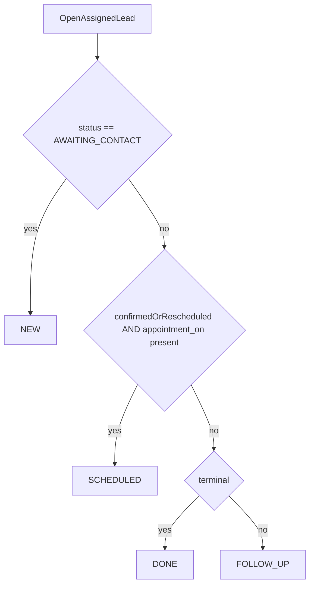

# BKYC Scheduled Split Plan

## Goal
Implement the agent-side tab split so `Scheduled` means only booked visits with `appointment_on`, `Follow-up` holds other open non-terminal work, `New` remains never-contacted, and `Closed` remains terminal.

## Decisions Locked
- New open tab label: `Follow-up`
- Rollout: clean break, no legacy `REVISIT` alias

## Target Behavior
- `NEW` -> only `AWAITING_CONTACT`
- `SCHEDULED` -> `KYC_APPOINTMENT_CONFIRMED` or `APPOINTMENT_RESCHEDULED` with non-null `appointment_on`
- `FOLLOW_UP` -> `CUSTOMER_UNREACHABLE`, `CALLBACK_REQUESTED`, `KYC_FAILED`, `REASSIGNMENT_REQUESTED`, plus any open edge case with no valid appointment date
- `DONE` / APK `Closed` -> terminal statuses
- On transition to booked/rescheduled: require `appointmentOn`
- On transition to follow-up states: clear `appointment_on` so stale dates cannot keep a lead in Scheduled

## Main Changes
- Backend list/query contract in [`trustt-platform-task-allocation/src/main/java/com/trustt/taskallocation/task/service/AgentTaskService.java`](trustt-platform-task-allocation/src/main/java/com/trustt/taskallocation/task/service/AgentTaskService.java)
  - replace the current 3-way hardcoded bucket logic with 4 explicit buckets
  - update tab counts and list filtering
- Backend constants / request validation in [`trustt-platform-task-allocation/src/main/java/com/trustt/taskallocation/task/AgentTaskListConstants.java`](trustt-platform-task-allocation/src/main/java/com/trustt/taskallocation/task/AgentTaskListConstants.java)
  - accept `NEW`, `SCHEDULED`, `FOLLOW_UP`, `DONE`
- Status update enforcement in [`trustt-platform-task-allocation/src/main/java/com/trustt/taskallocation/task/service/AgentTaskService.java`](trustt-platform-task-allocation/src/main/java/com/trustt/taskallocation/task/service/AgentTaskService.java) and status service paths
  - validate `appointmentOn` for booked/rescheduled updates
  - clear `appointment_on` for unreachable/callback/fail/reassign
- APK dashboard/search tab model in [`trustt-platform-digi-distribution-app/bkycVisitsLib/src/main/java/in/novopay/ddp/bkycvisitslib/bkyc_visits_dashboard/BkycVisitsDashboardActivity.kt`](trustt-platform-digi-distribution-app/bkycVisitsLib/src/main/java/in/novopay/ddp/bkycvisitslib/bkyc_visits_dashboard/BkycVisitsDashboardActivity.kt), [`trustt-platform-digi-distribution-app/bkycVisitsLib/src/main/java/in/novopay/ddp/bkycvisitslib/bkyc_visits_dashboard/BkycVisitsDashboardPresenter.kt`](trustt-platform-digi-distribution-app/bkycVisitsLib/src/main/java/in/novopay/ddp/bkycvisitslib/bkyc_visits_dashboard/BkycVisitsDashboardPresenter.kt), and [`trustt-platform-digi-distribution-app/bkycVisitsLib/src/main/java/in/novopay/ddp/bkycvisitslib/search_bkyc_visit/SearchVisitsActivity.kt`](trustt-platform-digi-distribution-app/bkycVisitsLib/src/main/java/in/novopay/ddp/bkycvisitslib/search_bkyc_visit/SearchVisitsActivity.kt)
  - replace `Scheduled`-means-REVISIT assumptions with explicit `Scheduled` and `Follow-up`
- APK copy/status presentation in [`trustt-platform-digi-distribution-app/bkycVisitsLib/src/main/res/values/strings.xml`](trustt-platform-digi-distribution-app/bkycVisitsLib/src/main/res/values/strings.xml) and [`trustt-platform-digi-distribution-app/bkycVisitsLib/src/main/java/in/novopay/ddp/bkycvisitslib/lead_details/LeadDetailsActivity.kt`](trustt-platform-digi-distribution-app/bkycVisitsLib/src/main/java/in/novopay/ddp/bkycvisitslib/lead_details/LeadDetailsActivity.kt)
  - fix empty-state text, tab names, and appointment/status rendering assumptions

## Backend Flow

## Verification Scope
- Backend targeted tests for bucket routing and status-update side effects
- APK manual/targeted validation for:
  - New -> Scheduled on book with date
  - New -> Follow-up on unreachable/callback/fail/reassign
  - Scheduled -> Follow-up when appointment breaks
  - Follow-up -> Scheduled on rebook
  - Any terminal -> Closed
- Confirm there is no stale `appointment_on` causing wrong Scheduled placement

## Risks
- Clean break means old APK callers expecting `REVISIT` will fail until APK updates ship together
- Search/filter/default-tab paths may still assume `Scheduled` is the middle bucket everywhere
- Any server-side hardcoded green/status presentation in APK may still imply booked work unless cleaned up with the tab split

## Suggested Rollout Order
1. Backend bucket + validation changes on a feature branch
2. APK tab/model/copy updates against the new list types
3. Joint QA on action-to-tab outcomes
4. Product sign-off on wording and final tab order