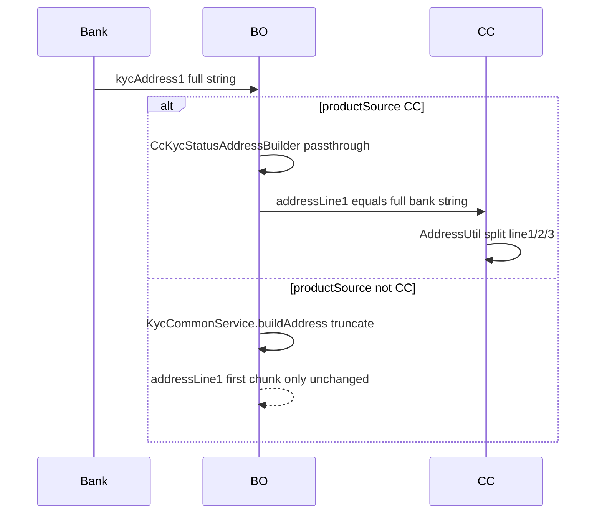

# CC-only KYC address fix (BO repo, BO-originated unchanged)

## Verdict

Change **BO repo only**, gated by `KycConstants.isCcProductSource`. Do **not** alter shared BO address truncation for non-CC. Do **not** expand `KycStatusAddressDTO` - put the **full** bank `kycAddress1` / `kycAddress2` into `addressLine1` for CC; CC already splits via `AddressUtil`.

## Why this shape

UAT proof for DSA322671786000715: bank sent full `Sector number 6, Airoli Near Railway...`; BO `Address built` kept only `Sector number 6, Airoli` because `buildAddress` strips city/pin, cuts at `NEAR`, chunks by `addressLineLength`, then **only keeps `lines.get(0)`**.

Local feature branch `[ddp-fea-kyc-engine-hdp-7350](c:\Users\ashutosh.kumar\Desktop\novopay\novopay-platform-banking-origination)` already simplified `buildAddress` to passthrough for **everyone** - that would change BO-originated. This plan **reverts that shared method to UAT truncation** and moves passthrough to a CC-only class.

## Implementation (BO)

### 1. Restore shared BO builder

In `[KycCommonService.java](c:\Users\ashutosh.kumar\Desktop\novopay\novopay-platform-banking-origination\src\main\java\in\novopay\bankingorigination\v2\service\KycCommonService.java)`, restore `buildAddress` to the **UAT** implementation (strip city/pincode, landmark keywords, chunk, `lines.get(0)` only). This is the path for non-CC.

### 2. Add CC-only copy class

New class e.g. `[CcKycStatusAddressBuilder.java](c:\Users\ashutosh.kumar\Desktop\novopay\novopay-platform-banking-origination\src\main\java\in\novopay\bankingorigination\v2\service\CcKycStatusAddressBuilder.java)`:

- Same signature as `buildAddress(addrMap, addressKey, pincode, city)`
- Builds `KycStatusAddressDTO` with geo fields from `addrMap` (same as today)
- Sets `addressLine1 = addressKey` (trimmed), **no** strip / NEAR cut / chunk / discard
- Log distinctly e.g. `CC Address built for KYC` so greps can prove the path

### 3. Stitch only for CC-originated status

In `[KycService.resolveStatusAddresses](c:\Users\ashutosh.kumar\Desktop\novopay\novopay-platform-banking-origination\src\main\java\in\novopay\bankingorigination\v2\service\KycService.java)`:

- Add `String productSource` parameter
- Choose builder: `isCcProductSource(productSource)` → `ccKycStatusAddressBuilder.buildAddress(...)` else → `kycCommonService.buildAddress(...)`
- Pass `kycDetailEntity.getProductSource()` from both callers:
  - `resolveHdfcStatusSuccess` (live bank poll)
  - `buildStatusFromElasticData` (ES cache path)

Reuse existing gate: `KycConstants.isCcProductSource` / `PRODUCT_SOURCE_CC = "CC"`.

### 4. Tests (BO)

- Unit test: CC builder keeps full string including `Near Railway...` and long mailing text
- Unit/service test: when productSource is not CC, still get first-chunk-only behavior (regression lock)
- When productSource is CC, `resolveStatusAddresses` uses passthrough

### 5. Out of scope (explicit)

- No change to BO-originated address semantics
- No DTO `addressLine2/3` expansion
- No CC repo change in this pass (once full line1 arrives, CC split + existing persist should absorb content; `mandateLine2` duplicate was a symptom of short truncated line1)
- No FILLER5 / commit / Bob unless asked

## Prove after deploy (manual)

Same CRN greps on DSA UAT:

- BO: `Address built` / `CC Address built` for STAN / CRN should show full bank text for CC
- CC: `aadhaarAddress.addressLine1` should match bank `kycAddress1` (not short `Sector number 6, Airoli` only)
- Non-CC BO KYC status: still truncated first chunk (spot-check one BO lead if available)

