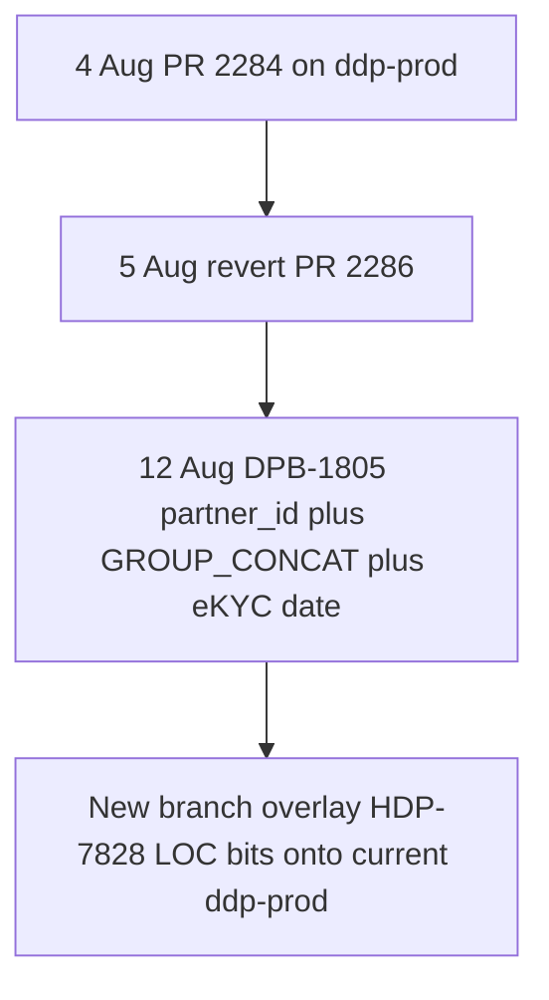

# Put selected HDP-7828 LOC bits on ddp-prod without undoing DPB-1805

## Feature branch after the revert - nothing unique to merge now

`ddp-fea-loc-pe-pq-jumbo-restriction-baseline` was synced onto `ddp-prod` after PR 2284 was reverted. Current tip is [`186971be5`](https://github.com/khoslalabs/novopay-platform-creditcard-management/commit/186971be5) (6 Aug, Salesforce PR 2297).

Commits on that branch **after** the original feature tip (`ce608a897`) are `ddp-prod` history, not new baseline work:

- 4 Aug - PR 2284 merge
- 5 Aug - revert `fc602603a` (the branch **contains the revert**)
- 5-6 Aug - log masking + Salesforce PR 2297 (already on `ddp-prod`)

`origin/ddp-prod..feature` is **0 commits**. The feature branch is an ancestor of current `ddp-prod` and is 13 commits behind (including DPB-1805). Jumbo restriction from [PR 2228](https://github.com/trusttai/trustt-platform-creditcard-management/pull/2228) (20 Jul) is still on `ddp-prod`; it was not reverted.

So there are **no post-revert feature-only changes** to keep off prod. The files we are skipping now are leftover **PR 2284** bits (unrelated S1192 tests, unused import), not later feature work.

## Later merge of the feature branch to ddp-prod

**Merging the current feature branch later will not bring the skipped PR 2284 files.** Git already merged those commits on 4 Aug. The 5 Aug revert stays in history. A second merge of the same commits is a no-op.

This plan is in accordance with a later merge **only if** that later merge is **new commits** on the feature branch (after merging latest `ddp-prod` in):

1. Land this surgical PR on `ddp-prod` (new commits, not a re-merge of PR 2284).
2. Merge `ddp-prod` into `ddp-fea-loc-pe-pq-jumbo-restriction-baseline`.
3. Put remaining baseline work as **new** commits on that branch.
4. Then merge that branch to `ddp-prod` as usual.

If step 3 is skipped and someone just merges the branch as it is today, Git brings nothing.

Do **not** later `git revert fc602603a` to "get the rest" - that would fight DPB-1805 and this overlay again.

## Do not do this now

Do **not** `git revert fc602603a` and do **not** merge `ddp-fea-loc-pe-pq-jumbo-restriction-baseline`.

- That feature branch tip is no longer the Aug 4 merge (`ce608a897`); it points at a later `ddp-prod` commit.
- A revert-of-revert would rewrite 25 files from [PR 2284](https://github.com/trusttai/trustt-platform-creditcard-management/pull/2284), including ~14 unrelated S1192 test files, and would fight [DPB-1805](https://github.com/khoslalabs/novopay-platform-creditcard-management/commit/b17f30d0f751b9fd2003cb2df8a3a4bd9bd2bafc) (Abhishek, 12 Aug) on the same report SQL files.

Partner_id report scoping is **already back** on `ddp-prod` via DPB-1805 (`appendReportScopeFilter`). What is still missing is mostly the **LOC date-range / row-limit** work from PR 2284.

## What is already on `ddp-prod` vs what to put back

**Keep as-is (DPB-1805 / current prod):**

- `[TransactionListReportQueryBuilder.java](novopay-platform-creditcard-management/src/main/java/in/novopay/creditcard/dao/TransactionListReportQueryBuilder.java)` - `SUBSTRING_INDEX(GROUP_CONCAT(... ORDER BY ... DESC), ',', 1)` (fixes multi-audit timestamp crash)
- `[TransactionListReportRowMapper.java](novopay-platform-creditcard-management/src/main/java/in/novopay/creditcard/dao/TransactionListReportRowMapper.java)` - `setEkycCompletionDateAndTime(...)` (CC report already has date-range + LIMIT)
- `[TransactionReportSqlFilters.appendReportScopeFilter](novopay-platform-creditcard-management/src/main/java/in/novopay/creditcard/dao/TransactionReportSqlFilters.java)` - partner_id-only scope

**Restore from merge `ac0e00070` (HDP-7828 functional leftover):**

- `[TransactionListLOCReportRowMapper.java](novopay-platform-creditcard-management/src/main/java/in/novopay/creditcard/dao/TransactionListLOCReportRowMapper.java)` - this is the real gap. Current LOC path still uses optional `appendCreatedOnFilter` and `lt.account_number`. PR 2284 added mandatory `from_date`/`to_date` via `TransactionReportDateRange`, `LIMIT`, configs `loc.report.max.date.range.days` / `loc.report.max.rows`, and `lt.loan_number` as Loan_reference_number.
- `[TransactionReportSqlFilters.java](novopay-platform-creditcard-management/src/main/java/in/novopay/creditcard/dao/TransactionReportSqlFilters.java)` - add back `appendResolvedCreatedOnBetween`; remove `appendCreatedOnFilter` once LOC no longer calls it.
- `[TransactionReportDateRange.java](novopay-platform-creditcard-management/src/main/java/in/novopay/creditcard/dao/TransactionReportDateRange.java)` - CC/LOC wording only (`from_date and to_date are mandatory for transaction report`).
- `[TransactionListDao.java](novopay-platform-creditcard-management/src/main/java/in/novopay/creditcard/dao/TransactionListDao.java)` - `getLOCTransactionsReportList` throws `NovopayNonFatalException`.
- `[DSALOCReport.java](novopay-platform-creditcard-management/src/main/java/in/novopay/creditcard/reports/impl/DSALOCReport.java)` - propagate that throws.

**Skip:** `[SqlTimestampParsing.java](novopay-platform-creditcard-management/src/main/java/in/novopay/creditcard/dao/SqlTimestampParsing.java)` (unused-import only). Skip all unrelated processor tests that PR 2284 also touched (`AddRecipientServiceTest`, `GetTnxResumeListProcessorTest`, etc.).

**Small consistency tweak on CC mapper:** keep DPB-1805 eKYC mapping and inline date-range math; optionally switch the BETWEEN/ORDER BY lines to `appendResolvedCreatedOnBetween` + `appendCreatedOnOrderDesc` so CC and LOC share one helper. Do not copy the HDP-7828 QueryBuilder.

## Implementation steps

1. In `novopay-platform-creditcard-management`, fetch and branch from **latest** `origin/ddp-prod`:
  `ddp-fea-restore-HDP-7828`
2. Overlay LOC mapper from `ac0e00070` **onto** current file: keep `appendReportScopeFilter`; restore date-range + LIMIT + `loan_number`; do not bring back old `GROUP_CONCAT`.
3. Add `appendResolvedCreatedOnBetween` to SqlFilters; delete unused `appendCreatedOnFilter`.
4. Restore DateRange message, Dao/DSALOCReport throws.
5. Restore only these tests from `ac0e00070`:
  - add `[TransactionReportSqlFiltersTest.java](novopay-platform-creditcard-management/src/test/java/in/novopay/creditcard/dao/TransactionReportSqlFiltersTest.java)`
  - `[TransactionReportDateRangeTest.java](novopay-platform-creditcard-management/src/test/java/in/novopay/creditcard/dao/TransactionReportDateRangeTest.java)`
  - `[DSALOCReportTest.java](novopay-platform-creditcard-management/src/test/java/in/novopay/creditcard/reports/impl/DSALOCReportTest.java)`
6. Compile + run those three test classes. Diff should be report files only.
7. Push and open a `ddp-prod` PR, same pattern as auth [#2231](https://github.com/trusttai/trustt-platform-authorization/pull/2231) and masterdata [#8300](https://github.com/trusttai/trustt-platform-masterdata/pull/8300).

## Product note

Restoring PR 2284 means LOC `Loan_reference_number` goes back to `lt.loan_number` (current pre-prod is `lt.account_number`). That was an intentional HDP-7828 mapping change, not a DPB-1805 fix. If bank/pre-prod must keep `account_number`, say so before implementation and we will keep the current column.