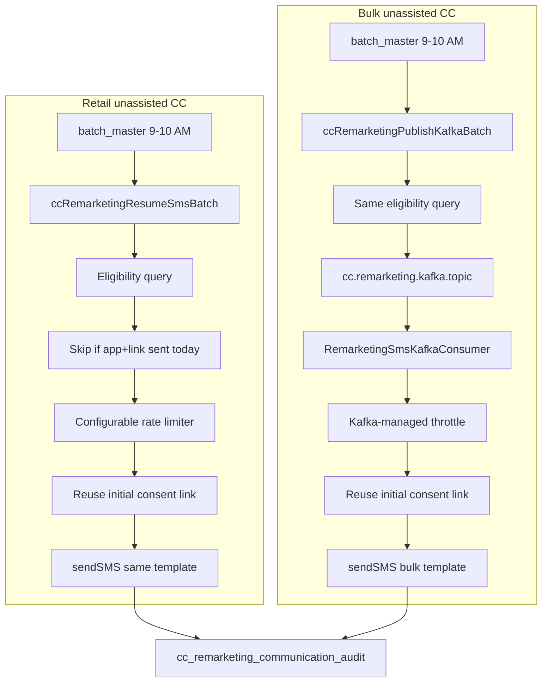
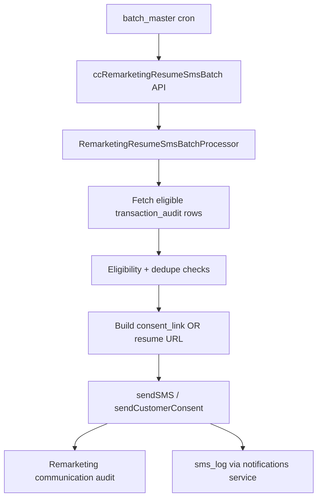
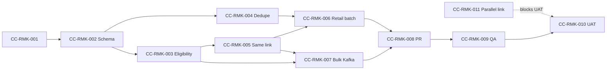

# Remarketing SMS for Resumable CC Leads - Implementation Plan

## Locked Product Decisions (stakeholder input)


| #   | Decision                                                                                                                                                                               |
| --- | -------------------------------------------------------------------------------------------------------------------------------------------------------------------------------------- |
| 1   | **Scope:** CC only; **unassisted only** (`is_assisted = 'N'`), includes **bulk**; **exclude assisted**                                                                                 |
| 2   | **Recipient:** SMS to **customer mobile only** - not agent (same as dashboard “send link to individual” but automated)                                                                 |
| 3   | **Eligibility:** `txn_status = 'PENDING'` **and** initial consent **agreed**; after agree, consent moves to **INPROGRESS** - then remarketing may send                                 |
| 4   | **Application window:** Resumable for **10 days**; existing `updateCreditCardStatusBatch` marks **EXPIRED** after day 10 (`transaction.expiring.days`)                                 |
| 5   | **Same link every time:** Reuse **existing initial consent link** (`consent_code` / portal URL) - do **not** generate a new link per reminder                                          |
| 6   | **Template:** **Same SMS template** as initial consent link SMS (`DDP_SMS_CC_CNST_LINK` retail / `DDP_SMS_CC_BULK_CNST_LINK` bulk)                                                     |
| 7   | **Schedule:** Daytime batch **9:00 AM**; send frequency **configurable** (default daily same time)                                                                                     |
| 8   | **Day 9 rule:** Last reminder on **day 9**; link valid **24 hours** (9 AM – 9 PM) - coordinate with parallel link work (today ~8h link expiry)                                         |
| 9   | **Journey validity:** Resume from same link valid **10 days**; reminder while application still **PENDING**                                                                            |
| 10  | **KYC re-do:** If KYC expires, customer redoes KYC; **same application** remains valid                                                                                                 |
| 11  | **Bulk path:** **No in-batch rate limiter** for bulk - batch **publishes to Kafka**; **Kafka consumer** sends SMS with throttling                                                      |
| 12  | **Retail path:** Scheduled batch + **configurable rate limiter** in processor                                                                                                          |
| 13  | **Reporting:** **No changes** to existing MIS/lead reports in this phase - but **dedicated remarketing audit** so impact can be tracked separately (queries/dashboards optional later) |
| 14  | **Parallel work:** In-flight **resumable link validity** development must complete **in parallel** - remarketing depends on stable same-link behavior                                  |
| 15  | **Same-day exclusion:** If application **started today** and initial consent **link already shared today**, remarketing batch must **not** send again the same calendar day            |





---

## Current System vs Product Document

The product doc assumes a single `APPLICATION_STATUS` + `RESUME_ALLOWED` model. **Credit card management uses a different model today:**


| Product doc term   | CC implementation today                                                                                                                                                                                                       | Source                                                                                                                                                                                                                                                                                                                            |
| ------------------ | ----------------------------------------------------------------------------------------------------------------------------------------------------------------------------------------------------------------------------- | --------------------------------------------------------------------------------------------------------------------------------------------------------------------------------------------------------------------------------------------------------------------------------------------------------------------------------- |
| PENDING            | **Unassisted CC:** `txn_status = 'PENDING'` (`[TransactionListRowMapper](novopay-platform-creditcard-management/src/main/java/in/novopay/creditcard/dao/TransactionListRowMapper.java)`); assisted resume tab still uses `NA` | Remarketing uses **PENDING** per product lock                                                                                                                                                                                                                                                                                     |
| Unassisted filter  | `is_assisted = 'N'`                                                                                                                                                                                                           | `[CreditCardApplicationService](novopay-platform-creditcard-management/src/main/java/in/novopay/creditcard/service/CreditCardApplicationService.java)`, bulk `[BatchValidateLeadsService](novopay-platform-creditcard-management/src/main/java/in/novopay/creditcard/bulk/BatchValidateLeadsService.java)`                        |
| Consent agreed     | `consent_audit.consent_status` = `AGREED` then `INPROGRESS`                                                                                                                                                                   | `[SaveCustomerConsentAuditLogProcessor](novopay-platform-consents/src/main/java/in/novopay/consents/processor/SaveCustomerConsentAuditLogProcessor.java)`, join in `[TransactionResumeListRowMapper](novopay-platform-creditcard-management/src/main/java/in/novopay/creditcard/dao/TransactionResumeListRowMapper.java)` (`ica`) |
| SUCCESS            | `txn_status = 'SUCCESS'`                                                                                                                                                                                                      | Same                                                                                                                                                                                                                                                                                                                              |
| FAILED             | `txn_status IN ('FAIL','EXPIRED')` (non-IPA-fail)                                                                                                                                                                             | Same                                                                                                                                                                                                                                                                                                                              |
| REJECTED           | `txn_status = 'FAIL'` AND `cc_additional_txn_data.ipa_status = 'FAIL'`                                                                                                                                                        | Same                                                                                                                                                                                                                                                                                                                              |
| EXPIRED            | `txn_status = 'EXPIRED'` (set by existing batch after N days)                                                                                                                                                                 | `[UpdateCreditCardStatusBatchProcessor.java](novopay-platform-creditcard-management/src/main/java/in/novopay/creditcard/common/processors/UpdateCreditCardStatusBatchProcessor.java)`                                                                                                                                             |
| CLOSED             | **Not modeled** in CC resume lifecycle                                                                                                                                                                                        | -                                                                                                                                                                                                                                                                                                                                 |
| RESUME_ALLOWED = Y | **No column/flag**; eligibility inferred from status + draft + hybrid flags                                                                                                                                                   | Gap                                                                                                                                                                                                                                                                                                                               |
| Resume link        | **No CC `resume.sms.link`**; customer link = **consent portal URL** (`consent_code` via consents service)                                                                                                                     | `[PrepareNotificationDataProcessor.java](novopay-platform-consents/src/main/java/in/novopay/consents/processor/PrepareNotificationDataProcessor.java)`                                                                                                                                                                            |
| Remarketing batch  | **Not implemented** for CC                                                                                                                                                                                                    | FD reference exists                                                                                                                                                                                                                                                                                                               |


**Closest reference implementation (FD):** `[SendJourneyNotificationBatch.java](novopay-platform-banking-origination/src/main/java/in/novopay/bankingorigination/v2/batch/SendJourneyNotificationBatch.java)` - queries `draft_application` with `status=PENDING` + `is_resume_enabled=true`, builds `resume.sms.link`, sends `DDP_SMS_FD_RESUME` via internal `sendSMS` API. Registered in `[V6000007__fd_resume_deletion_notification_batch.sql](novopay-platform-batch/src/main/resources/sql/migrations/bb/V6000007__fd_resume_deletion_notification_batch.sql)`.

**Existing CC batch pattern to follow:** `[UpdateCreditCardStatusBatchProcessor](novopay-platform-creditcard-management/src/main/java/in/novopay/creditcard/common/processors/UpdateCreditCardStatusBatchProcessor.java)` (`AbstractProcessor` + orchestration XML + `batch_master` cron in `novopay-platform-batch`).

**Dead / unused configs today (product doc should clarify intent):**

- `hdfc.cc.exclude.application.status` - loaded in `[GetTnxResumeListProcessor](novopay-platform-creditcard-management/src/main/java/in/novopay/creditcard/transaction/processor/GetTnxResumeListProcessor.java)` but not applied in resume-list SQL
- `dsa.resume.journey.max.retention.days` - injected in `[GetPendingTransactionProcessor](novopay-platform-creditcard-management/src/main/java/in/novopay/creditcard/common/processors/GetPendingTransactionProcessor.java)` but unused




---

## Proposed Technical Approach (aligned to locked decisions)

See **Locked Product Decisions** and dual-path diagram above. Summary:

### 1. Dual delivery paths


| Path              | Batch API                        | Send                                              | Throttle                  |
| ----------------- | -------------------------------- | ------------------------------------------------- | ------------------------- |
| Retail unassisted | `ccRemarketingResumeSmsBatch`    | `sendSMS` + same `consent_link`                   | In-processor rate limiter |
| Bulk unassisted   | `ccRemarketingPublishKafkaBatch` | Kafka → `RemarketingSmsKafkaConsumer` → `sendSMS` | Consumer throttle only    |


References: `[BatchValidateLeadsService](novopay-platform-creditcard-management/src/main/java/in/novopay/creditcard/bulk/BatchValidateLeadsService.java)`, `[BulkUploadLeadsConsumer](novopay-platform-creditcard-management/src/main/java/in/novopay/creditcard/consumers/BulkUploadLeadsConsumer.java)`.

### 2. Eligibility (unassisted CC, retail + bulk)

```sql
ta.transaction_sub_type = 'CC'
AND ta.is_assisted = 'N'
AND ta.txn_status = 'PENDING'
AND ta.customer_identifier_value IS NOT NULL
AND timestampdiff(day, ta.created_on, now()) < :expiringDays
AND ica.consent_status IN ('AGREED', 'INPROGRESS')
```

### 3. Same link - no `sendCustomerConsent` on remarketing

Reuse `ica.consent_code` → `ConsentsUtil.getConsentUrl` → placeholder in **existing** template (`DDP_SMS_CC_CNST_LINK` / `DDP_SMS_CC_BULK_CNST_LINK`). Parallels dashboard manual resend but without creating new consent rows.

### 4. Dedupe + audit

- **Same-day exclusion:** `DATE(ta.created_on) = CURDATE()` AND initial link already shared today (`DATE(ica.updated_on) = CURDATE()`, consent `AGREED`/`INPROGRESS`) → skip with `SKIPPED_SAME_DAY_INITIAL_LINK`.
- **From day 1+:** `cc.remarketing.sms.min.interval.hours` + max sends within 10-day window.
- **Audit table** for every attempt (SUCCESS / FAILED / SKIPPED + `skip_reason`).

### 4b. Separate remarketing tracking (no existing-report changes)


| Mechanism                                     | Purpose                                                          |
| --------------------------------------------- | ---------------------------------------------------------------- |
| `cc_remarketing_communication_audit`          | Isolate remarketing sends from initial consent SMS               |
| `communication_source`                        | `REMARKETING_BATCH` / `REMARKETING_KAFKA`                        |
| `batch_run_id`, `consent_code`, `skip_reason` | Ops/product analytics without touching MIS                       |
| README sample SQL                             | Optional ad-hoc counts (sends per day, skip reasons, conversion) |


**Not changing:** `[LEAD_REPORT_QUERY.sql](novopay-platform-creditcard-management/docs/LEAD_REPORT_QUERY.sql)`, resume dashboard APIs, `transaction_audit` MIS columns.

### 5. Parallel dependency CC-RMK-011

Consent `valid_upto` / 8h→24h day-9 rules owned by parallel resumable-link stream; remarketing UAT blocked until aligned.

### 6. Out of scope

Assisted CC, **modifications to existing** reporting/MIS exports, new SMS template copy, LOC/AOC. (Dedicated remarketing audit + sample queries **in scope** for separate tracking.)

---

## Questions for Product

### Answered (locked)


| #   | Topic        | Answer                                                                          |
| --- | ------------ | ------------------------------------------------------------------------------- |
| A1  | Status       | `txn_status = 'PENDING'`                                                        |
| A2  | Scope        | Unassisted CC + bulk; exclude assisted                                          |
| A3  | Recipient    | Customer only                                                                   |
| A4  | Consent gate | Initial consent agreed → INPROGRESS OK                                          |
| A5  | Link         | Same initial consent link every time                                            |
| A6  | Template     | Same as initial consent SMS                                                     |
| A7  | Window       | 10 days; expire batch day 10                                                    |
| A8  | Schedule     | 9 or 10 AM daily                                                                |
| A9  | Frequency    | Configurable                                                                    |
| A10 | Bulk         | Kafka publish + consumer throttle                                               |
| A11 | Reporting    | No change to existing reports; separate remarketing audit for optional tracking |
| A12 | Same-day     | No remarketing if app started today and initial link already sent today         |


### Still open


| #   | Topic                       | Default                            |
| --- | --------------------------- | ---------------------------------- |
| O1  | 9 vs 10 AM cron             | **Resolved: 9 AM**                 |
| O2  | Default interval hours      | **Resolved: 24 (daily same time)** |
| O3  | Max SMS in 10 days          | 9                                  |
| O4  | Day-9 24h link validity     | CC-RMK-011 parallel team           |
| O5  | Hybrid unassisted in scope? | Out                                |
| O6  | Parallel link PR/branch     | TBD                                |


---

## Pre-Development Test Cases (sign-off gate)

Sign-off required from **Product**, **QA**, and **Engineering** before implementation starts. Tests below are written for TDD (red → green).

### A. Eligibility - Unit (Engineering / TDD first)


| ID   | Scenario                     | Given                                                                     | When                   | Then                              |
| ---- | ---------------------------- | ------------------------------------------------------------------------- | ---------------------- | --------------------------------- |
| E-01 | Unassisted pending + consent | `is_assisted=N`, `txn_status=PENDING`, consent AGREED/INPROGRESS, day 1-9 | batch/Kafka            | selected                          |
| E-02 | Exclude assisted             | `is_assisted=Y`                                                           | batch runs             | skipped                           |
| E-03 | Exclude terminal txn         | SUCCESS/FAIL/EXPIRED                                                      | batch runs             | skipped                           |
| E-04 | Exclude pre-consent          | consent still PENDING                                                     | batch runs             | skipped                           |
| E-05 | Exclude no mobile            | blank msisdn                                                              | batch runs             | skipped + audit                   |
| E-06 | Bulk via Kafka               | `bulk_lead_file_ingest=Y`                                                 | publish batch          | Kafka message only                |
| E-07 | Retail not in bulk publisher | retail lead                                                               | publish batch          | not published                     |
| E-08 | Same link reused             | 2nd SMS                                                                   | send                   | identical `consent_code` in audit |
| E-09 | Day 10 no send               | created day 10                                                            | batch                  | skipped                           |
| E-10 | Day 9 last reminder          | day=9                                                                     | batch                  | SMS + 24h validity (CC-RMK-011)   |
| E-11 | Same-day exclusion           | app `created_on` today + consent agreed/link sent today                   | batch 9–10 AM same day | SKIPPED `SAME_DAY_INITIAL_LINK`   |
| E-12 | Day 1 eligible               | app created yesterday, consent yesterday                                  | batch today            | SMS allowed (first remarketing)   |


### B. Dedupe and retry - Unit


| ID   | Scenario              | Given                               | When       | Then                    |
| ---- | --------------------- | ----------------------------------- | ---------- | ----------------------- |
| D-01 | First remarketing SMS | app day 1+, no prior SUCCESS audit  | batch runs | SMS sent, audit SUCCESS |
| D-00 | Same-day block        | app + initial link both today       | batch runs | SKIPPED; no SMS (E-11)  |
| D-02 | Within interval       | SUCCESS audit 12h ago, interval=24h | batch runs | skipped (no SMS)        |
| D-03 | After interval        | SUCCESS audit 25h ago, interval=24h | batch runs | SMS sent                |
| D-04 | Max in 10-day window  | 9 prior SUCCESS, max=9              | batch runs | skipped permanently     |
| D-05 | Configurable interval | interval=48h, last send 24h ago     | batch runs | skipped                 |


### C. Communication - Unit / integration


| ID   | Scenario             | Given                        | When       | Then                                                                           |
| ---- | -------------------- | ---------------------------- | ---------- | ------------------------------------------------------------------------------ |
| C-01 | Happy path SMS       | eligible lead, gateway 200   | send       | `sms_log` SUCCESS, remarketing audit SUCCESS                                   |
| C-02 | Gateway failure      | eligible lead, gateway error | send       | audit FAILED; `notification_tracker` created                                   |
| C-03 | Same template + link | retail/bulk eligible         | SMS framed | `DDP_SMS_CC_CNST_LINK` or `DDP_SMS_CC_BULK_CNST_LINK` + same `${consent_link}` |
| C-04 | Missing consent code | no `ica.consent_code`        | batch runs | skipped; audit SKIPPED                                                         |
| C-05 | Not to agent         | assisted=Y                   | batch runs | no SMS                                                                         |


### D. Batch behavior - Unit


| ID   | Scenario               | Given                                | When         | Then                                         |
| ---- | ---------------------- | ------------------------------------ | ------------ | -------------------------------------------- |
| B-01 | Batch disabled         | `cc.remarketing.batch.enabled=false` | cron fires   | no records processed                         |
| B-02 | Pagination             | 1200 eligible, batch size 500        | one run      | processes 500; next run continues            |
| B-03 | Partial failure        | 1 of 3 records throws                | batch runs   | 2 succeed, 1 FAILED audit; batch completes   |
| B-04 | Audit summary          | any run                              | batch ends   | logs picked/sent/skipped/failed counts       |
| B-05 | Retail rate limit      | burst of 100 records                 | batch runs   | throttled per `retail.rate.limit.per.minute` |
| B-06 | Bulk no batch throttle | bulk leads                           | publish only | Kafka consumer applies throttle              |


### E. QA - End-to-end (DB + API validation)


| ID    | Scenario                | Steps                                                           | Expected DB/API                                                                  |
| ----- | ----------------------- | --------------------------------------------------------------- | -------------------------------------------------------------------------------- |
| QA-01 | Retail pending journey  | Create CC app → save draft → wait (or backdate) → trigger batch | Customer receives SMS; `cc_remarketing_communication_audit` row; `sms_log` entry |
| QA-02 | Completed journey       | Submit to SUCCESS                                               | batch run                                                                        |
| QA-03 | Rejected IPA            | Force REJECTED tab state                                        | batch run                                                                        |
| QA-04 | Expired by status batch | Run `updateCreditCardStatusBatch` until EXPIRED                 | remarketing batch                                                                |
| QA-05 | Dedupe                  | Two batch runs within interval                                  | second run                                                                       |
| QA-06 | Bulk lead (if in scope) | Bulk ingest → consent sent → pending                            | batch                                                                            |
| QA-07 | Consent link works      | Click link from SMS                                             | portal                                                                           |
| QA-08 | Multi-tenant            | DSA vs DDP tenant                                               | batch                                                                            |


### F. Product acceptance (business)


| ID   | Scenario             | Acceptance criteria                                                                                                    |
| ---- | -------------------- | ---------------------------------------------------------------------------------------------------------------------- |
| P-01 | Conversion intent    | SMS copy matches approved consent/remarketing template                                                                 |
| P-02 | Frequency cap        | Customer not spammed beyond agreed interval/retries                                                                    |
| P-03 | Exclusions           | SUCCESS/FAILED/REJECTED/EXPIRED never receive remarketing                                                              |
| P-04 | Remarketing tracking | Query `cc_remarketing_communication_audit` only - no change to existing MIS; can measure remarketing impact separately |
| P-05 | Same-day UX          | Customer who got initial link today does not receive duplicate remarketing SMS same day                                |


---

## TDD Implementation Sequence

Follow `[.cursor/skills/cc-backend-test-generation/SKILL.md](.cursor/skills/cc-backend-test-generation/SKILL.md)` and workspace rule `cc-backend-tests-required.mdc`.

### Phase 0 - Sign-off

- Product answers **Questions for Product** (section above).
- QA/Product/Engg agree on **Pre-Development Test Cases** tables A–F.

### Phase 1 - Red (tests only)

1. `RemarketingResumeSmsBatchProcessorTest` - E-01..E-10, D-01..D-05, B-01..B-04 (JUnit 5 + Mockito, pattern from `[UpdateCreditCardStatusBatchProcessorTest](novopay-platform-creditcard-management/src/test/java/in/novopay/creditcard/common/processors/UpdateCreditCardStatusBatchProcessorTest.java)`).
2. `RemarketingEligibilityServiceTest` (if eligibility extracted to service).
3. `TransactionAuditDaoServiceRemarketingTest` - query returns correct rows for fixture data.
4. Optional orchestration contract test for new XML.

### Phase 2 - Green (minimal implementation)

1. DAO query + eligibility service.
2. Batch processor loop + SMS send abstraction.
3. Audit entity + repository + flyway.
4. Config flyways + `batch_master` registration.
5. Notification template (if Option B).

### Phase 3 - Refactor + QA harness

1. Extract link builder (consent vs resume URL).
2. Run targeted Gradle: `./gradlew :novopay-platform-creditcard-management:test --tests "*Remarketing*"`
3. Execute QA-01..QA-08 in lower environment.

### Phase 4 - Documentation

- Update `[README.md](novopay-platform-creditcard-management/README.md)` with batch name, configs, eligibility rules, and test IDs.

---

## Key Files to Create / Modify


| Action                | Path                                                                                  |
| --------------------- | ------------------------------------------------------------------------------------- |
| Create                | `RemarketingResumeSmsBatchProcessor.java` (retail)                                    |
| Create                | `RemarketingPublishKafkaBatchProcessor.java` (bulk publish)                           |
| Create                | `RemarketingSmsKafkaConsumer.java` (bulk send + throttle)                             |
| Create                | `RemarketingEligibilityService.java`, `RemarketingSameLinkResolver.java`              |
| Create                | `CcRemarketingCommunicationAudit.java` (+ `consent_code`)                             |
| Create                | `common_ccRemarketingResumeSmsBatch.xml`, `common_ccRemarketingPublishKafkaBatch.xml` |
| Create                | Flyways: audit, configs, kafka topic, two `batch_master` @ 9/10 AM                    |
| Modify                | `TransactionAuditRepository` - eligibility with `ica` consent join                    |
| No new SMS template   | Reuse `DDP_SMS_CC_CNST_LINK` / `DDP_SMS_CC_BULK_CNST_LINK`                            |
| Parallel (CC-RMK-011) | Consents `valid_upto` for 10d / day-9 24h link                                        |


---

## Risk Register

- **CC-RMK-011 dependency:** Remarketing UAT blocked if parallel link validity (8h→24h day-9) not merged.
- **Same-link without new consent:** Must not call `sendCustomerConsent`; only `sendSMS` with stored `consent_code` - wrong impl regenerates consent.
- **PENDING vs NA:** Assisted/hybrid may still use `NA`; remarketing query must hard-filter `is_assisted=N` and `txn_status=PENDING`.
- **Cron ordering:** Run remarketing **before** expiry batch on day-10 edge cases, or use `created_on` day < 10 strictly.
- **Bulk Kafka lag:** Consumer throttle may delay SMS past 9-10 AM window - monitor lag SLA.

---

## Story Breakdown - Subtasks, Estimates, References

**Estimation unit:** hours (h). **1 person-day ≈ 8h.** Totals are per ticket; parallel work may reduce calendar time.

**Story ID (parent):** `CC-RMK-EPIC` - Remarketing SMS for Resumable CC Leads  
**Locked scope:** Unassisted CC (retail + bulk), `txn_status=PENDING`, consent agreed, same link/template, 9–10 AM batch.

### Summary rollup


| Ticket                       | Title                                                    | Dev    | Dev test | Code review | QA test | UAT    | **Total**       |
| ---------------------------- | -------------------------------------------------------- | ------ | -------- | ----------- | ------- | ------ | --------------- |
| CC-RMK-001                   | Lock open items + parallel coordination                  | 2      | 0        | 1           | 1       | 0      | **4**           |
| CC-RMK-011                   | **Parallel** - resumable link validity (10d / day-9 24h) | *ext*  | *ext*    | *ext*       | *ext*   | *ext*  | *separate epic* |
| CC-RMK-002                   | DB + configs + Kafka topic + batch_master                | 10     | 2        | 2           | 0       | 0      | **14**          |
| CC-RMK-003                   | Eligibility TDD (unassisted PENDING + consent)           | 10     | 4        | 2           | 0       | 0      | **16**          |
| CC-RMK-004                   | Audit + dedupe TDD (configurable freq)                   | 8      | 3        | 2           | 0       | 0      | **13**          |
| CC-RMK-005                   | Same-link resolver (reuse consent_code)                  | 6      | 2        | 2           | 0       | 0      | **10**          |
| CC-RMK-006                   | Retail batch 9–10 AM + rate limiter                      | 10     | 4        | 2           | 0       | 0      | **16**          |
| CC-RMK-007                   | Bulk Kafka publish + consumer SMS                        | 12     | 4        | 2           | 0       | 0      | **18**          |
| CC-RMK-008                   | Docs + integration smoke + PR                            | 4      | 2        | 2           | 0       | 0      | **8**           |
| CC-RMK-009                   | QA E2E (retail + bulk unassisted)                        | 0      | 0        | 0           | 28      | 0      | **28**          |
| CC-RMK-010                   | UAT (+ CC-RMK-011 dependency gate)                       | 2      | 0        | 0           | 0       | 14     | **16**          |
| **TOTAL** (excl. CC-RMK-011) |                                                          | **62** | **21**   | **15**      | **29**  | **14** | **141**         |


**Calendar:** ~8 dev-days + 3.5 QA-days + 2 UAT-days ≈ **18 person-days** (CC-RMK-011 parallel reduces UAT risk, not dev hours).

---

### CC-RMK-001 - Lock open items + parallel coordination

**Description:** Confirm remaining open items (O1–O6). Document integration contract with **parallel resumable-link** team (branch, APIs, consent `valid_upto` changes). Sign off updated test pack tables A–F with QA/Product.


| Role        | Hours |
| ----------- | ----- |
| Dev         | 2     |
| Dev testing | 0     |
| Code review | 1     |
| QA testing  | 1     |
| UAT         | 0     |


**Engineering reference:** Locked Product Decisions; Questions O1–O6; dependency diagram with CC-RMK-011.

**QA reference:** Sign off E-01..E-10, J1–J6 journeys; confirm assisted flows explicitly **out of regression**.

**Dependencies:** None

---

### CC-RMK-011 - Parallel: resumable link validity (external / separate track)

**Description:** In-flight work to align consent/resume link with product rules: **10-day** application validity, **day-9** last SMS with **24h** link window (9 AM–9 PM), fix current **~8h** link expiry. Remarketing epic **consumes** this output but does not own consent schema changes.


| Role | Hours (estimate)      |
| ---- | --------------------- |
| Dev  | 16–24 (parallel team) |
| QA   | 8                     |
| UAT  | 4                     |


**Engineering reference:** `[CC_INIT_CNSNT](novopay-platform-consents/src/main/resources/sql/migrations/dsa/V500002__insert_client_codes_scripts.sql)` (`valid_upto=900`); `[CC_BULK_INIT_CNSNT](novopay-platform-consents/src/main/resources/sql/migrations/dsa/V5000012__insert_cc_bulk_init_consent_template.sql)` (72h); `[ConsentService](novopay-platform-consents/src/main/java/in/novopay/consents/service/ConsentService.java)` expiry handling.

**QA reference:** Link opens on day 1–9; day-9 link works until 9 PM; day-10 application expired; KYC re-run does not invalidate application.

**Dependencies:** None for starting remarketing dev; **blocks CC-RMK-010 UAT** until merged/deployed.

---

### CC-RMK-002 - DB schema + configuration + Kafka + scheduler

**Description:** Create `cc_remarketing_communication_audit`. Seed `cc.remarketing.*` configs + Kafka topic. Register **two** batch jobs in `batch_master` @ 9/10 AM: `ccRemarketingResumeSmsBatch` (retail send) and `ccRemarketingPublishKafkaBatch` (bulk publish). Request/response template stubs.


| Role        | Hours                                                  |
| ----------- | ------------------------------------------------------ |
| Dev         | 8                                                      |
| Dev testing | 2 (migration runs locally; verify table + config rows) |
| Code review | 2                                                      |
| QA testing  | 0                                                      |
| UAT         | 0                                                      |


**Engineering reference**

- Pattern: `[V000041__create_cc_additional_txn_data_table.sql](novopay-platform-creditcard-management/src/main/resources/sql/migrations/product/)`
- Batch registration: `[V500002__update_credit_card_status_batch.sql](novopay-platform-batch/src/main/resources/sql/migrations/dsa/V500002__update_credit_card_status_batch.sql)`
- Config pattern: masterdata `configuration` table flyways
- Files to create: `V*__cc_remarketing_communication_audit.sql`, `V*__cc_remarketing_configs.sql`, `V*__cc_remarketing_batch_master.sql`

**QA reference**

- N/A (infra-only); verify in CC-RMK-009: table exists in QA DB, configs readable, batch row present in `batch_master`

**Dependencies:** CC-RMK-001

---

### CC-RMK-003 - Eligibility engine (TDD)

**Description:** Implement `RemarketingEligibilityService` + DAO native query mirroring resume dashboard pending tab (`txn_status=NA`, non-hybrid, draft exists, mobile present, within retention). Wire `hdfc.cc.exclude.application.status` into query (fix dead config). **TDD:** write failing tests E-01..E-10 first, then implement.


| Role        | Hours                                                                                |
| ----------- | ------------------------------------------------------------------------------------ |
| Dev         | 10                                                                                   |
| Dev testing | 4 (`RemarketingEligibilityServiceTest`, `TransactionAuditDaoServiceRemarketingTest`) |
| Code review | 2                                                                                    |
| QA testing  | 0                                                                                    |
| UAT         | 0                                                                                    |


**Engineering reference**

- SQL reference: `[TransactionResumeListRowMapper.appendStatusClause](novopay-platform-creditcard-management/src/main/java/in/novopay/creditcard/dao/TransactionResumeListRowMapper.java)` (`NA` clause lines 417–420)
- Expiry alignment: `[TransactionAuditRepository.getPendingTransactions](novopay-platform-creditcard-management/src/main/java/in/novopay/creditcard/repository/TransactionAuditRepository.java)`
- Test IDs: **E-01..E-10**
- Files: `RemarketingEligibilityService.java`, extend `TransactionAuditDaoService` / `TransactionAuditRepository`

**QA reference**

- Deferred to CC-RMK-009; scenarios **QA-01, QA-03, QA-04, QA-06** depend on this query
- Data setup: pending retail lead with draft; rejected; expired; hybrid queued

**Dependencies:** CC-RMK-002

---

### CC-RMK-004 - Communication audit + dedupe (TDD)

**Description:** Entity `CcRemarketingCommunicationAudit`, repository, service methods: `shouldSend()`, `recordSuccess()`, `recordFailure()`, `recordSkipped(reason)`. Enforce `cc.remarketing.sms.min.interval.hours` and `cc.remarketing.sms.max.retry.count`. **TDD:** D-01..D-05, B-01.


| Role        | Hours                              |
| ----------- | ---------------------------------- |
| Dev         | 8                                  |
| Dev testing | 3 (`RemarketingDedupeServiceTest`) |
| Code review | 2                                  |
| QA testing  | 0                                  |
| UAT         | 0                                  |


**Engineering reference**

- FR-7, FR-8, FR-9 from product doc
- Analog: consent `notification_retry_`* in `[V5000012__insert_cc_bulk_init_consent_template.sql](novopay-platform-consents/src/main/resources/sql/migrations/dsa/V5000012__insert_cc_bulk_init_consent_template.sql)`
- Test IDs: **D-01..D-05**, **B-01**
- Optional cross-check: `sms_log` / `notification_tracker` (notifications module)

**QA reference**

- CC-RMK-009 scenarios: **QA-05** (dedupe), **P-02** (frequency cap)
- DB validation: `cc_remarketing_communication_audit` rows for SUCCESS / FAILED / SKIPPED

**Dependencies:** CC-RMK-002

---

### CC-RMK-005 - Same-link resolver (reuse consent_code)

**Description:** Resolve **initial** `consent_code` from `ica` join; build URL via `ConsentsUtil.getConsentUrl` - **never** invoke `sendCustomerConsent`. Store `consent_code` on remarketing audit for proof of same-link reuse. Tests C-03, C-04, C-05, E-08.


| Role        | Hours                            |
| ----------- | -------------------------------- |
| Dev         | 8                                |
| Dev testing | 3 (`RemarketingLinkBuilderTest`) |
| Code review | 2                                |
| QA testing  | 0                                |
| UAT         | 0                                |


**Engineering reference**

- FD reference: `[SendJourneyNotificationBatch.frameLink](novopay-platform-banking-origination/src/main/java/in/novopay/bankingorigination/v2/batch/SendJourneyNotificationBatch.java)`
- Bulk consent: `[CreditCardApplicationService.invokeSendCustomerConsentAPI](novopay-platform-creditcard-management/src/main/java/in/novopay/creditcard/service/CreditCardApplicationService.java)`
- Resume list consent codes: `[TransactionResumeListRowMapper](novopay-platform-creditcard-management/src/main/java/in/novopay/creditcard/dao/TransactionResumeListRowMapper.java)` (consent_audit join)
- Test IDs: **C-03, C-04**

**QA reference**

- CC-RMK-009: **QA-07** (click link → journey resumes at correct stage)
- **QA-06** if bulk template path selected

**Dependencies:** CC-RMK-001, CC-RMK-003

---

### CC-RMK-006 - Retail batch processor (9-10 AM + rate limiter)

**Description:** `RemarketingResumeSmsBatchProcessor` for **retail unassisted only** (`bulk_lead_file_ingest <> Y`): paginated fetch → dedupe → same link → `sendSMS` with **in-batch rate limiter** (`cc.remarketing.retail.rate.limit.per.minute`). Tests B-02..B-05, E-07.


| Role        | Hours                                        |
| ----------- | -------------------------------------------- |
| Dev         | 10                                           |
| Dev testing | 4 (`RemarketingResumeSmsBatchProcessorTest`) |
| Code review | 2                                            |
| QA testing  | 0                                            |
| UAT         | 0                                            |


**Engineering reference**

- Pattern: `[UpdateCreditCardStatusBatchProcessor](novopay-platform-creditcard-management/src/main/java/in/novopay/creditcard/common/processors/UpdateCreditCardStatusBatchProcessor.java)`
- Orchestration: `[common_updateCreditCardStatus.xml](novopay-platform-creditcard-management/deploy/application/orchestration/common_updateCreditCardStatus.xml)`
- Test IDs: **B-02..B-04**, **C-01..C-02** (mocked send)
- Files: `RemarketingResumeSmsBatchProcessor.java`, `common_ccRemarketingResumeSmsBatch.xml`, request/response templates

**QA reference**

- CC-RMK-009: trigger batch manually / wait for cron; verify logs `CC-REMARKETING-BATCH STARTED/ENDED`
- Scenarios: **QA-01, QA-02, QA-04, QA-05, QA-08**

**Dependencies:** CC-RMK-003, CC-RMK-004, CC-RMK-005

---

### CC-RMK-007 - Bulk Kafka publish + consumer SMS

**Description:** `RemarketingPublishKafkaBatchProcessor` publishes eligible bulk leads to `cc.remarketing.kafka.topic`. `RemarketingSmsKafkaConsumer` sends SMS (same link/template) with **consumer-side throttle** - no rate limiter in publish batch. Reuse `[BulkUploadLeadsConsumer](novopay-platform-creditcard-management/src/main/java/in/novopay/creditcard/consumers/BulkUploadLeadsConsumer.java)` patterns. Tests E-06, B-06, C-01, C-02.


| Role        | Hours |
| ----------- | ----- |
| Dev         | 6     |
| Dev testing | 2     |
| Code review | 2     |
| QA testing  | 0     |
| UAT         | 0     |


**Engineering reference**

- SMS pipeline: `[SendSMSProcessor](novopay-platform-lib/infra-notifications/src/main/java/in/novopay/infra/notifications/otp/processor/SendSMSProcessor.java)` → `[SendSMSNotificationProcessor](novopay-platform-notifications/src/main/java/in/novopay/notifications/sms/processor/SendSMSNotificationProcessor.java)`
- Retail codes: `DDP_SMS_CC_CNST_OTP` / consent template codes
- Bulk codes: `DDP_SMS_CC_BULK_CNST_LINK` per `[BULK_CONSENT_TEMPLATE_DETAILS.txt](novopay-platform-creditcard-management/docs/BULK_CONSENT_TEMPLATE_DETAILS.txt)`
- FD template: `[V000258__fd_resume_send_sms.sql](novopay-platform-notifications/src/main/resources/sql/migrations/product/V000258__fd_resume_send_sms.sql)`

**QA reference**

- CC-RMK-009: **QA-01, QA-06** - SMS received, correct copy, placeholder substituted
- **P-01** product copy approval
- Check `sms_log.status`, `notification_code`, masked message

**Dependencies:** CC-RMK-005, CC-RMK-006

---

### CC-RMK-008 - Documentation + dev integration + PR

**Description:** Update README (batch name, configs, eligibility rules, test ID mapping). Run full remarketing test suite + smoke `UpdateCreditCardStatusBatchProcessorTest`. Raise PR with reviewer checklist. Dev-only lower-env smoke: 1 eligible lead → 1 SMS → audit row.


| Role        | Hours                                      |
| ----------- | ------------------------------------------ |
| Dev         | 4                                          |
| Dev testing | 2 (Gradle targeted tests + 1 manual smoke) |
| Code review | 2                                          |
| QA testing  | 0                                          |
| UAT         | 0                                          |


**Engineering reference**

- Skill: `[.cursor/skills/cc-backend-test-generation/SKILL.md](.cursor/skills/cc-backend-test-generation/SKILL.md)`
- Command: `./gradlew :novopay-platform-creditcard-management:test --tests "*Remarketing*"`
- README: `[novopay-platform-creditcard-management/README.md](novopay-platform-creditcard-management/README.md)`

**QA reference**

- Handoff doc: link PR, env config values, batch trigger steps, test data scripts
- Entry criteria for CC-RMK-009: PR merged to QA branch, flyways applied, `cc.remarketing.batch.enabled=true` in QA

**Dependencies:** CC-RMK-006, CC-RMK-007

---

### CC-RMK-009 - QA E2E + regression

**Description:** Execute full QA test pack in QA environment. Regression on adjacent flows (manageCC, consent, resume list, status batch). Log defects; re-test fixes. Sign off QA report mapped to test IDs.


| Role        | Hours |
| ----------- | ----- |
| Dev         | 0     |
| Dev testing | 0     |
| Code review | 0     |
| QA testing  | 24    |
| UAT         | 0     |


**Engineering reference**

- All test IDs: **QA-01..QA-08**, **E-01..E-10**, **P-01..P-04**
- Batch APIs: `ccRemarketingResumeSmsBatch`, existing `updateCreditCardStatusBatch`

**QA reference**

- See **QA Impact Matrix** and **QA Journey Test Pack** below (primary artifact for this ticket)

**Dependencies:** CC-RMK-008 deployed to QA

---

### CC-RMK-010 - UAT + production readiness

**Description:** Product/business validates conversion SMS, frequency caps, and reporting. Ops validates cron, kill switch, monitoring. Sign off for prod deploy. Post-deploy smoke in prod (limited test MSISDN).


| Role        | Hours                            |
| ----------- | -------------------------------- |
| Dev         | 2 (prod support / hotfix buffer) |
| Dev testing | 0                                |
| Code review | 0                                |
| QA testing  | 0                                |
| UAT         | 14                               |


**Engineering reference**

- Kill switch: `cc.remarketing.batch.enabled`
- Cron: `batch_master` entry
- Rollback: disable config + disable batch row

**QA reference**

- UAT re-run subset: **QA-01, QA-05, QA-07, P-01..P-04** on UAT env
- Confirm no SMS to terminal statuses in prod sampling

**Dependencies:** CC-RMK-009 pass

---

## QA Impact Matrix


| Impacted area               | Module / service                                              | Why impacted                                    |
| --------------------------- | ------------------------------------------------------------- | ----------------------------------------------- |
| Remarketing batch (new)     | `novopay-platform-creditcard-management`                      | New processor, DAO, audit table                 |
| Batch scheduler             | `novopay-platform-batch`                                      | New `batch_master` cron entry                   |
| Transaction lifecycle       | `transaction_audit`, `cc_additional_txn_data`                 | Eligibility reads status, hybrid, bulk flags    |
| Draft / resume              | `draft_application`, S3 `resume_journey`                      | Must exist for eligibility                      |
| Consent + SMS               | `novopay-platform-consents`, `novopay-platform-notifications` | Link build + SMS send + `sms_log`               |
| Status expiry batch         | `updateCreditCardStatusBatch`                                 | May EXPIRE leads before/after remarketing run   |
| Agent resume dashboard      | `getCreditCardTransactionHistory` (RESUME)                    | Same cohort definition - list vs SMS must align |
| Resume API                  | `resumeApplication`                                           | Customer link from SMS must open valid resume   |
| Bulk pipeline (if in scope) | `batchValidateLeads`, Kafka consumer, `sendCustomerConsent`   | Bulk template + consent codes                   |
| Configuration               | `novopay-platform-masterdata-management`                      | New `cc.remarketing.`* keys                     |


**Out of scope:** Assisted CC (`is_assisted=Y`), LOC, AOC, **changes to existing** reporting/MIS exports, agent-targeted SMS.

**In scope (tracking only):** `cc_remarketing_communication_audit` + README sample queries for remarketing impact analysis.

**In scope regression:** Unassisted retail + bulk, consent agree → INPROGRESS, dashboard manual resend (no regression break).

---

## QA Journey Test Pack

### Journey 1 - Unassisted retail CC (consent agreed -> remarketing)

**Flow:** `manageCreditCardApplication` (`is_assisted=N`) → customer agrees initial consent (`AGREED`→`INPROGRESS`) → `txn_status=PENDING` → **9–10 AM `ccRemarketingResumeSmsBatch`** → customer SMS (same link) → portal resume.


| Scenario ID | Scenario               | Steps                                               | Expected                                                           |
| ----------- | ---------------------- | --------------------------------------------------- | ------------------------------------------------------------------ |
| J1-S1       | Happy path             | Consent agreed, day 2 pending; trigger retail batch | SMS to **customer**; same `consent_link` as initial; audit SUCCESS |
| J1-S2       | Same link on repeat    | Day 4 second eligible send                          | Identical URL in SMS and audit `consent_code`                      |
| J1-S3       | Dedupe                 | Two batch runs within configured interval           | Second: SKIPPED                                                    |
| J1-S4       | Assisted excluded      | `is_assisted=Y` pending                             | No SMS                                                             |
| J1-S5       | Pre-consent excluded   | consent still PENDING                               | No SMS                                                             |
| J1-S6       | Same-day no duplicate  | App + consent link both today; batch same day       | No remarketing SMS (E-11)                                          |
| J1-S7       | Day 1 remarketing      | App created yesterday                               | Batch today sends first reminder                                   |
| J1-S8       | Dashboard parity       | Agent manual “Resend Link” vs batch SMS             | Manual still works; batch does not double-send same day            |
| J1-S9       | Track remarketing only | Query `cc_remarketing_communication_audit`          | Count SUCCESS/SKIPPED by date without changing MIS                 |


### Journey 2 - Unassisted bulk CC (Kafka path)

**Flow:** Bulk ingest → consent agreed → pending → **publish batch** → Kafka → **consumer SMS** (throttled).


| Scenario ID | Scenario            | Steps                                 | Expected                                    |
| ----------- | ------------------- | ------------------------------------- | ------------------------------------------- |
| J2-S1       | Bulk happy path     | Bulk pending day 3; publish + consume | SMS `DDP_SMS_CC_BULK_CNST_LINK`; audit row  |
| J2-S2       | No batch rate limit | Large bulk cohort                     | Publish completes; consumer throttles sends |
| J2-S3       | Retail not in Kafka | Retail lead                           | Not on remarketing Kafka topic              |


### Journey 3 - Terminal states & day boundaries


| Scenario ID | Scenario       | Steps                     | Expected                                |
| ----------- | -------------- | ------------------------- | --------------------------------------- |
| J3-S1       | SUCCESS        | Submit to SUCCESS         | No SMS                                  |
| J3-S2       | EXPIRED        | Day 10 expiry batch       | No SMS                                  |
| J3-S3       | Day 9 last SMS | day=9 morning batch       | Last reminder sent                      |
| J3-S4       | Day 9 link 24h | Open link 8 PM day 9      | Valid until 9 PM (CC-RMK-011)           |
| J3-S5       | KYC re-do      | VKYC expired, app pending | Same application; remarketing continues |


### Journey 4 - Operations & parallel dependency


| Scenario ID | Scenario          | Steps                | Expected                          |
| ----------- | ----------------- | -------------------- | --------------------------------- |
| J4-S1       | Cron 9–10 AM      | Scheduled run        | Batches START/END logged          |
| J4-S2       | Kill switch       | config disabled      | No SMS                            |
| J4-S3       | Retail rate limit | High retail volume   | Throttled in batch                |
| J4-S4       | CC-RMK-011 gate   | UAT without link fix | Day-9 link test fails - block UAT |


---

## Developer Tasksheet

Use this as a day-by-day checklist. Do not start implementation tickets until **CC-RMK-001** is signed off.

### Pre-development (CC-RMK-001 + CC-RMK-011)

- Confirm open items O1–O6; document parallel link team contact + merge date
- QA sign-off tables A–F, journeys J1–J4
- Jira subtasks CC-RMK-002..010; link CC-RMK-011 dependency on UAT

### CC-RMK-002 - Schema & config (Day 1)

- Audit table + `consent_code`; configs + Kafka topic
- Two `batch_master` rows @ 9/10 AM

### CC-RMK-003 - Eligibility TDD (Day 2)

- **RED/GREEN:** `is_assisted=N`, `PENDING`, consent AGREED/INPROGRESS, day < 10

### CC-RMK-004 - Dedupe TDD (Day 3)

- **RED/GREEN:** same-day exclusion (E-11/D-00); configurable interval; max 9 sends / 10 days
- Audit columns: `communication_source`, `skip_reason`, `batch_run_id`

### CC-RMK-005 - Same-link resolver (Day 3-4)

- **RED/GREEN:** reuse `ica.consent_code`; never call `sendCustomerConsent`

### CC-RMK-006 - Retail batch (Day 4-5)

- **RED/GREEN:** rate limiter + `DDP_SMS_CC_CNST_LINK`

### CC-RMK-007 - Bulk Kafka (Day 5-6)

- **RED/GREEN:** publish batch + consumer + `DDP_SMS_CC_BULK_CNST_LINK`

### CC-RMK-008 - PR (Day 7)

- Tests + README + QA handoff

### QA / UAT

- CC-RMK-009: J1–J4; exclude assisted
- CC-RMK-010: after CC-RMK-011 merge

---

## Dependency graph (subtasks)




**Parallelization:** CC-RMK-011 (resumable link validity) on a separate track; remarketing implementation proceeds after CC-RMK-002. UAT requires both merged.