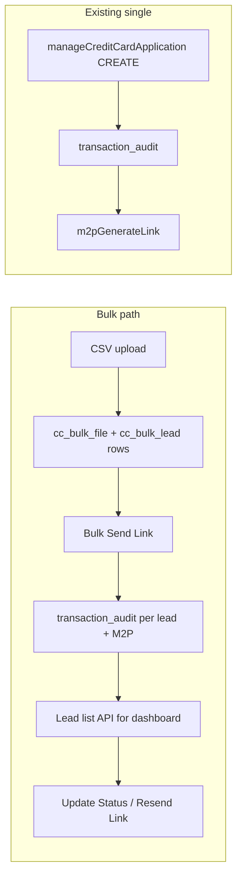

# Credit Card Bulk Lead Support – Architecture Plan

**Scope:** [novopay-platform-creditcard-management](c:\Users\ashutosh.kumar\Desktop\novopay\novopay-platform-creditcard-management) (backend only; align with **ddp-bkup-qa** for capture stages).  
**Branch:** Implementation is on `**ddp-fea-credit-card-bulk`** (created from **ddp-prod**). All changes and commits for this feature should be made on this branch; merge to ddp-qa/ddp-uat/ddp-prod per your release process.  
**Context:** Single flow exists today (Image 1 → Create Application; Image 2 → Single mobile, Send Link). Bulk option exists in UI but is inactive. Image 3 is the target audit dashboard (CSV upload, list by mobile/status/upload date, Update Status, Resend Link).  
**API version:** All new bulk APIs must be exposed as **v2** REST APIs (path prefix `/api/v2/...`), not v1. See section 2.8 and 6.  
**Capture stages:** Bulk flow must use **capture stages** as in ddp-bkup-qa (journey-stages pattern): record stages to `transaction_audit_logs` at each key step and expose `technical_stage` / `current_lead_stage` in the bulk lead list for the dashboard. See section 2.9.  
**Process all, no fail-fast:** If one record in the file or one lead fails, do not stop—process every record/lead and report per-item success or failure. See section 2.10.  
**DMS / S3:** File is uploaded via DMS API to S3; the API returns a document ID (`document_code`) which is stored and used for downstream processing (same as existing BKYC/DVKYC). See section 2.2.

---

## Current state (summary)

- **Single flow table:** **agent_lead** is the table for the single (non-bulk) flow. Single flow also uses `transaction_audit` and `draft_application`.
- **Single flow APIs:** **manageCreditCardApplication** (managecc), **sendCustomerConsent**, **resumeJourney** (in this repo: resumeApplication). managecc does CREATE/UPDATE/SUBMIT and creates/updates `transaction_audit`; sendCustomerConsent sends consent link; resumeJourney resumes an existing application.
- **Bulk-like flows** in repo are **file + lead** only: BKYC (ARN), DVKYC (ARN), DSE reassign. No **credit-card bulk lead** (mobile-based) flow.
- **Tables:** Single flow uses **agent_lead** plus transaction_audit, draft_application; file-based leads in `bkyc_file`/`bkyc_lead`, `dvkyc_file`/`dvkyc_lead`, `dse_reassign_file`/`dse_reassign_lead`. No table for “bulk” CC leads with mobile + lead status. Bulk CC will use new cc_bulk_file + cc_bulk_lead (separate from agent_lead).
- **Batch:** `updateCreditCardStatusBatch` updates **application** status from bank; it does not manage **lead** status (Link Sent, Not Interested, etc.) for the audit dashboard.

---

## Target flow (high level)




- **Upload:** CSV (e.g. mobile numbers) → one bulk file record + N bulk lead rows.  
- **Send link (bulk):** For selected leads: create `transaction_audit` (CREATE) per lead, then trigger M2P link (per lead or batch); set lead status to “Link Sent” and store `client_reference_code`.  
- **Dashboard (Image 3):** List API returning mobile, lead status, upload date, file info; filters and pagination; counts for “Bulk” tab.  
- **Actions:** Update lead status (single/batch); Resend link (reuse `m2pGenerateLink` per lead).

---

## 1. Database changes

**New migrations** under `src/main/resources/sql/migrations/product/` (next version after existing, e.g. V000077):

**1.1 Table: `cc_bulk_file`**  
Mirror [bkyc_file](c:\Users\ashutosh.kumar\Desktop\novopay\novopay-platform-creditcard-management\src\main\resources\sql\migrations\product\V000021__create_table_bkyc_file.sql) pattern:

- `id` (PK), `file_name`, `document_code`, `status`, `created_by`, `created_on`, `updated_by`, `updated_on`, `total_records`, `matched_records`
- Optional: `assistor_code` / `dse_code` for filtering by agent (if available in context).

**1.2 Table: `cc_bulk_lead`**

- `id` (PK), `cc_bulk_file_id` (FK), `mobile_number` (VARCHAR, indexed for list/search)
- `lead_status` (e.g. PENDING, LINK_SENT, NOT_INTERESTED, ASKED_TO_CALL_BACK, INVALID_NUMBER)
- `description` (optional notes), `client_reference_code` (nullable; set when link sent, links to `transaction_audit.client_reference_code`)
- `created_on`, `created_by`, `updated_by`, `updated_on`, `is_deleted`

**1.3 Optional: `transaction_audit`**  
If the “Bulk” tab in Image 1 must show counts from `getCreditCardTransactionHistory` filtered by “from bulk”:

- Add nullable `cc_bulk_lead_id` (or a `lead_source` enum: SINGLE / BULK) so listing can filter bulk vs single.  
- If the “Bulk” tab is driven only by the new bulk-lead list API and its counts, this can be skipped.

---

## 2. Backend code changes (repo structure)

Follow existing patterns: [UploadBkycFileProcessor](c:\Users\ashutosh.kumar\Desktop\novopay\novopay-platform-creditcard-management\src\main\java\in\novopay\creditcard\transaction\processor\UploadBkycFileProcessor.java), [ProcessLeadFileService](c:\Users\ashutosh.kumar\Desktop\novopay\novopay-platform-creditcard-management\src\main\java\in\novopay\creditcard\service\ProcessLeadFileService.java), [BkycLeadDAO](c:\Users\ashutosh.kumar\Desktop\novopay\novopay-platform-creditcard-management\src\main\java\in\novopay\creditcard\dao\BkycLeadDAO.java), [BkycLeadSearchRowMapper](c:\Users\ashutosh.kumar\Desktop\novopay\novopay-platform-creditcard-management\src\main\java\in\novopay\creditcard\dao\BkycLeadSearchRowMapper.java).

**2.1 Entities and DAOs**

- **Entity:** `CcBulkFileEntity`, `CcBulkLeadEntity` (under `entity/`).
- **DAO:** `CcBulkFileDAO`, `CcBulkLeadDAO` (CRUD + list with filters).
- **Row mapper:** `CcBulkLeadSearchRowMapper` for list API: mobile_number, lead_status, upload_date (from file), file_name, id, client_reference_code, **technical_stage**, **current_lead_stage** (from transaction_audit_logs for linked transaction_audit, latest by updated_on); support filters (file_id, lead_status, dse_code, date range), pagination, total count.

**2.2 Upload flow (DMS to S3, document_code, process all rows)**

- **DMS / S3:** File is uploaded via DMS API to S3; the API returns a document ID (`document_code`) passed in the request (e.g. `document_list`). Store it in `cc_bulk_file` and use **downloadDocument** with that `document_code` to fetch content for parsing (same as BKYC/DVKYC).
- **Request:** e.g. `uploadCreditCardBulkFile` (same pattern as [common_upload_bkyc_file.xml](c:\Users\ashutosh.kumar\Desktop\novopay\novopay-platform-creditcard-management\deploy\application\orchestration\common_upload_bkyc_file.xml)).
- **Processors:** UniqueFileNameCheck (or reuse), `UploadCreditCardBulkFileProcessor` (document_code from request, create `CcBulkFileEntity`), `ProcessCreditCardBulkFileService` (parse CSV with header e.g. “Mobile Number” or “mobile_number”; process every row per 2.10; create `CcBulkLeadEntity` per valid row; invalid rows skipped or stored with error status; save all; set file total_records / matched_records).
- **Templates:** Request/response for `uploadCreditCardBulkFile` under `deploy/application/templates/` (product/ddp as per existing).

**2.3 List API (audit dashboard – Image 3)**

- **Request:** `getCreditCardBulkLeadList`.
- **Orchestration:** New XML (e.g. `common_cc_bulk_lead.xml`) → processor that uses `CcBulkLeadSearchRowMapper` (and file join for upload_date, file_name).
- **Response template:** List of lead details (mobile_number, lead_status, upload_date, file_name, id, client_reference_code, **technical_stage**, **current_lead_stage** – see 2.9) + `number_of_records`, pagination; optional counts by status for tabs.

**2.4 Bulk “Send Link”**

- **Request:** e.g. `bulkSendCreditCardLink` (input: list of lead_ids or file_id; optionally limit batch size).
- **Processor:** For each lead (with status PENDING or retry logic):  
  - Build context with `mobile_number`, new `client_reference_number`, agent/dse context.  
  - Invoke internal `manageCreditCardApplication` CREATE (minimal payload: client_reference_number, mobile_number, transaction_type ASSET, transaction_sub_type CC, assistor details from context).  
  - Then invoke internal `m2pGenerateLink` (requires PAN – see note below).  
  - On success: update `cc_bulk_lead.lead_status` = LINK_SENT, set `client_reference_code`.
- **Design note:** Current [M2PGenerateLinkProcessor](c:\Users\ashutosh.kumar\Desktop\novopay\novopay-platform-creditcard-management\src\main\java\in\novopay\creditcard\common\processors\M2PGenerateLinkProcessor.java) expects PAN. For bulk, either (a) CSV includes encrypted PAN per row and bulk flow passes it per lead, or (b) “Send Link” sends a generic link without PAN and M2P flow is adapted (product decision). Plan assumes (a) unless product chooses otherwise.

**2.5 Update lead status**

- **Request:** `updateCreditCardLeadStatus` (single: lead_id, lead_status, optional description); optionally `updateCreditCardLeadStatusBatch` (list of lead_ids + status).
- **Processor:** Update `cc_bulk_lead.lead_status` (and description); validate status enum.

**2.6 Resend link**

- **Single:** Frontend calls existing `m2pGenerateLink` with `client_reference_number` from the lead row (no new API).
- **Bulk resend:** New request e.g. `bulkResendCreditCardLink` (list of lead_ids where lead_status = LINK_SENT); processor loops and calls internal `m2pGenerateLink` per lead (with rate limiting if needed).

**2.7 Dashboard counts (“Bulk – 10” tab)**

- Either extend `getCreditCardTransactionHistory` with a filter (e.g. by `cc_bulk_lead_id` or lead_source = BULK) and derive counts from that, **or**
- Add counts in `getCreditCardBulkLeadList` response (e.g. total, by lead_status) so the DDP UI can drive the “Bulk” tab from the bulk-lead API only. Latter avoids schema change on `transaction_audit` and is sufficient for an audit-focused dashboard.

**2.8 Expose as v2 REST APIs (required)**

- All new bulk operations must be exposed as **v2** APIs, not v1. In this repo, v2 is implemented via REST controllers with base path `/api/v2/...` (see [AddOnCardController](c:\Users\ashutosh.kumar\Desktop\novopay\novopay-platform-creditcard-management\src\main\java\in\novopay\creditcard\controller\AddOnCardController.java) `@RequestMapping("/api/v2/addOnCard")`).
- Add a dedicated controller, e.g. `**CreditCardBulkController`**, with `@RequestMapping("/api/v2/creditCardBulk")` (or `/api/v2/lead/bulk` as per your API naming standards), and map:
  - `POST .../upload` → uploadCreditCardBulkFile (document_list, user_id, etc.)
  - `GET .../leads` → getCreditCardBulkLeadList (query params: file_id, lead_status, page_size, offset, etc.)
  - `POST .../sendLink` → bulkSendCreditCardLink (body: lead_ids or file_id)
  - `PATCH .../leads/{id}/status` or `PUT .../leads/status` → updateCreditCardLeadStatus (single/batch)
  - `POST .../resendLink` → bulkResendCreditCardLink (body: lead_ids)
- The controller builds `ExecutionContext` from HTTP request (headers, body, query params), invokes the platform/internal API with the orchestration request name (e.g. `uploadCreditCardBulkFile`), and returns the response. No v1 path or legacy request-only exposure for these bulk operations.

**2.9 Capture stages (ddp-bkup-qa pattern)**

Bulk flow must record **journey stages** the same way as in **ddp-bkup-qa** (branch that merged `ddp-fea-dsa-aoc-loc-journey-stages`): use [CaptureStages](c:\Users\ashutosh.kumar\Desktop\novopay\novopay-platform-creditcard-management\src\main\java\in\novopay\creditcard\components\stages\CaptureStages.java) / [TransactionAuditLogCapture](c:\Users\ashutosh.kumar\Desktop\novopay\novopay-platform-creditcard-management\src\main\java\in\novopay\creditcard\components\stages\TransactionAuditLogCapture.java) to write to `transaction_audit_logs` (state, status, attempt, stan). Reference: [CODE_REVIEW_ddp-bkup-qa_cc_last9commits.md](c:\Users\ashutosh.kumar\Desktop\novopay\CODE_REVIEW_ddp-bkup-qa_cc_last9commits.md) (LOC list exposes technical_stage, current_lead_stage; processors capture stages at create/send/update).

- **Add bulk stages to enum:** In [TransactionAuditStages](c:\Users\ashutosh.kumar\Desktop\novopay\novopay-platform-creditcard-management\src\main\java\in\novopay\creditcard\enums\TransactionAuditStages.java) add: `CC_BULK_FILE_UPLOADED`, `CC_BULK_LEAD_CREATE`, `CC_BULK_LINK_SENT`, `CC_BULK_LEAD_STATUS_UPDATED` (and optionally `CC_BULK_LINK_FAIL` for failure path). If ddp-bkup-qa introduces a **JourneyStageCapture** facade with `captureWithReason`, use it for bulk failure reasons (e.g. store in `transaction_audit_attributes`); otherwise use existing `CaptureStages.capture(...)` and `TransactionAuditLogCapture.saveAuditTransactionLog(...)`.
- **Where to capture:**
  - **Bulk Send Link:** After creating `transaction_audit` for a lead, capture `CC_BULK_LEAD_CREATE` (SUCCESS). After M2P link success, capture `CC_BULK_LINK_SENT` (SUCCESS). On M2P or CREATE failure, capture corresponding stage with status FAIL (and optional reason via attributes if JourneyStageCapture exists).
  - **Update lead status:** When updating `cc_bulk_lead.lead_status`, if the lead has a linked `transaction_audit` (client_reference_code set), capture `CC_BULK_LEAD_STATUS_UPDATED` (SUCCESS) for that transaction_audit.
  - **Bulk file upload:** No `transaction_audit` exists at file level. Either (a) skip file-level stage, or (b) if product requires an audit trail for “file uploaded,” consider a single synthetic/placeholder transaction_audit per file and capture `CC_BULK_FILE_UPLOADED` there (optional; can be deferred).
- **Inject in processors:** `BulkSendCreditCardLinkProcessor` and `UpdateCreditCardLeadStatusProcessor` (and batch variant) must inject `CaptureStages` and/or `TransactionAuditLogCapture`, and call them at the points above. Use same STAN from execution context.
- **List API – expose stage for dashboard:** In **getCreditCardBulkLeadList** response, for each lead that has `client_reference_code` (linked to a transaction_audit), include:
  - **technical_stage:** latest `transaction_audit_logs.state` for that transaction_audit ordered by `updated_on DESC` (subquery or join, same as LOC list in 763c9d5).
  - **current_lead_stage:** same as technical_stage when present; else can show lead_status from `cc_bulk_lead` for consistency with “Stage” column in Image 1.
  - Implement in `CcBulkLeadSearchRowMapper` (or list query) by joining `transaction_audit` on `cc_bulk_lead.client_reference_code` and then `transaction_audit_logs` for latest state per audit id.

**2.10 Process all – no fail-fast (one bad record/lead must not stop the rest)**

- **Upload / CSV processing:** When parsing the bulk file and creating `cc_bulk_lead` rows, **process every row** in the file. If a row is invalid (e.g. missing mobile, bad format, duplicate): skip that row or insert a lead with an error status/description (e.g. INVALID_NUMBER, or a dedicated "ROW_ERROR" with description), and **continue** to the next row. Do not throw a fatal exception on first invalid row; complete the entire file and set file status (e.g. PROCESSED with total_records and matched_records or error count). Response can include counts (total_rows, created, skipped, errors) and optionally per-row errors for the first N failures.
- **Bulk Send Link:** For each lead in the batch, attempt CREATE + M2P. If one lead fails (CREATE fails, M2P fails, or any exception): catch the error, record failure for that lead (stage capture, update lead status/description), and **continue** to the next lead. Never abort the loop on first failure. Return HTTP 200 with a body that summarizes success_count, failed_count, and optionally a list of failed lead_ids with reason.
- **Bulk Update Status / Bulk Resend Link:** Same principle: iterate over all requested leads; for each, perform the action and record success or failure; continue to the end; return summary + per-item results if needed.
- **Rationale:** Ensures one bad record or one failing lead does not block the rest; users can fix or retry failed items separately while all valid items are processed.
- **Implementation:** Use try-catch per lead/row inside the loop; log errors; collect failures in a list or counter; do not rethrow (or only rethrow after the loop if you need a single "partial failure" response code—prefer 200 + body with counts).

---

## 3. Orchestration and templates (summary)


| Request                         | Orchestration file               | Main processor(s)                                                                               |
| ------------------------------- | -------------------------------- | ----------------------------------------------------------------------------------------------- |
| uploadCreditCardBulkFile        | common_upload_cc_bulk_file.xml   | UniqueFileNameCheck, UploadCreditCardBulkFileProcessor, ProcessCreditCardBulkFileService, audit |
| getCreditCardBulkLeadList       | common_cc_bulk_lead.xml          | GetCreditCardBulkLeadListProcessor (uses CcBulkLeadSearchRowMapper)                             |
| bulkSendCreditCardLink          | common_bulk_send_cc_link.xml     | BulkSendCreditCardLinkProcessor                                                                 |
| updateCreditCardLeadStatus      | common_update_cc_lead_status.xml | UpdateCreditCardLeadStatusProcessor                                                             |
| updateCreditCardLeadStatusBatch | (same or separate)               | UpdateCreditCardLeadStatusBatchProcessor                                                        |
| bulkResendCreditCardLink        | common_bulk_resend_cc_link.xml   | BulkResendCreditCardLinkProcessor                                                               |


Add request/response templates under `deploy/application/templates/request/product/`, `response/product/`, and ddp variants if needed. **Consumers call v2 REST endpoints only** (see 2.8); orchestration request names are used internally.

---

## 4. Implementation order (recommended) – build plan

Work on branch **ddp-fea-credit-card-bulk**. Implement in this order:

1. **DB:** Add migrations for `cc_bulk_file` and `cc_bulk_lead`; add entities and DAOs + row mapper.
2. **Stages enum:** Add bulk stages to `TransactionAuditStages` (CC_BULK_FILE_UPLOADED, CC_BULK_LEAD_CREATE, CC_BULK_LINK_SENT, CC_BULK_LEAD_STATUS_UPDATED, CC_BULK_LINK_FAIL).
3. **Upload:** ProcessCreditCardBulkFileService (DMS document_code → downloadDocument, CSV parse; **process all rows**, no fail-fast), UploadCreditCardBulkFileProcessor, orchestration, templates.
4. **List:** GetCreditCardBulkLeadListProcessor, CcBulkLeadSearchRowMapper with **technical_stage** / **current_lead_stage** from transaction_audit_logs (ddp-bkup-qa style), response template.
5. **Update status:** UpdateCreditCardLeadStatusProcessor (and batch); inject CaptureStages/TransactionAuditLogCapture; capture CC_BULK_LEAD_STATUS_UPDATED when lead has linked transaction_audit; orchestration and templates.
6. **Bulk send link:** BulkSendCreditCardLinkProcessor (invoke CREATE + m2p per lead; **process all leads**, no fail-fast; return success_count / failed_count + per-lead results); inject CaptureStages; capture CC_BULK_LEAD_CREATE and CC_BULK_LINK_SENT (and FAIL on failure); clarify PAN handling for bulk.
7. **Resend:** Document use of existing m2pGenerateLink for single; add bulk resend processor if required (capture stage on resend if needed).
8. **Counts:** Add count fields to list response (or separate count API) for “Bulk” tab.
9. **v2 REST layer:** Add `CreditCardBulkController` with `/api/v2/creditCardBulk`, wiring each operation to orchestration; add DTOs if needed.
10. **Testing:** Add unit tests per section 7.2 (service, processors, DAO/row mapper, controller); run tests; add Postman collection and/or use cURL (section 7.3–7.4) for API verification.

---

## 5. Out of scope / assumptions

- **Frontend (DDP):** UI for “Bulk” in Image 2 (file picker, bulk send button) and dashboard in Image 3 lives in another repo (e.g. DDP/agent app); this plan covers only backend APIs and DB in **novopay-platform-creditcard-management**.
- **PAN for bulk:** M2P link generation currently needs PAN; bulk CSV format and/or product must define how PAN is provided per bulk lead (or that bulk sends a different link type).
- **Tenant/channel:** Use same tenant (e.g. ddp) and channel/assistor context as single flow where applicable; pass from request context into CREATE and M2P calls.
- **Branch alignment:** If implementing on or merging to **ddp-bkup-qa**, reuse **JourneyStageCapture** and `captureWithReason` for bulk failure reasons where that facade exists; otherwise use existing CaptureStages/TransactionAuditLogCapture only.

---

## 6. Files to add/modify (key paths)


| Area                | Action | Path (relative to repo)                                                                                                                                                                                                                                                                                                                                                                                                                                                       |
| ------------------- | ------ | ----------------------------------------------------------------------------------------------------------------------------------------------------------------------------------------------------------------------------------------------------------------------------------------------------------------------------------------------------------------------------------------------------------------------------------------------------------------------------- |
| **Controller (v2)** | Add    | `controller/CreditCardBulkController.java` – `@RequestMapping("/api/v2/creditCardBulk")`; methods for upload, list, sendLink, updateStatus, resendLink that delegate to orchestration.                                                                                                                                                                                                                                                                                        |
| DB                  | Add    | `src/main/resources/sql/migrations/product/V000077__create_cc_bulk_file_and_lead.sql` (or next version)                                                                                                                                                                                                                                                                                                                                                                       |
| Entity              | Add    | `entity/CcBulkFileEntity.java`, `entity/CcBulkLeadEntity.java`                                                                                                                                                                                                                                                                                                                                                                                                                |
| DAO                 | Add    | `dao/CcBulkFileDAO.java`, `dao/CcBulkLeadDAO.java`, `dao/CcBulkLeadSearchRowMapper.java`                                                                                                                                                                                                                                                                                                                                                                                      |
| Service             | Add    | `service/ProcessCreditCardBulkFileService.java`                                                                                                                                                                                                                                                                                                                                                                                                                               |
| Processor           | Add    | `transaction/processor/UploadCreditCardBulkFileProcessor.java`, `transaction/processor/GetCreditCardBulkLeadListProcessor.java`, `common/processors/BulkSendCreditCardLinkProcessor.java`, `common/processors/UpdateCreditCardLeadStatusProcessor.java`, (optional) `common/processors/BulkResendCreditCardLinkProcessor.java`; each that creates/updates txn_audit or lead status must inject **CaptureStages** / **TransactionAuditLogCapture** and capture stages per 2.9. |
| Enum                | Modify | `enums/TransactionAuditStages.java` – add CC_BULK_* stages.                                                                                                                                                                                                                                                                                                                                                                                                                   |
| Orchestration       | Add    | `deploy/application/orchestration/common_upload_cc_bulk_file.xml`, `common_cc_bulk_lead.xml`, `common_bulk_send_cc_link.xml`, `common_update_cc_lead_status.xml`, `common_bulk_resend_cc_link.xml`                                                                                                                                                                                                                                                                            |
| Templates           | Add    | Request/response JSON for above requests under `deploy/application/templates/`                                                                                                                                                                                                                                                                                                                                                                                                |
| **Tests**           | Add    | Unit tests per section 7 below; same package structure under `src/test/java/`.                                                                                                                                                                                                                                                                                                                                                                                                |


---

## 7. Testing (test plan, unit tests, Postman/cURL)

### 7.1 Test plan (overview)


| Type            | Scope                                                                                                                                   | Objective                                                                                             |
| --------------- | --------------------------------------------------------------------------------------------------------------------------------------- | ----------------------------------------------------------------------------------------------------- |
| **Unit**        | ProcessCreditCardBulkFileService, BulkSendCreditCardLinkProcessor, UpdateCreditCardLeadStatusProcessor, CcBulkLeadSearchRowMapper, DAOs | Each unit behaves correctly in isolation with mocks; process-all (no fail-fast) and validation logic. |
| **Integration** | Upload flow (processor + service + DAO), List flow (processor + row mapper + DAO), Bulk send (processor + internal API mocks)           | End-to-end within service; DB and orchestration wiring.                                               |
| **API**         | v2 REST endpoints via CreditCardBulkController                                                                                          | Request/response contract, headers, status codes, error handling.                                     |


**Scenarios to cover:** valid file upload and lead creation; invalid rows (skip/error status, process all); bulk send link – all success, all fail, partial (process all, counts); list with filters and pagination; update status single/batch; resend link; empty file; duplicate mobile; missing document_code; invalid lead_status enum; stage capture on success/fail.

### 7.2 Unit tests (per functionality)

- **ProcessCreditCardBulkFileServiceTest:** valid CSV creates N leads, file PROCESSED; one invalid row → process all, skip or error status; header mismatch → REJECTED/no leads; empty CSV → 0 records; duplicate mobile per product; assert no fail-fast.
- **UploadCreditCardBulkFileProcessorTest:** valid context (document_code, user_id, tenant_code) → creates CcBulkFileEntity, calls service.
- **GetCreditCardBulkLeadListProcessorTest:** filters (file_id, lead_status, page_size, offset) → list + count; response includes technical_stage/current_lead_stage.
- **CcBulkLeadSearchRowMapperTest / CcBulkLeadDAOTest:** list query with filters; mapRow has mobile_number, lead_status, upload_date, file_name, client_reference_code, technical_stage, current_lead_stage.
- **BulkSendCreditCardLinkProcessorTest:** 2 succeed + 1 fail → processes all 3, success_count 2, failed_count 1; all fail → success 0, failed N; all succeed → LINK_SENT, stages captured.
- **UpdateCreditCardLeadStatusProcessorTest:** valid lead_id/lead_status → updates lead, captures stage if linked; invalid status → error; batch → process all.
- **BulkResendCreditCardLinkProcessorTest:** list of lead_ids → calls m2p per lead, process all, summary.
- **CreditCardBulkControllerTest (MockMvc):** POST upload 200; GET leads 200 + list; POST sendLink 200 + success_count/failed_count; PATCH/PUT status 200; POST resendLink 200.

Use JUnit 5, Mockito; mock NovopayInternalAPIClient, DAOs, CaptureStages where needed.

### 7.3 Postman / cURL examples (v2 APIs)

Base: `https://<host>/api/v2/creditCardBulk`. Headers: `user_id`, `client_code`, `tenant_code`, `stan`, `channel_code`.

**1. Upload (after DMS returns document_code)**  
`POST .../upload`  
Body: `{"document_list":[{"document_code":"<document_code_from_dms>"}],"file_name":"Leads.csv"}`  
Expected: 200, body with file_id, total_records, matched_records or error.

**2. Get lead list**  
`GET .../leads?file_id=<id>&lead_status=PENDING&page_size=10&offset=0`  
Expected: 200, body with cc_bulk_lead_list (mobile_number, lead_status, upload_date, technical_stage, current_lead_stage), number_of_records.

**3. Bulk send link**  
`POST .../sendLink`  
Body: `{"lead_ids":[1,2,3]}` or `{"file_id":<id>}`  
Expected: 200, body success_count, failed_count, optional failed_lead_ids/failed_reasons.

**4. Update status (single)**  
`PATCH .../leads/1/status`  
Body: `{"lead_status":"NOT_INTERESTED","description":"Customer declined"}`  
Expected: 200.

**5. Update status (batch)**  
`PUT .../leads/status`  
Body: `{"updates":[{"lead_id":1,"lead_status":"NOT_INTERESTED"},{"lead_id":2,"lead_status":"ASKED_TO_CALL_BACK"}]}`  
Expected: 200.

**6. Bulk resend link**  
`POST .../resendLink`  
Body: `{"lead_ids":[1,2]}`  
Expected: 200, success_count/failed_count.

**Postman:** Create collection "Credit Card Bulk v2" with variables for host, user_id, client_code, tenant_code; add tests (e.g. pm.response.to.have.status(200); body has success_count or file_id).

### 7.4 Full cURL examples (copy-paste)

Replace `<host>`, `<document_code_from_dms>`, `<file_id>`, `<agent_user_id>`, `<client_code>` as needed.

```bash
# 1. Upload bulk file (document_code from DMS/S3 upload response)
curl -X POST "https://<host>/api/v2/creditCardBulk/upload" \
  -H "Content-Type: application/json" \
  -H "user_id: <agent_user_id>" \
  -H "client_code: <client_code>" \
  -H "tenant_code: ddp" \
  -H "stan: $(date +%s)" \
  -H "channel_code: WEB" \
  -d '{"document_list":[{"document_code":"<document_code_from_dms>"}],"file_name":"Leads.csv"}'

# 2. Get bulk lead list
curl -X GET "https://<host>/api/v2/creditCardBulk/leads?file_id=<file_id>&page_size=10&offset=0" \
  -H "user_id: <agent_user_id>" \
  -H "client_code: <client_code>" \
  -H "tenant_code: ddp" \
  -H "stan: $(date +%s)" \
  -H "channel_code: WEB"

# 3. Bulk send link
curl -X POST "https://<host>/api/v2/creditCardBulk/sendLink" \
  -H "Content-Type: application/json" \
  -H "user_id: <agent_user_id>" \
  -H "client_code: <client_code>" \
  -H "tenant_code: ddp" \
  -H "stan: $(date +%s)" \
  -d '{"lead_ids":[1,2,3]}'

# 4. Update lead status (single)
curl -X PATCH "https://<host>/api/v2/creditCardBulk/leads/1/status" \
  -H "Content-Type: application/json" \
  -H "user_id: <agent_user_id>" \
  -H "tenant_code: ddp" \
  -d '{"lead_status":"NOT_INTERESTED","description":"Customer declined"}'

# 5. Bulk resend link
curl -X POST "https://<host>/api/v2/creditCardBulk/resendLink" \
  -H "Content-Type: application/json" \
  -H "user_id: <agent_user_id>" \
  -H "tenant_code: ddp" \
  -d '{"lead_ids":[1,2]}'
```

---

No change to existing single flow (`manageCreditCardApplication`, `m2pGenerateLink`) except possibly optional `transaction_audit` column for “Bulk” filter. **All new bulk APIs are v2 only** (no v1 equivalents for these operations).