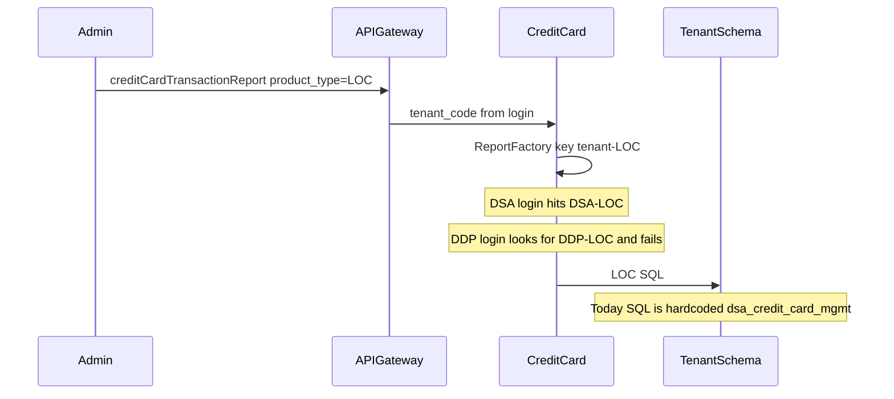

# DDP LOC Report (mirror DSA)

Recommended Jira structure: **1 Story + 4 subtasks** (one outcome, one squad, one release train).

**LOCKED:** Same LOC Report as DSA (same columns, date/row caps, permission codes). DDP admin gets it in addition to DSA. CC Report on DDP is out of scope.

**ASSUMPTION:** LOC journeys already persist in `ddp_credit_card_mgmt.transaction_audit` (`transaction_sub_type = 'LOC'`). If they do not, the menu/download will work and the file will be empty.

## Why DDP cannot use it today

Admin UI is already tenant-agnostic ([sidebar.data.ts](novopay-platform-webapp/src/app/layout/sidebar/sidebar.data.ts), [reports.module.ts](novopay-platform-webapp/src/app/report-management/reports/reports.module.ts)). Download is not.



- Factory key is `{tenant}-{product_type}` in [ReportFactory.java](novopay-platform-creditcard-management/src/main/java/in/novopay/creditcard/reports/factory/ReportFactory.java). Only [DSALOCReport.java](novopay-platform-creditcard-management/src/main/java/in/novopay/creditcard/reports/impl/DSALOCReport.java) exists (`DSA-LOC`). DDP download throws `4000181` `No handler found for key: DDP-LOC`.
- LOC SQL in [TransactionListLOCReportRowMapper.java](novopay-platform-creditcard-management/src/main/java/in/novopay/creditcard/dao/TransactionListLOCReportRowMapper.java) is hardcoded to `dsa_credit_card_mgmt`. CC already uses `TransactionListReportQueryBuilder.resolveSchema` (`{tenant}_credit_card_mgmt`).
- Auth catalog `LOC-REPORT` / `LOC-REPORT-DNLD` / `LOC-REPORT-UC002` is DSA-only ([V5000025](novopay-platform-authorization/src/main/resources/sql/migrations/dsa/V5000025__loc_report_role_permission_mapping.sql)). DDP auth still has Agent Lead + Role reports only.
- Code master `REPORT_TYPE` / `LOC` + `LOC_REPORT` is DSA-only ([V5000145](novopay-platform-masterdata-management/src/main/resources/sql/migrations/dsa/V5000145__split_loc_report_type_code_master.sql)). FE LOC page loads that subtype in [entities.config.ts](novopay-platform-webapp/src/app/report-management/reports/entities.config.ts).
- API `creditCardTransactionReport` is already in platform `api_master` ([V702071](novopay-platform-initial-setup/flyway/sql/V702071__cc_report_api_script.sql)). No new API.

## Approach

Surgical copy of the CC DDP path. Do **not** change factory lookup for CC. Do **not** change FE.

1. **CC Java** - make LOC SQL tenant-aware; add a thin `DDPLOCReport` with key `DDP-LOC` that reuses the same DAO (same pattern as `DSALOCReport`).
2. **DDP auth Flyway** - seed the same catalog as DSA V5000025 (idempotent, backticks).
3. **DDP masterdata Flyway** - seed end-state of V5000145 (`REPORT_TYPE` / `LOC` + `LOC_REPORT`). Do not insert under `REPORT_TYPE` / `DDP`.
4. **UAM** - map `LOC-REPORT-DNLD` to the DDP roles that already have `CC-REPORT-DNLD`. Flyway does not attach roles.

Flyway: in each repo checkout latest remote **common-scripts** branch, take next unused **ddp** seq (local tips today are auth `V4000125`, masterdata `V4000850` - do not invent from that; re-discover after fetch). Stage only; no commit unless asked.

## Out of scope

- New API, FE changes, CC Report, changing DSA LOC columns/caps
- Auto-assigning roles (UAM after catalog is live)
- `loc.report.max.date.range.days` / `loc.report.max.rows` Flyway (Java defaults already apply)

## Subtasks

### 1. Tenant-aware LOC SQL + DDP-LOC handler (~3h)

- Replace every `dsa_credit_card_mgmt` in `TransactionListLOCReportRowMapper` with `TransactionListReportQueryBuilder.resolveSchema(executionContext)`.
- Add [DDPLOCReport.java](novopay-platform-creditcard-management/src/main/java/in/novopay/creditcard/reports/impl/DDPLOCReport.java) (`getReportKey()` = `DDP-LOC`, same DAO call).
- Tests: factory `getReportHandler("ddp", "loc")`; `DDPLOCReportTest`; resolveSchema `ddp` -> `ddp_credit_card_mgmt`. DSA path must still resolve `DSA-LOC`.
- Run only new CC test classes (`--tests ...DDPLOCReportTest` / `ReportFactoryTest`). Compile `compileJava`.

### 2. DDP authorization Flyway (~2h)

- Copy DSA V5000025 into `novopay-platform-authorization/.../migrations/ddp/`.
- Backtick all identifiers; `INSERT ... SELECT ... WHERE NOT EXISTS`.
- Codes: `LOC-REPORT`, `LOC-REPORT-DNLD`, `LOC-REPORT-UC002`.

### 3. DDP code-master Flyway (~2h)

- Idempotent seed of `REPORT_TYPE` / `LOC` and detail `LOC_REPORT` (V5000145 end-state).
- Do not add `LOC_REPORT` under `REPORT_TYPE` / `DDP` (that would leak onto the CC page).

### 4. UAM + verify (~2h)

- Assign `LOC-REPORT-DNLD` to the same DDP roles that have CC Report download.
- Re-login. Menu **Reports > Report Downloads > LOC Report** shows. Download writes zip from `ddp_credit_card_mgmt` (not DSA).

## Verify SQL (DDP)

```sql
SELECT code FROM ddp_authorization.user_story WHERE code = 'LOC-REPORT';
SELECT code FROM ddp_authorization.permission WHERE code = 'LOC-REPORT-DNLD';

SELECT r.code, r.display_name
FROM ddp_authorization.role r
JOIN ddp_authorization.role__permission__mapping rpm ON rpm.role_id = r.id
JOIN ddp_authorization.permission p ON p.id = rpm.permission_id
WHERE p.code = 'LOC-REPORT-DNLD';

SELECT cm.data_sub_type, cmd.code, cmd.is_deleted
FROM ddp_masterdata.code_master cm
JOIN ddp_masterdata.code_master_details cmd ON cmd.code_master_id = cm.id
WHERE cm.data_type = 'REPORT_TYPE'
  AND (cm.data_sub_type = 'LOC' OR cmd.code = 'LOC_REPORT');
```

QA / UAT / prod can drift until those Flyways are applied. `platform_master.api_master` schema name can differ by env.

## Repos

| Repo | Change |
| --- | --- |
| `novopay-platform-creditcard-management` | SQL + `DDPLOCReport` + tests |
| `novopay-platform-authorization` | DDP Flyway |
| `novopay-platform-masterdata-management` | DDP Flyway |
| `novopay-platform-webapp` | None |
| `novopay-platform-initial-setup` | None |

Baseline: latest remote `origin/ddp-prod-master`. Same `ddp-fea-*` branch name across touched repos.