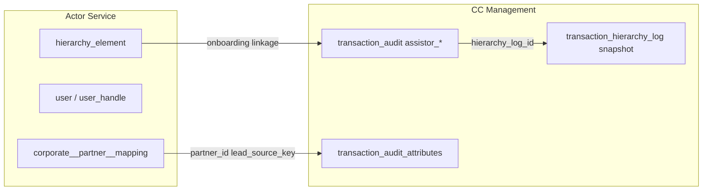
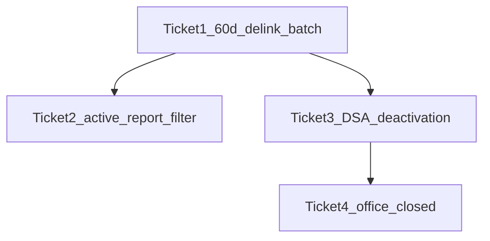

# DSA Lead Lifecycle — Four Tickets Plan

**Baseline for code review:** Compare against latest prod branches before implementation:

- Backend: `ddp-prod` in [novopay-platform-creditcard-management](novopay-platform-creditcard-management), [novopay-platform-actor](novopay-platform-actor), [novopay-platform-batch](novopay-platform-batch)
- Frontend (if any UI/report download changes): `dsa-prod` in [novopay-platform-agent-webapp](novopay-platform-agent-webapp)

**Current state (from codebase scan):**

- CC leads live in `transaction_audit` (`assistor_code` = DSE linkage); attribution snapshot in `transaction_hierarchy_log` (DSE, DSA_ADMIN, `partner_id`, etc.)
- No 60-day CC lead purge exists; closest patterns: `LeadReassignAuditProcessor` (reassign assistor), `UpdateCreditCardStatusBatchProcessor` (time-window batch), `GetCustomerLeadProcessor` (active-lead definition)
- DSA Admin report: `creditCardTransactionReport` → [DSACCReport.java](novopay-platform-creditcard-management/src/main/java/in/novopay/creditcard/reports/impl/DSACCReport.java) → [TransactionListReportRowMapper.java](novopay-platform-creditcard-management/src/main/java/in/novopay/creditcard/dao/TransactionListReportRowMapper.java); manual MIS: [cc_lead_mis_export.sql](trustt-platform-ddp-manual-report-queries/sql/cc_lead_mis_export.sql)
- DSE deactivation blocked when active leads exist: [CheckAgentDeletableBasedOnActiveLeadsProcessor.java](novopay-platform-actor/src/main/java/in/novopay/actor/processor/CheckAgentDeletableBasedOnActiveLeadsProcessor.java) → `getCustomerLeadByDseCode`
- DSA corp deactivation cascades user disable: [product_corporate_orc.xml](novopay-platform-actor/deploy/application/orchestration/product_corporate_orc.xml)
- Office closure: `office.closed_on` only; no CC lead delink on close today

**Design principle (all tickets):** Separate **operational linkage** (who currently owns/serves the lead; `assistor_`*, Actor `hierarchy_element`) from **historical attribution / UTM** (`transaction_hierarchy_log`, `transaction_audit_attributes`, `partner_id`). Purge/delink must not mutate historical attribution on existing applications.

---

## Team Clarifications Required (resolve before dev)

> **Action for team:** Fill the **Decision** column in the sign-off table at the end of this section. Development should not start until all **Blocker** items have an owner-approved answer.

### Terminology alignment (confirm with business)

- **Q-T.1:** Does “UTM parameters” in requirements map to: `transaction_hierarchy_log` (DSE/DSA Admin/SM codes, `partner_id`, `channel_source`) + `transaction_audit_attributes` (`lead_source_key`, `link_journey`) + Actor `corporate_attribute.partner_id`? (No literal `utm_source` columns exist in DSA/CC tables today.)
- **Q-T.2:** Does “delink” mean remove **operational** ownership (`transaction_audit.assistor_*`, Actor `hierarchy_element`) while keeping **historical snapshot** (`transaction_hierarchy_log`) unchanged?
- **Q-T.3:** Does “disable lead” mean the lead is no longer actionable by the DSE in app/dashboard, but the application record remains for bank/HDFC and reporting history?

### Ticket 1 — 60-day purge eligibility

- **Q1.1:** Which leads are auto-delinked after 60 days?
  - (A) All CC leads linked to DSE where `created_on` > 60 days
  - (B) Only terminal/inactive leads (>60 days AND consent `EXPIRED` or txn terminal e.g. `FAIL` / `APPROVED`)
  - (C) Only leads failing existing active-lead check ([GetCustomerLeadProcessor](novopay-platform-creditcard-management/src/main/java/in/novopay/creditcard/common/processors/GetCustomerLeadProcessor.java): consent not `PENDING`/`EXPIRED`) and >60 days
  - (D) Only **inactive** leads per (C), excluding `application_status = APPROVED` regardless of age
- **Q1.2:** Is 60 days measured from `transaction_audit.created_on`, last `updated_on`, or consent expiry date?
- **Q1.3:** What does “delink” mean operationally?
  - Clear `assistor_id` / `assistor_code` on `transaction_audit`?
  - Set a new status flag (e.g. `lead_link_status = DELINKED`) while retaining assistor for audit?
  - Both (flag + clear assistor)?
- **Q1.4:** Should delinked leads be excluded from DSE dashboard/resume list (`getTnxResumeList`, transaction count APIs) immediately?
- **Q1.5:** Batch schedule: daily off-peak (like `cc_disapproved_status_batch`) or on-demand admin trigger?
- **Q1.6:** Config key name and default: e.g. `cc.lead.dse.delink.interval.days` = 60 — confirm with ops.
- **Q1.7:** Should **APPROVED** / successfully submitted applications ever be auto-delinked from DSE?
- **Q1.8:** After delink, can ops still use **manual lead reassignment** (`uploadLeadReassignFile` / `LeadReassignAuditProcessor`) to attach a new DSE?
- **Q1.9:** Is delink **irreversible**, or should support be able to restore `assistor_*` linkage?
- **Q1.10:** At go-live, run **one-time backfill** batch for all existing leads >60 days, or only new leads created after release date?
- **Q1.11:** Should delink run per DSE (`assistor_code`) in batches with chunk size / max rows per run (performance guard)?

### Ticket 2 — DSA Admin report “active only”

- **Q2.1:** Which report outputs must filter to active leads only?
  - (A) `creditCardTransactionReport` API only
  - (B) Manual MIS SQL only
  - (C) Both API and MIS SQL
- **Q2.2:** Confirm “active lead” definition matches `GetCustomerLeadProcessor` (consent not `PENDING`/`EXPIRED`) or a different rule (e.g. also exclude `txn_status = FAIL`, `application_status = APPROVED`)?
- **Q2.3:** For purged/delinked leads (Ticket 1): include in report with historical UTM snapshot, or exclude entirely?
- **Q2.4:** Should report show a column for link status (ACTIVE / DELINKED / DISABLED)?
- **Q2.5:** Performance: active check per row via consent API is expensive — acceptable to use SQL approximation (draft + txn status) vs batch pre-computed flag on `transaction_audit`?
- **Q2.6:** Should the same “active only” rule apply to **DSE-facing** lists (resume list, transaction history), or DSA Admin report only?
- **Q2.7:** Is a separate **historical / audit report** required that still includes delinked/disabled leads for compliance?
- **Q2.8:** Report date range: if a lead was active when created but later delinked, should it appear when `from_date`/`to_date` spans the active period?
- **Q2.9:** DSA Admin report filter uses `employee_type` + `employee_code` on `transaction_hierarchy_log` ([TransactionListReportRowMapper.applyDataFilter](novopay-platform-creditcard-management/src/main/java/in/novopay/creditcard/dao/TransactionListReportRowMapper.java)) — confirm `DSA_ADMIN` is the intended report persona.

### Ticket 3 — DSA deactivation

- **Q3.1:** “Disable leads without changing UTM” — confirm UTM = `transaction_hierarchy_log` + `transaction_audit_attributes` (`partner_id`, `lead_source_key`, `link_journey`) and must remain immutable on existing rows.
- **Q3.2:** What is “disabled lead” state?
  - New `transaction_audit` / attribute flag (e.g. `lead_status = DISABLED`)?
  - Delink assistor only?
  - Mark `txn_status` / `application_status` change?
- **Q3.3:** On DSA deactivation, disable leads for **all DSEs and DSA Admins** under that DSA, or only direct corporate employees?
- **Q3.4:** Existing cascade in [product_corporate_orc.xml](novopay-platform-actor/deploy/application/orchestration/product_corporate_orc.xml) sets agents/employees to `AUTO_TERMINATED` and users to `DEACTIVATED`. Should this remain, or switch to a new status that allows re-onboarding?
- **Q3.5:** “Re-onboard with another Partner” — does that require new `corporate__partner__mapping` + new `partner_id` on **new** applications only, while old apps keep old `partner_id` in `transaction_hierarchy_log`?
- **Q3.6:** Should `CheckAgentDeletableBasedOnActiveLeadsProcessor` (error `4000360`) be bypassed/relaxed after leads are auto-disabled on DSA deactivation?
- **Q3.7:** Audit: store deactivation reason + timestamp on lead (new attribute or audit log table)?
- **Q3.8:** Individual **DSE deactivation** (`updateAgentStatus` DEACTIVATE in [dsa_agent_orc.xml](novopay-platform-actor/deploy/application/orchestration/dsa_agent_orc.xml)) — same lead-disable rules as DSA-level deactivation, or out of scope for this ticket?
- **Q3.9:** On DSA deactivation, should `corporate__partner__mapping` / `corporate_attribute.partner_id` on the **DSA corporate** be retained (read-only) for historical reference, or removed?
- **Q3.10:** Can the same mobile/PAN re-register as DSE/DSA Admin under a **new** DSA immediately, or are dedupe rules (`DseDedupeCheckService`, agent lead tables) expected to block and need exemption?
- **Q3.11:** Should in-flight (consent `PENDING`) leads be force-expired/disabled on DSA deactivation, or only delinked after consent completes/fails?
- **Q3.12:** Notify DSE/DSA Admin users (SMS/email/in-app) when leads are bulk-disabled?

### Ticket 4 — Office closed

- **Q4.1:** Trigger: office `closed_on` set via [dsa_createOrUpdateCorpOffice.xml](novopay-platform-actor/deploy/application/orchestration/dsa_createOrUpdateCorpOffice.xml) — also on office `status` change, or date-only?
- **Q4.2:** Scope: delink all DSE/DSA Admin hierarchy under that office, or only users mapped to that `office_id`?
- **Q4.3:** Report behavior: UTM (DSE/DSA Admin codes/names) must still appear — confirm source is `transaction_hierarchy_log` snapshot (no change needed) vs live Actor hierarchy.
- **Q4.4:** Linkage removal: soft-delete `hierarchy_element` (`is_deleted = true`) for affected DSE/DSA_ADMIN nodes — confirm.
- **Q4.5:** Re-onboarding: same DSA allowed, or must be different DSA? Any cooling-off period?
- **Q4.6:** Relationship to Ticket 3: if DSA is deactivated and office closed, which rule wins (idempotent processing order)?
- **Q4.7:** Office closure with **future** `closed_on` date — process immediately on save or on a scheduled job when date is reached?
- **Q4.8:** On office close, disable **user/login** (`user`, `user_handle`) in addition to hierarchy delink, or hierarchy delink only?
- **Q4.9:** Should CC leads tied to DSEs of that office be bulk-delinked/disabled (call shared API from Ticket 1/3), or Actor-only linkage change?
- **Q4.10:** Can a new office be opened under the same DSA and reuse the same DSE codes, or must new codes be generated?

### Cross-cutting

- **Q0.1:** Tenant scope: DSA tenant only, or DDP as well?
- **Q0.2:** Bulk-upload leads (`bulk_lead_file_ingest = Y`): same purge/disable rules?
- **Q0.3:** Jan Samarth / link journey (`link_journey = JAN_SAMARTH`): in or out of scope? (Today [FetchAgentDetailsProcessor](novopay-platform-creditcard-management/src/main/java/in/novopay/creditcard/common/processors/FetchAgentDetailsProcessor.java) skips agent lookup for link journey.)
- **Q0.4:** Flyway + masterdata config entries required for new configs/statuses — which DBs: `dsa_credit_card_mgmt`, Actor DSA schema, `novopay-platform-masterdata-management`?
- **Q0.5:** Frontend changes needed on `dsa-prod` ([novopay-platform-agent-webapp](novopay-platform-agent-webapp)), or backend-only?
- **Q0.6:** LOAN_ON_CARD / LOC (`transaction_sub_type` other than `CC`) — same lifecycle rules or CC-only?
- **Q0.7:** Salesforce vs DAP channel (`api_channel`) — different purge/disable behavior?
- **Q0.8:** Error codes and user-facing messages when deactivation is blocked vs when auto-remediation runs — new codes needed?
- **Q0.9:** Regulatory/audit retention: minimum retention period for delinked lead rows (hard delete ever allowed?) — **assumed never hard-delete**.
- **Q0.10:** Prod rollout: feature flag per DSA corporate, big-bang, or phased pilot DSAs?
- **Q0.11:** Who approves prod branch baseline — confirm `ddp-prod` (CC-mgmt/Actor/batch) and `dsa-prod` (webapp) tags at implementation time?

### Appendix — Team sign-off table (copy to Confluence/Jira)

| ID | Blocker? | Question (short) | Decision (team to fill) | Owner | Date |
|----|----------|------------------|-------------------------|-------|------|
| Q-T.1 | Y | UTM field mapping | | | |
| Q-T.2 | Y | Delink vs snapshot | | | |
| Q-T.3 | Y | Disable lead meaning | | | |
| Q1.1 | Y | Purge eligibility | | | |
| Q1.2 | Y | 60-day anchor date | | | |
| Q1.3 | Y | Delink data model | | | |
| Q1.4 | N | Dashboard exclusion | | | |
| Q1.5 | Y | Batch schedule | | | |
| Q1.6 | N | Config key name | | | |
| Q1.7 | Y | APPROVED leads purge? | | | |
| Q1.8 | N | Reassign after delink | | | |
| Q1.9 | N | Reversible delink | | | |
| Q1.10 | Y | Backfill at go-live | | | |
| Q1.11 | N | Batch chunking | | | |
| Q2.1 | Y | Report surfaces | | | |
| Q2.2 | Y | Active lead definition | | | |
| Q2.3 | Y | Delinked in report? | | | |
| Q2.4 | N | Link status column | | | |
| Q2.5 | Y | Active flag strategy | | | |
| Q2.6 | N | DSE list filter too? | | | |
| Q2.7 | N | Historical report | | | |
| Q2.8 | N | Date range behavior | | | |
| Q2.9 | N | DSA_ADMIN persona | | | |
| Q3.1 | Y | UTM immutability | | | |
| Q3.2 | Y | Disabled lead state | | | |
| Q3.3 | Y | Scope of disable | | | |
| Q3.4 | Y | User/agent statuses | | | |
| Q3.5 | Y | Re-onboard partner | | | |
| Q3.6 | Y | Active-lead guard | | | |
| Q3.7 | N | Audit attributes | | | |
| Q3.8 | N | DSE-only deactivation | | | |
| Q3.9 | N | Partner mapping retain | | | |
| Q3.10 | Y | Dedupe / re-register | | | |
| Q3.11 | Y | In-flight PENDING leads | | | |
| Q3.12 | N | User notifications | | | |
| Q4.1 | Y | Office close trigger | | | |
| Q4.2 | Y | Office scope | | | |
| Q4.3 | Y | Report UTM source | | | |
| Q4.4 | Y | Hierarchy soft-delete | | | |
| Q4.5 | Y | Re-onboard same DSA | | | |
| Q4.6 | N | Ticket 3 vs 4 order | | | |
| Q4.7 | N | Future closed_on | | | |
| Q4.8 | Y | Disable users on close | | | |
| Q4.9 | Y | CC lead bulk action | | | |
| Q4.10 | N | Reuse DSE codes | | | |
| Q0.1 | Y | Tenant scope | | | |
| Q0.2 | Y | Bulk leads | | | |
| Q0.3 | Y | Jan Samarth scope | | | |
| Q0.4 | Y | Flyway targets | | | |
| Q0.5 | N | Frontend scope | | | |
| Q0.6 | Y | LOC in scope | | | |
| Q0.7 | N | DAP vs Salesforce | | | |
| Q0.8 | N | Error codes | | | |
| Q0.9 | Y | Retention policy | | | |
| Q0.10 | Y | Rollout strategy | | | |
| Q0.11 | N | Prod branch tags | | | |

---

## Ticket 1: 60-Day DSE Lead Delink (Data Purging)

### Title

**CC-DSA-001: Scheduled delink of CC leads older than 60 days from DSE**

### Description

Implement automated purging logic that delinks credit-card customer leads linked to a DSE for more than 60 days. Delink removes operational ownership from the DSE while preserving historical transaction and hierarchy/UTM data for audit and future reference. This unblocks DSE lifecycle management and reduces stale lead coupling.

### Implementation plan (pending Q1.x answers)

| Step | Module  | Action                                                                                                                                                                                                                                                 |
| ---- | ------- | ------------------------------------------------------------------------------------------------------------------------------------------------------------------------------------------------------------------------------------------------------ |
| 1    | CC-mgmt | Add `@NovopayConfig` e.g. `cc.lead.dse.delink.interval.days` (default 60) + masterdata flyway                                                                                                                                                          |
| 2    | CC-mgmt | Repository query: leads by `assistor_code` + age threshold + eligibility per Q1.1                                                                                                                                                                      |
| 3    | CC-mgmt | New `DelinkDseLeadsBatchProcessor` (extend `AbstractProcessor`, mirror [UpdateCreditCardStatusBatchProcessor](novopay-platform-creditcard-management/src/main/java/in/novopay/creditcard/common/processors/UpdateCreditCardStatusBatchProcessor.java)) |
| 4    | CC-mgmt | Delink service: update `transaction_audit` per Q1.3; **do not** update `transaction_hierarchy_log` or attributes                                                                                                                                       |
| 5    | CC-mgmt | Optional: `transaction_audit_attributes` audit keys `dse_delinked_on`, `dse_delink_reason`                                                                                                                                                             |
| 6    | Batch   | Register job in DSA batch migrations (pattern: `cc_disapproved_status_batch`)                                                                                                                                                                          |
| 7    | Tests   | Unit tests for eligibility + batch processor; H2 integration for repository                                                                                                                                                                            |

**Key files:** [TransactionAuditRepository.java](novopay-platform-creditcard-management/src/main/java/in/novopay/creditcard/repository/TransactionAuditRepository.java), [TransactionAuditDaoService.java](novopay-platform-creditcard-management/src/main/java/in/novopay/creditcard/dao/TransactionAuditDaoService.java), batch migrations under `novopay-platform-batch`

**Dependency:** Ticket 2 should use delink flag/status if Q2.3 requires excluding delinked leads.

---

## Ticket 2: DSA Admin Report — Active Leads Only (Post-Purge)

### Title

**CC-DSA-002: Restrict DSA Admin report to active leads after purge**

### Description

After Ticket 1 purge is live, the DSA Admin credit-card report must include only **active** leads (per agreed definition). Historical/purged leads must not appear in operational MIS unless explicitly required. Align API report and manual SQL export per team decision.

### Implementation plan (pending Q2.x answers)

| Step | Module  | Action                                                                                                                                                                                                                                                      |
| ---- | ------- | ----------------------------------------------------------------------------------------------------------------------------------------------------------------------------------------------------------------------------------------------------------- |
| 1    | CC-mgmt | Extract shared `ActiveLeadEvaluator` (reuse logic from [GetCustomerLeadProcessor](novopay-platform-creditcard-management/src/main/java/in/novopay/creditcard/common/processors/GetCustomerLeadProcessor.java))                                              |
| 2    | CC-mgmt | Update [TransactionListReportRowMapper.getDSACCTransactionsReportList](novopay-platform-creditcard-management/src/main/java/in/novopay/creditcard/dao/TransactionListReportRowMapper.java): add filter for active-only + exclude delinked/disabled per Q2.3 |
| 3    | CC-mgmt | If Q2.5: add persisted `is_active_lead` / `lead_link_status` on `transaction_audit` (flyway) updated by purge batch + consent batch to avoid N+1 consent API calls in report                                                                                |
| 4    | SQL     | Update [cc_lead_mis_export.sql](trustt-platform-ddp-manual-report-queries/sql/cc_lead_mis_export.sql) with same filters                                                                                                                                     |
| 5    | Tests   | [DSACCReportTest](novopay-platform-creditcard-management/src/test/java/in/novopay/creditcard/reports/impl/DSACCReportTest.java) + row mapper tests                                                                                                          |

**Key files:** [DSACCReport.java](novopay-platform-creditcard-management/src/main/java/in/novopay/creditcard/reports/impl/DSACCReport.java), [common_getCreditCardTransactionHistory.xml](novopay-platform-creditcard-management/deploy/application/orchestration/common_getCreditCardTransactionHistory.xml)

**Dependency:** Ticket 1 (delink flag/status). Can start in parallel if Q2.3 = exclude delinked by assistor-null rule.

---

## Ticket 3: DSA Deactivation — Disable Users & Leads, Preserve UTM, Allow Re-Onboarding

### Title

**CC-DSA-003: On DSA deactivation, disable linked users and leads while preserving application UTM attribution**

### Description

When a DSA corporate is deactivated, all users (DSE, DSA Admin, etc.) linked to that DSA must be automatically disabled. Associated CC leads must be disabled/delinked without modifying UTM/attribution data on existing applications (hierarchy snapshot, partner_id, lead_source_key). Disabled users and delinked hierarchy must allow DSE and DSA Admin to be onboarded under the same or a different partner/DSA, with old applications retained as historical repository.

### Implementation plan (pending Q3.x answers)

| Step | Module  | Action                                                                                                                                                                                                                                            |
| ---- | ------- | ------------------------------------------------------------------------------------------------------------------------------------------------------------------------------------------------------------------------------------------------- |
| 1    | Actor   | Hook post-deactivation in [product_corporate_orc.xml](novopay-platform-actor/deploy/application/orchestration/product_corporate_orc.xml) `updateCorporateStatus` DEACTIVATE branch (after existing cascade)                                       |
| 2    | CC-mgmt | New internal API/processor `disableLeadsByDsaCode` — bulk update leads for all DSE codes under DSA (query via hierarchy or assistor list from Actor)                                                                                              |
| 3    | CC-mgmt | Disable pattern per Q3.2: set lead flag + clear `assistor_`*; **never** update `transaction_hierarchy_log` / UTM attributes                                                                                                                       |
| 4    | Actor   | Soft-delete / detach `hierarchy_element` for DSE + DSA_ADMIN under deactivated DSA (mirror [HierarchyElementRepository](novopay-platform-actor/src/main/java/in/novopay/actor/hierarchy/daoservice/HierarchyElementRepository.java) `is_deleted`) |
| 5    | Actor   | Ensure [CheckAgentDeletableBasedOnActiveLeadsProcessor](novopay-platform-actor/src/main/java/in/novopay/actor/processor/CheckAgentDeletableBasedOnActiveLeadsProcessor.java) passes after lead disable (Q3.6)                                     |
| 6    | Actor   | Re-onboarding path: `createOrUpdateESO` / `createOrUpdateCorpEmployeeViaUam` must allow new hierarchy + partner mapping when old corp is deactivated (validate dedupe rules)                                                                      |
| 7    | Tests   | Actor orchestration branch tests + CC bulk disable processor tests                                                                                                                                                                                |

**Key files:** [dsa_agent_orc.xml](novopay-platform-actor/deploy/application/orchestration/dsa_agent_orc.xml), [dsa_uam_corp_employee_orc.xml](novopay-platform-actor/deploy/application/orchestration/dsa_uam_corp_employee_orc.xml), [dsa_eso_orc.xml](novopay-platform-actor/deploy/application/orchestration/dsa_eso_orc.xml), [FetchAgentDetailsProcessor.java](novopay-platform-creditcard-management/src/main/java/in/novopay/creditcard/common/processors/FetchAgentDetailsProcessor.java)

**Dependency:** Ticket 1 delink pattern recommended for consistency. Ticket 4 is independent unless same user affected.

---

## Ticket 4: Office Closed — Retain UTM in Report, Remove Linkage for Re-Onboarding

### Title

**CC-DSA-004: On office closure, retain UTM in reports and remove DSE/DSA Admin linkage for re-onboarding**

### Description

When a corporate office is closed (`closed_on` set), existing report exports must continue to show UTM details (DSE / DSA Admin from `transaction_hierarchy_log`). Operational linkage in Actor hierarchy must be removed so affected DSE/DSA Admin can be onboarded again under the same DSA or a different DSA without being blocked by prior office assignment.

### Implementation plan (pending Q4.x answers)

| Step | Module  | Action                                                                                                                                                                                                                                                                                                                                  |
| ---- | ------- | --------------------------------------------------------------------------------------------------------------------------------------------------------------------------------------------------------------------------------------------------------------------------------------------------------------------------------------- |
| 1    | Actor   | Extend [dsa_createOrUpdateCorpOffice.xml](novopay-platform-actor/deploy/application/orchestration/dsa_createOrUpdateCorpOffice.xml) / [UpdateOfficeProcessor.java](novopay-platform-actor/src/main/java/in/novopay/actor/office/processor/UpdateOfficeProcessor.java): when `closed_on` set, invoke new `OfficeClosureLinkageProcessor` |
| 2    | Actor   | Identify DSE/DSA_ADMIN linked to office (via `corporate.base_office_id`, `hierarchy_element__entity__mapping`)                                                                                                                                                                                                                          |
| 3    | Actor   | Soft-delete hierarchy nodes + disable users (optional per Q4.x) without touching partner mappings on historical CC data                                                                                                                                                                                                                 |
| 4    | CC-mgmt | Optional: call shared delink/disable lead API for leads tied to affected DSE codes (scope per Q4.2)                                                                                                                                                                                                                                     |
| 5    | CC-mgmt | Verify report unchanged for historical rows (THL snapshot) — likely no SQL change if Q4.3 = snapshot                                                                                                                                                                                                                                    |
| 6    | Actor   | Re-onboarding validation: office-closed users can register under new office/DSA                                                                                                                                                                                                                                                         |
| 7    | Tests   | Office close orchestration + hierarchy soft-delete + login/onboarding path                                                                                                                                                                                                                                                              |

**Key files:** [OfficeEntity.java](novopay-platform-actor/src/main/java/in/novopay/actor/office/datamodel/entity/OfficeEntity.java), [ValidateForUpdateOffice.java](novopay-platform-actor/src/main/java/in/novopay/actor/office/processor/ValidateForUpdateOffice.java), [HierarchyLogService.java](novopay-platform-creditcard-management/src/main/java/in/novopay/creditcard/service/HierarchyLogService.java)

**Dependency:** Reuse delink/disable primitives from Tickets 1 and 3.

---

## Suggested delivery order

1. **Ticket 1** — establishes delink primitive and config
2. **Ticket 2** — depends on delink semantics for report filtering
3. **Ticket 3** — DSA deactivation (can parallel with 2 after Q answers)
4. **Ticket 4** — office closure (reuses 1 + 3 primitives)

---

## Testing checklist (all tickets)

- DSE with leads >60d: delinked, assistor cleared, THL unchanged  
- DSA Admin report: only active leads; purged excluded per Q2.3  
- DSA deactivation: users disabled, leads disabled, old apps show original UTM in report  
- Re-onboard DSE/DSA Admin under new partner: new apps get new partner_id; old apps unchanged  
- Office closed: report shows historical DSE/DSA Admin; hierarchy allows new onboarding  
- Regression: bulk leads, `getCustomerLeadByDseCode`, DSE reassignment file upload, existing batch jobs

