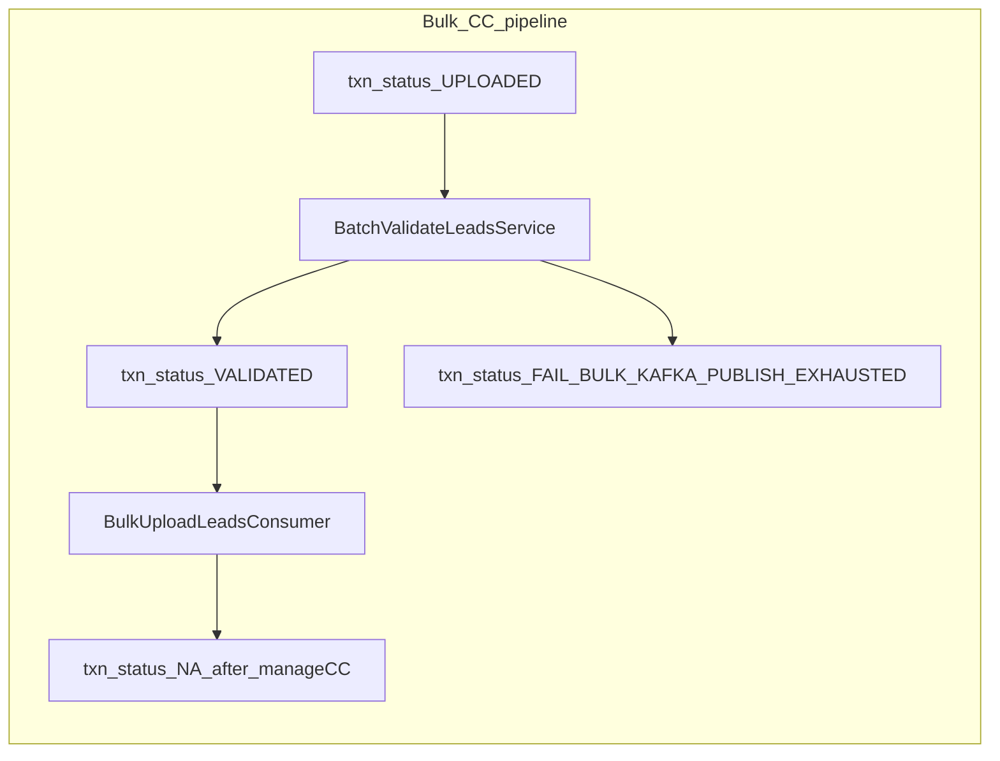

# Reprocessing batches for DSE dedupe and Factiva failures

## Reality check (this repo)

- The literal orchestration step IDs **`process_lead_file`**, **`process_lead`**, **`dse_dedupe_check`**, and **`lead_factiva_checks`** do **not** appear under [`deploy/application/orchestration`](deploy/application/orchestration) or Java in [novopay-platform-creditcard-management](.). Batch display names in your ticket likely come from **DSA scheduler / dashboard config** (similar to how you wired `checkExpiredAgentLead` and `updateEmployeeStatusToDormant`). Implementation here adds **CC-mgmt orchestration `Request` entries + processors**; ops still map scheduler job names to those requests in the batch-config service.
- Within CC-mgmt, closest counterparts are:
  - **Bulk file → Kafka → per-lead CC APIs**: [`BatchValidateLeadsService`](src/main/java/in/novopay/creditcard/bulk/BatchValidateLeadsService.java) (UPLOADED → VALIDATED + Kafka) and [`BulkUploadLeadsConsumer.processLead`](src/main/java/in/novopay/creditcard/consumers/BulkUploadLeadsConsumer.java) (manageCC → consent → resume).
  - **Dedupe**: audit stage **`CUSTOMER_DEDUPE_CHECK`** from [`TransactionAuditStages`](src/main/java/in/novopay/creditcard/enums/TransactionAuditStages.java), mapped by [`TransactionAuditUtil`](src/main/java/in/novopay/creditcard/utils/TransactionAuditUtil.java) to API **`fetchCustomerDetailsWithDedupe`** / function_sub_code **`INITIATE`** (see [`deploy/application/orchestration/common_fetchCustomerDetailsWithDedupe.xml`](deploy/application/orchestration/common_fetchCustomerDetailsWithDedupe.xml)).
  - **Factiva**: **no dedicated stage** in `TransactionAuditUtil`. [`Application.java`](src/main/java/in/novopay/creditcard/Application.java) excludes `FactivaServicePartnerDiscoveryService` from this service’s component scan, so **Factiva execution may live primarily in HDFC integration libs or upstream orchestration**. Plan includes a **short discovery step** in `novopay-platform-lib` / `infra-transaction-hdfc` to see whether Factiva runs inside `fetchCustomerDetailsWithDedupe` or another API—batch selection criteria depend on that.

## Stuck-record signals (grounded in existing code)

- **Kafka publish edge cases** ([`publishWithRetries`](src/main/java/in/novopay/creditcard/bulk/BatchValidateLeadsService.java)): on **exhausted retries**, row is marked **FAIL** with `txn_result_code = BULK_KAFKA_PUBLISH_EXHAUSTED`. On **InterruptedException**, the method **returns without marking FAIL**, leaving **VALIDATED** while Kafka may never have delivered—matches “stuck after Kafka failure.”
- **`process_lead`-style failures**: consumer catches exceptions and logs only—**no automatic retry** ([`BulkUploadLeadsConsumer`](src/main/java/in/novopay/creditcard/consumers/BulkUploadLeadsConsumer.java)).
- **Dedupe**: use **`transaction_audit_logs`** where `state = 'CUSTOMER_DEDUPE_CHECK'` and `status` in failure/pending-like values (`FAIL`, `NA`, `ERROR`, optionally `PENDING`) plus **staleness** (`updated_on` older than N minutes) to avoid racing active journeys.
- **Optional BKYC parallel** (only if your “lead file” means BKYC upload): [`BkycFileEntity.status`](src/main/java/in/novopay/creditcard/entity/BkycFileEntity.java) / [`BkycLeadEntity.leadStatus`](src/main/java/in/novopay/creditcard/entity/BulkLeadEntity.java) (`PENDING`) and [`ProcessLeadFileService`](src/main/java/in/novopay/creditcard/service/ProcessLeadFileService.java)—narrow scope unless product confirms.

## Proposed batches (CC-mgmt)

### 1) `processingLeadFile` batch (bulk pipeline repair)

**Goal:** Repush bulk-ingest rows that never completed the pipeline.

**Behavior (config-driven limits + staleness):**

| Scenario | Suggested handling |
|----------|-------------------|
| `txn_status = UPLOADED` for long time | Already picked by existing [`findNaLeadsForBatchValidate`](src/main/java/in/novopay/creditcard/dao/TransactionAuditRepository.java); batch can **invoke existing** `BatchValidateLeadsService.validateAndPushToKafka` under scheduler tenant context **or** duplicate its selection if you need different staleness—prefer **one code path** to avoid drift. |
| `txn_status = FAIL` and `txn_result_code = BULK_KAFKA_PUBLISH_EXHAUSTED` | **Reset to UPLOADED** (clear result code/description or set neutral), then run same validate/publish path **or** publish-only path (see below). |
| `txn_status = VALIDATED` + stale `updated_on` + still bulk-ingest + journey not progressed | **Replay Kafka only**: rebuild payload using existing static helpers (`mergeBulkContextForKafka`, `buildValidatedLeadKafkaPayload`, `partitionKey`)—**do not** toggle VALIDATED unless product wants UPLOADED recycle. Guard with **max attempts per day** (new txn attribute or reuse attempt on a dedicated replay attribute) to prevent infinite loops. |

**Implementation sketch:**

- New service (e.g. `BulkLeadPipelineReplayService`) that delegates to extracted/shared publish logic from `BatchValidateLeadsService` (refactor **minimal** surface: e.g. package-private `replayPublish(TransactionAudit lead, ...)` + reuse `publishWithRetries` semantics).
- New repository methods in [`TransactionAuditRepository`](src/main/java/in/novopay/creditcard/dao/TransactionAuditRepository.java) / DAO for the three predicates (always join `cc_additional_txn_data.bulk_lead_file_ingest = 'Y'`, `is_assisted = 'N'`, same subtype filters as batch validate).
- New `@Processor` (e.g. `BulkLeadPipelineReplayBatchProcessor`) extending [`AbstractProcessor`](src/main/java/in/novopay/creditcard/common/processors/UpdateCreditCardStatusBatchProcessor.java) pattern: loop with try/catch per row, structured logging.
- New orchestration XML (e.g. `common_bulkLeadPipelineReplay.xml`) with `<Request name="processingLeadFileBatch">` (name can match scheduler expectation).

### 2) `processingDedupeCheck` batch (`dse_dedupe_check`)

**Goal:** Retry stuck **CUSTOMER_DEDUPE_CHECK** for DSA/CC journeys.

**Behavior:**

- Query `transaction_audit` joined with `transaction_audit_logs` for `state = 'CUSTOMER_DEDUPE_CHECK'` and problematic `status`, filtered by **channel_source / tenant / transaction_sub_type** as agreed with product (e.g. DSA + CC).
- For each row, **re-invoke** orchestration **`fetchCustomerDetailsWithDedupe`** with **`INITIATE`** (and required headers/body) via the same mechanism used elsewhere (`NovopayInternalAPIClient` or a small processor chain modeled on [`common_vkyc_retrigger.xml`](deploy/application/orchestration/common_vkyc_retrigger.xml): load audit → build `ExecutionContext` → call internal API).
- Increment attempt / respect backoff via config; skip if a newer SUCCESS log exists for same audit.

**Risk:** Blind retries can duplicate bank calls—coordinate with **HDFC idempotency** and existing dedupe processor behavior ([`ExecuteDedupeApplicationProcessor`](src/main/java/in/novopay/creditcard/transaction/processor/ExecuteDedupeApplicationProcessor.java)).

### 3) `processingFactiva` batch (`lead_factiva_checks`)

**Goal:** Retry Factiva failures **once discovery confirms** where Factiva is invoked.

- **If** Factiva is part of `fetchCustomerDetailsWithDedupe` / demog chain: selection may be **same table as dedupe batch** but filtered by attribute/error codes discovered in HDFC code, **or** a dedicated log state if the integration adds one.
- **If** Factiva is not in CC-mgmt at all: batch may be **no-op here** and belongs to another service—document outcome of discovery.

## Platform wiring (outside Java)

### SQL / Flyway sequence numbering (mandatory)

Whenever a **new SQL migration file** is created (e.g. masterdata `configuration` inserts for `@NovopayConfig` keys):

1. On the repo that owns the migrations (typically **novopay-platform-masterdata-management**), use git to inspect the **`common-scripts`** branch.
2. Determine the **latest Flyway sequence number** already used there (highest `V<number>__` prefix in the relevant migration folder, e.g. `dsa/` or product scripts—match whatever path your change targets).
3. Name the new script with the **next** sequence number (`lastSeq + 1`), so branch ordering stays consistent and avoids duplicate version collisions.

Do **not** guess the version from only your local branch; **`common-scripts` is the source of truth** for the next seq no.

- **Orchestration**: register new `<Request>` blocks (mirror [`common_updateCreditCardStatus.xml`](deploy/application/orchestration/common_updateCreditCardStatus.xml)).
- **Masterdata / batch scheduler**: add rows for **`CREDIT-CARD-MANAGEMENT`** (same pattern as your completed DSA batches): cron, tenant, endpoint hitting new request name, headers (`user_id`, `X-Tenant-Code`, etc.).
- **Configuration**: new `@NovopayConfig` keys (limits, staleness minutes, max replay attempts, enable flags)—each needs Flyway in **novopay-platform-masterdata-management** `configuration` table per project guidelines.

## Testing (required for touched production code)

- Unit tests for new processors and replay service (mock DAO + Kafka producer).
- Repository tests or H2 integration for new native queries (pattern: [`BulkDedupeQueryH2IntegrationTest`](src/test/java/in/novopay/creditcard/dao/BulkDedupeQueryH2IntegrationTest.java)).
- Extend [`BatchValidateLeadsServiceValidateAndPushTest`](src/test/java/in/novopay/creditcard/bulk/BatchValidateLeadsServiceValidateAndPushTest.java) if publish logic is refactored.

## Deliverables checklist

1. Discovery note: Factiva call site (lib vs CC-mgmt).
2. DAO queries + configs for stuck selection.
3. Replay service + batch processor(s) + orchestration XML.
4. Masterdata Flyway + scheduler binding (IDs aligned with DSA naming); migration version from **`common-scripts`** branch last seq + 1.
5. Tests + targeted `./gradlew test --tests ...`.
