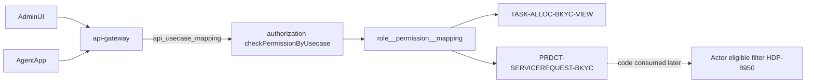

# HDP-8937 / ST-BE-04 - Task-allocation permissions

## Goal

Make BKYC / task-allocation **grantable** for corporate admins and field agents via DDP authz, enforce it on gateway v2 APIs, and leave a stable permission code for Actor eligibility (HDP-8950). Estimate: ~1 day.

Ticket: [HDP-8937](https://novopay.atlassian.net/browse/HDP-8937) (To Do). Parent: [HDP-8921](https://novopay.atlassian.net/browse/HDP-8921).

## Branch baseline (mandatory)

Plan and implement on ticket branch **`ddp-fea-hdp-8937-task-alloc-permissions`** (local; not pushed yet). All four repos checked out on this branch.

| Repo | Base (fetched) | Branch tip |
|---|---|---|
| `novopay-platform-authorization` | `origin/ddp-prod-master` (`d018e7cd`) | checked out |
| `novopay-platform-api-gateway` | `origin/ddp-prod-master` (`8fb308a0`) | checked out |
| `novopay-platform-actor` | `origin/ddp-prod-master` (`f7d7b5def1`) | checked out |
| `trustt-platform-task-allocation` | `origin/ddp-fea-bkyc` (`f109069`) | checked out |

### Flyway workflow (mandatory)

1. Discover each repo's common-scripts remote branch (`git branch -r | grep -i common` - today all four use `origin/ddp-fea-common-scripts`; name can differ).
2. **Fetch/pull that common-scripts branch** and read tip `V*` seq under `sql/migrations/ddp/` (or tenant folder used).
3. Land the new migration **on common-scripts first** with the next unused version.
4. Cherry-pick / bring onto `ddp-fea-hdp-8937-task-alloc-permissions` as needed for the feature PR.
5. **Never invent seq** from feature/`ddp-prod-master` alone.
6. **Never commit** without asking the user first.

Do not use stale local `ddp-qa` / unrelated feature checkouts as the Java feature base.

## Post-pull check (`ddp-fea-bkyc` → `f109069`)

Pulled Abhishek/Deepankar work on task-allocation feature branch: Annexure parser (HDP-8939), `task_file` / `task_bkyc` rename, ingest handbook. **No permission / authz / gateway / ST-BE-04 seeds or codes.** Handbook says bank-employee security lives in a peer DDP service - same as this plan. **Permission approach unchanged;** branch base corrected to `ddp-prod` above.

## Locked decisions (this build)


| Item                            | Choice                                                                                                                                                                                                                                                                                                                                                                     |
| ------------------------------- | -------------------------------------------------------------------------------------------------------------------------------------------------------------------------------------------------------------------------------------------------------------------------------------------------------------------------------------------------------------------------- |
| Phase 1 corporate default roles | **BC – Central Manager** + **BC – Regional Manager** (ticket lock; [HDP-9031](https://novopay.atlassian.net/browse/HDP-9031) is Reopened for extra bank roles - **do not** seed those extras)                                                                                                                                                                              |
| Role attachability              | Seed via `role__permission__mapping` only; no hard-coded role names in Java                                                                                                                                                                                                                                                                                                |
| Corporate permission            | `TASK-ALLOC-BKYC-VIEW` (admin portal + ADM/workflow APIs)                                                                                                                                                                                                                                                                                                                  |
| Agent permission                | `PRDCT-SERVICEREQUEST-BKYC` (APK entitlement + future INT4 / eligible-agent filter; same family as REKYC / complaint)                                                                                                                                                                                                                                                      |
| Corporate usecase               | `TASK-ALLOC-BKYC-UC001`                                                                                                                                                                                                                                                                                                                                                    |
| Agent usecase                   | `PRDCT-BKYC-UC001`                                                                                                                                                                                                                                                                                                                                                         |
| User story / feature            | Corporate under `ORGN-EMPL` (mirror DSA [V5000014](novopay-platform-authorization/src/main/resources/sql/migrations/dsa/V5000014__insert_auth_bkyc_lead.sql)); agent under existing `SERVICE-REQUEST` / `LIABILITY` story pattern used by [V4000115](novopay-platform-authorization/src/main/resources/sql/migrations/ddp/V4000115__rekyc_permission_role.sql) / complaint |
| Out of scope                    | Full per-`task_type` matrix; Actor `getEligibleAgentsForTask` body (HDP-8950); ST-BE-03 routing if still open                                                                                                                                                                                                                                                              |





## Runtime model (existing - do not reinvent)

1. Gateway `[AuthorizationCheckFilter](novopay-platform-api-gateway)` looks up `ddp_gateway.api_usecase_mapping` by `(api_name, function_code, function_sub_code)`.
2. Calls authorization `checkPermissionByUsecase`.
3. Auth joins user → role → `role__permission__mapping` → `usecase.required_permission_id`.
4. **No mapping row = permission check skipped** - so mapping is required for enforcement.

RBAC seeds live in `**novopay-platform-authorization**`, not task-allocation / masterdata.

## Implementation steps

### 1. Discover / create corporate role codes

On local or QA `ddp_authorization`:

```sql
SELECT id, code, display_name, role_group, status
FROM ddp_authorization.role
WHERE display_name LIKE '%Central%Manager%'
   OR display_name LIKE '%Regional%Manager%'
   OR code LIKE '%CNTRL%' OR code LIKE '%REGN%';
```

- If roles exist: use their `code` in the grant migration.
- If missing: create roles in the same auth Flyway with codes `**BC-CNTRL-MGR**` / `**BC-REGN-MGR**`, `role_group = 'EMPL'`, display names matching CN (`BC – Central Manager`, `BC – Regional Manager`).

### 2. Authorization Flyway (DDP)

Repo: `[novopay-platform-authorization](novopay-platform-authorization)` — Java on feature branch from `ddp-prod-master`; **Flyway on latest `ddp-fea-common-scripts`** (fetch/pull first; next seq after tip - do not assume `V4000124` until locked).

- After locking seq on common-scripts tip → e.g. `V######__insert_task_alloc_bkyc_permissions.sql`.
- Insert:
  - `user_story` e.g. `TASK-ALLOC-BKYC` under feature `ORGN-EMPL`
  - `permission`: `TASK-ALLOC-BKYC-VIEW`, `PRDCT-SERVICEREQUEST-BKYC`
  - `user_story__permission__mapping` (corporate story ↔ corporate perm; agent story ↔ agent perm)
  - `usecase`: `TASK-ALLOC-BKYC-UC001` → corporate perm; `PRDCT-BKYC-UC001` → agent perm
  - `role__permission__mapping`: both corporate roles → `TASK-ALLOC-BKYC-VIEW`
- Agent default-grant: if a Manipal/BC agent role is already present in QA (discover similarly), map `PRDCT-SERVICEREQUEST-BKYC`; otherwise leave agent grant to KP/UAM and document that on the ticket (permission still grantable = DoD).

Templates: DSA BKYC upload seed, DDP REKYC `[V4000115](novopay-platform-authorization/src/main/resources/sql/migrations/ddp/V4000115__rekyc_permission_role.sql)`, role grants `[V4000111](novopay-platform-authorization/src/main/resources/sql/migrations/ddp/V4000111__insert_annual_checklist_roles_and_permission.sql)`.

### 3. Gateway Flyway - `api_usecase_mapping`

Repo: `[novopay-platform-api-gateway](novopay-platform-api-gateway)` — Java on feature branch from `ddp-prod-master`; **Flyway on latest `ddp-fea-common-scripts`** (fetch/pull first; next seq after tip - do not assume `V4000043` until locked).

- After locking seq on common-scripts tip → e.g. `V######__task_allocation_api_usecase_mapping.sql`.
- Map solution §3.2 v2 API names (`DEFAULT` / `DEFAULT` unless an API needs other function codes):


| APIs                                                                                                                                                                                                                                              | Usecase                 |
| ------------------------------------------------------------------------------------------------------------------------------------------------------------------------------------------------------------------------------------------------- | ----------------------- |
| Admin: `getTaskList`, `getEligibleAgentsForTask`, `updateTaskAssignment`, `triggerWorkflow`, `getWorkflowRunList`, `getWorkflowRunDetails`, `getTaskActivityLog`, `uploadTaskLeadFile`, `getTaskLeadUploadList`, `downloadTaskLeadUploadResponse` | `TASK-ALLOC-BKYC-UC001` |
| Agent: `getAgentTaskList`, `getAgentTaskDetails`, `updateTaskStatus`, `submitBkyc`                                                                                                                                                                | `PRDCT-BKYC-UC001`      |


Pattern: `[V4000026__configuration_mgmt.sql](novopay-platform-api-gateway/src/main/resources/sql/migrations/ddp/V4000026__configuration_mgmt.sql)`.

Note: `[request_forward` / service registry](trustt-platform-task-allocation/docs/project-overview.md) remains ST-BE-03 ([HDP-8936](https://novopay.atlassian.net/browse/HDP-8936)); this ticket only adds usecase mappings so checks fire once routes exist.

### 4. Actor - contract only (no HDP-8950 scope creep)

Java on feature branch from **`origin/ddp-prod-master`** (no Flyway for this ticket unless a constant-only change needs none).

- Add a single constant for `PRDCT-SERVICEREQUEST-BKYC` in the existing Actor permission/product constants area (near `[AbstractPermissionListProcessor](novopay-platform-actor/src/main/java/in/novopay/actor/suryoday/AbstractPermissionListProcessor.java)` `SERVICEREQUEST_PREFIX` on `ddp-prod-master`) so APK permission-list reshaping and future eligible-agent filter share one code.
- Do **not** implement `getEligibleAgentsForTask` here; comment on HDP-8937 that HDP-8950 must filter agents by this permission.

### 5. task-allocation repo

- No permission DDL in `trustt-platform-task-allocation`.
- Optional one-liner in `[docs/task-allocation/solution-document.md](trustt-platform-task-allocation/docs/task-allocation/solution-document.md)` §11 naming the two permission codes (keeps SoT aligned).

### 6. Prove + close ticket

Verify on QA-oriented / local auth+gateway DB:

```sql
-- permissions + usecases exist
SELECT code FROM ddp_authorization.permission WHERE code IN ('TASK-ALLOC-BKYC-VIEW','PRDCT-SERVICEREQUEST-BKYC');
SELECT code FROM ddp_authorization.usecase WHERE code IN ('TASK-ALLOC-BKYC-UC001','PRDCT-BKYC-UC001');
-- corporate default grants
SELECT r.code, p.code
FROM ddp_authorization.role__permission__mapping m
JOIN ddp_authorization.role r ON r.id = m.role_id
JOIN ddp_authorization.permission p ON p.id = m.permission_id
WHERE p.code = 'TASK-ALLOC-BKYC-VIEW';
-- gateway mappings present
SELECT api_name, usecase FROM ddp_gateway.api_usecase_mapping
WHERE usecase IN ('TASK-ALLOC-BKYC-UC001','PRDCT-BKYC-UC001');
```

Comment on HDP-8937 (DoD): exact permission codes, usecase codes, role codes granted, Flyway filenames, verify SQL results.

## DoD checklist

- Corporate Central/Regional can receive `TASK-ALLOC-BKYC-VIEW` (seeded)
- Agent can receive `PRDCT-SERVICEREQUEST-BKYC` (seeded; role grant or documented UAM path)
- Permissions attachable to any role via `role__permission__mapping` (not Java hard-wire)
- Gateway mappings for known ADM/AGT/workflow API names
- Exact codes commented on HDP-8937

## Risk notes

- **HDP-9031 Reopened** - stick to two corporate roles; KP can attach later.
- **Flyway collisions** - land on latest common-scripts per repo after fetch/pull; re-lock seq before writing files.
- **Never commit** without asking the user first.
- Do not reuse DSA `BKYC-UPLD-*` codes (old DSA lead upload, different product).

