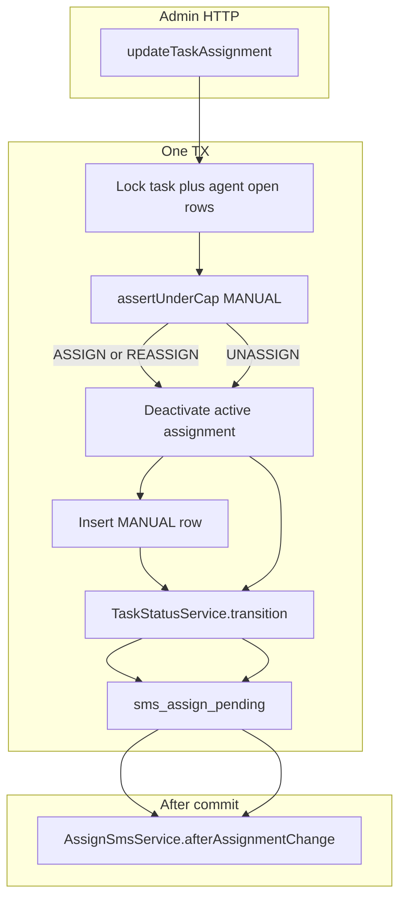

# HDP-9005 ADM3 updateTaskAssignment

Recommended Jira structure: keep the existing sub-task [HDP-9005](https://novopay.atlassian.net/browse/HDP-9005) under [HDP-8930](https://novopay.atlassian.net/browse/HDP-8930). Do not split into new Stories.

Depends on [HDP-9004](https://novopay.atlassian.net/browse/HDP-9004) (ADM2). Stack the same way as 9004: branch from latest `origin/ddp-fea-bkyc`, then merge `ddp-fea-HDP-9004-adm2-eligible-agents` (PR [#17](https://github.com/trusttai/trustt-platform-task-allocation/pull/17)) so `AdminTaskV2Controller` keeps getTaskList + getEligibleAgentsForTask + this mapping.

## What lands

Public `POST /api/v2/updateTaskAssignment` in [AdminTaskV2Controller.java](trustt-platform-task-allocation/src/main/java/com/trustt/taskallocation/task/controller/AdminTaskV2Controller.java). Gateway already maps this name to `TASK-ALLOC-BKYC-UC-ASSIGN` ([HDP-8937](https://novopay.atlassian.net/browse/HDP-8937) `V4000043`). Freeze the API name as `updateTaskAssignment` (not `assignTask`).

Ops can assign an unassigned BKYC visit, move it to another agent, or put it back in the leftover pool. Manual cap 15 is a hard reject. Assign SMS is a post-commit hook only - assignment never rolls back if SMS fails.

## Locked behaviour

- Corporate from `BkycAssignConfig` (`trustt.taskallocation.bkyc.corporate.id`). Task must be BKYC for that corporate (same check as ADM2 `requireConfiguredBkycTask`).
- **ASSIGN:** no active assignment, task not terminal, `agentId` required. Deactivate is a no-op. Insert `assign_mode=MANUAL`, optional `strategy` / `distanceKm` from request. Status `AWAITING_CONTACT`. `sms_assign_pending=1`.
- **REASSIGN:** active assignment required; `agentId` required and must differ from the current agent. Deactivate current (`unassigned_on=now`), then insert new row. Same status + pending as ASSIGN. Cap check after deactivate so the old agent's slot is free.
- **UNASSIGN:** active assignment required; omit `agentId`. Deactivate only. Status `AWAITING_AGENT_ASSIGNMENT`. Clear `sms_assign_pending`. No SMS.
- Cap: `AssignCapService.assertUnderCap(..., AssignCapMode.MANUAL)` inside the same TX. Public code already frozen as `TASK_AGENT_CAP_REACHED` with copy *The requested agent has already reached the maximum task assignment limit.* in [AssignCapConstants.java](trustt-platform-task-allocation/src/main/java/com/trustt/taskallocation/assignment/AssignCapConstants.java).
- SMS after commit: `AssignSmsService.afterAssignmentChange(taskId, ASSIGN|REASSIGN|UNASSIGN)` already returns SENT / PENDING / NONE. Put that on `assignSms`. Do not invent a second window.
- Status writes: `TaskStatusService.transition(...)` (same as AUTO_ASSIGN), **not** `transitionStatus`. The matrix in [StatusTransitionMatrix.java](trustt-platform-task-allocation/src/main/java/com/trustt/taskallocation/task/service/StatusTransitionMatrix.java) does not allow `AWAITING_CONTACT` -> `AWAITING_AGENT_ASSIGNMENT` or same-status REASSIGN. Do not expand the matrix here.
- `change_source` = `updateTaskAssignment`. `actor_id` from `X-User-Id`. `remarks` -> history `notes` (no remarks column on `task_assignment`).
- Do not re-call Actor eligibility. ADM2 `canAssign` is soft; ADM3 hard-blocks cap only. Trust `agentId` from ADM2 `agentDetails.id`.
- Response: echo `taskId` / `action`; `statusCode` / `statusLabel` from `task_status_master`; `assignedAgentId` from the new active row (null after UNASSIGN); `assignedAgentCode` / `assignedAgentName` null (same as ADM1 - FE already has names from ADM2). `assignSms` SENT / PENDING / NONE.
- New validation codes `4000056`-`4000061` (do not reuse ADM1 `4000045`-`4000049`, ADM2 `4000050`-`4000055`, or SMS `4000045` / `4000046`). Cap stays `TASK_AGENT_CAP_REACHED`.

## Out of scope

- ADM4 Run now, ADM5/ADM6 activity log
- Gateway / auth / masterdata / common-scripts Flyway
- Actor eligible-agent search, request `corporateId`, agent-name enricher
- Expanding `StatusTransitionMatrix` (bank-closure / HDP-9013)
- Frontend [HDP-9008](https://novopay.atlassian.net/browse/HDP-9008) / [HDP-9009](https://novopay.atlassian.net/browse/HDP-9009)

## Reuse (do not duplicate)

- [AssignCapService.java](trustt-platform-task-allocation/src/main/java/com/trustt/taskallocation/assignment/AssignCapService.java) - `assertUnderCap` + `lockOpenAssignmentIdsForAgent`
- [AssignSmsService.java](trustt-platform-task-allocation/src/main/java/com/trustt/taskallocation/assignment/sms/AssignSmsService.java) - `afterAssignmentChange`
- [AutoAssignCommitService.java](trustt-platform-task-allocation/src/main/java/com/trustt/taskallocation/assignment/AutoAssignCommitService.java) - pattern only (deactivate/insert/status/pending). New `AdminAssignmentService`; do not overload AUTO_ASSIGN.
- [EligibleAgentsMode.java](trustt-platform-task-allocation/src/main/java/com/trustt/taskallocation/integration/actor/EligibleAgentsMode.java) if `strategy` is present
- Controller style: `executeWithMdc` + wrap `NovopayNonFatalException` like ADM2

Add a task-row lock (`SELECT ... FOR UPDATE` on `task.id`) in the assign TX so two concurrent ASSIGNs cannot both insert. Agent open-row lock already exists.

## Files to add / touch

- New: `AdminAssignmentService`, DTOs, `AdminAssignmentConstants` (errors + `CHANGE_SOURCE` + `ASSIGN_MODE_MANUAL`)
- Touch: [AdminTaskV2Controller.java](trustt-platform-task-allocation/src/main/java/com/trustt/taskallocation/task/controller/AdminTaskV2Controller.java) + its test
- New tests only: `AdminAssignmentServiceTest` (and controller cases). Do not run the preexisting TaskAlloc suite.
- TDD pack later: clone 9004 scenarios S1-S37, add ADM3 S38+ (ASSIGN leftover, cap 15 reject, REASSIGN SMS, UNASSIGN pool + no SMS, in-window SENT). Catalog alias if Bob would collide on Actor `updateTaskAssignment` - check at pack time.

No schema change. Verify SQL after deploy: gateway `updateTaskAssignment` -> `TASK-ALLOC-BKYC-UC-ASSIGN`; assignment history `is_active` / `unassigned_on`; `task.sms_assign_pending`.

## Assumptions (object by seq no)

1. ASSIGN is illegal when an active assignment already exists (use REASSIGN). REASSIGN to the same agent is illegal.
2. UNASSIGN / REASSIGN allowed from any non-terminal status that has an active assignment (not only `AWAITING_CONTACT`).
3. ASSIGN allowed from any non-terminal status with no active assignment (leftover pool and `PENDING_ASSIGNMENT`).
4. Agent code/name on the response stay null.
5. Invalid / missing `strategy` when sent must be PINCODE / DISTANCE / HYBRID; omit is allowed.

## Open (non-blocking unless you object)

- Parse `X-User-Id` to Long for `actor_id`; if unparseable, store null rather than fail the assign.
- Same-status REASSIGN still writes a history row (`from` = `to` = `AWAITING_CONTACT`) via `transition()`.

## Prove / Ship (after Build)

Full 9004 regression plus new ADM3 cases. Unit tests cover cap race, wrong action-for-state, and fail-closed HTTP 400. Do not run `bob validate-ticket` until you ask to prove.
