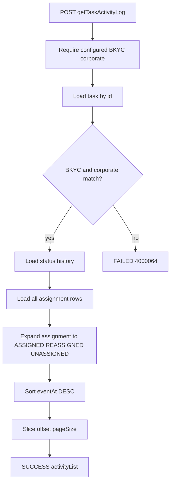

# HDP-9551 ADM6 getTaskActivityLog

Recommended Jira structure: keep existing Story [HDP-8930](https://novopay.atlassian.net/browse/HDP-8930) + sub-task [HDP-9551](https://novopay.atlassian.net/browse/HDP-9551). Do not split more Stories. Slices below are build order only.

UI sibling [HDP-9552](https://novopay.atlassian.net/browse/HDP-9552) is already Jira Done. Gateway mapping for `getTaskActivityLog` already exists (HDP-8937 `TASK-ALLOC-BKYC-UC001` in [V4000043__task_allocation_api_usecase_mapping.sql](novopay-platform-api-gateway/src/main/resources/sql/migrations/ddp/V4000043__task_allocation_api_usecase_mapping.sql)). No gateway / auth / Flyway work.

## Scope (LOCKED)

- Repo: `trustt-platform-task-allocation` only.
- API: `POST /api/v2/getTaskActivityLog` (gateway path `/api-gateway/api/v2/task-allocation/getTaskActivityLog`).
- Merge `task_status_history` + `task_assignment` into `activityList[]`, newest-first. No new audit table. No dialer events. No ADM5 workflow history.
- Corporate scope: same as ADM1/ADM2/ADM3 - task must be `BKYC` and `corporate_id` = `trustt.taskallocation.bkyc.corporate.id` ([BkycAssignConfig](trustt-platform-task-allocation/src/main/java/com/trustt/taskallocation/plugin/bkyc/config/BkycAssignConfig.java)).
- Pattern: Spring `@RestController` + service like ADM1-3 on [AdminTaskV2Controller](trustt-platform-task-allocation/src/main/java/com/trustt/taskallocation/task/controller/AdminTaskV2Controller.java). Jira says "Orc v2 processor" - do **not** add `AbstractProcessor` / `AbstractCreditCardManager`.

## Branch (LOCKED)

- Depends on ST-BE-37 assignment soft-history ([HDP-9005](https://novopay.atlassian.net/browse/HDP-9005) PR https://github.com/trusttai/trustt-platform-task-allocation/pull/18). AUTO_ASSIGN + status history already exist; ASSIGNED/REASSIGNED/UNASSIGNED timeline cannot be proven without 9005 writes.
- Fetch latest `origin/ddp-fea-bkyc`. Create `ddp-fea-HDP-9551-adm6-activity-log` from `ddp-fea-HDP-9005-adm3-update-assignment` (keep stacked SMS/ADM1/ADM2/ADM3 commits). If 9005 has merged to `ddp-fea-bkyc` by Build time, branch from that instead. Do not strip sibling commits.

## Request / response (LOCKED)

Request (camelCase). `taskId` required. `pageSize` / `offset` **optional** - [HDP-8930 comment 396785](https://novopay.atlassian.net/browse/HDP-8930): FE Phase 1 may send `{ "taskId": 70001 }` only. Defaults **50 / 0**. Cap pageSize **100**. Echo `pageSize`, `offset`, `numberOfRecords` (total merged events, not page length). Empty `activityList` is SUCCESS.

Reuse ADM2 optional paging style from [GetEligibleAgentsRequestDto](trustt-platform-task-allocation/src/main/java/com/trustt/taskallocation/task/dto/GetEligibleAgentsRequestDto.java). Nested v2 envelope like [GetEligibleAgentsResponseDto](trustt-platform-task-allocation/src/main/java/com/trustt/taskallocation/task/dto/GetEligibleAgentsResponseDto.java) plus `taskId`.

Do not omit Jira fields on `activityList[]`: `eventAt`, `eventType`, `eventAction`, `actorId`, `actorLabel`, `summary`, status fields, `changeSource`, `notes`, assignment fields.

`eventAt`: format `LocalDateTime` as ISO offset in `Asia/Kolkata` (same helper pattern as [WorkflowResponseMapper](trustt-platform-task-allocation/src/main/java/com/trustt/taskallocation/workflow/service/WorkflowResponseMapper.java)).

## Merge algorithm (LOCKED)

Load all status history for the task ([TaskDaoService.listStatusHistoryForTask](trustt-platform-task-allocation/src/main/java/com/trustt/taskallocation/task/dao/TaskDaoService.java) already exists) and **all** assignment rows (add `findByTaskIdOrderByAssignedOnAscIdAsc` - list-by-task is missing today). Merge in memory. Typical volume is tens of rows; SQL UNION paging is not worth it.

**STATUS_CHANGE:** one event per `task_status_history` row. `eventAt` = `created_on`. `eventAction` = `STATUS_CHANGED`. Labels from `task_status_master.label`. `changeSource` as stored (`updateTaskAssignment`, `AUTO_ASSIGN`, ingest/handler names). `fromStatus` null on first create row is OK.

**ASSIGNMENT** from `task_assignment` ordered by `assigned_on`, then `id`:

- At `assigned_on`: `ASSIGNED` if no immediate predecessor; `REASSIGNED` if previous row has `unassigned_on` and next `assigned_on` is within **5 seconds** of that `unassigned_on` (same TX: [AssignmentWriter](trustt-platform-task-allocation/src/main/java/com/trustt/taskallocation/assignment/AssignmentWriter.java) `deactivate` then `insertActive` with two `LocalDateTime.now()` calls).
- At `unassigned_on`: emit `UNASSIGNED` only when that 5s successor is **absent** (true leftover). REASSIGN must not emit UNASSIGNED.
- Later AUTO_ASSIGN refill after a real UNASSIGN is a new `ASSIGNED` (gap >> 5s).

Sort merged events by `eventAt` DESC, then type/id for ties. Apply offset/pageSize on the merged list.

## Phase 1 names (LOCKED)

Same as ADM1: assignment stores `agentId` only. `agentCode` / `agentName` / `actorLabel` stay **null** (do not call Actor). FE already handles empty By ([HDP-9552 comment 396129](https://novopay.atlassian.net/browse/HDP-9552)). Keep the JSON keys. `agentId` and `assignmentId` are populated. `actorId` on STATUS_CHANGE comes from history when present.

Summaries (UI one-liners):

- Status: `Status {fromLabel or code} → {toLabel or code}` (first row with null from: `Status → {toLabel}`).
- ASSIGNED: `Assigned to agent {id} ({mode} / {strategy})` when strategy present.
- REASSIGNED: `Reassigned to agent {id} ({strategy or mode})`.
- UNASSIGNED: `Unassigned from agent {id}`.

## Errors (new constants 4000062+)

Do not reuse ADM1/ADM2 codes. Suggested:

- `4000062` invalid paging (pageSize not 1-100, offset &lt; 0)
- `4000063` corporate unset
- `4000064` task missing / not BKYC / wrong corporate (same fail-closed message as ADM2 `4000051`)

Missing `taskId`: Bean Validation `@NotNull` like ADM2.

## Files to add/touch

- New: `AdminTaskActivityConstants`, `GetTaskActivityLogRequestDto`, `GetTaskActivityLogResponseDto`, `ActivityListItemDto`, `AdminTaskActivityService` (merge + paging).
- Touch: [AdminTaskV2Controller](trustt-platform-task-allocation/src/main/java/com/trustt/taskallocation/task/controller/AdminTaskV2Controller.java), [TaskAssignmentJpaRepository](trustt-platform-task-allocation/src/main/java/com/trustt/taskallocation/task/dao/TaskAssignmentJpaRepository.java), [TaskDaoService](trustt-platform-task-allocation/src/main/java/com/trustt/taskallocation/task/dao/TaskDaoService.java) (`listAssignmentsForTask`).
- Tests only: `AdminTaskActivityServiceTest` (assign → status → reassign → unassign → later assign; empty; paging; wrong corporate). Extend [AdminTaskV2ControllerTest](trustt-platform-task-allocation/src/test/java/com/trustt/taskallocation/task/controller/AdminTaskV2ControllerTest.java) for the new POST. Run `--tests` those classes only, then `compileJava`.

## Out of scope

- UI, new table, Flyway, gateway, Actor name enricher, ADM5, dialer events, Jira comments, commit/PR until Ship gate.

## Open (non-blocking)

- If 5s window mis-classifies a same-second AUTO_ASSIGN refill in Bob, tighten to "successor assigned_on equals unassigned_on truncated to seconds" after first E2E, not in Plan.
- Prove later only when asked (`bob validate-ticket HDP-9551`); reuse 9005 fixtures for assign/reassign/unassign history.

## Self-check after Build

- Diff is TaskAlloc ADM6 only.
- Compile + new test classes only.
- SQL fully qualified if any verify queries in ticket pack.
- No `bob validate-ticket` unless asked.