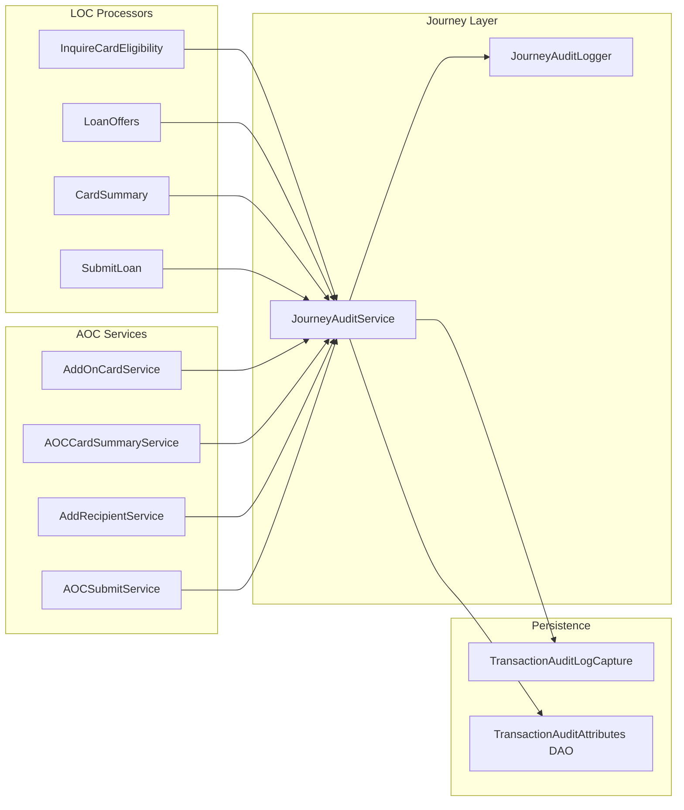

# Journey Analytics – Pluggable Architecture

## Goals

- **Reusability:** One capture path for LOC, AOC, and any future journey (no copy-paste).
- **Developer ease:** Add a new journey = add stage constants + call one API at each step; add a new stage = one constant + one call.
- **Consistency:** Same persistence (transaction_audit_logs + transaction_audit_attributes), same log shape, same attribute key convention.
- **Non-invasive:** Existing CC flow keeps using CaptureStages and TransactionAuditUtil.getServiceStage; no breaking changes.
- **Testability:** Single facade and a small logger; easy to mock and unit test.

---

## Current State (unchanged)

- **CC journey:** CaptureStages.capture(transactionAudit, TransactionAuditStages, status, stan) or captureOfferType(..., qualifier, ...); state from enum or OfferTypes. Persistence: transaction_audit_logs only. Entry: AbstractCreditCardManager.createOrUpdateAuditLog() → TransactionAuditUtil.getServiceStage(apiName, functionCode, functionSubCode).
- **Persistence:** TransactionAuditLogCapture.saveAuditTransactionLog(transactionAudit, state, status, stan). TransactionAuditAttributes via DAO (today LOCUtils.createOrUpdateAttribute for LOC-only).

---

## Proposed Building Blocks

### 1. Journey type (shared)

- **Purpose:** Identify the journey for attribute prefix and logging.
- **Shape:** Constants or enum, e.g. `JourneyType.LOC`, `JourneyType.AOC`.
- **Location:** e.g. `in.novopay.creditcard.components.journey.JourneyType` (or under existing constants package).
- **Usage:** Passed into the generic capture API so attribute keys and logs are prefixed/typed by journey.

### 2. Stage names per journey (reusable pattern)

- **Purpose:** Each journey defines its own stage names; no single global enum that grows with every product.
- **Shape:** One class per journey holding string constants (e.g. LOC: INQUIRE_CARD_ELIGIBILITY, PRODUCT_ELIGIBILITY, LOC_CARD_SUMMARY, SUBMIT_LOAN_INSTA, SUBMIT_LOAN_JUMBO, LOC_OTP_GENERATE, LOC_OTP_VALIDATE, LOC_ACCOUNT_INFO; AOC: AOC_CREATE_APP, AOC_OTP_GENERATION, AOC_OTP_VALIDATION, AOC_CARD_ELIGIBILITY, AOC_CARD_SUMMARY, AOC_ACCOUNT_INFO, AOC_VIEW_RECIPIENT, AOC_ADD_RECIPIENT, AOC_SUBMIT).
- **Location:** Keep LOC in `loc.constants` (e.g. LOCStages or refactor LOCStageConstants to only stage names); add AOC in a similar place (e.g. aoc.constants.AOCStages or journey.aoc.AOCStages).
- **Developer:** For a new journey, add one class with public static final String STAGE_* = "..."; no change to other journeys.

### 3. Standard failure-context keys (shared)

- **Purpose:** Same attribute names across journeys for querying and tooling; optional journey prefix for clarity.
- **Shape:** Constants: failure_stage, failure_reason, api_error_code, api_error_message. Stored with optional prefix: `{journeyType}_failure_stage`, `{journeyType}_failure_reason`, etc., or unprefixed and rely on state in transaction_audit_logs for “where failed”.
- **Location:** e.g. `JourneyAuditConstants` or inside JourneyAuditService. Journey-specific keys (e.g. eligibility_product_codes, inquire_svc_return, loc_chosen_product_code) stay as extra context keys (can still be prefixed for clarity).

### 4. JourneyAuditService (new – single facade)

- **Purpose:** Single entry point for all non-CC journeys (LOC, AOC, future) to record stage and optional failure context; encapsulates logs + DB.
- **Interface (conceptual):**
  - `capture(TransactionAudit audit, String journeyType, String stage, TransactionAuditLogsStatus status, String stan)`  
  → Persist state=stage to transaction_audit_logs; optionally call structured logger.
  - `captureFailure(TransactionAudit audit, String journeyType, String stage, TransactionAuditLogsStatus status, String stan, String failureReason, Map<String, String> context)`  
  → Same as above + write failure_stage, failure_reason and context map to transaction_audit_attributes (with naming convention); then structured log.
- **Implementation:** Uses existing TransactionAuditLogCapture.saveAuditTransactionLog(audit, stage, status, stan). For attributes: uses TransactionAuditAttributesDAOService (or a thin wrapper that applies prefix and trims value length). Calls JourneyAuditLogger (see below). No business logic; only orchestration.
- **Location:** `in.novopay.creditcard.components.journey.JourneyAuditService` (or under components.stages if preferred).
- **Dependencies:** TransactionAuditLogCapture, TransactionAuditAttributesDAOService (or generic “attribute writer” that allows blank for selected keys if needed), JourneyAuditLogger.
- **Developer:** In any LOC/AOC processor or service: inject JourneyAuditService; on success call capture(...); on failure call captureFailure(..., reason, contextMap). No direct use of TransactionAuditLogCapture or attribute keys in feature code.

### 5. JourneyAuditLogger (new – centralised structured logging)

- **Purpose:** One consistent log line per capture for analytics and support; optional MDC so all logs in the request carry journey context.
- **Shape:** e.g. `logJourney(String journeyType, String stage, String status, String stan, String clientReferenceCode, Long transactionAuditId, Map<String, String> context)`. Log format: structured (e.g. JSON or key=value) with fixed keys: journey_type, stage, status, stan, client_reference_code, transaction_audit_id, and optional context (product_code, failure_reason, etc.). Optionally set MDC (stan, journey_type, stage) before logging and clear in filter or controller.
- **Location:** `in.novopay.creditcard.components.journey.JourneyAuditLogger` (or util).
- **Used by:** JourneyAuditService only (so all journey captures go through one log path). CC can adopt later if desired.

### 6. Attribute persistence (reuse + convention)

- **Reuse:** TransactionAuditAttributesDAOService (findEntityByTransactionAuditIdAndAttrKey, save). No duplication of “find or create” logic.
- **Convention:** JourneyAuditService (or a small helper) builds attribute keys: e.g. `journeyType + "_failure_stage"`, `journeyType + "_failure_reason"`, and for context map keys either prefixed or allowed as-is for known keys. Truncate long values (e.g. 500 chars) for api_error_message.
- **Allow blank:** For “no offers” or empty product list, store failure_reason and optionally eligibility_product_codes = "". If current LOCUtils skips blank values, add an overload or use the DAO from JourneyAuditService with a flag to allow blank for specific keys so analytics can distinguish “empty list” from “key missing”.

---

## Data Flow

---

## Implementation Order

1. **Shared layer (one PR/commit if desired)**
  - Add JourneyType, JourneyAuditConstants (standard failure keys), JourneyAuditLogger, JourneyAuditService (capture + captureFailure).  
  - Add a small attribute writer (or extend existing) that supports optional “allow blank” for chosen keys and key prefix by journey.
2. **LOC (align + complete)**
  - Refactor LOC processors to use JourneyAuditService instead of TransactionAuditLogCapture + LOCUtils for capture and failure context.  
  - Keep LOC stage names in one place (LOCStages or current LOCStageConstants); add missing stages (LOC_OTP_GENERATE, LOC_OTP_VALIDATE, LOC_ACCOUNT_INFO) and add capture in OTP flow (e.g. TransactionAuditUtil mapping for customerOTPLoc when transaction_sub_type=LOC) and in getLOCOffers for account info if applicable.  
  - Ensure all required data is passed in context (product codes, svc_return, chosen product, error message).
3. **AOC (full journey)**
  - Add AOCStages (or AOC stage constants).  
  - In AddOnCardService, AOCCardSummaryService (4a–4d), AddRecipientService, AOCSubmitApplicationService: inject JourneyAuditService and call capture/captureFailure at each step.  
  - Wire OTP for AOC (TransactionAuditUtil or equivalent) if AOC shares customerOTPLoc.
4. **Optional**
  - Extend CaptureStages with an overload that accepts optional failure context and delegates to JourneyAuditService for non-CC journeys, or leave CC and journey paths separate for clarity.

---

## Developer Checklist (new journey)

- Add `JourneyType.X`.
- Add `XStages` with stage name constants.
- In each step of the journey: inject `JourneyAuditService`; on success call `capture(audit, JourneyType.X, XStages.STAGE_*, SUCCESS, stan)`; on failure call `captureFailure(audit, JourneyType.X, XStages.STAGE_*, FAIL, stan, reason, contextMap)`.
- No need to touch TransactionAuditLogCapture, attribute DAO, or log format.

---

## Summary

| Concern            | Solution                                                                             |
| ------------------ | ------------------------------------------------------------------------------------ |
| Reusability        | JourneyAuditService + per-journey stage constants; one code path for all journeys.   |
| Ease for developer | One facade; add stages and call capture/captureFailure.                              |
| Consistency        | Same DB schema, same attribute naming, same log shape.                               |
| Pluggability       | New journey = new type + new stage constants + calls to same service.                |
| CC compatibility   | No change to CaptureStages or getServiceStage; LOC/AOC use JourneyAuditService only. |
| Testability        | Mock JourneyAuditService; unit test processors with in-memory or stub.               |
| Log analytics      | JourneyAuditLogger gives one structured line per capture; optional MDC.              |

No changes required in the lib repo for this feature.