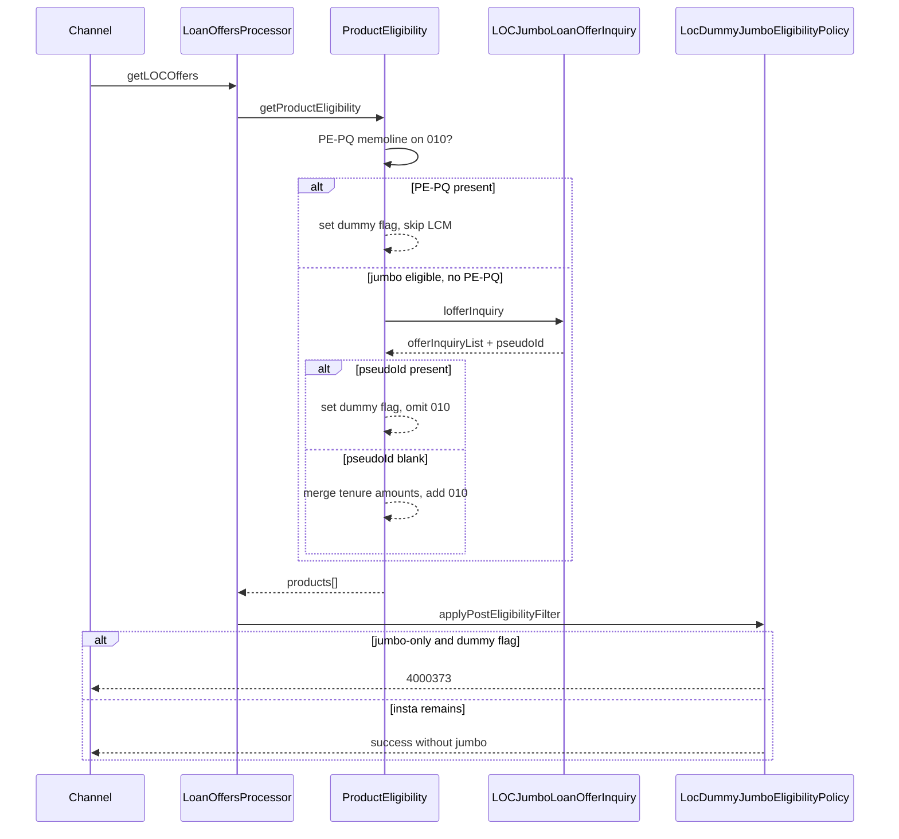

# Jumbo Loan pseudoId restriction plan

**TLDR:** Reuse the existing PE-PQ jumbo suppression pipeline; add one new check after LCM Offer Inquiry reads `pseudoId` from the bank response. No channel-side changes - `getLOCOffers` already orchestrates both APIs.

## Current vs target flow



## Design decisions (locked)

| Decision | Choice |
|----------|--------|
| PE-PQ coexistence | **Stack** - keep [`shouldSkipJumboBlockForDummyEligibility`](c:\Users\ashutosh.kumar\Desktop\novopay\novopay-platform-lib\infra-transaction-hdfc\src\main\java\in\novopay\infra\hdfc\api\loanoncard\ProductEligibilityService.java) as-is |
| Downstream suppression | Reuse `LOC_JUMBO_DUMMY_ELIGIBILITY_ACTIVE` + existing [`LocDummyJumboEligibilityPolicy`](c:\Users\ashutosh.kumar\Desktop\novopay\novopay-platform-creditcard-management\src\main\java\in\novopay\creditcard\loc\util\LocDummyJumboEligibilityPolicy.java) (no new error code) |
| Scope | Jumbo (`010`) only; Insta (`007`) untouched |
| `pseudoId` JSON path | **TBD** - implement parser against a configurable/central constant; confirm path from bank sample before merge |
| LCM API failure | **No change** - keep current `mergeJumboOfferInquiryIntoProduct` fatal wrap; distinct from pseudoId suppression |

## Implementation (lib-first)

### 1. Constants - [`LoanOnCardConst.java`](c:\Users\ashutosh.kumar\Desktop\novopay\novopay-platform-lib\infra-transaction-hdfc\src\main\java\in\novopay\infra\hdfc\api\loanoncard\constants\LoanOnCardConst.java)

Add:

- `LOC_JUMBO_LCM_PSEUDO_ID` - execution-context key for parsed response value (audit/debug)
- Optional audit attr key `loc_jumbo_lcm_pseudo_id` if we want DB traceability (same pattern as `loc_jumbo_dummy_eligibility_active`)

Reuse existing `LOC_JUMBO_DUMMY_ELIGIBILITY_ACTIVE` / `_VALUE` when pseudoId blocks jumbo (same customer outcome as PE-PQ).

### 2. Response template - [`locOfferInquiryOfInstaJumboLoan_responseTemplate.json`](c:\Users\ashutosh.kumar\Desktop\novopay\novopay-platform-creditcard-management\deploy\application\templates\bankIntegrationResponse\product\locOfferInquiryOfInstaJumboLoan_responseTemplate.json)

Add `pseudoId` mapping under the **placeholder path** (default assumption: inside each `offerInquiryList` item, sibling of `tenureWiseOfferList`):

```json
"pseudoId": { "class": "SMPL", "type": "String" }
```

**Pre-merge checklist:** validate against one real UAT/prod LCM response; adjust JSON path if bank places `pseudoId` at `lcmResponseString` root instead.

### 3. LCM service - [`LOCJumboLoanOfferInquiryService.java`](c:\Users\ashutosh.kumar\Desktop\novopay\novopay-platform-lib\infra-transaction-hdfc\src\main\java\in\novopay\infra\hdfc\api\loanoncard\LOCJumboLoanOfferInquiryService.java)

After `doPost` succeeds (`errorCode == "0"`):

1. Extract `pseudoId` from `responseMap` (first non-blank from `offerInquiryList[0]` or root - per confirmed path).
2. `executionContext.put(LOC_JUMBO_LCM_PSEUDO_ID, trimmedValue)`.
3. If `StringUtils.isNotBlank(pseudoId)`:
   - `executionContext.put(LOC_JUMBO_DUMMY_ELIGIBILITY_ACTIVE, LOC_JUMBO_DUMMY_ELIGIBILITY_ACTIVE_VALUE)`
   - Log: jumbo suppressed due to LCM pseudoId
   - **Return early** - do not populate `loan_amounts` / `jumbo_max_loan_amount`
4. If blank/null: continue existing tenure/amount parsing unchanged.

Request side stays `pseudoId=""` (search-by-card criteria unchanged).

### 4. Product eligibility merge - [`ProductEligibilityService.java`](c:\Users\ashutosh.kumar\Desktop\novopay\novopay-platform-lib\infra-transaction-hdfc\src\main\java\in\novopay\infra\hdfc\api\loanoncard\ProductEligibilityService.java)

In `mergeJumboOfferInquiryIntoProduct` after `jumboLoanOfferInquiryService.process()`:

- If `dummyJumboEligibilityPolicy` equivalent check: `LOC_JUMBO_DUMMY_ELIGIBILITY_ACTIVE == Y` (set by LCM step), return `false` immediately.
- This keeps jumbo omission logic in one place even if LCM service sets the flag before amounts are empty.

No change to PE-PQ pre-skip (`shouldSkipJumboBlockForDummyEligibility`).

### 5. CC layer - minimal / optional

[`LoanOffersProcessor.java`](c:\Users\ashutosh.kumar\Desktop\novopay\novopay-platform-creditcard-management\src\main\java\in\novopay\creditcard\loc\processors\LoanOffersProcessor.java) and [`LocDummyJumboEligibilityPolicy.java`](c:\Users\ashutosh.kumar\Desktop\novopay\novopay-platform-creditcard-management\src\main\java\in\novopay\creditcard\loc\util\LocDummyJumboEligibilityPolicy.java) need **no behavioral change** if lib sets the existing dummy flag.

Optional (recommended for ops): persist `LOC_JUMBO_LCM_PSEUDO_ID` in `persistSuccessPathAuditAttributes` / failure path when flag is set - helps distinguish PE-PQ vs pseudoId in MIS.

[`LocAuditContextResolver`](c:\Users\ashutosh.kumar\Desktop\novopay\novopay-platform-creditcard-management\src\main\java\in\novopay\creditcard\constants\LocAuditContextResolver.java) / [`LocCustomerMessageResolver`](c:\Users\ashutosh.kumar\Desktop\novopay\novopay-platform-creditcard-management\src\main\java\in\novopay\creditcard\service\LocCustomerMessageResolver.java) - no change (`4000373` already mapped).

## Tests

### Lib (`novopay-platform-lib`)

| Test | Scenario |
|------|----------|
| New `LOCJumboLoanOfferInquiryServicePseudoIdTest` | pseudoId present → flag set, no `loan_amounts` |
| Same | pseudoId blank → amounts populated, no flag |
| Extend [`ProductEligibilityServiceDummyJumboTest`](c:\Users\ashutosh.kumar\Desktop\novopay\novopay-platform-lib\infra-transaction-hdfc\src\test\java\in\novopay\infra\hdfc\api\loanoncard\ProductEligibilityServiceDummyJumboTest.java) | jumbo eligible, LCM returns pseudoId → products empty, flag set, **LCM was called** (unlike PE-PQ) |
| Same | jumbo + insta eligible, pseudoId present → only `007` in products |

### CC (`novopay-platform-creditcard-management`)

| Test | Scenario |
|------|----------|
| Extend [`LoanOffersProcessorJourneyTest`](c:\Users\ashutosh.kumar\Desktop\novopay\novopay-platform-creditcard-management\src\test\java\in\novopay\creditcard\loc\processors\LoanOffersProcessorJourneyTest.java) | jumbo-only + pseudoId path → `4000373` |
| Same | insta + jumbo, pseudoId path → success with jumbo stripped |
| Existing [`LocDummyJumboEligibilityPolicyTest`](c:\Users\ashutosh.kumar\Desktop\novopay\novopay-platform-creditcard-management\src\test\java\in\novopay\creditcard\loc\util\LocDummyJumboEligibilityPolicyTest.java) | unchanged (already validates flag-driven behavior) |

Run targeted Gradle:

```bash
# lib
./gradlew :infra-transaction-hdfc:test --tests "*ProductEligibilityServiceDummyJumboTest" --tests "*LOCJumboLoanOfferInquiry*"

# cc (composite includeBuild)
./gradlew test --tests "*LoanOffersProcessorJourneyTest" --tests "*LocDummyJumboEligibilityPolicyTest"
```

## Bob / E2E proof (when asked)

Scenarios under `docs/tdd-runs/<ticket-id>/`:

1. Jumbo eligible + LCM pseudoId blank → jumbo shown in `getLOCOffers` response
2. Jumbo eligible + LCM pseudoId present → jumbo hidden; insta journey continues if `007` eligible
3. Jumbo-only + pseudoId present → `4000373`
4. PE-PQ memoline still suppresses without LCM call (regression)

DB verify: `dsa_credit_card_mgmt.transaction_audit_attributes` for `loc_jumbo_dummy_eligibility_active`, optional `loc_jumbo_lcm_pseudo_id`.

## Risk / open item

**`pseudoId` response path is unconfirmed.** Implementation should isolate extraction in a small helper (e.g. `LocJumboLcmPseudoIdParser`) so only template + one method change when bank confirms wire format.

## Repos touched

- **Primary:** `novopay-platform-lib` (`infra-transaction-hdfc`)
- **Secondary:** `novopay-platform-creditcard-management` (response template + optional audit + journey tests)

No orchestration XML change - [`common_loanOnCards.xml`](c:\Users\ashutosh.kumar\Desktop\novopay\novopay-platform-creditcard-management\deploy\application\orchestration\common_loanOnCards.xml) `getLOCOffers` flow unchanged.
