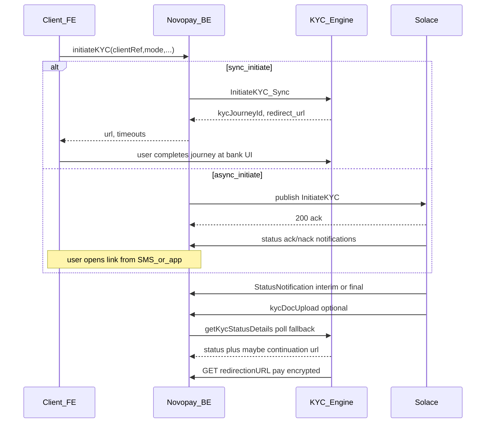

# KYC Engine integration — architecture and implementation plan

## Document inventory and per-file summary (5–6 lines each)

All paths below are under [`c:\Users\ashutosh.kumar\Downloads\KYC Engine`](c:\Users\ashutosh.kumar\Downloads\KYC Engine).

### Folder: `other teams docs`

1. **[`CKYC+Video KYC Flow - Customer onboarding_5Aug25.pptx`](c:\Users\ashutosh.kumar\Downloads\KYC Engine\other teams docs\CKYC+Video KYC Flow - Customer onboarding_5Aug25.pptx)**  
   Slide content describes CKYC routed via the bank KYC engine vs legacy DDP modes (Biometric/FaceAuth/OTP/OVD). Specifies skipping the KYC selection page when CKYC is pre-selected on DDP, and returning the user to DDP on failure or mode change. Covers Hybrid SA/SAL: documents flow back to DDP but VCIP link is not generated from the engine after CKYC. Operational/process oriented, not API-complete.

2. **[`Customer Onboarding Integration of CKYC and Video KYC Ver 1.0.docx`](c:\Users\ashutosh.kumar\Downloads\KYC Engine\other teams docs\Customer Onboarding Integration of CKYC and Video KYC Ver 1.0.docx)**  
   Process note: RBI expectation to offer CKYC on digital onboarding; scope resident individuals/NTB; CKYC via CERSAI with consent; validations on mandatory fields, document expiry (&gt;30 days for DL/Passport), mailing-address confirmation; then VKYC/VCIP with agent rules for non-Aadhaar POI. Includes risk, systems list (Fluttr/Flexcube/WMS/KDR/IDFY), and responsibilities. Same family as v1.1 — treat as superseded for detailed deltas.

3. **[`Customer Onboarding Integration of CKYC and Video KYC Ver 1.1.docx`](c:\Users\ashutosh.kumar\Downloads\KYC Engine\other teams docs\Customer Onboarding Integration of CKYC and Video KYC Ver 1.1.docx)**  
   Same process backbone as v1.0 with expanded risk/MIS/compliance sections (e.g., reputational/vendor data-handling). Reinforces PAN validation before VKYC when PAN captured, CKYC attempts limits, OTP retry rules, and 72-hour VCIP link validity anchored to CKYC OTP validation time. Useful for **business rules** that must align with FE/BE validation; does not replace API specs.

4. **[`Customer Onboarding Integration of CKYC and Video KYC Ver 1.1 (1).docx`](c:\Users\ashutosh.kumar\Downloads\KYC Engine\other teams docs\Customer Onboarding Integration of CKYC and Video KYC Ver 1.1 (1).docx)**  
   Near-duplicate of v1.1 (duplicate file in folder). **GAP:** No “diff” in docs — team must pick a single canonical process version to avoid conflicting sign-off references.

5. **[`image (4).png`](c:\Users\ashutosh.kumar\Downloads\KYC Engine\other teams docs\image (4).png)**  
   Binary image; not interpreted in this pass. **GAP:** If the image contains sequence diagrams or field mappings, content is currently unverified.

6. **[`KYCEngine_DocUpload_APISpecification_v1.1.docx`](c:\Users\ashutosh.kumar\Downloads\KYC Engine\other teams docs\KYCEngine_DocUpload_APISpecification_v1.1.docx)**  
   Defines **async document push** from KYC Engine to the source system (via Solace per “Pass Through – via Solace”): POST to **your** URL; body has `sessionContext` + `responseParam` (`docformat`, `docid`, `doctype`, `poatype` PERMANENT/MAILING, `doccontent` Base64) + `responseStatus`. Success ack: HTTP **200** with **blank body**; HTTP **500** when retry desired — **Solace auto-retry 10 times**. Notes optionality depends on engine configuration (DMS vs source).

7. **[`KYCEngine_getKYCStatusDetails_Sync_APISpecification_v1.2.docx`](c:\Users\ashutosh.kumar\Downloads\KYC Engine\other teams docs\KYCEngine_getKYCStatusDetails_Sync_APISpecification_v1.2.docx)**  
   **Synchronous status inquiry** (`getKycStatusDetails`): HTTPS POST, **timeout 4 sec**, inquiry keys include combinations of `kycJourneyId` + `externalRefNo`, or `strMobNo` + `applicationId`, or `strMobNo` + `dtDateOfBirth`. Response returns rich `responseParam` (addresses split for CKYC vs EKYC/DigiLocker behavior, `kycType`, `kycApplicationStatus`, flags, optional **`url`** continuation link, `responseCode` 0/1). Documents UIDAI/KYC* error messaging pattern.

8. **[`KYCEngine_InitiateKYC_ASync_APISpecification_v2.7 (1).docx`](c:\Users\ashutosh.kumar\Downloads\KYC Engine\other teams docs\KYCEngine_InitiateKYC_ASync_APISpecification_v2.7 (1).docx)**  
   **Async initiation** for offline/LOS-style integrations: publisher posts to **Solace REST** (`https://solaceuat.hbctxdom.com:9449/.../request/gm`), Basic Auth + header `Solace-DMQ-Eligible=true`, timeout **4 sec**. Request mirrors sync JSON (`sessionContext` + large `requestParam`). **Response:** HTTP **200 with blank body** on acceptance; non-200 treated as failure — **source must retry**; detailed errors arrive via **status notification**, not this response. Duplicate filename `(1)` present — **GAP:** confirm baseline version with bank.

9. **[`KYCEngine_InitiateKYC_Sync_APISpecification_v2.9 (1).docx`](c:\Users\ashutosh.kumar\Downloads\KYC Engine\other teams docs\KYCEngine_InitiateKYC_Sync_APISpecification_v2.9 (1).docx)**  
   **Sync initiation**: REST POST to proxy + product-processor UAT URLs in doc; **timeout 4 sec**; HTTPS + IP whitelist + Basic Auth + channel/product validation. Returns `sessionContext` (includes `kycJourneyId`, `nextJourneyStep`) and `responseParam` with **`url`** to open KYC UI, plus `responseStatus` (`responseCode`, `errorCode`, `errorMsg`). Field catalog includes `kycPreferredMode` (CKYC/EKYC/DIGILOCKER), `ckycNo`, `ckycReferenceId`, `redirectionURL`, VKYC-only conditional Aadhaar fields, etc. Error codes **INTF001–INTF003** and KYC* listed.

10. **[`KYCEngine_StatusNotification_Async_APISpecification_v2.6 (1).docx`](c:\Users\ashutosh.kumar\Downloads\KYC Engine\other teams docs\KYCEngine_StatusNotification_Async_APISpecification_v2.6 (1).docx)**  
    **Async interim/final notifications** pushed via Solace to your REST endpoint; payload shape aligns with status result (`sessionContext`, `responseParam`, `responseStatus`). Includes initiation ack sample for async LOS. Consumer must return **200 + blank body**; **500** triggers **Solace retries (10)**. v2.7 also exists — **GAP:** confirm field deltas (v2.7 adds richer CKYC-oriented fields like split doc ids/expiry in prose).

11. **[`KYCEngine_StatusNotification_Async_APISpecification_v2.7.docx`](c:\Users\ashutosh.kumar\Downloads\KYC Engine\other teams docs\KYCEngine_StatusNotification_Async_APISpecification_v2.7.docx)**  
    Same async callback mechanism; explicitly lists **event types**: initiation ack/nack, Aadhaar OTP success/fail, VKYC success/fail, **case expiry**. Payload includes `kycPhoto`, `kycNo`/`kycRefNo` semantics for EKYC vs CKYC, `isResidentForeigner`, `aadhaarExpiryDate`, CKYC POA/POI metadata (`docIdNo1/2`, `kycDoc1Exp`, etc.). Solace IP/port noted (UAT).

12. **[`Redirection_APISpecification_V.2.1.docx`](c:\Users\ashutosh.kumar\Downloads\KYC Engine\other teams docs\Redirection_APISpecification_V.2.1.docx)**  
    **Return redirect** to source: **GET** with `pay` query param; decode Base64 outer wrapper; decrypt inner payload using **source private key** (doc text says SHA256 for encryption — treat as **GAP** vs standard RSA/AES wording; implement per bank crypto spec). Decrypted JSON mirrors KYC result (`sessionContext`, `responseParam`, `responseStatus`). Separate from Solace callbacks — second completion channel.

### Folder: `our docs`

13. **[`EKYC Engine Integration Task Sheet.xlsx`](c:\Users\ashutosh.kumar\Downloads\KYC Engine\our docs\EKYC Engine Integration Task Sheet.xlsx)**  
    Internal WBS: entity/repo/service/DTO layers; bank API integrations for initiate/get status; callbacks `/{tenantCode}/KYCStatusNotification` and `kycDocUpload`; PAN encrypt/decrypt; S3 full JSON; DMS photo/doc upload; geo address mapping; effort hours per row. Useful as **backlog skeleton**, not a normative contract.

14. **[`KYC_API_Specifications.docx`](c:\Users\ashutosh.kumar\Downloads\KYC Engine\our docs\KYC_API_Specifications.docx)**  
    Novopay **Credit Card Management Service** external spec: headers `x-user-Id`, `x-tenant-Code`, `x-stan`. Flow: `/kycController/initiateKYC` → user completes on bank URL → poll `/kycController/getKYCStatus` → bank async `/KYCStatusNotification` + `/kycDocUpload`. **PAN mandatory** (encrypted on wire). `kycPreferredMode`: **EKYC | CKYC | DIGILOCKER**. S3 key `APPLICATION_DATA_{referenceNumber}`; after first success, status served from S3. **Notable rule:** CKYC docs with `docType` prefix `CKYC` blocked in get-status path with FAIL “Ckyc Not Allowed” — conflicts with offering CKYC mode unless removed/refactored. Callback auth: “No x-user-Id / x-stan required”; tenant in path.

---

## STEP 1 — External KYC Engine (from “other teams docs”)

### What the KYC Engine is (IDCOM-like role)

Central **HDFC KYC Engine** orchestrates customer KYC UI and backend steps. It is **not** described under the vendor name “IDCOM” in these files; integrations reference **UIDAI** (Aadhaar OTP), **CERSAI/CKYC**, **DigiLocker**, **IDFY** (Video KYC), and optional **Biometric / Face auth** depending on `prodCd` and channel configuration. It behaves like a **hosted journey + APIs**: your system **initiates**, user is **redirected** (sync) or notified to open a link (async/mobile), engine performs steps, then **status** is retrieved via **sync poll** and/or **async push** (Solace) and/or **encrypted redirect back** to `redirectionURL`.

### Supported KYC types / modes (as named in specs)

- **EKYC** (Aadhaar OTP / UIDAI path — implied by “Aadhar OTP Authentication” and `kycType` EKYC).
- **CKYC** (CERSAI registry — `kycPreferredMode` CKYC; extra CKYC fields in initiate v2.9).
- **DIGILOCKER** (enumerated alongside EKYC/CKYC in initiate field `kycPreferredMode`).
- **BIO** / **FACE** as **product codes** (`prodCd` / channel config) for biometric/face auth steps.
- **VKYC** (Video KYC) appears as a **stage** (IDFY) especially when `prodCd` is VKYC or BOTH-style journeys; status values include `VKYC-COMPLETED` / `VKYC-FAILED`.

**GAP:** Exact matrix of (`channelID`, `prodCd`, `configId`) → allowed modes is **not** in these docs (bank configuration).

### APIs and channels (initiate / callback / poll)

| Mechanism | Direction | Purpose |
|-----------|-----------|---------|
| **InitiateKYC Sync** | You → Engine REST | Get `kycJourneyId` + `url` to open journey |
| **InitiateKYC Async** | You → Solace REST publisher | Enqueue initiation; **blank** 200 ack; errors via notifications |
| **getKycStatusDetails** | You → Engine REST | Poll status; may include continuation `url` |
| **KYC StatusNotification** | Engine (Solace) → your REST | Interim + final events (OTP, VKYC, expiry, etc.) |
| **kycDocUpload** | Engine (Solace) → your REST | Optional pushed identity docs (Base64) |
| **KycengineRedirectiontoSource** | Engine → browser GET your URL | `pay` encrypted payload |

### Authentication / security

- **TLS**, **IP whitelisting**, **HTTP Basic** on initiate sync (sample creds in UAT doc — **not** for production use).
- **Channel ID + product validation** on requests.
- **Payload encryption** for return redirect (`pay`); **your private key** decryption.
- Async Solace path: publisher auth to Solace; callback endpoints described as **no special auth headers** in samples — **GAP:** production mutual-auth / signing not specified here.

### Retry behavior (explicit in docs)

- **Initiate async:** any non-200 to publisher = failure; **client retry** responsibility.
- **StatusNotification & DocUpload consumer:** return **200 + empty body**; return **500** to ask Solace to retry; **Solace auto-retry = 10** (per doc).
- **GAP:** Backoff schedule, idempotency keys, and DLQ handling beyond “10 retries” are **not** specified.

### SLA / timings (only what is stated)

- Multiple services list **HTTP timeout ≈ 4 seconds** (initiate sync/async publisher, get status, notification/doc timeout fields).
- Process note: **72 hours** VCIP link validity relative to CKYC OTP validation timestamp (business SLA for a downstream step, not engine HTTP SLA).
- **GAP:** No document gives p95 completion time, queue latency, or max journey duration except **case expiry** as an event type.

### End-to-end summary (engine-centric)

---

## STEP 2 — Our current system (from “our docs” only)

### Current flow

1. Client calls **`POST /api/v2/kycController/initiateKYC`** with `clientReferenceNumber`, `referenceNumber`, `mobileNumber`, **encrypted `panNo`**, demographics, and **`kycPreferredMode`** ∈ {EKYC, CKYC, DIGILOCKER}.
2. If a KYC record already exists for `clientReferenceNumber`, **cached URL** may be returned without new bank call.
3. Backend decrypts PAN, calls **HDFC initiate**, persists `KycDetailEntity`, sends SMS with link.
4. Client polls **`POST /api/v2/kycController/getKYCStatus`** with `clientReferenceNumber`.
5. If `kycNumber` already populated, **read consolidated JSON from S3** (`APPLICATION_DATA_{referenceNumber}`) and skip bank.
6. Else poll HDFC status API; on success push full JSON to S3; map addresses; handle **EKYC** masked `kycNumber` behavior; special **reject** if CKYC doc types with `CKYC` prefix appear.
7. Async bank callbacks: **`POST /api/v2/{tenantCode}/KYCStatusNotification`** and **`POST /api/v2/{tenantCode}/kycDocUpload`** (no `x-user-Id` / `x-stan`), update DB, DMS uploads, S3 JSON.

### Data model (as per spec)

Table **`kyc_detail`**: `client_reference_number`, `reference_number`, `kyc_journey_id`, `kyc_url`, `kyc_type`, `kyc_number`, `kyc_status`, `status`, `response_description`, `document_type`, `document_id`, `s3_identifier`, `is_kyc_changed`, `next_journey_step`, timestamps.

### Constraints called out in our spec

- **PAN mandatory** on initiate.
- **CKYC blocking rule** in get-status path for certain CKYC document types — conflicts with offering CKYC as preferred mode unless business logic is updated.
- **Tenant** scoping on callbacks via path parameter.

### Limitations of current approach (relative to engine docs)

- Our spec describes **single** bank integration path (REST initiate + REST status + two callbacks). Engine docs additionally define **Solace async initiation**, **interim notifications**, and **encrypted browser redirect** completion — **unclear** which subset HDFC enabled for Novopay (GAP).
- Our callback DTO (`CkycDTO`) must be reconciled with **v2.7 notification** field richness (CKYC doc metadata, photo, foreign resident flags).
- **Security:** callbacks are unauthenticated in our spec; bank docs also show open HTTPS POST — **organizational GAP** to confirm mTLS/HMAC/IP allowlists for production.

---

## STEP 3 — Gap analysis (engine capabilities vs our system)

**Note:** Per tooling constraints, gaps are listed as structured bullets (not a markdown table).

- **Integration mode selection — GAP / decision:** Engine supports **sync REST**, **async Solace initiate**, **Solace push notifications**, and **encrypted redirect**. Our doc only asserts **REST initiate/status** + two callbacks. Need **signed integration pattern** from bank for CCMS.
- **Interim events:** Engine publishes **OTP/VKYC interim** statuses; our client API collapses to **SUCCESS/PENDING/FAIL**. **GAP:** whether FE must show granular progress; may need new fields or webhook to FE.
- **getKycStatus inquiry keys:** Engine allows alternate keys (`mobile`+`DOB`, etc.); our API only accepts `clientReferenceNumber`. **GAP:** internal mapping only vs external API support.
- **Continuation `url`:** Engine status response can return a new `url`; our `getKYCStatus` contract does not expose a **resumed journey link** field to clients.
- **Redirection `pay` decryption:** Not mentioned in our spec; required if bank uses **GET redirect** completion path.
- **CKYC support contradiction:** Our get-status **fails** certain CKYC doc types; product requires **CKYC mode** — **must resolve** before CKYC go-live.
- **Field mapping:** Initiate v2.9 includes many conditional fields (employment, addresses, `ckycNo`, `consentId`, DBT bank fields); our initiate body is **smaller**. **GAP:** which engine fields HDFC mandates for **CCMS channel** / `configId`.
- **Idempotency / dedup:** Solace may retry notifications **10x**; our spec does not define **dedup keys** or outbox pattern.
- **Document upload:** Engine `poatype` (PERMANENT vs MAILING) and `doctype` taxonomy must map to our DMS + `documentType` mapping table; varchar length for `doccontent` in doc looks inconsistent with Base64 — **treat spec as conceptual; confirm max size**.
- **Prod vs UAT endpoints:** Our spec names HDFC generically; engine docs embed **UAT hostnames** — **GAP:** production URLs and credentials distribution.
- **Duplicate document versions in folder:** v2.6 vs v2.7 notifications, duplicate v1.1 — **process GAP:** baseline the version set with bank.

---

## STEP 4 — High-level design (HLD)

### Placement of integration layer

Introduce (conceptually) a **`KycEngineGateway`** inside the backend — the only module allowed to know HDFC/Solace endpoints, credentials, DTO mapping, timeout/retry policy, and correlation IDs (`externalRefNo` ↔ `clientReferenceNumber`, `transactionId` ↔ `referenceNumber` or internal app id). Controllers remain thin; domain service owns state transitions.

### FE–BE–Engine interactions

- **FE** uses existing initiate + poll endpoints; optionally extended for **resume URL**, **granular status**, **mode change**.
- **BE** calls **Sync Initiate** (if that is the chosen pattern) OR **Solace publisher** for async; persists `kyc_journey_id`, `next_journey_step`, raw last request/response metadata (audit — policy permitting).
- **Engine** pushes **StatusNotification** / **DocUpload** to **tenant-scoped** URLs already in our spec; extend handlers to **v2.7** shapes.
- **Polling** `getKycStatusDetails` acts as **reconciliation** when callbacks lag; schedule with backoff capped by `initiateTimeout` / compliance needs.

### Callback handling

- Single **ingress controller** validates TLS + **allowlisted source IPs** / future mTLS; parses payload; dispatches to **state machine** service.
- **Fast 200**: persist event, enqueue async processing (S3/DMS/DB) to meet “blank body 200” expectation and avoid Solace retries due to slow I/O.

### Polling fallback

- Exponential backoff (e.g., start at `retryTimeout` from initiate response if available) until **terminal** `kycApplicationStatus` or **timeout**; jitter to avoid thundering herd; **stop** when S3 snapshot exists with success.

### KYC type change handling

- Engine signals actual mode via `kycType` / `kycApplicationStatus`; our spec already has `isKycChanged`. Rules: if final `kycType` ≠ `kycPreferredMode`, set flag; **re-run** downstream compliance (address source differs CKYC vs EKYC); **do not** silently treat as failure unless business demands.

---

## STEP 5 — Low-level design (LLD)

### 1) DB schema (evolution)

Keep `kyc_detail` baseline from our spec; **add** (conceptual — confirm with DBA):

- `external_ref_no` (if not 1:1 with `client_reference_number`)
- `engine_channel_id`, `engine_prod_cd`, `engine_config_id` (audit/config)
- `last_notification_at`, `last_poll_at`, `callback_delivery_count` (observability)
- `journey_state` (normalized internal enum)
- `resume_url` / `last_engine_url` (encrypted at rest if sensitive)
- `idempotency_key` / `last_solace_message_id` (**GAP:** need bank header if any)
- Optional `raw_last_status_json` (PII risk — prefer object storage with pointer)

### 2) API contracts

**External (client-facing)** — preserve [`KYC_API_Specifications.docx`](c:\Users\ashutosh.kumar\Downloads\KYC Engine\our docs\KYC_API_Specifications.docx) compatibility; **optional vNext** fields:

- `resumeUrl` on `getKYCStatus` when engine returns continuation `url`
- `engineStage` or `kycApplicationStatus` passthrough for UX

**Internal bank-facing** — mirror engine specs:

- Initiate: `sessionContext` + `requestParam` mapping function from our initiate DTO + tenant config
- Status: `getKycStatusDetails` request builder from stored IDs
- Callbacks: **v2.7** `responseParam` superset of current `CkycDTO`

### 3) Service layer structure

- `KycOrchestrationService` — initiate, poll scheduling hooks
- `KycEngineClient` — HTTP/Solace I/O
- `KycCallbackService` — notification/doc upload
- `KycProjectionService` — S3 JSON build/read, address normalizers
- `KycComplianceMapper` — doc type mapping, CKYC rules

### 4) State machine (recommended states)

**Internal `journey_state`:** `INITIATED`, `AWAITING_USER`, `INTERIM_EKYC`, `INTERIM_VKYC`, `COMPLETED`, `FAILED`, `EXPIRED`, `DOC_INGESTED` (parallel sub-state for DMS).  
**Terminal predicates:** derive from `kycApplicationStatus` (`EKYC-COMPLETED`, `*_FAILED`, `KYC-CASE-EXPIRY`, VKYC statuses) + `responseStatus.responseCode`.

### 5) Idempotency for callbacks

- Primary key: (`kyc_journey_id`, `external_ref_no`, **event fingerprint**) where fingerprint = hash of (`kycApplicationStatus`, `kycCompletionDate`, `responseStatus.errorCode`, truncated doc hash for uploads).
- **Outbox pattern:** insert callback row before 200; workers process exactly-once per fingerprint; **Solace 10 retries** become harmless replays.

### 6) Polling logic

- Initial delay: config `retryTimeout` (our initiate already returns string ms)
- Backoff: exponential × jitter, cap at e.g. 5 minutes unless `initiateTimeout` smaller
- Stop conditions: terminal status, **case expiry** event received, or timeout → surface `FAIL`/`PENDING` per product policy
- **Rate:** respect **4s** engine timeout — do not parallel-storm

---

## STEP 6 — Edge cases and failure handling

- **Callback never arrives:** rely on **polling** + **user support playbook**; mark `PENDING` until expiry event or timeout.
- **Duplicate callbacks / Solace retries:** fingerprint idempotency + transactional outbox; always return **200** after durable enqueue.
- **Partial completion (EKYC ok, VKYC pending):** treat as non-terminal; FE continues polling; align with `vKycStatus` fields.
- **User abandons:** `KYC-CASE-EXPIRY` or timeout path; free cached URL policy per business (our initiate caches URL — may trap users — review).
- **KYC type change:** set `isKycChanged`; re-evaluate document acceptance rules; unblock CKYC if old rule deprecated.
- **Timeouts:** engine HTTP 4s — use circuit breaker + alert; distinguish **transport** errors vs **business** `responseCode=1`.

---

## STEP 7 — Task breakdown (sequential, small)

**Backend**

1. Baseline bank doc version set (v2.9 initiate, v1.2 status, v2.7 notification, v1.1 doc upload, v2.1 redirect).
2. Map `CkycDTO` → v2.7 superset; add migration for new persisted fields.
3. Implement `KycEngineClient` (sync initiate + status) with config-driven endpoints.
4. Resolve CKYC blocking rule vs product requirement; update get-status mapper + tests.
5. Harden callbacks: allowlist, payload validation, fast-ack queue, idempotency store.
6. Polling scheduler service + integration with existing `getKYCStatus`.
7. Optional: Solace publisher client for async initiate — **only if** bank confirms pattern.
8. Optional: `pay` redirect decryption endpoint/service — **only if** enabled.
9. Observability: structured logs, correlation IDs, metrics for callback lag.

**Frontend**

1. UX for **CKYC** consent + error paths aligned with process note.
2. Poll cadence driven by `retryTimeout` / `initiateTimeout`.
3. Display non-terminal **VKYC pending** states when exposed by API.
4. Handle **resume URL** if added to API.

**DevOps**

1. Network allowlisting (egress to HDFC, ingress for callbacks).
2. Secret management for Basic Auth / certs / Solace creds.
3. Certificate lifecycle for redirect decryption private key.
4. DLQ/alerting for callback processing failures after idempotency layer.

---

## STEP 8 — Open questions / risks

**Missing info in docs**

- Production endpoints, `channelID` / `prodCd` / `configId` for Novopay CCMS.
- Whether **async Solace** + **sync REST** can both be active for same channel.
- Exact crypto spec for `pay` (doc wording ambiguous).
- Maximum Base64 document size; allowed MIME types beyond examples.
- Whether **`kycPhoto`** will be present and PII retention policy.

**Assumptions (flagged)**

- “HDFC KYC Initiate API” in our spec maps to **Initiate Sync v2.9** shape — **verify**.
- `transactionId` in engine equals our `referenceNumber` or another id — **verify mapping**.

**Risks**

- **Solace retry storms** if handlers slow → must fast-ack with queue.
- **PII duplication** across DB, S3, DMS without retention policy.
- **Contract drift** between v2.6/v2.7 notification versions.
- **CKYC rule contradiction** in current get-status may block go-live.

---

## Addendum — Review of [`our docs`](c:\Users\ashutosh.kumar\Downloads\KYC Engine\our docs) only

### A) Is [`KYC_API_Specifications.docx`](c:\Users\ashutosh.kumar\Downloads\KYC Engine\our docs\KYC_API_Specifications.docx) “correct”? What is missing?

**What reads as internally consistent (for a client-facing CCMS slice)**

- Three-step story (initiate → poll → bank callbacks) matches the **happy path** described in bank specs for sync initiate + status poll + async pushes.
- Headers on client APIs (`x-user-Id`, `x-tenant-Code`, `x-stan`) are defined; callback paths use `{tenantCode}` without those headers, which matches the **pattern** in bank samples (still a **production security GAP** to close with bank).
- S3 keying off `referenceNumber`, and “serve from S3 once `kycNumber` is set” is a coherent performance/cost strategy.
- Document type mapping table for EKYC/CKYC OVDs is helpful for DMS alignment.

**Incorrect / risky relative to bank engine specs (must fix or explicitly scope out)**

- **Internal product contradiction:** `kycPreferredMode` allows **CKYC**, but get-status logic says CKYC doc types prefixed `CKYC` are **blocked** with FAIL — this is not “correct” for a CKYC offering until business rules are rewritten.
- **Callback response body:** bank StatusNotification/DocUpload specs expect **HTTP 200 with blank body** on success; our spec says callbacks **return the received CkycDTO** as acknowledgement. That mismatch can break **Solace retry semantics** and client expectations — align to bank (typically **empty body** after durable accept).
- **Doc upload payload:** HDFC DocUpload v1.1 includes **`poatype`** (PERMANENT vs MAILING). Our spec lists `doccontent`, `docformat`, `doctype`, `docid` only — **missing** `poatype` and any mapping rules to mailing vs permanent storage.
- **Get-status continuation:** bank `getKycStatusDetails` can return a **`url`** to resume the journey; our client contract has **no** `resumeUrl` / continuation field.
- **Interim statuses:** bank async notifications include **interim** events (OTP/VKYC steps, case expiry). Our external API collapses to SUCCESS/PENDING/FAIL — **missing** optional surfacing of `kycApplicationStatus` / stage for UX and ops.
- **Encrypted redirect return path:** bank **Redirection** spec (`pay` query param, private-key decrypt) is **absent** from our API spec; if HDFC enables `redirectionURL` for CCMS, we have **no** documented endpoint or FE flow to consume it.
- **Solace/async initiate:** not mentioned; if CCMS ever uses LOS-style async initiation, our spec does not cover it.
- **Field parity on initiate:** bank Initiate v2.9 has a large conditional `requestParam` (CKYC numbers, consent IDs, RM fields, DBT fields, etc.). Our initiate body is minimal — **not wrong** if bank confirms CCMS only needs the subset, but it is **incomplete** as a bank contract unless explicitly signed off.

**Minor / editorial issues in the doc text**

- Endpoint paths show a stray space: `/api/v2/ kycController/...` should be normalized in the published spec.
- Sample `kycApplicationStatus`: `COMPLETED` vs bank enums like `EKYC-COMPLETED` / `VKYC-COMPLETED` — clarify mapping in the spec to avoid integrator confusion.

---

### B) [`EKYC Engine Integration Task Sheet.xlsx`](c:\Users\ashutosh.kumar\Downloads\KYC Engine\our docs\EKYC Engine Integration Task Sheet.xlsx) — completeness, hours, and 4h chunking

**Parsed rows (TASK | hours)**

| Row | TASK (abridged) | Hrs |
|-----|------------------|-----|
| 2 | EKYC new table creation | 4 |
| 3 | Kyc Entity, Repository, Service, DTO | 4 |
| 4 | DTO/transformers initiate client DTO | 2 |
| 5 | DTO/transformers getKYC client DTO | 2 |
| 6 | DTO/transformers notification callback | 2 |
| 7 | DTO/transformers doc download callback | 2 |
| 8 | DTO/transformers initiate **bank** API | 2 |
| 9 | Integration initiate **bank** API | 6 |
| 10 | New endpoint initiateKYC | 2 |
| 11 | PAN encrypt/decrypt | 1 |
| 12 | Error handling initiate | 2 |
| 13 | DTO/transformers getKYC **bank** API | **(blank — defect)** |
| 14 | Integration getKYC bank API | 6 |
| 15 | New endpoint getKyc | 2 |
| 16 | S3 fetch completed KYC | 4 |
| 17 | Mailing + Aadhaar address via fetchGeo… | 4 |
| 18 | `/{tenant}/KYCStatusNotification` | 2 |
| 19 | Photo base64 → DMS + S3 JSON | 6 |
| 20 | Push full JSON S3 + update entity | 6 |
| 21 | `/{tenant}/kycDocUpload` | 2 |
| 22 | Extract doc fields from CkycDTO | 6 |
| 23 | Upload identity doc DMS | 4 |
| 24 | execute Interface API changes | 3 |

**Sum of hours (as written, treating blank as 0):** 72h. **If row 13 is intended** (mirror row 8): add **2h → 74h** total dev sheet hours.

**Cannot prove estimates are “correct”** from documentation alone; they omit testing/review/infra and several integration gaps. Treat as **initial dev-only** estimates.

**Tasks strictly > 4h — split into groups of 4 + remainder (per your rule)**

- Row 9 **6h** → **4h + 2h** (e.g., “Initiate bank API: core integration” + “edge cases, logging, config”).
- Row 14 **6h** → **4h + 2h** (e.g., “Status poll integration” + “S3 vs API path, failure modes”).
- Row 19 **6h** → **4h + 2h** (e.g., “DMS photo upload + metadata” + “S3 JSON wiring + error handling”).
- Row 20 **6h** → **4h + 2h** (e.g., “S3 push + entity update” + “idempotency / partial callback ordering”).
- Row 22 **6h** → **4h + 2h** (e.g., “Parse doc callback + validation” + “map poatype/doctype + DMS edge cases”).

Rows at **4h** are already compliant with “max 4 per line item” if each row is a single assignable ticket.

**Major items NOT in the task sheet (should be added for a complete delivery)**

- **Idempotency + fast-ack** for Solace retries (10x) on both callbacks.
- **Security hardening:** IP allowlist / mTLS / signing for bank callbacks; secret rotation; **no** sample creds in code.
- **Observability:** metrics, correlation IDs (`externalRefNo`, `kycJourneyId`, `referenceNumber`), dashboards, alerts on callback lag.
- **Config:** `channelId`, `prodCd`, `configId`, timeouts, feature flags per tenant.
- **Optional scope:** Solace async initiate; **GET `pay`** redirect handling; **resumeUrl** exposure on get-status.
- **Data migration / DBA review** for any new columns (beyond “new table”).
- **Frontend** tasks (CKYC UX, polling, interim states) — **zero** FE rows today.
- **DevOps / network** allowlisting, certs for redirect decryption, non-prod environments.
- **Compliance / retention** review for PII in S3/DMS/logs.

**Row quality notes**

- Row 13 is a **spreadsheet defect** (duplicate category to row 8 but hours missing).
- “execute Interface API changes” (3h) is **underspecified** — should name the interface(s) and acceptance criteria.

---

### C) Code review, testing phases, bank UAT, and “code ants” (code quality) effort

Interpreted **“code ants”** as **static analysis / quality gate remediation** (e.g., SonarQube, Codacy, Checkstyle, security scanners) — clarify with the author if a different tool was meant.

**Suggested additional buckets (hours are planning placeholders — calibrate to team velocity)**

Use **74h** as written (or **76h** if row 13 is filled at 2h) as **Dev implementation** baseline.

1. **PR / code review feedback resolution:** **8–16h** (often 10–20% of dev for integrations this size); split tickets as **4h + remainder** where needed.
2. **Developer testing** (unit + integration + local/stub HDFC): **16–24h** (roughly **20–30%** of dev).
3. **QA testing** (functional regression, negative paths, callback replay, concurrency): **24–40h** depends on automation level.
4. **Business UAT** (Novopay product/ops): **1–2 calendar weeks** elapsed typical; **effort** **16–32h** spread across sessions if dedicated testers.
5. **Release engineering + Bank UAT readiness:** infra checklist, smoke in pre-prod, **coordinate bank UAT window** — **8–16h** engineering + **fixed calendar buffer** (see below).
6. **Code quality / Sonar remediation:** **8–12h** baseline for new code; more if security hotspots or coverage gates fail.

**Higher management ↔ bank communication (timing)**

- Bank UAT is usually **calendar-gated**, not “hours-gated.” Recommend management communicate a **target window** only after: (a) QA sign-off on internal env, (b) callbacks verified from bank test IPs, (c) idempotency/load smoke done.
- Practical pattern: **T+0** internal QA complete → **T+1w** Novopay UAT stable → propose **Bank UAT start T+2–3w** (adjust for HDFC change windows). This is a **process recommendation**; the docs do not specify bank UAT lead time.

**Order of operations (sequential)**

Dev complete → self-test → PR review rounds → merge to test env → **QA** → fix cycle → **UAT** → release candidate → **Bank UAT** → production enablement.

---

## Deliverable quality checklist

- All listed files summarized; **PNG not analyzed**; duplicate doc versions noted.
- No code written; architecture and contracts are explicit; **GAPs** separated from decisions.
- **Our docs addendum:** API spec gaps vs bank; task sheet totals/chunking; missing WBS; testing + bank UAT + quality remediation buckets added.
