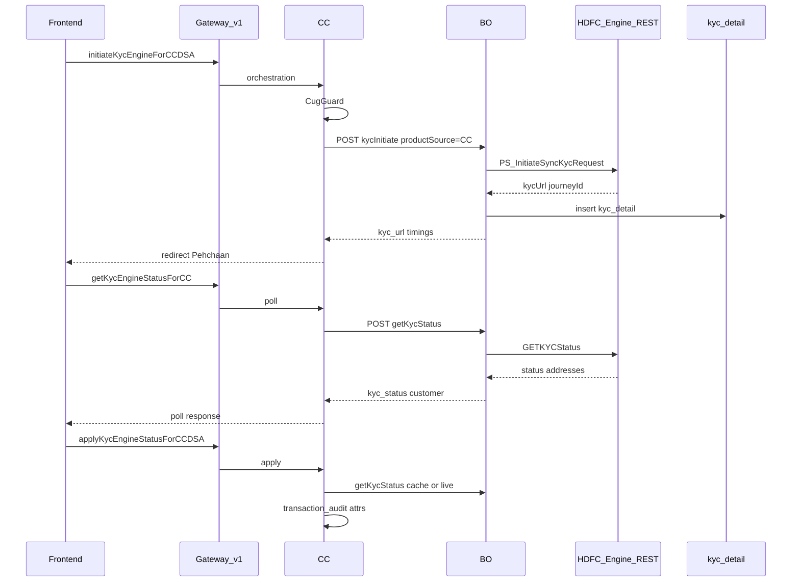
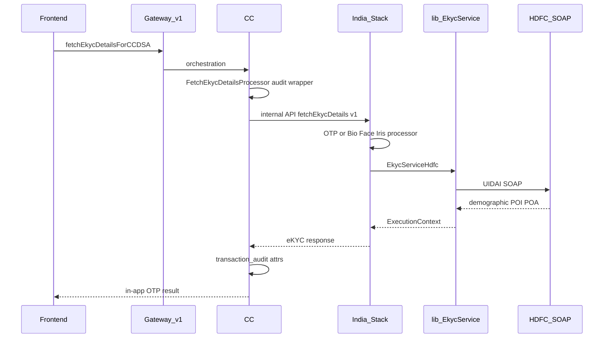
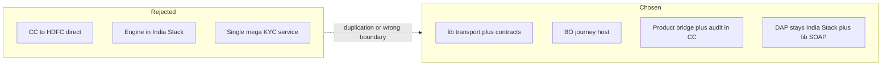
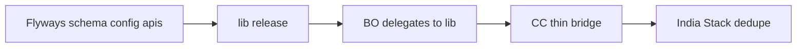
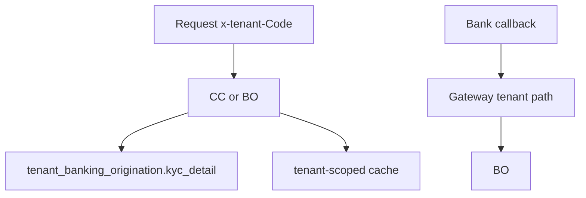
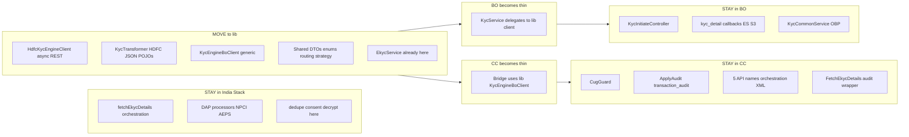

# KYC - CC / BO / lib / India Stack (`ddp-qa` QA)

**TLDR:** QA runs **two KYC paths** - CUG **Engine** (CC→BO→HDFC REST) and legacy **DAP** (CC→India Stack→lib SOAP). Engine code is split across CC+BO today; **platformize HDFC transport + DTOs + product bridge into lib**, keep BO as journey host, India Stack for DAP/NPCI only. CC keeps CUG, APIs, and audit.

**QA:** `np-ddp-qa-app` | gateway `ddp-qa.novopay.in` | test tenant `dsa`

---

## 1. What lives where TODAY (ddp-qa)

```mermaid
flowchart TB
  subgraph CC ["CC creditcard-management"]
    direction TB
    CC_E1["ENGINE: Initiate/Get/Apply processors"]
    CC_E2["ENGINE: KycEngineBridgeService"]
    CC_E3["ENGINE: CugGuard StatusCache ApplyAudit"]
    CC_E4["ENGINE: 5 APIs + orchestration XML"]
    CC_L1["LEGACY: FetchEkycDetailsProcessor wrapper"]
    CC_L2["LEGACY: validateAadhaar wrapper + txn audit"]
    CC_S1["SHARED: EkycAuditMappingService"]
  end

  subgraph BO ["BO banking-origination"]
    direction TB
    BO_E1["ENGINE: KycService + KycTransformer"]
    BO_E2["ENGINE: KycInitiateController REST"]
    BO_E3["ENGINE: kyc_detail DAO + callbacks"]
    BO_E4["ENGINE: ES/S3 APPLICATION_DATA"]
    BO_O1["OBP: KycCommonService SMS geo"]
  end

  subgraph LIB ["lib novopay-platform-lib"]
    direction TB
    LIB_L1["LEGACY: EkycService interface"]
    LIB_L2["LEGACY: EkycServiceHdfc SOAP clients"]
    LIB_L3["LEGACY: WSDLs OTP bio face iris"]
    LIB_P1["PLUMBING: ExecutionContext HttpClient Cache Config"]
    LIB_X["ENGINE: none on ddp-qa"]
  end

  subgraph IS ["India Stack INDIA-STACK"]
    direction TB
    IS_L1["LEGACY: fetchEkycDetails API"]
    IS_L2["LEGACY: OTP Bio Face Iris processors"]
    IS_L3["LEGACY: AbstractEkycProcessor geo SMS"]
    IS_N1["NPCI: doAEPSeKYC executor"]
    IS_X["ENGINE: none"]
  end

  subgraph HDFC ["HDFC bank"]
    HDFC_SOA["SOAP UIDAI DAP"]
    HDFC_ENG["REST KYC Engine Pehchaan"]
    NPCI["NPCI network"]
  end
```

---

## 2. RUNTIME - Engine path CUG (Track B)

**Not in path:** India Stack, lib EkycService

---

## 3. RUNTIME - Legacy DAP path non-CUG

**Not in path:** BO KycService, HDFC Engine REST

---

## 4. Approvals required

### Goal

Enable **new HDFC products/tenants** on KYC Engine with **config + thin product adapters**, not copying `KycService` / bridge code per product.

### Non-goals

| Will not do |
|-------------|
| Products call HDFC Engine REST directly |
| Fold KYC Engine into India Stack |
| Replace BO as journey host (`kyc_detail`, callbacks, ES/S3) |
| Change public CC API names or FE contract during platformization |
| Remove legacy DAP path (`fetchEkycDetails` via India Stack) |

### Alternatives

| Option | Why rejected |
|--------|----------------|
| CC → HDFC direct | Duplicates BO; loses callbacks/idempotency |
| Engine in India Stack | Wrong protocol; IS owns sync DAP/NPCI only |
| One new KYC microservice | Extra deploy surface; BO already hosts journey |

### Deploy order (coordinated)

| Step | Repo | Change |
|------|------|--------|
| 1 | masterdata, initial-setup, BO | configs, api registry, `kyc_detail` schema |
| 2 | lib | DTOs, `HdfcKycEngineClient`, `KycEngineBoClient`, routing strategy |
| 3 | BO | `KycService` delegates; keep REST + persistence |
| 4 | CC | swap bridge to lib client; APIs unchanged |
| 5 | India Stack | consent/decrypt dedupe only |

### Tenant and security (unchanged model)

- No hardcoded `dsa`/`ddp` in KYC Java
- PII/audit: products write own `transaction_audit`; bank callbacks land on BO only

### Risks

| Risk | Mitigation |
|------|------------|
| lib version skew across CC/BO | composite `includeBuild`; release lib first |
| Dual path Engine + DAP forever | config routing per CUG; both paths tested |
| `kyc_detail` schema drift per tenant | single product migration template |
| Refactor breaks QA engine E2E | behavior-neutral phase 1 DTOs; delegate-only phase 2 |

### Success criteria (sign-off when)

- [ ] New product adds **routing strategy + masterdata keys** only (no new BO `if productSource`)
- [ ] Product bridge is **lib `KycEngineBoClient`** with `productSource` param
- [ ] HDFC async I/O lives in **one lib client** (unit-tested)
- [ ] CC public APIs and legacy DAP path **unchanged**
- [ ] QA engine + legacy regression pass on `ddp-qa`

---

## 5. TARGET - what CAN move (future)

---

## 6. Move matrix (one glance)

| Component | Today | Future home |
|-----------|-------|-------------|
| Engine processors + CUG | CC | **CC** |
| Engine bridge HTTP | CC | **lib** `KycEngineBoClient` |
| Engine apply audit | CC | **CC** |
| `KycService` HDFC HTTP | BO | **lib** `HdfcKycEngineClient` |
| `kyc_detail` callbacks | BO | **BO** |
| `KycTransformer` routing | BO | **lib** strategy + config |
| SOAP eKYC transport | lib | **lib** (done) |
| `fetchEkycDetails` orchestration | India Stack | **India Stack** |
| DAP OTP/bio processors | India Stack | **India Stack** |
| `decryptUsingPrivateKey` | CC bean refs IS XML | **India Stack** |
| `CheckIfConsentApproved` | duplicated CC+IS | **India Stack** |

---

## 7. QA blockers (ddp-qa only)

| Item | Status |
|------|--------|
| Gateway APIs `V702135` | 404 until flyway applied |
| BO `V400044` product_source ddp | not on branch |
| Bank status URL from QA host | timeout - use pehchaan-uat2 alternate |

---

## 8. Phases (short)

1. **QA fix** - flyways + status URL
2. **lib** - DTOs + `HdfcKycEngineClient` + `KycEngineBoClient`
3. **BO** - delegate to lib; product routing registry
4. **CC** - thin bridge; keep audit/CUG
5. **India Stack** - dedupe consent/decrypt only
