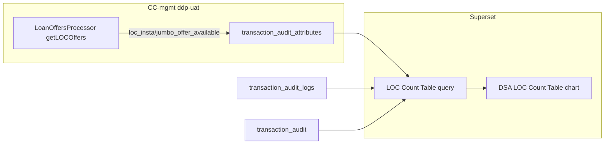

# LOC Admin Portal Count Table (Superset SQL)

## Context

The CC Count Table Superset chart uses a **funnel SQL** (not status buckets). The current LOC query only counts `txn_status` buckets (`PENDING`, `SUCCESS`, etc.) and must be **replaced** with the same funnel shape as CC, plus three new stages.

**CC reference (your query):**

```sql
WITH base AS (
  SELECT ta.id,
    CASE WHEN ta.is_assisted = 'N' THEN 'UNASSISTED' ELSE 'ASSISTED' END AS journey_type,
    CASE WHEN EXISTS (... card_offer_received = 'Y') THEN 1 ELSE 0 END AS offer_available,
    CASE WHEN EXISTS (... state = 'CC_APPLICATION_SUBMIT' AND status = 'SUCCESS') THEN 1 ELSE 0 END AS final_submission,
    CASE WHEN ta.application_status = 'APPROVED' THEN 1 ELSE 0 END AS final_approval
  FROM dsa_credit_card_mgmt.transaction_audit ta
  WHERE DATE(ta.created_on) = CURDATE()
)
-- UNION ALL stages with prev_cnt for Conversion %
```

**LOC gap:** Insta (`007`) vs Jumbo (`010`) offers exist only in the transient `products` list during [`LoanOffersProcessor`](c:\Users\ashutosh.kumar\Desktop\novopay\novopay-platform-creditcard-management\src\main\java\in\novopay\creditcard\loc\processors\LoanOffersProcessor.java). `transaction_audit.product_code` is set at **submit**, not at offer inquiry. Pure SQL cannot split offer types without new persisted attributes.

---

## Stage definitions (LOC)

| Stage | Flag logic | Conversion % denominator (`prev_cnt`) |
|-------|------------|--------------------------------------|
| Total Leads Generated | All LOC rows in date window | Self (always `100%`) |
| Offers Available | Offer inquiry succeeded (see below) | Total leads (`COUNT(*)`) |
| Insta Loan Offers | `loc_insta_offer_available = 'Y'` attribute | Total leads (same as Offers Available) |
| Jumbo Loan Offers | `loc_jumbo_offer_available = 'Y'` attribute | Total leads |
| Insta + Jumbo Loan Offers | Both attributes `Y` | Total leads |
| Final Submission | Submit audit log SUCCESS | `SUM(offer_available)` |
| Final Approval | `txn_status = 'SUCCESS'` | `SUM(final_submission)` |

**Offers Available** (align with [`loc_journey_mis_export.sql`](c:\Users\ashutosh.kumar\Desktop\novopay\trustt-platform-ddp-manual-report-queries\sql\loc\loc_journey_mis_export.sql)):

```sql
CASE
  WHEN ta.txn_result_code IN ('4000359', '4000233', '4000373') THEN 0
  WHEN EXISTS (
    SELECT 1 FROM dsa_credit_card_mgmt.transaction_audit_logs l
    WHERE l.transaction_audit_id = ta.id
      AND l.state IN (
        'inquireCreditCardProductEligibility', 'INQUIRE_CARD_ELIGIBILITY',
        'getLOCOffers', 'GET_LOC_OFFERS'
      )
      AND l.status = 'SUCCESS'
  ) THEN 1
  WHEN EXISTS (
    SELECT 1 FROM dsa_credit_card_mgmt.transaction_audit_attributes a
    WHERE a.transaction_audit_id = ta.id
      AND a.attr_key IN ('tid', 'relation_number')
      AND TRIM(COALESCE(a.attr_value, '')) <> ''
  ) THEN 1
  ELSE 0
END AS offer_available
```

**Final Submission** (LOC uses camelCase bank API states from [`LoanOnCardConst`](c:\Users\ashutosh.kumar\Desktop\novopay\novopay-platform-lib\infra-transaction-hdfc\src\main\java\in\novopay\infra\hdfc\api\loanoncard\constants\LoanOnCardConst.java)):

```sql
CASE WHEN EXISTS (
  SELECT 1 FROM dsa_credit_card_mgmt.transaction_audit_logs l
  WHERE l.transaction_audit_id = ta.id
    AND l.state IN ('submitInstaLoan', 'submitInstaJumboLoan', 'submitLoanOnCards', 'SUBMIT_LOAN_ON_CARD')
    AND l.status = 'SUCCESS'
) THEN 1 ELSE 0 END AS final_submission
```

**Final Approval:** `CASE WHEN ta.txn_status = 'SUCCESS' THEN 1 ELSE 0 END` (LOC does not populate `application_status` like CC; `txn_status` is the boarded/completed signal).

**Filter scope:** Match CC (all assisted + unassisted with breakdown columns). If product wants unassisted-only, add `AND ta.is_assisted = 'N'` to the `base` WHERE (your old LOC query used this filter).

---

## Required backend change (small, CC-mgmt)

Persist offer-type flags in [`LoanOffersProcessor.updateTxnAuditAttr()`](c:\Users\ashutosh.kumar\Desktop\novopay\novopay-platform-creditcard-management\src\main\java\in\novopay\creditcard\loc\processors\LoanOffersProcessor.java) **after** PE-PQ jumbo filter and **only on successful offers path** (post-`enrichProductOffers`, before/after existing `tid`/`relation_number` writes):

- `loc_insta_offer_available` = `Y` if filtered `products` contains `product_code = '007'`
- `loc_jumbo_offer_available` = `Y` if filtered `products` contains `product_code = '010'`

Add constants in [`LoanOnCardConst`](c:\Users\ashutosh.kumar\Desktop\novopay\novopay-platform-lib\infra-transaction-hdfc\src\main\java\in\novopay\infra\hdfc\api\loanoncard\constants\LoanOnCardConst.java) or [`TransactionAuditConstants`](c:\Users\ashutosh.kumar\Desktop\novopay\novopay-platform-creditcard-management\src\main\java\in\novopay\creditcard\constants\TransactionAuditConstants.java).

**Tests:** Extend [`LoanOffersProcessorTest`](c:\Users\ashutosh.kumar\Desktop\novopay\novopay-platform-creditcard-management\src\test\java\in\novopay\creditcard\loc\processors\LoanOffersProcessorTest.java) / audit tests for insta-only, jumbo-only, both, and PE-PQ jumbo-stripped cases.

**Historical data:** Rows before deploy will show `0` for the three new offer-type stages unless backfilled (out of scope unless requested).

---

## Proposed LOC Superset query (Today card)

Replace the existing LOC status-bucket query with:

```sql
WITH base AS (
  SELECT
    ta.id,
    CASE WHEN ta.is_assisted = 'N' THEN 'UNASSISTED' ELSE 'ASSISTED' END AS journey_type,
    CASE
      WHEN ta.txn_result_code IN ('4000359', '4000233', '4000373') THEN 0
      WHEN EXISTS (
        SELECT 1 FROM dsa_credit_card_mgmt.transaction_audit_logs l
        WHERE l.transaction_audit_id = ta.id
          AND l.state IN (
            'inquireCreditCardProductEligibility', 'INQUIRE_CARD_ELIGIBILITY',
            'getLOCOffers', 'GET_LOC_OFFERS'
          )
          AND l.status = 'SUCCESS'
      ) THEN 1
      WHEN EXISTS (
        SELECT 1 FROM dsa_credit_card_mgmt.transaction_audit_attributes a
        WHERE a.transaction_audit_id = ta.id
          AND a.attr_key IN ('tid', 'relation_number')
          AND TRIM(COALESCE(a.attr_value, '')) <> ''
      ) THEN 1
      ELSE 0
    END AS offer_available,
    CASE WHEN EXISTS (
      SELECT 1 FROM dsa_credit_card_mgmt.transaction_audit_attributes a
      WHERE a.transaction_audit_id = ta.id
        AND a.attr_key = 'loc_insta_offer_available'
        AND a.attr_value = 'Y'
    ) THEN 1 ELSE 0 END AS insta_offer,
    CASE WHEN EXISTS (
      SELECT 1 FROM dsa_credit_card_mgmt.transaction_audit_attributes a
      WHERE a.transaction_audit_id = ta.id
        AND a.attr_key = 'loc_jumbo_offer_available'
        AND a.attr_value = 'Y'
    ) THEN 1 ELSE 0 END AS jumbo_offer,
    CASE WHEN EXISTS (
      SELECT 1 FROM dsa_credit_card_mgmt.transaction_audit_attributes a
      WHERE a.transaction_audit_id = ta.id
        AND a.attr_key = 'loc_insta_offer_available' AND a.attr_value = 'Y'
    ) AND EXISTS (
      SELECT 1 FROM dsa_credit_card_mgmt.transaction_audit_attributes a
      WHERE a.transaction_audit_id = ta.id
        AND a.attr_key = 'loc_jumbo_offer_available' AND a.attr_value = 'Y'
    ) THEN 1 ELSE 0 END AS insta_jumbo_offer,
    CASE WHEN EXISTS (
      SELECT 1 FROM dsa_credit_card_mgmt.transaction_audit_logs l
      WHERE l.transaction_audit_id = ta.id
        AND l.state IN ('submitInstaLoan', 'submitInstaJumboLoan', 'submitLoanOnCards', 'SUBMIT_LOAN_ON_CARD')
        AND l.status = 'SUCCESS'
    ) THEN 1 ELSE 0 END AS final_submission,
    CASE WHEN ta.txn_status = 'SUCCESS' THEN 1 ELSE 0 END AS final_approval
  FROM dsa_credit_card_mgmt.transaction_audit ta
  WHERE ta.transaction_sub_type = 'LOC'
    AND DATE(ta.created_on) = CURDATE()
)
SELECT
  stage,
  cnt AS `Count`,
  CASE
    WHEN stage = 'Total Leads Generated' THEN '100%'
    WHEN prev_cnt = 0 THEN '0%'
    ELSE CONCAT(ROUND(cnt * 100 / prev_cnt, 0), '%')
  END AS `Conversion %`,
  Assisted,
  Unassisted
FROM (
  SELECT 'Total Leads Generated' AS stage, COUNT(*) AS cnt, COUNT(*) AS prev_cnt,
    SUM(CASE WHEN journey_type = 'ASSISTED' THEN 1 ELSE 0 END) AS Assisted,
    SUM(CASE WHEN journey_type = 'UNASSISTED' THEN 1 ELSE 0 END) AS Unassisted
  FROM base
  UNION ALL
  SELECT 'Offers Available', SUM(offer_available), COUNT(*),
    SUM(CASE WHEN journey_type = 'ASSISTED' AND offer_available = 1 THEN 1 ELSE 0 END),
    SUM(CASE WHEN journey_type = 'UNASSISTED' AND offer_available = 1 THEN 1 ELSE 0 END)
  FROM base
  UNION ALL
  SELECT 'Insta Loan Offers', SUM(insta_offer), COUNT(*),
    SUM(CASE WHEN journey_type = 'ASSISTED' AND insta_offer = 1 THEN 1 ELSE 0 END),
    SUM(CASE WHEN journey_type = 'UNASSISTED' AND insta_offer = 1 THEN 1 ELSE 0 END)
  FROM base
  UNION ALL
  SELECT 'Jumbo Loan Offers', SUM(jumbo_offer), COUNT(*),
    SUM(CASE WHEN journey_type = 'ASSISTED' AND jumbo_offer = 1 THEN 1 ELSE 0 END),
    SUM(CASE WHEN journey_type = 'UNASSISTED' AND jumbo_offer = 1 THEN 1 ELSE 0 END)
  FROM base
  UNION ALL
  SELECT 'Insta + Jumbo Loan Offers', SUM(insta_jumbo_offer), COUNT(*),
    SUM(CASE WHEN journey_type = 'ASSISTED' AND insta_jumbo_offer = 1 THEN 1 ELSE 0 END),
    SUM(CASE WHEN journey_type = 'UNASSISTED' AND insta_jumbo_offer = 1 THEN 1 ELSE 0 END)
  FROM base
  UNION ALL
  SELECT 'Final Submission', SUM(final_submission), SUM(offer_available),
    SUM(CASE WHEN journey_type = 'ASSISTED' AND final_submission = 1 THEN 1 ELSE 0 END),
    SUM(CASE WHEN journey_type = 'UNASSISTED' AND final_submission = 1 THEN 1 ELSE 0 END)
  FROM base
  UNION ALL
  SELECT 'Final Approval', SUM(final_approval), SUM(final_submission),
    SUM(CASE WHEN journey_type = 'ASSISTED' AND final_approval = 1 THEN 1 ELSE 0 END),
    SUM(CASE WHEN journey_type = 'UNASSISTED' AND final_approval = 1 THEN 1 ELSE 0 END)
  FROM base
) X;
```

**Date variants** (clone per dashboard card, same as CC):

| Card | WHERE clause |
|------|----------------|
| Today | `DATE(ta.created_on) = CURDATE()` |
| Yesterday | `DATE(ta.created_on) = CURDATE() - INTERVAL 1 DAY` |
| This Month | `YEAR(ta.created_on) = YEAR(CURDATE()) AND MONTH(ta.created_on) = MONTH(CURDATE())` |
| From Starting | Remove date filter (or use agreed go-live date) |

---

## Deliverables



1. **Superset** - Paste updated SQL into the four LOC Count Table charts (Today / Yesterday / This Month / From Starting) on the DSA Admin Portal dashboard.
2. **CC-mgmt** (`ddp-uat`) - Persist `loc_insta_offer_available` / `loc_jumbo_offer_available` + unit tests.
3. **Version control** - Add [`trustt-platform-ddp-manual-report-queries/sql/loc/loc_count_table.sql`](c:\Users\ashutosh.kumar\Desktop\novopay\trustt-platform-ddp-manual-report-queries\sql\loc\loc_count_table.sql) with the query and date-variant comments; update README table.

No actor/orchestration/agent-webapp changes (Superset dashboards are listed dynamically via existing [`dsa_superset_orc.xml`](c:\Users\ashutosh.kumar\Desktop\novopay\novopay-platform-actor\deploy\application\orchestration\dsa_superset_orc.xml)).

---

## Verification

1. Run query against DSA DB for a known date with LOC test leads.
2. Confirm stage order and Conversion % math (e.g. Final Submission % = submissions / offers available).
3. After backend deploy, create test leads: insta-only, jumbo-only, both - verify three new rows increment correctly.
4. PE-PQ case: jumbo stripped - expect `insta_offer=Y`, `jumbo_offer` absent, `insta_jumbo_offer=0`.
