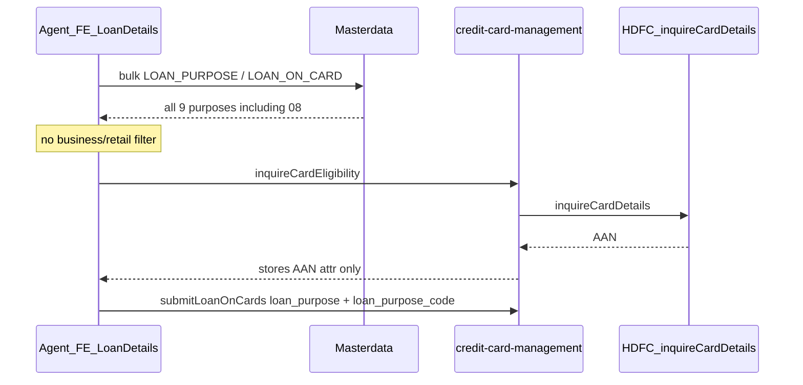

# LOC loan purpose: business vs retail (Plan)

## Requirement (as stated)

- Business cards: show **only** loan purpose `08` / Business Enhancement.
- Non-business (retail) cards: show **all other** purposes (not 08).
- Classify card using **org + logo** from eligibility **AAN** + attached master.
- No new bank API subscription; no UI redesign envisaged.

## Current state (what exists today)

| Area                | Today                                                                                                                                                                                                                                                                                                                                                                  | Gap                                                              |
| ------------------- | ---------------------------------------------------------------------------------------------------------------------------------------------------------------------------------------------------------------------------------------------------------------------------------------------------------------------------------------------------------------------- | ---------------------------------------------------------------- |
| Masterdata purposes | `LOAN_PURPOSE` / `LOAN_ON_CARD` has all 9 codes including `08` Business Enhancement ([V5000060](novopay-platform-masterdata-management/src/main/resources/sql/migrations/dsa/V5000060__loan_purpose_fix.sql), [V5000098](novopay-platform-masterdata-management/src/main/resources/sql/migrations/dsa/V5000098__update_loan_purpose_code.sql))                         | No business vs retail split                                      |
| FE dropdown         | [LoanDetailsScreen.tsx](novopay-platform-agent-webapp/src/components/Screens/Journeys/LOC/LoanDetails/LoanDetailsScreen.tsx) loads full bulk list; [bulkCodeMasterConfig.ts](novopay-platform-agent-webapp/src/constants/apiConstants/bulkCodeMasterConfig.ts) fixed subtype                                                                                           | No filter; `locDataSlice` has no card-category flag              |
| Eligibility AAN     | [InquireCardDetailsService.prepareResponse](novopay-platform-lib/infra-transaction-hdfc/src/main/java/in/novopay/infra/hdfc/api/loanoncard/InquireCardDetailsService.java) puts `aan`; [InquireCardEligibilityProcessor](novopay-platform-creditcard-management/src/main/java/in/novopay/creditcard/loc/processors/InquireCardEligibilityProcessor.java) persists attr | Does not parse org/logo or classify card                         |
| AAN parse           | [AOCCardSummaryService.setCardVariant](novopay-platform-creditcard-management/src/main/java/in/novopay/creditcard/service/AOCCardSummaryService.java) / [CardVariantResolver](novopay-platform-creditcard-management/src/main/java/in/novopay/creditcard/service/CardVariantResolver.java): `indexOf("101")` + next **3** chars = `logo_code` only                     | **org never extracted**; lookup is logo-only                     |
| `logo_master`       | Entity has `org_code`, `logo_code`, `product_type`, `segment`, `variant` ([LogoMaster.java](novopay-platform-creditcard-management/src/main/java/in/novopay/creditcard/entity/LogoMaster.java)); repo methods are logo-only ([LogoMasterRepository](novopay-platform-creditcard-management/src/main/java/in/novopay/creditcard/dao/LogoMasterRepository.java))         | No `findByOrgCodeAndLogoCode`; `product_type` unread in app code |
| Submit              | [SubmitLoanOnCardsProcessor](novopay-platform-creditcard-management/src/main/java/in/novopay/creditcard/loc/processors/SubmitLoanOnCardsProcessor.java) audits `loan_purpose` / `loan_purpose_code`; HDFC uses 2-char purpose code                                                                                                                                     | No business/retail purpose validation                            |

**Stakeholder note (session):** reading `logo_master` from AAN is **already implemented for AOC**; what is missing is **business vs retail** classification for LOC loan purpose.

**What AOC already does (reuse candidate for LOC):**
- Parse AAN: `indexOf("101")` + next 3 chars = `logo_code` (`AOCCardSummaryService.setCardVariant`, `CardVariantResolver`)
- Lookup `logo_master` by `logo_code` (+ Active/Include) - **logo only, not org+logo**
- Use `product_description` as `cardVariant`
- Columns `org_code`, `product_type`, `segment`, `variant` exist on entity but are **not read** for business/retail today

**Still blocking for this story:** which field/value on that same `logo_master` row means Business vs Retail (or whether org must be added to the lookup). If product still insists on org+logo and AOC never uses org, that is a **delta** on top of AOC, not already done.

---

## Where changes would be required (by service)

### 1. `novopay-platform-creditcard-management` (primary)

| What                                                                                                                  | Why                                                                                                             |
| --------------------------------------------------------------------------------------------------------------------- | --------------------------------------------------------------------------------------------------------------- |
| Shared AAN parse helper (new util, reuse from AOC paths)                                                              | Extract **org** and **logo** from eligibility AAN once rules are known                                          |
| `LogoMasterRepository`                                                                                                | Add lookup by **org_code + logo_code** (+ Active/Include if still required)                                     |
| Classification service (new small component)                                                                          | Map logo_master row (or attached master rules) → `BUSINESS` / `RETAIL`                                          |
| `InquireCardEligibilityProcessor` (after successful AAN)                                                              | Classify, persist attrs e.g. `org_code`, `logo_code`, `card_category` (or equivalent)                           |
| Existing response the FE already uses (prefer eligibility / offers / getTransactionDetails - pick one after FE check) | Surface `card_category` (and optionally filtered purpose codes) so dropdown can be scoped **without a new API** |
| `SubmitLoanOnCardsProcessor` (beforeReal / validation)                                                                | Server-side enforce: business → only `08`; retail → reject `08`                                                 |

Optional consistency: align AOC `setCardVariant` / `CardVariantResolver` to org+logo lookup later (out of scope unless logo collisions exist).

### 2. `novopay-platform-lib` / `infra-transaction-hdfc`

| What                                           | Why                                                           |
| ---------------------------------------------- | ------------------------------------------------------------- |
| Likely **no** bank contract change             | Eligibility already returns AAN (`InquireCardDetailsService`) |
| Only if AAN string needs extra response fields | Requirement says use AAN only - prefer no adapter change      |

### 3. `novopay-platform-masterdata-management`

| What                                                                                                                         | Why                                |
| ---------------------------------------------------------------------------------------------------------------------------- | ---------------------------------- |
| Keep single `LOAN_PURPOSE`/`LOAN_ON_CARD` list **or** split subtypes (e.g. `LOAN_ON_CARD_BUSINESS` vs `LOAN_ON_CARD_RETAIL`) | Depends on delivery approach below |
| Possibly seed/flag Business Enhancement isolation                                                                            | Data only if approach B            |

### 4. `novopay-platform-agent-webapp` (almost certainly needed despite "no UI")

| What                                                     | Why                                                                                       |
| -------------------------------------------------------- | ----------------------------------------------------------------------------------------- |
| Filter or switch master subtype for loan purpose options | Today FE always loads full list; dropdown cannot become business-only with zero FE change |
| Read a card-category signal already returned by CC       | Minimal change (no new screen/field)                                                      |

Consents webapp: display-only; no dropdown change expected.

---

## Recommended approach (for Gate 1 decision)

**Goal:** no new bank API; same Loan Details screen/dropdown widget; purpose list differs by card type.

**Recommended (A - flag + FE filter + submit guard):**

1. After inquire eligibility success: parse AAN → org+logo → `logo_master` (composite) → set `card_category`.
2. Return `card_category` on an existing LOC response FE already handles (or add field to an existing template).
3. FE: after bulk fetch, `filter` purposes (`code === '08'` iff BUSINESS; exclude `08` iff RETAIL).
4. Backend submit: reject mismatched purpose (defense in depth).

**Alternative (B - masterdata subtypes):** two `data_sub_type`s; FE picks subtype from `card_category`. Slightly more masterdata migration; still needs FE one-liner + flag.

**Not sufficient alone:**

- Mutating shared `LOAN_ON_CARD` to only `08` would break retail.
- Submit-only validation would leave wrong options visible (fails "show only").

"No UI envisaged" should be read as **no new screens/fields**, not literally zero FE lines. Pure backend-only cannot hide options while FE still calls static bulk masterdata.

---

## Evidence from `LOC APIs mapping v 0.1 (1).xlsx` (Downloads)

Sheets: Header, Inquire_Card_Details, Product_eligibility, Insta/Jumbo Loan, card_summary, Account_Info.

| Open Q                                                              | Helped?              | What it adds                                                                                                                                                                                                                                                                                                                                                                                                                             |
| ------------------------------------------------------------------- | -------------------- | ---------------------------------------------------------------------------------------------------------------------------------------------------------------------------------------------------------------------------------------------------------------------------------------------------------------------------------------------------------------------------------------------------------------------------------------- |
| Org+logo **business/retail master**                                 | **No**               | No org/logo combination list, no product_type=Business rules, no Business Enhancement filter rules                                                                                                                                                                                                                                                                                                                                       |
| Exact AAN layout for org+logo                                       | **Partial only**     | Sample Inquire response AAN: `0001013940000115303` (19 chars). Confirms AAN comes from Inquire_Card_Details and is reused downstream. Does **not** document org vs logo subfields inside AAN. Card_summary says request AAN by **removing first 3 digits** (aligns with existing AOC strip/`101` handling). Product_eligibility has `HIBVPRD-LOGO` (3) marked "No use" for LOC - logo for classify is not from that field for this story |
| Purpose code width                                                  | **Yes (supporting)** | Insta/Jumbo memo: Purpose is **2 chars** (sample `01`) - matches existing `loan_purpose_code` / codes `01`-`09` including `08`                                                                                                                                                                                                                                                                                                           |
| Retail allow-list / FE filter / which API for card_category / scope | **No**               | Not covered                                                                                                                                                                                                                                                                                                                                                                                                                              |

**Conclusion:** this workbook is bank API field mapping (already largely implemented). It **does not replace** the missing org+logo classification master. AAN sample is useful for parse experiments once bank/HDFC confirms org+logo positions.

## Open questions (block Build until answered)

1. **Business vs Retail rule on existing `logo_master` row** - **still blocking**. AOC already loads the row by logo; we never read a business/retail flag. Which column/value? (`product_type`? `segment`? `variant`? free-text in `product_description`? allow-list of logo codes?)
2. **Org in the lookup?** Requirement text said org+logo. AOC today is **logo-only**. Confirm: reuse AOC logo-only lookup, **or** must we add org parsing + `findByOrgCodeAndLogoCode`?
3. **Exact AAN org layout** - only needed if Q2 says org is required. If reuse AOC, we can treat AAN parse as already decided (logo after `101`, 3 chars).
4. **Retail list:** all codes except `08`, or explicit allow-list?
5. **Accept minimal FE filter?** + which existing API returns `card_category`?
6. Scope: DSA agent only, or customer/consent hybrid too?

---

## Suggested Build sequence (after Gate 1 approve + answers)

1. Confirm AAN parse + master match rules; add unit tests with real sample AANs from bank/master.
2. CC: repository + classifier + persist on `InquireCardEligibilityProcessor`.
3. Expose `card_category` on chosen existing API/template.
4. Agent FE: filter loan purpose options (or subtype switch).
5. Submit validation in `SubmitLoanOnCardsProcessor`.
6. Masterdata migration only if approach B.
7. Prove: business AAN → only 08 selectable + submit OK; retail AAN → 08 hidden + submit of 08 rejected.

## Out of scope unless asked

- New bank API / new UI screens
- Reworking AOC logo-only lookups (except if org collision discovered)
- Accounting/webapp `LOAN_PURPOSE`/`DEFAULT` (different product)

