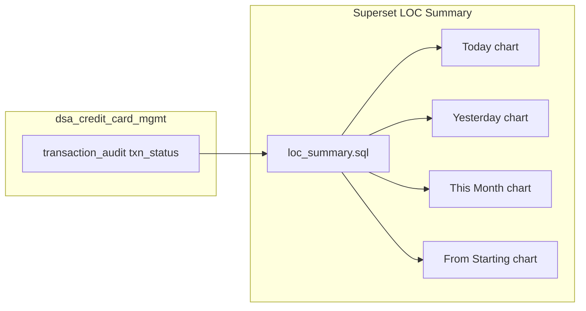

# LOC Admin Portal Summary Tab (Superset SQL)

## How Summary differs from Count Table

| Tab | Purpose | Query shape |
|-----|---------|-------------|
| **Count Table** | Journey funnel + conversion % | Rows: Total Leads, Offers Available, Insta/Jumbo offers, Final Submission, Final Approval ([existing plan](c:\Users\ashutosh.kumar\.cursor\plans\loc_count_table_sql_b6c14e09.plan.md)) |
| **Summary tab** | Application status breakdown | Rows: Pending / Queued / Submitted / Failed / Rejected (+ Total) |

Your existing LOC Superset query is the **Summary** pattern (status buckets), not the Count Table funnel:

```sql
-- Current LOC Summary (Today) - gaps called out below
SELECT
  SUM(CASE WHEN txn_status='PENDING' THEN 1 END) AS Pending_Count,
  SUM(CASE WHEN txn_status='SUCCESS' THEN 1 END) AS Success_Count,
  SUM(CASE WHEN txn_status='REJECTED' THEN 1 END) AS Rejected_Count,
  SUM(CASE WHEN txn_status='FAIL' THEN 1 END) AS Failed_Count,
  COUNT(*) AS Total_Count
FROM dsa_credit_card_mgmt.transaction_audit
WHERE transaction_sub_type = 'LOC' AND is_assisted='N' AND DATE(created_on)= CURDATE()
```

The Count Table plan **replaces** a copy of this query on the wrong chart. Summary tab keeps status buckets but must be **corrected and expanded** to match CC + backend semantics.

---

## Source of truth: backend bucket logic

Agent resume API and home dashboard use the same counts from [`TransactionListLOCRowMapper.COUNT_QUERY`](c:\Users\ashutosh.kumar\Desktop\novopay\novopay-platform-creditcard-management\src\main\java\in\novopay\creditcard\dao\TransactionListLOCRowMapper.java):

| UI label (CC agent) | LOC `txn_status` | Notes |
|---------------------|------------------|-------|
| Pending Applications | `PENDING` | |
| Queued Applications | `HYBRID` | Missing from current LOC Superset query |
| Submitted Applications | `SUCCESS` | Current query uses `Success_Count` |
| Failed Applications | `FAIL`, `EXPIRED` | Current query counts `FAIL` only |
| Rejected Applications | `REJECTED` | No-offers / policy reject path |

Processor: [`GetLoanOnCardTransactionHistoryProcessor`](c:\Users\ashutosh.kumar\Desktop\novopay\novopay-platform-creditcard-management\src\main\java\in\novopay\creditcard\loc\processors\GetLoanOnCardTransactionHistoryProcessor.java) exposes `number_of_pending/success/fail/rejected/queued_records`.

**CC Summary reference (agent webapp):** [`CCHomeScreen.tsx`](c:\Users\ashutosh.kumar\Desktop\novopay\novopay-platform-agent-webapp\src\components\Dashboard\CreditCard\CCHomeScreen.tsx) shows all 5 buckets on the SUMMARY tab. LOC [`LOCHomeScreen.tsx`](c:\Users\ashutosh.kumar\Desktop\novopay\novopay-platform-agent-webapp\src\components\Dashboard\LoanOnCard\LOCHomeScreen.tsx) has no SUMMARY tab (only status chips on list tabs; QUEUED commented out).

---

## Gaps in current LOC Summary Superset query

1. **Missing Queued** - `txn_status = 'HYBRID'` not counted (CC Summary includes it).
2. **Failed under-counts** - must include `EXPIRED` (backend list + count both treat EXPIRED as failed).
3. **Unassisted-only filter** - `is_assisted='N'` drops assisted journeys; CC Count Table includes both with Assisted/Unassisted columns. Summary should match CC unless product confirms unassisted-only.
4. **Wide column layout** - harder to mirror CC admin table UX; prefer **row layout** (`status`, `Count`, `Assisted`, `Unassisted`) like Count Table without Conversion %.
5. **Label mismatch** - use `Submitted` (not `Success`) to align with CC/agent wording.

**No backend code change required** for Summary - all flags come from `transaction_audit.txn_status` and `is_assisted`.

---

## Proposed LOC Summary Superset query (Today card)

Row-based format (recommended for Superset table chart parity with CC admin):

```sql
WITH base AS (
  SELECT
    ta.id,
    ta.txn_status,
    CASE WHEN ta.is_assisted = 'N' THEN 'UNASSISTED' ELSE 'ASSISTED' END AS journey_type
  FROM dsa_credit_card_mgmt.transaction_audit ta
  WHERE ta.transaction_sub_type = 'LOC'
    AND DATE(ta.created_on) = CURDATE()
)
SELECT
  status AS stage,
  cnt AS `Count`,
  assisted_cnt AS Assisted,
  unassisted_cnt AS Unassisted
FROM (
  SELECT 'Pending Applications' AS status,
    SUM(CASE WHEN txn_status = 'PENDING' THEN 1 ELSE 0 END) AS cnt,
    SUM(CASE WHEN txn_status = 'PENDING' AND journey_type = 'ASSISTED' THEN 1 ELSE 0 END) AS assisted_cnt,
    SUM(CASE WHEN txn_status = 'PENDING' AND journey_type = 'UNASSISTED' THEN 1 ELSE 0 END) AS unassisted_cnt
  FROM base
  UNION ALL
  SELECT 'Queued Applications',
    SUM(CASE WHEN txn_status = 'HYBRID' THEN 1 ELSE 0 END),
    SUM(CASE WHEN txn_status = 'HYBRID' AND journey_type = 'ASSISTED' THEN 1 ELSE 0 END),
    SUM(CASE WHEN txn_status = 'HYBRID' AND journey_type = 'UNASSISTED' THEN 1 ELSE 0 END)
  FROM base
  UNION ALL
  SELECT 'Submitted Applications',
    SUM(CASE WHEN txn_status = 'SUCCESS' THEN 1 ELSE 0 END),
    SUM(CASE WHEN txn_status = 'SUCCESS' AND journey_type = 'ASSISTED' THEN 1 ELSE 0 END),
    SUM(CASE WHEN txn_status = 'SUCCESS' AND journey_type = 'UNASSISTED' THEN 1 ELSE 0 END)
  FROM base
  UNION ALL
  SELECT 'Rejected Applications',
    SUM(CASE WHEN txn_status = 'REJECTED' THEN 1 ELSE 0 END),
    SUM(CASE WHEN txn_status = 'REJECTED' AND journey_type = 'ASSISTED' THEN 1 ELSE 0 END),
    SUM(CASE WHEN txn_status = 'REJECTED' AND journey_type = 'UNASSISTED' THEN 1 ELSE 0 END)
  FROM base
  UNION ALL
  SELECT 'Failed Applications',
    SUM(CASE WHEN txn_status IN ('FAIL', 'EXPIRED') THEN 1 ELSE 0 END),
    SUM(CASE WHEN txn_status IN ('FAIL', 'EXPIRED') AND journey_type = 'ASSISTED' THEN 1 ELSE 0 END),
    SUM(CASE WHEN txn_status IN ('FAIL', 'EXPIRED') AND journey_type = 'UNASSISTED' THEN 1 ELSE 0 END)
  FROM base
  UNION ALL
  SELECT 'Total Applications',
    COUNT(*),
    SUM(CASE WHEN journey_type = 'ASSISTED' THEN 1 ELSE 0 END),
    SUM(CASE WHEN journey_type = 'UNASSISTED' THEN 1 ELSE 0 END)
  FROM base
) X;
```

**Alternative wide format** (if Superset chart already bound to column names - minimal edit of your query):

```sql
SELECT
  SUM(CASE WHEN ta.txn_status = 'PENDING' THEN 1 ELSE 0 END) AS Pending_Count,
  SUM(CASE WHEN ta.txn_status = 'HYBRID' THEN 1 ELSE 0 END) AS Queued_Count,
  SUM(CASE WHEN ta.txn_status = 'SUCCESS' THEN 1 ELSE 0 END) AS Submitted_Count,
  SUM(CASE WHEN ta.txn_status = 'REJECTED' THEN 1 ELSE 0 END) AS Rejected_Count,
  SUM(CASE WHEN ta.txn_status IN ('FAIL', 'EXPIRED') THEN 1 ELSE 0 END) AS Failed_Count,
  COUNT(*) AS Total_Count
FROM dsa_credit_card_mgmt.transaction_audit ta
WHERE ta.transaction_sub_type = 'LOC'
  AND DATE(ta.created_on) = CURDATE();
```

Add `AND ta.is_assisted = 'N'` only if CC Summary Superset chart also filters unassisted-only (verify against CC Summary query in Superset before applying).

---

## Date variants (four dashboard cards)

Same pattern as Count Table - swap only the date predicate in `base` WHERE:

| Card | Filter |
|------|--------|
| LOC - Today's DATA | `DATE(ta.created_on) = CURDATE()` |
| LOC - Yesterday's DATA | `DATE(ta.created_on) = CURDATE() - INTERVAL 1 DAY` |
| LOC - This Month's DATA | `YEAR(ta.created_on) = YEAR(CURDATE()) AND MONTH(ta.created_on) = MONTH(CURDATE())` |
| LOC - DATA From Starting | No date filter (or agreed LOC go-live date) |

---

## CC Summary alignment checklist

When editing Superset, pull the **CC Summary tab query** from Superset UI and mirror:

- Row labels and order (Pending, Queued, Submitted, Rejected, Failed, Total)
- Whether Assisted / Unassisted columns exist
- Whether `is_assisted` filter is applied at dataset level
- Chart type (Superset table vs pivot)

CC backend uses different status semantics (`txn_status='NA'` + `cc_additional_txn_data`) - **do not copy CC SQL literally**; only mirror **presentation and filters**, using LOC `txn_status` mapping above.

---

## Optional: agent webapp parity (out of Superset scope)

If product also wants agent portal parity (not Admin Portal):

- Add `SUMMARY` tab to [`LOCHomeScreen.tsx`](c:\Users\ashutosh.kumar\Desktop\novopay\novopay-platform-agent-webapp\src\components\Dashboard\LoanOnCard\LOCHomeScreen.tsx) mirroring CC "Application Summary" panel
- Re-enable `QUEUED` chip (currently commented out ~line 1032)
- Include `QUEUED` in [`Dashboard.tsx`](c:\Users\ashutosh.kumar\Desktop\novopay\novopay-platform-agent-webapp\src\components\Dashboard\Dashboard.tsx) LOC home card counts

Backend already returns all five counts via `getLoanOnCardTransactionHistory` with `status_list: ["SUMMARY"]`.

---

## Deliverables



1. **Superset** - Update four LOC Summary tab charts with corrected SQL (row format recommended).
2. **Version control** - Add [`trustt-platform-ddp-manual-report-queries/sql/loc/loc_summary_tab.sql`](c:\Users\ashutosh.kumar\Desktop\novopay\trustt-platform-ddp-manual-report-queries\sql\loc\loc_summary_tab.sql) + README entry.
3. **Cross-check** - Run Summary and Count Table queries for same date; `Total Applications` in Summary should equal `Total Leads Generated` in Count Table (both count LOC rows in window).

**No CC-mgmt Java changes** for Summary tab alone. Count Table offer-type attributes from the other plan are unrelated to Summary buckets.

---

## Verification

1. Pick a date with known LOC leads in each status (`PENDING`, `HYBRID`, `SUCCESS`, `REJECTED`, `FAIL`, `EXPIRED`).
2. Compare Superset Summary output to `getLoanOnCardTransactionHistory` API counts for same `actor_id`/date (agent resume).
3. Confirm `Failed` includes `EXPIRED` rows.
4. Confirm `Total` equals sum of mutually exclusive statuses (every LOC row should be in exactly one primary bucket; `Total` is all rows regardless of status).
5. If RLS is enabled via [`GetGuestTokenFromSupersetDsaProcessor`](c:\Users\ashutosh.kumar\Desktop\novopay\novopay-platform-actor\src\main\java\in\novopay\actor\superset\GetGuestTokenFromSupersetDsaProcessor.java), validate hierarchy-scoped counts match expectations for a DSA admin login.
