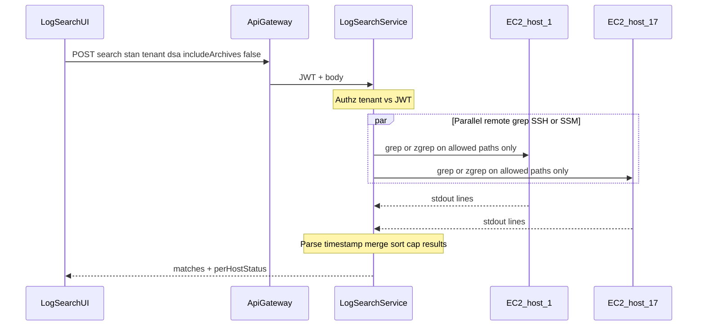
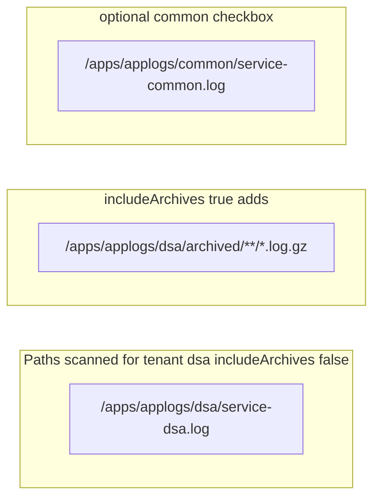

# Novopay Log Search - Revised Plan (grep-first)

## Is the 17-agent architecture worth it?

**Short answer: probably not for your usage.**

| Approach | When it makes sense | Your case |
|----------|---------------------|-----------|
| `grep -Rin` on one box | All logs on one host/NFS | No - logs are per EC2 |
| SSH loop + grep on 17 hosts | Occasional RCA, ops-comfortable with shell | **Best starting point** |
| Thin service + remote grep (SSM/SSH) | Want UI + auth, still occasional use | **Recommended target** |
| Log Agent JVM on every EC2 | SSH blocked, strict mTLS, no shell on hosts | Only if grep-remote fails policy |
| ELK / Loki / CloudWatch | High volume, analytics, tail-follow | Overkill (&lt;1GB/day) |

The agent design from the AI draft is **grep-as-a-service spread across 17 JVMs**. It solves the same problem as:

```bash
# Per host (what actually finds lines)
grep -Rin --include='*.log' 'YOUR_STAN' /apps/applogs/dsa /apps/applogs/common
zgrep -in 'YOUR_STAN' /apps/applogs/dsa/archived/archived-logs-*/*/*.log.gz  # archives only when needed
```

The hard part is **not grep** - it is **fan-out to 17 machines** and **giving support a UI**. A single small `log-search-service` that runs grep remotely (SSH or AWS SSM Run Command) is enough unless infra forbids shell access on EC2s.

**Do not deploy 17 Spring Boot agents unless you prove SSH/SSM grep is blocked or too brittle.**

---

## When logs go to archive (from codebase)

From [`log4j2-spring.xml`](C:/Users/ashutosh.kumar/Desktop/novopay/novopay-platform-creditcard-management/deploy/application/log/log4j2-spring.xml) and [`log4j2-routing-appender.xml`](C:/Users/ashutosh.kumar/Desktop/novopay/novopay-platform-creditcard-management/deploy/application/log/log4j2-routing-appender.xml) (same pattern across ~18 services):

**Rollover triggers (either one fires):**
1. **Daily** - `TimeBasedTriggeringPolicy` with no `interval` = rollover at **midnight** (calendar day boundary)
2. **Size** - `SizeBasedTriggeringPolicy size="100 MB"` - rollover when active file exceeds 100MB (can happen same day)

**Active file (search here first):**
```
/apps/applogs/{tenant}/{service-name}-{tenant}.log
/apps/applogs/common/{service-name}-common.log
```

**Archive destination after rollover:**
```
/apps/applogs/{tenant}/archived/archived-logs-{yyyy-MM}/{service-name}/{yyyy-MM-dd}-{service-name}-{tenant}-{i}.log.gz
```

**Retention / deletion:**
- Tenant + common `.log.gz` archives: **no auto-delete** in config (`DefaultRolloverStrategy nomax="true"` or `max="1000000"`) - ops must clean disk
- **ECS JSON logs only** (`LOG_APPENDER_TYPE=ecs`): delete after **7 days** via `IfLastModified age="7d"` - not the main file appenders

**Implication for search:**
- Same-day / recent STAN: active `*.log` under tenant folder is enough
- Yesterday or older (after midnight rollover): lines may be **only** in `archived/.../*.log.gz`
- Busy service hitting 100MB: archive can appear **within the same day**
- UI should default to **active logs only**; **"Include archives"** checkbox runs `zgrep` on `archived/**/*.log.gz` when user needs it

---

## Tenant scope - do not search all tenants

A single API flow uses **one tenant** (MDC `tenant` from request). Gateway, actor, CC, etc. all log into that tenant's folder for that request.

**Wrong:** always scan `dsa`, `ddp`, `bb`, `kp`, `ra`, `rbg`, `common`.

**Right:**
- UI: **tenant required** (single select or small multi-select when user knows cross-tenant batch ran)
- Default tenant from **JWT** (`ROLE_TENANT_DSA` etc.) - not "all"
- Always offer **`common`** as optional add-on (shared services / fallback when MDC tenant missing)
- Authz: server intersects requested tenants with JWT - never grep folders user cannot access

Example DSA flow search paths on each host:
```
/apps/applogs/dsa/{service}-dsa.log
/apps/applogs/dsa/archived/...   # only if includeArchives=true
/apps/applogs/common/{service}-common.log   # optional checkbox
```

---

## Current state

**Log layout** (`NOVOPAY_LOG_HOME=/apps/applogs` on server):

```
/apps/applogs/
├── common/{service}-common.log
├── dsa/{service}-dsa.log
├── ddp|bb|kp|ra|rbg/...
├── perf/{service}-perf.log
└── {tenant}/archived/archived-logs-{yyyy-MM}/{service}/*.log.gz
```

**STAN** in every standard line (7th bracket field):

```
[ts] [service] [LEVEL] [logger] [tenant] [api-name] [STAN] [user-id] message
```

**Deployment:** 1 service per EC2; each host has only **its** `{service}-{tenant}.log` files.

**Gap:** API Gateway missing `deploy/application/log/log4j2-spring.xml` in repo - gateway may not log in standard paths.

---

## Recommended architecture (grep under the hood)





**One JVM** (`log-search-service`) + **React UI**. No per-EC2 agent unless SSH/SSM is rejected.

---

## Implementation phases

### Phase 1 - Prove remote grep (1-2 days)

Bash/Ansible POC on QA:

```bash
STAN="1719231330123"
TENANT="dsa"
HOSTS=(ec2-cc ec2-gateway ...)  # 17 hosts

for h in "${HOSTS[@]}"; do
  ssh "$h" "grep -in --include='${SERVICE}-${TENANT}.log' '${STAN}' /apps/applogs/${TENANT}/ 2>/dev/null" &
done
wait
```

With archives:

```bash
ssh "$h" "zgrep -in '${STAN}' /apps/applogs/${TENANT}/archived/archived-logs-*/*/*.log.gz 2>/dev/null"
```

Validate: latency, SSH access, STAN hit rate on active vs archive.

### Phase 2 - log-search-service (thin wrapper)

Single Spring Boot service:

| Responsibility | Implementation |
|----------------|----------------|
| Input validation | STAN alphanumeric only - **never** interpolate into `sh -c` |
| Remote exec | `ProcessBuilder` fixed args OR AWS SSM `send-command` with parameterized document |
| Fan-out | `ExecutorService` parallel 17 hosts, 5s timeout each |
| Parse lines | Novopay bracket regex for timestamp/level; raw line as snippet |
| Merge | Sort by parsed time desc, cap 500-2000 |
| Authz | JWT tenant roles |
| Audit | Log who searched which STAN |

**Request body:**

```json
{
  "stan": "1719231330123",
  "tenant": "dsa",
  "includeCommon": false,
  "includeArchives": false,
  "services": ["credit-card-management", "api-gateway"]
}
```

`services` optional - default all 17; filters which hosts to query.

### Phase 3 - React UI

- STAN (required)
- Tenant dropdown (required, JWT default)
- Checkboxes: Include common, Include archives
- Optional service multi-select
- Results table + "host unreachable" banner

Gateway route: `POST /api/v1/logs/search`

### Phase 4 - Optional hardening

Only if needed:
- Replace SSH with **SSM Run Command** (no open SSH, IAM-based)
- Add per-EC2 **log-agent** if security policy forbids any remote shell
- API Gateway log4j2 alignment
- Rate limit (10 searches/min/user)

---

## What we are NOT building

- 17 JVM log agents (unless Phase 1 POC fails policy)
- Elasticsearch / Loki / CloudWatch Insights
- Always scanning all tenant folders
- Always scanning archives (opt-in only)

---

## Success criteria

- User picks **one tenant** (e.g. dsa), enters STAN, gets cross-service timeline in ~3s
- "Include archives" finds STAN from yesterday after daily rollover
- DSA user cannot grep `ddp/` paths
- No shell injection - STAN validated before any remote command
- Works without new processes on every EC2

---

## Decision summary

| Question | Answer |
|----------|--------|
| Is grep enough? | **Yes** - the search mechanism is grep/zgrep |
| Is 17-agent architecture worth it? | **No** for occasional debugging - too much ops overhead |
| Search all tenants? | **No** - user/JWT picks tenant; common optional |
| When archives? | **Midnight rollover OR 100MB**; search archives only when checkbox on |
| What to build? | **UI + thin aggregator + remote grep** |
