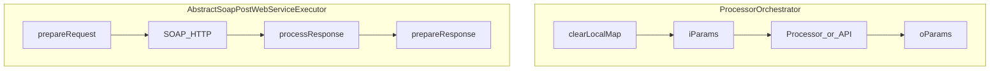

# SKILL.md for novopay-platform-lib

The following is the **complete deliverable** to save as [`SKILL.md`](SKILL.md) at the repository root (file does not exist yet). It is grounded in: [`settings.gradle`](settings.gradle), [`build.gradle`](build.gradle), [`infra-platform/.../ExecutionContext.java`](infra-platform/src/main/java/in/novopay/infra/platform/navigation/ExecutionContext.java), [`DefaultExecutionContext.java`](infra-platform/src/main/java/in/novopay/infra/platform/navigation/DefaultExecutionContext.java), [`ThreadLocalContext.java`](infra-platform/src/main/java/in/novopay/infra/platform/core/ThreadLocalContext.java), [`ProcessorOrchestrator.java`](infra-navigation/src/main/java/in/novopay/infra/navigation/orchestrator/ProcessorOrchestrator.java), [`AbstractProcessor.java`](infra-platform/src/main/java/in/novopay/infra/platform/navigation/AbstractProcessor.java), [`AbstractSoapWebServiceExecutor.java`](infra-transaction-interface/src/main/java/in/novopay/infra/core/AbstractSoapWebServiceExecutor.java), [`AbstractSoapPostWebServiceExecutor.java`](infra-transaction-interface/src/main/java/in/novopay/infra/core/AbstractSoapPostWebServiceExecutor.java), [`NovopayInternalAPIClient.java`](infra-api-client/src/main/java/in/novopay/infra/api/client/NovopayInternalAPIClient.java), [`MasterDataValueValidator.java`](infra-masterdata/src/main/java/in/novopay/infra/masterdata/validator/MasterDataValueValidator.java), [`ExecuteInterfaceRequestDsaService.java`](infra-transaction-hdfc/src/main/java/in/novopay/infra/hdfc/api/dapservice/service/ExecuteInterfaceRequestDsaService.java), [`ExecuteInterfaceRequestService.java`](infra-transaction-hdfc/src/main/java/in/novopay/infra/hdfc/api/dapservice/service/ExecuteInterfaceRequestService.java) (pattern), [`HeadersV1.java`](infra-transaction-internal-interface/src/main/java/in/novopay/infra/transaction/internal/util/HeadersV1.java), [`NovopayAPIConstants.java`](infra-platform/src/main/java/in/novopay/infra/platform/constants/NovopayAPIConstants.java), [`HTTPHeaderConstants.java`](infra-platform/src/main/java/in/novopay/infra/platform/constants/HTTPHeaderConstants.java).

---

```markdown
# Novopay Platform Library — Backend Test & Development Skill

## 1. Name + Description

**Name:** `novopay-platform-lib` (Novopay infra platform Java library)

**Description:** Multi-module Gradle library providing shared infrastructure: `ExecutionContext` request orchestration, navigation/orchestration (`ProcessorOrchestrator`), SOAP/HTTP bank connectors (notably HDFC SOA/DAP), internal JSON API client (`NovopayInternalAPIClient`), masterdata-backed validators, notifications, caching, and adapters. Use this skill to author **unit**, **integration**, **journey/flow**, and **contract** tests that respect real execution order, context scoping, and bank-side error semantics.

## 2. When To Use

- Implementing or testing any **processor**, **validator**, **SOAP service**, or **internal API** flow in this repo.
- Debugging **wrong order** of steps, **missing context keys**, or **tenant/config** resolution issues.
- Building tests for **HDFC DAP / CRM / eKYC** services where fillers, partner variables, and IP fields are easy to get wrong.
- Aligning FE payloads with **BE expectations** (`HeadersV1`, `client_ip`, masterdata code/value pairs).

## 3. Inputs Required

| Input | Purpose |
|-------|---------|
| **Target class** under test | Service, processor, or executor name |
| **Orchestration XML** (consumer app, not always in this repo) | Processor order, `iParam`/`oParam`, control flags — verify if present |
| **JSON templates** (JTF / Redis or filesystem) | Request/response shape for `NovopayInternalAPIClient` |
| **Masterdata** keys | When `MasterDataValueValidator` or DTO mapping uses coded fields |
| **Config keys** (`@NovopayConfig`, `ConfigValueUtil`) | URLs, timeouts, patterns like `novopay.ip.pattern` |

**Docs path concept:** There is **no single `docs/` API spec** in-repo; treat **Java sources**, **`build.gradle`**, and **consumer ORC/XML + JTF templates** (outside this repo) as authoritative for end-to-end contracts.

## 4. Operating Modes

### Bug Fix Mode
1. Reproduce with **minimal `DefaultExecutionContext` map** (see §11).
2. Confirm **which layer** throws (`NovopayFatalException` vs `NovopayNonFatalException`).
3. For SOAP: trace `configurations` → `prepareRequest` → HTTP → `prepareResponse`.
4. For orchestration: check **processor list order** and **`clearLocalMap` between units**.

### Codebase Scan Mode
- Enumerate modules from [`settings.gradle`](settings.gradle) (note **commented** includes: Paytm, IndusInd, Suryoday, Veri5, MATM — code may exist but not built).
- Map **entry beans** extending `AbstractProcessor` / `AbstractSoapWebServiceExecutor` / `AbstractSoapPostWebServiceExecutor`.

### Journey Mode
- Model a **multi-step narrative** as a **sequence of orchestration units** or **chained puts** on `ExecutionContext`.
- Assert **order** of side effects (mock verifications) — see §13.

## 5. Knowledge Source Priority

1. **Code** (behavior, order, exceptions).
2. **Gradle/config** (`build.gradle`, `@NovopayConfig` defaults, Sonar/Jacoco setup).
3. **External docs / KT** — only if consistent with code; otherwise tag **`// DOC CONFLICT: docs say X, code does Y`**.

## 6. Repo Map (from [`settings.gradle`](settings.gradle))

| Module | Role |
|--------|------|
| `infra-platform` | `ExecutionContext`, `AbstractProcessor`, `ThreadLocalContext`, constants |
| `infra-navigation` | `ProcessorOrchestrator`, conditions, audit trail entities |
| `infra-transaction-interface` | Abstract SOAP executors, shared SOAP infrastructure |
| `infra-transaction-hdfc` | HDFC bank integrations (DAP, CRM, eKYC, AEPS, etc.) — **largest surface** |
| `infra-transaction-internal-interface` | DTOs like `HeadersV1` (internal API headers) |
| `infra-api-client` | `NovopayInternalAPIClient`, HTTP + JTF formatting |
| `infra-jtf` | JSON Template Framework (templates, Redis) |
| `infra-masterdata` | `MasterDataValueValidator`, config utilities |
| `infra-notifications` | SMS / notification helpers using `localMap` |
| `infra-cache`, `infra-message-broker`, `infra-essentials-*`, `infra-batch`, `infra-authorization`, `infra-approval`, `infra-service-gateway`, `infra-service-security`, `util-platform`, `adapter-aadhaar-xsd` | Supporting infrastructure |

## 7. Core Flow Map

### 7.1 `AbstractProcessor` lifecycle

| Step | Action |
|------|--------|
| 1 | `initialize(executionContext)` (optional override) |
| 2 | `process(executionContext)` (**abstract**) |
| 3 | `finalise(executionContext)` (optional override) |

Source: [`AbstractProcessor.execute`](infra-platform/src/main/java/in/novopay/infra/platform/navigation/AbstractProcessor.java).

### 7.2 `ProcessorOrchestrator.executeProcessors`

| Step | Action |
|------|--------|
| 1 | For each `ExecutionUnit` in list order: **`executionContext.clearLocalMap()`** |
| 2 | If `Processor`: evaluate control conditions → **`processIParams`** → resolve Spring bean → **`bean.execute`** → audit extraction → **`processOParams`** |
| 3 | If `API`: conditions → `processIParams` → **`novopayInternalAPIClient.callInternalAPI`** → **`processOParamsForAPI`** (maps API response into shared map) |

Transactional: `@Transactional(propagation = REQUIRES_NEW, isolation = READ_COMMITTED, noRollbackFor = NovopayNonFatalException.class, rollbackFor = Exception.class)`.

### 7.3 SOAP (`AbstractSoapWebServiceExecutor`)

| Step | Action |
|------|--------|
| 1 | `configurations()` |
| 2 | Create `MessageFactory` (SOAP 1.1 default, or protocol from config) |
| 3 | `processRequest(executionContext)` — subclass builds/calls transport |
| 4 | `processResponse(sr)` — JAXB/SAX parse body |
| 5 | `prepareResponse(response, executionContext)` |

### 7.4 SOAP POST (`AbstractSoapPostWebServiceExecutor`)

| Step | Action |
|------|--------|
| 1 | `prepareRequest` → JAXB → SOAP DOM → **HTTP POST** |
| 2 | (Inherited) parse response → `prepareResponse` |

### 7.5 Internal API (`NovopayInternalAPIClient.callInternalAPI`)

| Step | Action |
|------|--------|
| 1 | Merge **`sharedMap` + `localMap`** for JSON formatting |
| 2 | Optionally **generate `stan`** |
| 3 | Format JSON via `JSONHelperForAPIRequestResponse` (JTF template or external template fallback) |
| 4 | HTTP call; parse response into map; **`executionContext.putAPIResponse(apiIdentifier, apiResponseMap)`** |
| 5 | If `status == "FAIL"`, throw `NovopayFatalException` with code/message from response |



## 8. Contract Rules

### 8.1 `ExecutionContext` lookup

- **`get(key)`** reads **`localMap` first**, then **`sharedMap`**. **Local overrides shared** for the same key.
- **`put` / `putAll`** write to **shared** only; **`putLocal`** to **local**.
- **`getStringValue`** returns `""` on null/parse issues (never throws for missing key).
- **`getBooleanValue`**: false if missing/invalid.
- **`getIntegerValue` / `getLongValue`**: null if invalid.

### 8.2 Masterdata code/value pairing

`MasterDataValueValidator`: for each `IParam`, resolves **type** (with placeholders from `sharedMap`), maps `name` by replacing `_code` with `_value`, loads **actual** value from `MasterDataUtil`, compares to request **`_value`** field — mismatch → `NovopayNonFatalException` with **`FIELD_NAME`** put to context on failure path.

### 8.3 HDFC DAP — `ExecuteInterfaceRequestDsaService` (illustrative)

| Rule | Code behavior |
|------|----------------|
| **Gender** | `gender_code` M/F/T → APS gender 1/2/3; **default branch leaves APS gender unset if unknown** |
| **Name on card vs full name** | If `name_on_card` equals `customer_full_name` → `APSFILLER10` = `N`, else `Y` |
| **Marital status** | Blank → defaults to **`2`** (Others) in APS |
| **Auth mode** | `customer_type` `NEW` → `OTP`; else **`IDCOM`** |
| **Journey / OFFER4** | If `function_code` ≠ `SUBMIT`: INCOME journey + income → `APSOFFER4` = `DUMMY` + `additional_ref_number`; PERFIOS → `perfios_transaction_id` |
| **Mandatory partner vars** | **`corporate_partner_id`, `system_ip_address`, `agent_ip`** — any blank → **`NovopayFatalException("323004")`** |
| **`agent_ip`** | First token of **`client_ip`** after split on `","` (trim not applied on split — use realistic comma-separated tests) |
| **Bank error mapping** | `APSERRORCODE` non-`0000`: `5002` → `CC0006` + `missing_fields`; `5003` → `CC0007` + `invalid_fields` |

### 8.4 HDFC DAP — `ExecuteInterfaceRequestService` (non-DSA variant)

Uses **`customer_ip_address`** and **`agent_ip_address`** for partner variables (not the same keys as DSA service). **// DOC CONFLICT:** KT saying only `client_ip` matters is **incomplete** — code paths differ by service class.

### 8.5 Internal headers record

[`HeadersV1`](infra-transaction-internal-interface/src/main/java/in/novopay/infra/transaction/internal/util/HeadersV1.java) includes **`client_ip`**, **`tenant_code`**, **`stan`**, **`function_code`**, channel fields — contract tests should assert **required JSON properties** expected by internal APIs.

### 8.6 Constants

- **`NovopayAPIConstants.CLIENT_IP`** = `"client_ip"`.
- **`HTTPHeaderConstants.CLIENT_IP`** = `"X-Client-IP"` (header name for HTTP layer — distinct from JSON body key).

## 9. Dynamic Data Rules

### 9.1 Filler fields (pattern)

- **DAP** exposes many **`APSFILLER1`–`APSFILLER15`**; semantics are **journey-specific** (e.g. edit flags, sourcing channel in `APSFILLER2`).
- **Other flows** (e.g. `CompleteDocumentUploadService`): `filler1` may be fixed (`"Android"`), `filler2` from **encryption** of `device_id` + `validate_partner_filler1`, `filler4` from `EncryptionUtil.getFiller4()`.
- **eKYC** (`EkycFaceAuthService`): `filler1` from config `hdfc.soa.ekyc.filler.one.value`; XML may inject CDATA into `<filler2>` / `<filler3>` placeholders.

**Test strategy:** For each service, **read the specific `setFiller*` / `APSFILLER*` assignments** — there is **no single global filler schema**.

### 9.2 Partner variables (DAP DSA)

Populated via `setIfAvailable` (skip if blank): `DSA_CODE`, `AADHAAR_ADDR_MATCH_FLAG`, conditional `AddrDeclarationFlag`, `PAN_DETAILS`, `GROSS_ANNUAL_INCOME` (monthly × 12), `DOB_DETAILS`, `AADHAAR_SEEDING_STATUS`, addon card keys when `is_addon_card_selected` = Y, consent/browser/OS/latlong, **`CUSTOMER_IP`** from `findCustomerIp(system_ip_address)`, **`AGENT_IP`** from `agent_ip`.

### 9.3 IP helpers

- **`findCustomerIp(String ips)`**: first entry in comma-separated list (`split(",\\s*")`).
- **`findUniqueIP`**: keeps IPs **not** starting with configured **`novopay.ip.pattern`** (default **`10.199`**); used when filtering lists — do not assume KT “customer IP” wording without checking which method is called.

## 10. External API Handling

| Aspect | Library behavior |
|--------|-------------------|
| **SOAP pool** | JAXB context pools; failures may invalidate pool objects |
| **Timeouts** | `AbstractSoapPostWebService` uses `hdfc.connection.timeout` / `hdfc.socket.timeout`, optionally **per-API suffix** via `ConfigValueUtil` (`propKey + "." + apiName`) |
| **Internal API HTTP** | Non-200 → `createExceptionByHttpStatus`; 200 + `FAIL` status → fatal from body |
| **Templates** | Missing JTF template → fallback to external template string path in `NovopayAPIClient` |

**Failure scenarios to test:** null/empty SOAP body; SOAP fault; bank business error codes (`5002`, `5003`); template missing; `FAIL` JSON status.

## 11. Context Handling

| Mechanism | Use |
|-----------|-----|
| **`ExecutionContext`** | Cross-cutting request state; prefer **`put`** for outputs consumed downstream |
| **`putLocal`** | Notification/SMS and ephemeral fields — merged into internal API calls |
| **`ThreadLocalContext`** | **`PlatformTenant`** only; **`getTenantCode()`** returns `""` if unset — tests must **set tenant** when code uses `ConfigValueUtil` / cache keys |
| **Tenant** | `NovopayDataSource` uses `ThreadLocalContext.getTenantCode()` |

**Customer IP propagation (verified):**

1. **`client_ip`** → first segment → **`agent_ip`** + bank **`APSIPADDRESS`** (DSA DAP).
2. **`system_ip_address`** → **`findCustomerIp`** → partner var **`CUSTOMER_IP`**.
3. CRM/consent flows may use **`consent_system_ip_address`** — separate keys.

## 12. Test Design Rules

**T1 / T2 / T3 matrix** (define in team wiki; not codified in repo):

| Tier | Suggested scope |
|------|-------------------|
| **T1** | Pure unit: validators, POJO mapping, `ExecutionContext` behavior, error mapping |
| **T2** | Service + mocked HTTP/SOAP (`HttpClientService`, `NovopayInternalAPIClient` collaborators) |
| **T3** | Full Spring context or wiremock against bank WSDL/JSON (heavy; few tests) |

**JT1/JT2/JT3 (journey):** map to **orchestrator-ordered** processors or **explicit service call chains**; use **mocks** for external I/O.

### 12.1 Coverage target (lines + conditions)

**Target:** **≥ 85%** for **most classes** that contain **non-trivial behavior** (services, processors, validators, orchestration helpers, clients, utilities with branching).

**Definition (align with JaCoCo / Sonar “combined” intuition):**

`coverage = (lines_covered + branches_covered) / (lines_total + branches_total)`

Treat **branches** as **conditions** (boolean expressions, `switch` arms, ternary, `&&` / `||` short-circuit paths). JaCoCo reports **line** and **branch** counters separately; SonarQube can combine them into an overall metric — use the same denominator semantics when comparing to **85%**.

**Exemptions (no hard 85% gate):** structural / low-logic types, including but not limited to:

| Type | Rationale |
|------|-----------|
| `enum` | Declarative only |
| DTO / POJO / JAXB-generated beans | Accessors only; no custom logic |
| `record` | Data carriers |
| `*Constants` / static-only constants | No executable logic |
| Marker / empty interfaces | No behavior |
| Generated code (JAXB, OpenAPI) | Prefer testing adapters at boundaries |

If a class is **exempt**, note in PR; if it is **not exempt** and falls short of 85%, justify the gap or add tests.

## 13. Journey Test Requirements

- **MUST** assert **call order** when order matters (e.g. `prepareRequest` before HTTP). Mockito **`InOrder`** is **not yet used** in this repo’s tests (sample: [`ExecuteInterfaceTest`](infra-transaction-hdfc/src/test/java/in/novopay/infra/hdfc/api/dap/service/ExecuteInterfaceTest.java)) — **adopt for new journey tests**.
- **MUST** fail if **orchestration order** is wrong: verify `ProcessorOrchestrator` calls beans in **list order** and **`clearLocalMap`** between units.

## 14. Integration Test Rules

- **Controller contract validation** lives primarily in **consumer services**; this repo exposes **library** classes — validate **`HeadersV1`** and **request maps** in ITs.
- **FE input protection:** enforce **masterdata** code/value consistency via `MasterDataValueValidator`; **mandatory partner fields** in DAP services; **never rely** on `getStringValue` returning null (empty string instead).

## 15. Common Failure Patterns (from code)

| Symptom | Likely cause |
|---------|----------------|
| `323004` | Missing **`corporate_partner_id` / `system_ip_address` / `agent_ip`** (DSA) |
| `CC0006` / `CC0007` | Bank codes `5002` / `5003` — check **`missing_fields` / `invalid_fields`** |
| Wrong tenant config | **`ThreadLocalContext`** unset |
| Stale data after processor | **`clearLocalMap`** wiped **local** keys between orchestration units |
| Internal API wrong body | Merge uses **shared + local**; missing keys in both → blank/omitted in JSON |

## 16. Cursor Usage Prompts

**UT generation**
> "For class `X`, generate JUnit 5 tests with Mockito. Cover: happy path, null/blank `ExecutionContext` keys, `NovopayFatalException` / `NovopayNonFatalException` branches, and `ThreadLocalContext` setup where `ConfigValueUtil` is used. Use `@ExtendWith(MockitoExtension.class)`."

**Bug fix testing**
> "Given error code `323004` / `CC0006` / `CC0007`, trace required `ExecutionContext` keys from `ExecuteInterfaceRequestDsaService` (or relevant service) and add a test that reproduces the fix."

**Journey tests**
> "Mock collaborators in order. Verify with `InOrder` that `prepareRequest` → HTTP client → `prepareResponse` occurs, and that `agent_ip` is derived from `client_ip` before partner variable validation."

**Full repo scan**
> "List all classes extending `AbstractSoapPostWebServiceExecutor` or `AbstractProcessor` in included Gradle modules; for each, summarize required context keys from `prepareRequest`/`process`."

**Coverage uplift**
> "For class `X`, add tests until **line + branch** combined coverage (per §12.1 formula) is **≥ 85%**, unless `X` is an exempt structural type (enum, constants-only, DTO, generated bean)."

## 17. Reporting Format

| Artifact | Command / output |
|----------|------------------|
| **Unit tests** | `./gradlew test` (JUnit Platform per [`build.gradle`](build.gradle)) |
| **Coverage** | JaCoCo: verify **line + branch** counters for changed classes; **≥ 85%** per §12.1 where applicable. Aggregated report task commented in root `build.gradle` — enable `codeCoverageReport` when gating CI |
| **Sonar** | `org.sonarqube` 6.3.1 on subprojects — align quality gate with **line + condition** combined target if team configures it |

**PR summary template**
- **Scope:** Module(s) touched  
- **Behavior:** What execution path changed  
- **Contracts:** Any new/updated `ExecutionContext` keys or error codes  
- **Tests:** New/updated test class names  
- **Coverage:** New/changed non-exempt classes: **line + branch** vs **85%** (or exemption noted)  
- **Risk:** Orchestration order, tenant/thread local, external I/O mocks  

---

## Optional: TEST_STRATEGY.md (outline)

1. **Pyramid:** many T1, fewer T2, minimal T3.  
2. **Critical paths:** DAP execute interface (DSA + non-DSA), CRM lead XML builders, eKYC SOAP injectors.  
3. **Env:** WireMock for SOAP/HTTP; Redis/JTF templates as fixtures.

## Optional: FLOW_DIAGRAMS

See §7 mermaid diagram; add per-service sequence diagrams when documenting a specific journey.

## Risk Hotspots (from scan)

- **Commented Gradle modules** — code may be **uncompiled** / stale.  
- **Tests calling real bank URLs** — [`ExecuteInterfaceTest`](infra-transaction-hdfc/src/test/java/in/novopay/infra/hdfc/api/dap/service/ExecuteInterfaceTest.java) asserts concrete reference numbers; fragile for CI — prefer mocks.  
- **Implicit gender / APS fields** when `gender_code` not M/F/T.  
- **`ThreadLocalContext` empty tenant** causing wrong config or cache key.  
- **Two DAP implementations** with **different IP field names** (`client_ip`/`agent_ip` vs `customer_ip_address`/`agent_ip_address`).

```

---

**After you approve:** write the markdown above to [`SKILL.md`](SKILL.md) at the repo root (optional: add `TEST_STRATEGY.md` using the outline in the plan).
