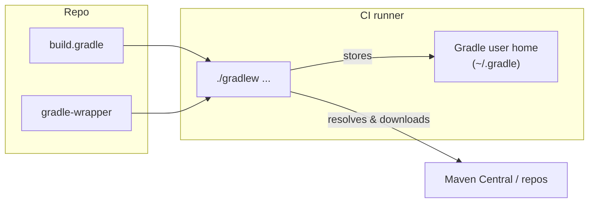

# Per-repo CI with Java version, dependencies, and cache strategy

## Context

- **Microservices live in separate GitHub repositories** — there is no single monorepo. So CI must be **per repository**: each microservice repo gets its own workflow (or calls a shared reusable workflow).
- The current root `[.github/workflows/build.yml](c:\Users\ashutosh.kumar\Desktop\novopay\.github\workflows\build.yml)` assumed one root repo and used **Java 17**; the codebase uses **Java 21** in almost all services (`sourceCompatibility = JavaVersion.VERSION_21` in [e.g. novopay-platform-actor/build.gradle](c:\Users\ashutosh.kumar\Desktop\novopay\novopay-platform-actor\build.gradle)).
- Dependencies are resolved and downloaded by Gradle from repos declared in `build.gradle` (e.g. Maven Central); they are stored in Gradle’s user home, not “inserted” by the workflow.
- Cache: we only **restore/save** that Gradle data via GitHub Actions; **eviction** is handled by GitHub (10GB per repo, LRU).

---

## 1. Where to add the workflow and config (per-repo)

- **Workflow:** Add the build workflow **inside each microservice repository** at **`<microservice-repo>/.github/workflows/build.yml`** (e.g. in repo `novopay-platform-actor` the file is that repo's `.github/workflows/build.yml`). CI runs in that repo's context on push/PR to that repo.
- **Config (optional):** In the same repo, add **`<microservice-repo>/.ci/build-deps.yml`** to list which dependency repos to checkout (and in what order) so you can change "build this and this first" without editing the workflow each time.
- **Option A (simplest):** Copy the same workflow file into each repo and set `java-version` (and optionally `BUILD_CMD`) per repo.
- **Option B:** One “shared” repo with a **reusable workflow**; each microservice repo has a tiny workflow that calls it with inputs (e.g. `java-version`, `build-cmd`). Same behavior, single place to change logic.

Recommendation: start with **Option A** (copy workflow into each repo); move to **Option B** if you want one file to update for all repos.

---

## 2. Building the concerned repo and its dependencies (e.g. lib)

- Build **the microservice repo** and **its dependent repos** (e.g. `novopay-platform-lib`) in the right order. Today each service's `settings.gradle` uses **`includeBuild '../novopay-platform-lib'`**, so Gradle expects lib as a **sibling directory** of the current repo.

**Recommended – Checkout dependencies, then one Gradle build:**  
1. Checkout the **current (microservice) repo**.  
2. Checkout **each dependency repo** (e.g. lib) into the path that `settings.gradle` expects (e.g. `../novopay-platform-lib`).  
3. Run **one** `./gradlew clean build -x test` in the microservice repo. Gradle builds the included build (lib) first, then the microservice. No need to run Gradle inside lib separately.

**Configurable "build this and this in this order" (change anytime):** Use a config file in each repo (e.g. **`.ci/build-deps.yml`**) so you can add/remove/reorder dependency repos without editing the workflow:

```yaml
build_dependencies:
  - repository: myorg/novopay-platform-lib
    path: ../novopay-platform-lib
    ref: main
```

- **Meaning:** Before building, checkout each listed `repository` into `path` (so `settings.gradle`'s `includeBuild` can use it). Use Git `ref` (branch or tag). List order = checkout order; Gradle then decides build order via `includeBuild`.
- **Changing it:** Edit `.ci/build-deps.yml` (add/remove/reorder or change `ref`). The workflow reads this file and runs checkout for each entry (e.g. `actions/checkout` with `repository` and `path`, or a script that clones with token for private repos). If the file is missing or `build_dependencies` is empty, the workflow just builds the current repo.

---

## 3. Java version

- **Source of truth:** Most services use **Java 21** (see `sourceCompatibility` / `targetCompatibility` in `build.gradle`). A few modules use 11 or 8.
- **In the workflow:** Set `java-version` to match the repo. Default to **21** in the template. Repos that still use 11 (or 8) should override to `'11'` (or `'8'`) in their copy of the workflow.
- No need to parse `build.gradle` in the workflow; keep it as a single, explicit value per repo.

---

## 4. How dependencies are “downloaded” and where they live




- **Gradle** (via `./gradlew`) reads `build.gradle` / `settings.gradle` and **resolves and downloads** dependencies from the declared repositories (e.g. Maven Central). Nothing is “inserted” by the workflow; the workflow only runs `./gradlew`.
- Downloaded artifacts and metadata are stored under **Gradle user home** (e.g. `~/.gradle`), mainly:
  - `~/.gradle/caches` — dependency jars, metadata, transforms.
  - `~/.gradle/wrapper/dists` — Gradle wrapper distributions (if not already present).
- So “downloading dependencies” = first run (or after cache miss) Gradle populates these directories; we **cache** them so the next run can **restore** and skip re-downloading.

---

## 5. Cache: what we insert, when, and what we evict


| Aspect                      | Behavior                                                                                                                                                                                                                                                                                                            |
| --------------------------- | ------------------------------------------------------------------------------------------------------------------------------------------------------------------------------------------------------------------------------------------------------------------------------------------------------------------- |
| **What we cache**           | Gradle user home: dependency caches and wrapper. Concretely: `~/.gradle/caches` and `~/.gradle/wrapper` (or use a single action that does this).                                                                                                                                                                    |
| **When we “insert” (save)** | GitHub Actions saves the cache **at the end of the job** for the given `path` when the cache `key` is specified. So we “insert” automatically after the job runs (no extra step).                                                                                                                                   |
| **When we restore**         | At the start of the job, before `./gradlew ...`. Restore uses `key` (exact) or `restore-keys` (prefix match).                                                                                                                                                                                                       |
| **Eviction**                | We do **not** explicitly evict. GitHub evicts caches by **LRU** when the repo’s total cache size exceeds the **10GB limit**. Using a key that changes when dependencies change (e.g. hash of `*.gradle*`, `gradle-wrapper.properties`) creates new cache entries over time; old ones become unused and get evicted. |


**Cache key strategy (time- then space-optimal):**

- **Key:** Include a hash of dependency-affecting files so the same deps → same key → cache hit. Example:  
`gradle-${{ runner.os }}-${{ hashFiles('**/*.gradle*', '**/gradle-wrapper.properties') }}`
- **Restore-keys:** One fallback, e.g. `gradle-${{ runner.os }}-`, so if the exact key is missing (e.g. new branch, first run), we still restore a recent Gradle cache and only re-download what changed (faster than full miss).
- **Path:** Only `~/.gradle/caches` and `~/.gradle/wrapper`. Do **not** cache `build/` or other project output (saves space and avoids stale artifacts).

---

## 6. Keeping the process optimal

**Time (primary):**

- Use **Java 21** (or the correct version) so the runner matches the project.
- **Restore cache before** running `./gradlew`.
- Use `**cache: 'gradle'`** in `actions/setup-java@v4` so Gradle home is cached without maintaining a custom key/restore-keys (recommended). Alternatively use `actions/cache` with the key/restore-keys above.
- Run `**./gradlew clean build -x test**` (or your chosen command) with `**--no-daemon**` in CI to avoid daemon startup and leave no local daemon state (optional but avoids surprises).
- Avoid extra steps; one job, checkout → setup Java (with cache) → build.

**Space (secondary):**

- Cache only Gradle’s directories (`caches` + `wrapper`), not `build/` or `.gradle` in the project.
- Rely on **one key prefix** (e.g. `gradle-${{ runner.os }}-`) plus hash so you don’t create unnecessary duplicate entries; `restore-keys` keeps one fallback to limit total entries while still improving hit rate.

---

## 7. Concrete workflow template (per-repo)

Each microservice repo gets a workflow that:

1. **Checkout** the current repo (e.g. `actions/checkout@v4`).
2. **Checkout dependency repos** (if `.ci/build-deps.yml` exists): for each entry, checkout that `repository` into `path` (e.g. `../novopay-platform-lib`) so `includeBuild` can see it.
3. **Set up JDK** with **Gradle cache**: use `actions/setup-java@v4` with `distribution: temurin`, `java-version: '21'` (or `'11'`/`'8'` where needed), and `cache: 'gradle'` so dependencies are cached and restored automatically.
4. **Build**: run `./gradlew clean build -x test` (or `env.BUILD_CMD` so the command is easy to change in one place). Optionally add `--no-daemon`.

No separate `actions/cache` step is required when using `cache: 'gradle'`; `setup-java` handles saving/restoring the Gradle cache. If you prefer explicit control (e.g. custom key with `hashFiles`), use `actions/cache` with the key/restore-keys and path above instead of `cache: 'gradle'`.

---

## 8. Summary


| Topic                 | Decision                                                                                              |
| --------------------- | ----------------------------------------------------------------------------------------------------- |
| **Where**             | Workflow: `<microservice-repo>/.github/workflows/build.yml`. Optional config: `<repo>/.ci/build-deps.yml`. |
| **Build order**       | Checkout dependency repos (e.g. lib) per config; then one Gradle build in the microservice repo (Gradle builds includeBuild in order). |
| **Configurable**      | Edit `.ci/build-deps.yml` to add/remove/reorder repos or change `ref`; no workflow edit needed.       |
| **Repos**             | One workflow per microservice repo (copy or reusable workflow).                                       |
| **Java**              | Use **21** in the template; override to 11/8 in repos that need it.                                   |
| **Dependencies**      | Downloaded by Gradle into `~/.gradle`; workflow only runs `./gradlew`.                                |
| **Cache – what**      | Gradle caches + wrapper (`~/.gradle/caches`, `~/.gradle/wrapper`).                                    |
| **Cache – when save** | End of job (automatic with `cache: 'gradle'` or `actions/cache`).                                     |
| **Cache – evict**     | GitHub LRU when over 10GB; key based on gradle files to avoid pointless duplicates.                   |
| **Optimal**           | `setup-java` with `cache: 'gradle'`, single build step, `--no-daemon` optional; no `build/` in cache. |


This gives you a single, consistent approach for every microservice repo: one workflow per repo, correct Java version, clear dependency and cache behavior, and a cache strategy optimized for time first, then space.