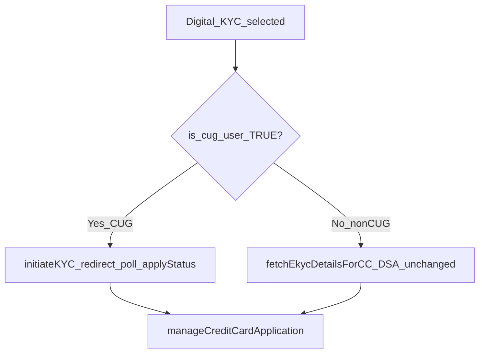
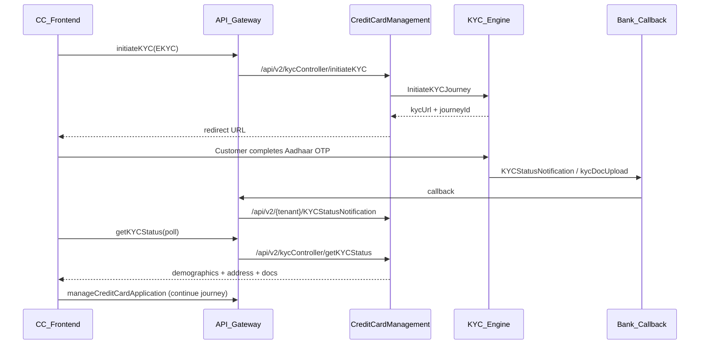

# Phase 1 Plan - HDP-7350 EKYC via KYC Engine

> **Onboarding doc (baseline vs target - no implementation status):**  
> [docs/hdp-7350-ekyc-engine/KYC_SYSTEM_BEFORE_AFTER.md](docs/hdp-7350-ekyc-engine/KYC_SYSTEM_BEFORE_AFTER.md)  
> Before/after flows, assumptions, Product/QA/eng checklists, API tables.

## Goal

Replace DAP eKYC with KYC Engine for **CUG users only**. **Non-CUG (production) users stay on the existing DAP in-app Aadhaar OTP flow** with no behaviour change in Phase 1.

Applies across CC channels when user is CUG:

- DSA: [agent-webapp](C:/Users/ashutosh.kumar/Desktop/novopay/novopay-platform-agent-webapp) via `fetchEkycDetailsForCCDSA`
- Product + co-browse: [consents-webapp](C:/Users/ashutosh.kumar/Desktop/novopay/novopay-platform-consents-webapp) via `fetchEkycDetailsForCC` / `fetchEkycDetailsForCCDSA`

**Out of scope for Phase 1:** CKYC+VKYC journey (HDP-7351). **Non-CUG KYC Engine rollout** (future phase after CUG validation).

## CUG vs non-CUG routing (core Phase 1 decision)

Align with existing CC pattern used for OTP/demog in [AbstractCreditCardManager](C:/Users/ashutosh.kumar/Desktop/novopay/novopay-platform-creditcard-management/src/main/java/in/novopay/creditcard/transaction/processor/AbstractCreditCardManager.java):

| User type   | `is_cug_user`             | Digital KYC path (Phase 1)                                                                        |
| ----------- | ------------------------- | ------------------------------------------------------------------------------------------------- |
| **CUG**     | `TRUE` (case-insensitive) | **New:** `initiateKYC` -> Pehchaan redirect -> `getKYCStatus` -> apply-status -> continue journey |
| **Non-CUG** | anything else / absent    | **Unchanged:** `fetchEkycDetailsForCC` / `fetchEkycDetailsForCCDSA` (DAP Aadhaar OTP in-app)      |

**Where CUG flag comes from today:**

- **agent-webapp:** `loginSlice.isCugUser` from login (`is_cug_user === "TRUE"`); passed on consent/CC APIs via [apiHelper.ts](C:/Users/ashutosh.kumar/Desktop/novopay/novopay-platform-agent-webapp/src/helpers/apiHelper.ts) / [consentHelper.ts](C:/Users/ashutosh.kumar/Desktop/novopay/novopay-platform-agent-webapp/src/helpers/consentHelper.ts)
- **consents-webapp:** `attributes.is_cug_user` on consent journey ([InitialConsent.tsx](C:/Users/ashutosh.kumar/Desktop/novopay/novopay-platform-consents-webapp/src/Components/CommonScreens/InitialConsent/InitialConsent.tsx), [OTPScreen.tsx](C:/Users/ashutosh.kumar/Desktop/novopay/novopay-platform-consents-webapp/src/Components/OTPScreen/OTPScreen.tsx))

**Backend stance (matches [KycEngineController](C:/Users/ashutosh.kumar/Desktop/novopay/novopay-platform-creditcard-management/src/main/java/in/novopay/creditcard/kyc/controller/KycEngineController.java) comment):** CUG routing is primarily a **frontend/channel concern** - FE chooses engine vs legacy API. Optional defense-in-depth: reject `initiateKYC` when `is_cug_user` is not `TRUE` (add flag to initiate DTO or resolve from `clientReferenceNumber` audit attributes).

## Source documents (HDP-7350 folder)

The first plan draft used **Ticket.txt + codebase only**. This revision incorporates all DOCX files:

| Document                                                                | Purpose                                                                                                      |
| ----------------------------------------------------------------------- | ------------------------------------------------------------------------------------------------------------ |
| `RD_Adobe CC_KYC engine integration_BSG_final (1).docx`                 | Business RD - segment scope, functional flow, channel/prodCd rules, DAP field mapping, foreigner termination |
| `KYCEngine_InitiateKYC_Sync_APISpecification_v2.9 (12) (1).docx`        | InitiateKYCJourney request/response, `redirectionURL`, `kycPreferredMode`, UAT URLs                          |
| `KYCEngine_getKYCStatusDetails_Sync_APISpecification_v1.3 (4) (1).docx` | GETKYCStatus inquiry, `isResidentForeigner`, demographics response                                           |
| `KYCEngine_StatusNotification_Async_APISpecification_v2.7 (8) (1).docx` | Solace async push to source callback, interim events, 4s timeout, HTTP 200 ack                               |
| `KYCEngine_DocUpload_APISpecification_v1.1 (12) (1).docx`               | Optional `kycDocUpload` callback with base64 doc + `poatype`                                                 |

**Images in DOCX:** Yes, readable when extracted. In these files they are mostly **HDFC logos** and a **Postman Basic Auth screenshot** (`engineuser`) for the engine endpoint - not separate flow-diagram images. Functional flows are in **text/tables** inside the RD and API specs (now reflected below).

## Spec-driven requirements (from DOCX, Phase 1 EKYC only)

From RD + API specs, Phase 1 must additionally ensure:

- **channelId:** `SFDCA` for CC (RD); validate against current `hdfc.obp.channelcode` default `NOVPY` in [KycTransformer.java](C:/Users/ashutosh.kumar/Desktop/novopay/novopay-platform-creditcard-management/src/main/java/in/novopay/creditcard/kyc/transformer/KycTransformer.java)
- **prodCd + kycPreferredMode (EKYC path):** `prodCd=EKYC-OTP` + `kycPreferredMode=EKYC` -> engine runs EKYC only (RD). Do not use `BOTH` in Phase 1 unless VKYC is in scope.
- **redirectionURL:** mandatory in initiate request; FE passes channel return URL; Pehchaan redirects customer back after Aadhaar OTP (RD flow)
- **getKYCStatus:** poll after return; support inquiry by `kycJourneyId` (already in CC) or `externalRefNo + applicationId` per spec
- **isResidentForeigner=Y:** terminate journey; show RD message: *"We are unable to proceed due to internal policy guidelines..."*
- **Downstream DAP contracts:** Aadhaar demographics from engine must populate **existing Execute Interface and Final DAP fields** (RD note - refer attached excel with HDFC for field list)
- **Callbacks:** `KYCStatusNotification` (async via Solace) + optional `kycDocUpload`; source must return HTTP 200 with blank/minimal body within 4s
- **Security:** HTTPS, IP whitelisting, channel/product validation; engine may require Basic Auth per integration Postman in Initiate spec
- **Segment coverage (RD):** NTB, ETB wo, PACC, VRM PACC, Corporate, Branch Assisted, ETB FD-backed - all replace DAP Aadhaar with engine for Phase 1

## Current state (reuse baseline)

Already on branch `ddp-fea-kyc-engine` in [creditcard-management](C:/Users/ashutosh.kumar/Desktop/novopay/novopay-platform-creditcard-management):

- REST surface: [KycEngineController.java](C:/Users/ashutosh.kumar/Desktop/novopay/novopay-platform-creditcard-management/src/main/java/in/novopay/creditcard/kyc/controller/KycEngineController.java) (`initiateKYC`, `getKYCStatus`, bank callbacks)
- Core service: [CreditCardKycEngineService.java](C:/Users/ashutosh.kumar/Desktop/novopay/novopay-platform-creditcard-management/src/main/java/in/novopay/creditcard/kyc/service/CreditCardKycEngineService.java) (EKYC-only, ES snapshot, DMS upload, idempotent callbacks)
- Persistence: [V000093__kyc_detail_hdfc_kyc_engine.sql](C:/Users/ashutosh.kumar/Desktop/novopay/novopay-platform-creditcard-management/src/main/resources/sql/migrations/product/V000093__kyc_detail_hdfc_kyc_engine.sql)

**Not done yet:** gateway routing to CC, CC masterdata config, frontend redirect/poll flow, post-KYC application sync, dev/QA proof.

## Target flow

Routing decision is **CUG-gated on the frontend** (same pattern as fintech OTP v2): only CUG users call KYC Engine endpoints; non-CUG users never leave the legacy DAP eKYC path in Phase 1.

---

## Workstreams

### 1. API Gateway (required)

**Repo:** [novopay-platform-api-gateway](C:/Users/ashutosh.kumar/Desktop/novopay/novopay-platform-api-gateway)

Add DDP tenant flyways (pattern from [V4000039__kycstatusnotification_callback.sql](C:/Users/ashutosh.kumar/Desktop/novopay/novopay-platform-api-gateway/src/main/resources/sql/migrations/ddp/V4000039__kycstatusnotification_callback.sql)):

| request_name            | service_name             | forward_url                         |
| ----------------------- | ------------------------ | ----------------------------------- |
| `initiateKYC`           | `CREDIT-CARD-MANAGEMENT` | `api/v2/kycController/initiateKYC`  |
| `getKYCStatus`          | `CREDIT-CARD-MANAGEMENT` | `api/v2/kycController/getKYCStatus` |
| `KYCStatusNotification` | `CREDIT-CARD-MANAGEMENT` | `api/v2/ddp/KYCStatusNotification`  |
| `kycDocUpload`          | `CREDIT-CARD-MANAGEMENT` | `api/v2/ddp/kycDocUpload`           |

Today callbacks forward to **BANKING-ORIGINATION** - must be repointed to CC for credit card scope.

Also register APIs in [initial-setup flyway](C:/Users/ashutosh.kumar/Desktop/novopay/novopay-platform-initial-setup/flyway/sql) if your env depends on it.

### 2. Masterdata config (required)

**Repo:** [novopay-platform-masterdata-management](C:/Users/ashutosh.kumar/Desktop/novopay/novopay-platform-masterdata-management)

Clone KYC Engine keys currently under `BANKING-ORIGINATION` ([V4000715](C:/Users/ashutosh.kumar/Desktop/novopay/novopay-platform-masterdata-management/src/main/resources/sql/migrations/ddp/V4000715__create_async_kyc_api.sql)) for `**CREDIT-CARD-MANAGEMENT`**:

- `hdfc.kyc.async.initiate.url`
- `hdfc.kyc.async.status.url`
- `hdfc.kyc.async.initiate.initiate.timeout` / `retry.timeout`
- `hdfc.kyc.aadhhar.get.refnumber.api.enable`
- `creditcard.kyc.callback.allowed.source.addresses` (prod bank IP allowlist)
- `creditcard.kyc.callback.photo.max.bytes` / `document.max.bytes`

Per-env URL values to be confirmed with HDFC integration team.

### 3. Credit Card backend - finish integration (required)

**Repo:** [novopay-platform-creditcard-management](C:/Users/ashutosh.kumar/Desktop/novopay/novopay-platform-creditcard-management)

#### 3a. Initiate request hardening (align to Initiate spec v2.9 + RD)

- Add `redirectionURL` to [KycInitiateRequestDTO](C:/Users/ashutosh.kumar/Desktop/novopay/novopay-platform-creditcard-management/src/main/java/in/novopay/creditcard/kyc/dto/KycInitiateRequestDTO.java); FE passes per-channel return URL (DSA / consents / product)
- Set `channelId` to `SFDCA` (RD) via masterdata, not hardcoded `NOVPY`
- Set `prodCd=EKYC-OTP` and `kycPreferredMode=EKYC` for Phase 1
- Confirm `transactionId` / `applicationId` mapping to `clientReferenceNumber` for status inquiry fallback
- Validate engine auth (Basic Auth credentials in masterdata if required by HDFC UAT)

#### 3b. Post-KYC application sync (main backend gap)

Legacy path uses [FetchEkycDetailsProcessor](C:/Users/ashutosh.kumar/Desktop/novopay/novopay-platform-creditcard-management/src/main/java/in/novopay/creditcard/common/processors/FetchEkycDetailsProcessor.java) to write audit attributes, stages (`EKYC_STATUS`), address normalization, name split, Aadhaar ref fields.

Add a focused processor (e.g. `ApplyKycEngineStatusProcessor`) + orchestration API (e.g. `applyKycEngineStatusForCC` / `applyKycEngineStatusForCCDSA`) that:

1. Calls existing `CreditCardKycEngineService.getKycStatus()`
2. On `SUCCESS`, maps response into the same execution-context shape legacy eKYC produces (name, DOB, gender, address lines, `aadhaar_reference_number`, `is_prn_available`, geo flags)
3. Reuses existing helpers from `FetchEkycDetailsProcessor` / `CreditCardKycCommonService` where possible (pincode-city match, address length split, `CaptureStages` for `EKYC_STATUS`)
4. Persists transaction audit attributes and audit log
5. If `isResidentForeigner=Y` in status response, fail with RD termination message (do not continue application)
6. Map demographics into Execute Interface / Final DAP existing fields per RD (coordinate field list with HDFC excel attachment)

This avoids duplicating downstream `manageCreditCardApplication` expectations.

#### 3c. CUG guard (optional backend safety)

- Do **not** use a broad `creditcard.kyc.engine.enabled` flag that affects all users
- Primary gate: FE routes on `is_cug_user === TRUE`
- Optional: on `initiateKYC`, verify CUG from request flag or `transaction_audit_attributes` for `clientReferenceNumber`; return error if non-CUG calls engine APIs
- Legacy [FetchEkycDetailsProcessor](C:/Users/ashutosh.kumar/Desktop/novopay/novopay-platform-creditcard-management/src/main/java/in/novopay/creditcard/common/processors/FetchEkycDetailsProcessor.java) path remains untouched for non-CUG

#### 3d. Tests

Add unit tests for `kyc` package (currently none under `src/test/java`). Minimum:

- initiate idempotency + EKYC-only guard
- getKycStatus pending/completed/ES-snapshot paths
- callback idempotency hash skip
- new apply-status processor mapping

### 4. Frontend - DSA (required, not started)

**Repo:** [agent-webapp](C:/Users/ashutosh.kumar/Desktop/novopay/novopay-platform-agent-webapp)

Touch points:

- [VerificationOptionScreen.tsx](C:/Users/ashutosh.kumar/Desktop/novopay/novopay-platform-agent-webapp/src/components/VerificationOptionScreen/VerificationOptionScreen.tsx) - Digital KYC branch currently opens in-app Aadhaar OTP via `fetchEkycDetailsForCCDSA`
- [DiyVerificationScreen.tsx](C:/Users/ashutosh.kumar/Desktop/novopay/novopay-platform-agent-webapp/src/components/pages/DiyLandingScreen/DiyVerificationScreen.tsx)

Changes:

1. Add v2 endpoints in [apiEndpoints.ts](C:/Users/ashutosh.kumar/Desktop/novopay/novopay-platform-agent-webapp/src/api/apiEndpoints.ts): `initiateKYC`, `getKYCStatus`, `applyKycEngineStatusForCCDSA` (or equivalent)
2. In Digital KYC branch, **branch on `isCugUser` from login state:**
  - **CUG (`TRUE`):** call `initiateKYC` -> redirect to `kycUrl` -> poll `getKYCStatus` -> apply-status -> continue post-eKYC navigation/Firebase sync
  - **Non-CUG:** keep existing `fetchEkycDetailsForCCDSA` Aadhaar input + OTP flow with **no code-path change**
3. Pass `is_cug_user: TRUE` on downstream CC APIs as today (already in helpers)

### 5. Frontend - Product + co-browse (required, not started)

**Repo:** [consents-webapp](C:/Users/ashutosh.kumar/Desktop/novopay/novopay-platform-consents-webapp)

Touch points:

- [AadhaarInputScreen.tsx](C:/Users/ashutosh.kumar/Desktop/novopay/novopay-platform-consents-webapp/src/Components/AadharInputScreen/AadhaarInputScreen.tsx)
- [OTPScreen.tsx](C:/Users/ashutosh.kumar/Desktop/novopay/novopay-platform-consents-webapp/src/Components/OTPScreen/OTPScreen.tsx) (uses both `fetchEkycDetailsForCC` and `fetchEkycDetailsForCCDSA`)

Same redirect + poll + apply-status pattern as DSA, but **only when `attributes.is_cug_user === true`**. Non-CUG co-browse/product journeys continue using `fetchEkycDetailsForCC` / `fetchEkycDetailsForCCDSA` unchanged.

### 6. Dev testing + Bob proof (required)

Create ticket folder `docs/tdd-runs/hdp-7350-ekyc-engine/` with:

- `ticket-spec.yaml` - scenarios: initiate success, redirect return, status poll success, callback idempotency, legacy fallback unchanged
- Postman collection for `initiateKYC`, `getKYCStatus`, apply-status API
- DB verify: `kyc_detail`, transaction audit attributes, `EKYC_STATUS` stage
- ES verify: `APPLICATION_DATA_{clientRef}`
- Log grep patterns for journey id / external ref

Run `bob validate-ticket hdp-7350-ekyc-engine` before QA handoff.

### 7. QA testing (required)

| Area                | Cases                                                                                        |
| ------------------- | -------------------------------------------------------------------------------------------- |
| CUG Digital KYC     | initiate -> redirect -> complete -> resume application                                       |
| Non-CUG Digital KYC | legacy DAP OTP path unchanged (regression must be clean)                                     |
| Product CC          | CUG engine + non-CUG legacy split                                                            |
| Co-browse           | agent/customer route sync after engine return (CUG only)                                     |
| Negative            | initiate fail, status pending timeout, callback duplicate, isResidentForeigner=Y termination |
| Regression          | Physical KYC, VKYC retrigger, resume list, demog routing, non-CUG OTP unchanged              |

---

## Services summary

| Service                                | Phase 1 change                                                |
| -------------------------------------- | ------------------------------------------------------------- |
| creditcard-management                  | **High** - apply-status processor, redirect URL config, tests |
| agent-webapp                           | **High** - new engine journey (not started)                   |
| consents-webapp                        | **High** - product/co-browse engine journey (not started)     |
| api-gateway                            | **Medium** - new routes + callback repoint                    |
| masterdata-management                  | **Medium** - CC KYC engine configs                            |
| initial-setup                          | **Low** - API registration if needed                          |
| lib / BO / actor / notifications / DMS | **None** (consumed via existing internal APIs)                |

---

## Timeline (all CC channels)

| Track                               | Estimate                              |
| ----------------------------------- | ------------------------------------- |
| Backend (CC + gateway + masterdata) | 4-6 dev days                          |
| Frontend (agent + consents)         | 4-6 dev days (parallel)               |
| Dev testing + Bob proof             | 2-3 dev days                          |
| QA regression                       | 3-4 QA days                           |
| **Elapsed (parallel)**              | **~10-12 working days**               |
| **Target window**                   | **~1-12 July 2026** (with 15% buffer) |

Recommended sequencing: gateway + masterdata first (unblocks FE integration), then BE apply-status processor, then FE in parallel, then Bob + QA.

## Risks / dependencies

- HDFC must whitelist Novopay callback URLs pointing to CC gateway paths
- `redirectionURL` contract must be agreed (per-channel return page)
- Bank callback timing may require FE polling window tuning (`retryMilliSeconds` / `initiateMilliSeconds` from initiate response)
- CUG login/attribute propagation must be correct in all channels before engine path is enabled
- Non-CUG users must never hit engine APIs accidentally (FE branch + optional BE guard)

## Definition of done (Phase 1)

- **CUG** users can complete Digital/EKYC via KYC Engine in UAT (DSA, product, co-browse)
- **Non-CUG** users continue on legacy DAP eKYC with no regression
- Bank callbacks land on CC and persist to `kyc_detail` + ES (CUG journeys only in practice)
- Post-KYC data flows into `manageCreditCardApplication` same as today for CUG engine path
- Bob `GATE_SUMMARY.md` shows PASS for Plan/Build/Prove
- QA sign-off on CUG engine path and non-CUG legacy regression

