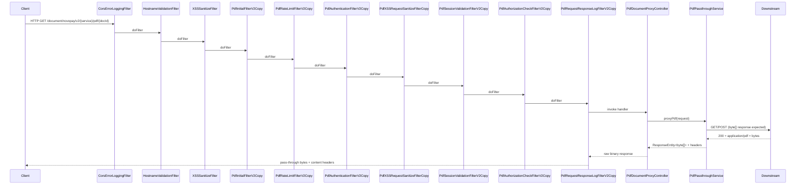

# Raw PDF Passthrough Implementation Plan

## Goal
Expose a new gateway endpoint that returns `application/pdf` (or downstream content-type) as raw bytes, without any payload encoding/decoding, and without modifying existing filter classes.

## Current State (from codebase)
- Existing document download flow in [`C:/Users/ashutosh.kumar/Desktop/novopay/novopay-platform-api-gateway/src/main/java/in/novopay/apigateway/controller/DocumentController.java`](C:/Users/ashutosh.kumar/Desktop/novopay/novopay-platform-api-gateway/src/main/java/in/novopay/apigateway/controller/DocumentController.java) decodes Base64 from JSON `content`.
- Existing binary-safe proxy behavior already exists in [`C:/Users/ashutosh.kumar/Desktop/novopay/novopay-platform-api-gateway/src/main/java/in/novopay/apigateway/proxy/ProxyService.java`](C:/Users/ashutosh.kumar/Desktop/novopay/novopay-platform-api-gateway/src/main/java/in/novopay/apigateway/proxy/ProxyService.java) via `processProxyAssetRequest(... byte[].class ...)`.
- V2 JSON filter chain is registered in [`C:/Users/ashutosh.kumar/Desktop/novopay/novopay-platform-api-gateway/src/main/java/in/novopay/apigateway/config/FilterConfig.java`](C:/Users/ashutosh.kumar/Desktop/novopay/novopay-platform-api-gateway/src/main/java/in/novopay/apigateway/config/FilterConfig.java); some filters assume JSON/text response bodies (especially request/response logging and auth envelope filters).

## Architecture Decision (Best Way)
Use a **new dedicated raw PDF route** that bypasses JSON envelope flow and proxies bytes directly from downstream:
- Keep old `/document/.../downloadDocument` intact for backward compatibility.
- Add a new endpoint under a dedicated path (for example `/document/novopay/{version}/{destinationServiceName}/pdf/**`) that uses byte passthrough.
- Route through a dedicated PDF service method built on `RestTemplate.exchange(..., byte[].class)` and stream response with original headers (`Content-Type`, `Content-Disposition`, `Content-Length` where available).
- For filter requirements on the new path, create **new copied filter classes** (no edits to existing filters) and register only for PDF URL patterns.

Why this is best:
- Zero encode/decode overhead and no binary corruption risk from JSON assumptions.
- Minimal blast radius: existing APIs and filters remain unchanged.
- Explicit contract for clients needing binary PDF.

## Filter Strategy (No changes to existing filters)
### Keep as-is (reused safely)
- Global/common filters with no payload mutation intent:
  - `corsErrorLoggingFilter` (highest precedence)
  - `HostnameValidationFilter`
  - `XSSSanitizeFilter` (already bypasses multipart; validate for PDF GET)

### Copy-and-scope for PDF path
Create PDF-specific copies when behavior differs:
- Copy `RequestResponseLogFilterV2` into a PDF-safe variant that:
  - avoids UTF-8 body parsing on response bytes,
  - logs metadata only (status, headers, sizes),
  - never calls JSON response parsers for binary responses.
- If auth/session/authorization filters currently enforce JSON envelope assumptions on the same path, create PDF variants of those filters and scope them to PDF URL pattern only.
- Register new copies in `FilterConfig` with a dedicated URL pattern constant and deterministic order.

## Implementation Tasks
1. Add new PDF controller endpoint + route mapping under document v2 area.
2. Add PDF passthrough service method returning `ResponseEntity<ByteArrayResource>` (or `ResponseEntity<byte[]>`) with downstream header preservation.
3. Add PDF-specific filter copies for any binary-unsafe behavior (starting with request/response logging filter), without touching existing filter classes.
4. Register a dedicated PDF filter chain in `FilterConfig` using new URL pattern(s), keeping order aligned with current v2 conventions.
5. Add config toggles/allowlists if needed for PDF path (e.g., skiplist entries), without changing behavior of existing routes.
6. Add tests:
   - controller test for binary response and headers,
   - filter test proving binary-safe logging path,
   - integration-style test for end-to-end PDF bytes passthrough.
7. Update docs/README for new endpoint contract and migration guidance.

## Request-to-Response Sequence (Including filters involved)

## Key Files Expected to Change
- [`C:/Users/ashutosh.kumar/Desktop/novopay/novopay-platform-api-gateway/src/main/java/in/novopay/apigateway/config/FilterConfig.java`](C:/Users/ashutosh.kumar/Desktop/novopay/novopay-platform-api-gateway/src/main/java/in/novopay/apigateway/config/FilterConfig.java)
- New controller file under `src/main/java/in/novopay/apigateway/controller/` for PDF passthrough endpoint.
- Existing or new service under `src/main/java/in/novopay/apigateway/controller/support/` or `src/main/java/in/novopay/apigateway/proxy/` for raw byte forwarding.
- New copied filter classes under `src/main/java/in/novopay/apigateway/filter/v2/` (or a `filter/pdf/` package) for binary-safe handling.
- Tests under `src/test/java/...` for controller/filter/integration path.

## Risks and Mitigations
- Binary corruption by text parsing in filters: mitigated by copied binary-safe filters.
- Header loss (`Content-Type`, `Content-Disposition`): explicitly preserve/forward downstream headers.
- Regression on existing consumers: old endpoints untouched; new route additive.
