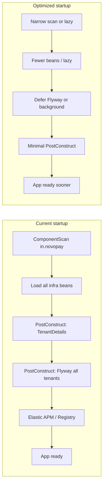

# Microservice Startup Time and Memory Optimization Plan

## Current state (findings)

- **23+ Gradle Spring Boot microservices** (mostly 3.5.7, Java 21), plus Maven `novopay-payments` and Node DDP utility.
- **Shared platform**: All services depend on `novopay-platform-lib` (infra-platform, infra-cache, infra-message-broker, infra-essentials-grpc, etc.) and use `**ComponentScan(basePackages = "in.novopay")`**, so every service loads beans from the entire `in.novopay` package.
- **Startup hotspots**:
  - [NovopayFlywayService](novopay-platform-lib/infra-platform/src/main/java/in/novopay/infra/platform/tenant/core/NovopayFlywayService.java): `@PostConstruct intializeAllTenants()` runs **Flyway.migrate() for every tenant** with auto-update enabled (DB round-trips and migrations per tenant before the app is “ready”).
  - [TenantDetailsDAOService](novopay-platform-lib/infra-platform/src/main/java/in/novopay/infra/platform/tenant/core/TenantDetailsDAOService.java): `@PostConstruct` calls `findAllTenants(service)` against platform_master (eager tenant load).
  - [ServiceRegistry](novopay-platform-lib/infra-platform/src/main/java/in/novopay/infra/platform/registry/ServiceRegistry.java), [ElasticApmConfig](novopay-platform-lib/infra-platform/src/main/java/in/novopay/infra/platform/es/core/ElasticApmConfig.java): Additional `@PostConstruct` work at startup.
- **Memory / classpath**: Each service pulls many starters (actuator, JPA, cache, Kafka, gRPC, Thymeleaf, validation, web) and 15+ `in.novopay:infra-`* libraries; no lazy-init; no actuator endpoint narrowing in most services; Dockerfiles do not set `-Xmx`/`-Xms`.
- **Data access**: DataSource/Flyway/Redis auto-config are excluded; custom setup in infra creates **platform master Hikari** at startup (defaults: max 10, minIdle from env). Tenant pools are created lazily in [TenantSpecificDataSourceFactory](novopay-platform-lib/infra-platform/src/main/java/in/novopay/infra/platform/core/TenantSpecificDataSourceFactory.java) (good). No `spring.datasource.hikari.`* or `novopay.master.datasource.`* in service `application.properties`.
- **Design smells**: `spring.main.allow-bean-definition-overriding=true` and `allow-circular-references=true` in several services, adding resolution overhead and masking design issues.

---

## Architecture overview (current vs optimized)

---

## 1. Startup time improvements

### 1.1 Defer Flyway from “all tenants at startup” (high impact)

**Problem**: [NovopayFlywayService.intializeAllTenants()](novopay-platform-lib/infra-platform/src/main/java/in/novopay/infra/platform/tenant/core/NovopayFlywayService.java) runs in `@PostConstruct` and runs Flyway for every tenant with auto-update enabled, blocking startup.

**Options (choose one per env)**:

- **A – Defer to first use**: Remove `@PostConstruct`; run Flyway for a tenant the first time that tenant’s DataSource is requested (e.g. in [TenantSpecificDataSourceFactory](novopay-platform-lib/infra-platform/src/main/java/in/novopay/infra/platform/core/TenantSpecificDataSourceFactory.java) before returning the pool, or in a tenant-scoped “ensure migrated” step). Ensures migrations run before use without blocking startup.
- **B – Background after startup**: Keep loading tenant list at startup if needed, but run Flyway in an `ApplicationRunner` or `@Scheduled` (with a one-off delay) so the app becomes ready first; expose readiness to exclude “migrations pending” if required.
- **C – Feature flag**: Add a property (e.g. `novopay.service.flyway.run.on.startup=true|false`). When false, use A or B. Use false in dev/local and optionally in prod after validation.

**Recommendation**: Implement A for “migrate on first tenant use” and add C so existing behavior can be restored. Document and test rollback (re-enable run.on.startup) for safe rollout.

### 1.2 Reduce component scan scope (high impact)

**Problem**: `ComponentScan(basePackages = "in.novopay")` forces every service to load all `@Configuration` and `@Component` classes from every infra-* module on the classpath, increasing context creation time and memory.

**Approach**:

- **Preferred**: Narrow to the service’s own package plus explicit infra packages, e.g. `scanBasePackages = {"in.novopay.bankingtransaction", "in.novopay.infra.platform", "in.novopay.infra.cache", ...}` (only the infra packages that service actually uses). This requires a one-time audit per service: list required infra packages and add them to `scanBasePackages` or use `@Import` for infra config classes.
- **Alternative**: Keep `in.novopay` but move infra configs to **explicit `@Configuration` classes** and use `@Import` only in services that need them, and narrow scan to e.g. `in.novopay.<servicename>` so only the service and its explicit imports are loaded. More invasive but maximum control.

**Best practice**: One service = one (or few) bounded packages + explicit imports; avoid “scan the world”.

### 1.3 Enable lazy bean initialization (medium impact)

**Approach**:

- Set `spring.main.lazy-initialization=true` in `application.properties` for services where acceptable. Beans are created on first use, so startup time and initial memory drop; first request per bean may be slightly slower.
- **Caveat**: Beans that must run at startup (e.g. security, filters, or the master DataSource used by `TenantDetailsDAOService`) must remain eager. Options: (1) Keep lazy by default and mark only required configs with `@Lazy(false)` or equivalent, or (2) use a separate “bootstrap” profile where lazy is false for those beans. Audit `@PostConstruct` and `ApplicationRunner`/`CommandLineRunner` when enabling.

**Recommendation**: Enable lazy in one non-critical service first (e.g. a low-traffic API), measure startup and memory, then roll out with clear exclusion list for eager beans.

### 1.4 Trim PostConstruct work (medium impact)

- **TenantDetailsDAOService**: Pre-loading tenants in `@PostConstruct` is useful for fast first request but blocks startup. Consider loading tenant list asynchronously after context is up (e.g. `ApplicationRunner`) or on first access with a small in-memory cache; ensure thread-safety and readiness checks if you depend on “tenants loaded” for health.
- **ElasticApmConfig**: ElasticApmAttacher.attach() in `@PostConstruct` is a known cost. If APM is disabled (e.g. `elastic.apm.enabled=false` in api-gateway), ensure the bean is not created or the attach is skipped to avoid unnecessary work.
- **ServiceRegistry**: If initialization only needs the master DataSource, ensure it doesn’t do extra DB or I/O in `@PostConstruct` beyond what’s strictly necessary for “registry ready”.

### 1.5 Exclude unused auto-configurations (low–medium impact)

- Many services already exclude `DataSourceAutoConfiguration`, `FlywayAutoConfiguration`, `RedisAutoConfiguration`. Add explicit exclusions for starters that are on classpath but not used in that service, e.g.:
  - `ThymeleafAutoConfiguration` for pure REST/gRPC services that don’t serve HTML.
  - `KafkaAutoConfiguration` (or similar) if the service only uses a shared client and doesn’t need the default producer/consumer setup.
- Use `@EnableAutoConfiguration(exclude = { ... })` or `spring.autoconfigure.exclude=...` so Spring Boot skips scanning and configuring unused features.

### 1.6 Limit Actuator endpoints (low impact)

- Default actuator can register many endpoints. Restrict to what’s needed: e.g. `management.endpoints.web.exposure.include=health,info` (and metrics/prometheus only where needed). Reduces startup and surface area. Only one property file currently sets `management.endpoints.web.exposure.include=`*; others can explicitly set a minimal list.

---

## 2. Memory improvements

### 2.1 JVM heap and GC (high impact for RSS and predictability)

- **Dockerfiles**: Today they don’t set `-Xmx`/`-Xms`. Set both in the `java` command (e.g. `-Xms256m -Xmx512m` or per-service based on profiling). Same heap for `-Xms` and `-Xmx` avoids heap resizing and can reduce footprint.
- **GC**: Current Dockerfile seen uses `-XX:+UseConcMarkSweepGC`. Prefer **G1GC** (default in Java 21) or **ZGC** for low pause and good throughput, e.g. `-XX:+UseZGC` for large heaps or `-XX:+UseG1GC` (default). Remove explicit CMS unless there’s a proven need.
- **Metaspace**: Add `-XX:MaxMetaspaceSize=256m` (or similar) to cap metaspace and avoid unbounded growth from many infra classes.
- **Container awareness**: Use `-XX:+UseContainerSupport` (Java 10+) so the JVM respects container limits; prefer setting memory requests/limits in Kubernetes and matching `-Xmx` to the limit minus non-heap.

### 2.2 Master DataSource pool sizing (medium impact)

- Platform master pool is created at startup with defaults from [PlatformMasterDataSourceConfiguration](novopay-platform-lib/infra-platform/src/main/java/in/novopay/infra/platform/core/PlatformMasterDataSourceConfiguration.java) (e.g. max 10, minIdle from env). For services that only need master for tenant lookup and registry:
  - Set `novopay.master.datasource.min-idle=0` (or low) and `novopay.master.datasource.max-active=5` (or per-service tuned value) in `application.properties` so fewer connections are held at startup and in idle.
  - Ensure `novopay.master.datasource.connection-timeout-ms` and validation timeouts are set so startup doesn’t hang if DB is slow.

### 2.3 Dependency pruning (medium impact)

- **Per-service**: Remove unused dependencies from `build.gradle`. Examples: drop `spring-boot-starter-thymeleaf` for REST-only services; make optional any infra-* library that the service doesn’t actually use (e.g. if a service doesn’t call gRPC, consider excluding or not depending on infra-essentials-grpc). This reduces classpath size and number of beans.
- **Versions**: You already exclude some transitive deps (e.g. snakeyaml, xmlunit). Continue to exclude unneeded transitives and align versions (e.g. Netty, Jackson) to avoid duplicate libraries.

### 2.4 Resolve circular references and bean overriding (low–medium impact)

- **Medium-term**: Remove `spring.main.allow-circular-references=true` and `spring.main.allow-bean-definition-overriding=true` by refactoring dependencies (extract shared logic, use interfaces, or split configs). This reduces resolution cost and clarifies design; do it incrementally per service to avoid big-bang breaks.
- **Short-term**: If keeping them, at least document which beans are overridden or circular so future changes don’t worsen startup.

---

## 3. Optional advanced improvements

### 3.1 Spring Boot AOT (Application Context AotProcessor)

- Use Spring Boot 3.x AOT to pre-process the context at build time (e.g. `gradle bootRun` with AOT or a dedicated AOT task). This moves part of reflection and config resolution to build time and can significantly reduce startup time. Prefer enabling for one service first and validating behavior (e.g. dynamic proxies and reflection used by infra).

### 3.2 GraalVM native image (selected services)

- For a subset of services (e.g. small, few dependencies), consider GraalVM native image for very fast startup and lower memory. Requires testing all infra (reflection, resources, JPA, Kafka, etc.) for native compatibility; start with the simplest service.

### 3.3 Shared libraries and version alignment

- Ensure `novopay-platform-lib` and all services use the same Spring Boot BOM and Java version so that dependency resolution is consistent and duplicate libraries are minimized. You already use a shared BOM for gRPC; extend to other key deps where useful.

---

## 4. Implementation order and risk

| Priority | Action                                                                             | Impact                     | Risk / effort                           |
| -------- | ---------------------------------------------------------------------------------- | -------------------------- | --------------------------------------- |
| 1        | Defer Flyway (option A + flag) in infra-platform                                   | High startup               | Medium (test all tenants, rollout flag) |
| 2        | Set -Xms/-Xmx and GC in Dockerfiles                                                | High memory predictability | Low                                     |
| 3        | Add novopay.master.datasource.* for master pool (min-idle, max-active) per service | Medium memory/startup      | Low                                     |
| 4        | Limit actuator endpoints                                                           | Low startup/memory         | Low                                     |
| 5        | Enable lazy-initialization in one service, then expand                             | Medium startup/memory      | Medium (audit eager beans)              |
| 6        | Narrow ComponentScan per service                                                   | High startup/memory        | High (audit and test each service)      |
| 7        | Exclude unused auto-config (Thymeleaf, etc.)                                       | Low–medium                 | Low                                     |
| 8        | Reduce PostConstruct work (TenantDetails, APM)                                     | Medium                     | Medium                                  |
| 9        | Remove circular refs / bean overriding                                             | Low–medium long-term       | High (refactor)                         |
| 10       | AOT / native (pilot)                                                               | Very high for subset       | High (pilot first)                      |

---

## 5. Metrics and validation

- **Startup**: Measure time from process start to “application started” (e.g. Spring Boot log line or readiness probe success) before and after each change.
- **Memory**: Measure JVM heap (e.g. via actuator metrics or `jmap -heap`) and container RSS after steady state and after GC; track metaspace.
- **Correctness**: After Flyway deferral, run integration tests that create tenant contexts and trigger migrations; run full regression on tenant-specific flows.
- Prefer **one change per PR** (e.g. Flyway deferral only, or JVM opts only) and compare metrics in a consistent environment (e.g. same tenant count, same profile).

---

## 6. Files and areas to touch

- **Infra (platform-lib)**  
  - [NovopayFlywayService](novopay-platform-lib/infra-platform/src/main/java/in/novopay/infra/platform/tenant/core/NovopayFlywayService.java): Defer or gate Flyway; add `novopay.service.flyway.run.on.startup`.  
  - [TenantSpecificDataSourceFactory](novopay-platform-lib/infra-platform/src/main/java/in/novopay/infra/platform/core/TenantSpecificDataSourceFactory.java): Optional “migrate on first use” if Flyway is deferred.  
  - [TenantDetailsDAOService](novopay-platform-lib/infra-platform/src/main/java/in/novopay/infra/platform/tenant/core/TenantDetailsDAOService.java): Optional async or on-first-access tenant load.  
  - [PlatformMasterDataSourceConfiguration](novopay-platform-lib/infra-platform/src/main/java/in/novopay/infra/platform/core/PlatformMasterDataSourceConfiguration.java): Already reads `novopay.master.datasource.`*; document recommended defaults (min-idle, max-active).
- **Each microservice**  
  - `application.properties`: `spring.main.lazy-initialization`, `management.endpoints.web.exposure.include`, `novopay.master.datasource.min-idle`, `novopay.master.datasource.max-active`, optional `novopay.service.flyway.run.on.startup`.  
  - `Application.java`: Narrow `scanBasePackages` or add `@Import`; add `exclude` for unused auto-config (e.g. Thymeleaf).  
  - `build.gradle`: Remove unused dependencies (e.g. Thymeleaf for API-only services).
- **Deploy**  
  - Each service’s `deploy/application/Dockerfile`: Add JVM options (`-Xms`, `-Xmx`, `-XX:MaxMetaspaceSize`, GC).  
  - Kubernetes/Helm (if used): Align memory requests/limits with `-Xmx`.

This plan is scoped to startup and memory; it does not change business logic or API contracts, and each step can be validated with the metrics above.