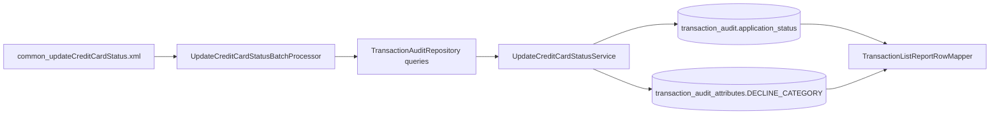

# Status and Curable Mapping Plan

## What I found in code

- `DECLINE_CATEGORY` is **written** in [src/main/java/in/novopay/creditcard/service/UpdateCreditCardStatusService.java](src/main/java/in/novopay/creditcard/service/UpdateCreditCardStatusService.java) from bank response `filler3` and persisted to `transaction_audit_attributes.attr_value`.
- `application_status` is **written** in the same service from bank `status` and stored in `transaction_audit.application_status`.
- Declined-batch selection is controlled in [src/main/java/in/novopay/creditcard/common/processors/UpdateCreditCardStatusBatchProcessor.java](src/main/java/in/novopay/creditcard/common/processors/UpdateCreditCardStatusBatchProcessor.java) using `check_declined_transactions=Y` from [deploy/application/orchestration/common_updateCreditCardStatus.xml](deploy/application/orchestration/common_updateCreditCardStatus.xml).
- Status polling queries are in [src/main/java/in/novopay/creditcard/dao/TransactionAuditRepository.java](src/main/java/in/novopay/creditcard/dao/TransactionAuditRepository.java).
- Report-side reads of `DECLINE_CATEGORY`, `ipa_result`, `card_offer_received`, and `application_status` are in [src/main/java/in/novopay/creditcard/dao/TransactionListReportRowMapper.java](src/main/java/in/novopay/creditcard/dao/TransactionListReportRowMapper.java).
- `transaction_audit_attributes.attr_value` storage schema is in [src/main/resources/sql/migrations/product/V000002__transaction_audit_attribute_table.sql](src/main/resources/sql/migrations/product/V000002__transaction_audit_attribute_table.sql).
- There is **no explicit** `curable`/`non-curable` flag currently; closest proxy signals are `application_status`, `DECLINE_CATEGORY`, `ipa_result`, `card_offer_received`.

## Current status behavior to normalize

- Code uses multiple status vocabularies: `APPROVED`, `DISAPPROVED`, `DECLINE`, `REJECTED`, `SUCCESS`, `FAIL`, `NA`, `EXPIRED`.
- Declined-batch path excludes only `APPROVED`, while regular batch excludes `APPROVED`, `DISAPPROVED`, `DECLINE`.
- Resume filtering defaults to excluding `REJECTED,DISAPPROVED` (not always `DECLINE`).

## Recommended implementation direction

- Introduce a single derivation method (service-level helper) to compute `isCurable` from normalized inputs: `application_status` + `DECLINE_CATEGORY`.
- Apply rule: only set curable when status is `DECLINED` or `DISAPPROVED` **and** decline category belongs to a curated curable set.
- Keep curability decision in one place and consume it in batch pick/read/report flows instead of duplicating checks.
- Optionally persist derived `is_curable` attribute in `transaction_audit_attributes` for easy downstream reporting/filtering.

## Data flow map

## Validation checklist after implementation

- Verify writes: `application_status`, `DECLINE_CATEGORY`, and derived curable value are persisted consistently.
- Verify pick logic: declined/disapproved leads are selected only when derived curable is true.
- Verify read/report logic: curable/non-curable output matches source status + decline category combinations.
- Add/adjust unit tests for derivation and batch selection paths.

