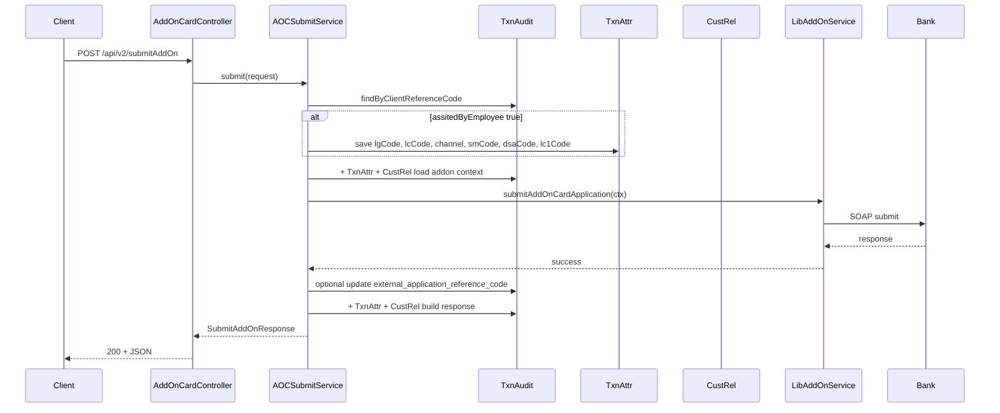

# Submit AddOn API Wrapper Plan

## Scope and branches

- **Lib repo (novopay-platform-lib):**
  - **3-rec support (bank can send 3 customer details in `<rec>`):** Implement **in** the existing branch `ddp-fea-addon-credit-card-request-application` itself (no new branch for this).
  - **Additional lib changes:** Only if the requirement needs *other* lib changes beyond what is already in `ddp-fea-addon-credit-card-request-application` (and beyond the 3-rec support above), create a **new branch from** `ddp-fea-addon-credit-card-request-application` with prefix `ddp-fea-` for those additional changes.
- **CC repo (novopay-platform-creditcard-management):** The wrapper is additional work. Create a **new branch from** base `ddp-fea-dsa-add-on` with prefix `ddp-fea-` (e.g. `ddp-fea-addon-submit-wrapper`). Branch naming convention: same `ddp-fea-` prefix in both repos.

## Key files and references

- **Controller:** [AddOnCardController.java](novopay-platform-creditcard-management/src/main/java/in/novopay/creditcard/controller/AddOnCardController.java) — add new endpoint here.
- **Lib submit flow:** [SubmitAddOnCardApplicationService](novopay-platform-lib/infra-transaction-hdfc/src/main/java/in/novopay/infra/hdfc/api/loanoncard/util/SubmitAddOnCardApplicationService.java) (builds 400-char rec, calls bank, parses 200-char response); invoked via [AddOnCardServiceHdfc](novopay-platform-lib/infra-transaction-hdfc/src/main/java/in/novopay/infra/transaction/hdfc/service/impl/AddOnCardServiceHdfc.java) → [AddOnCardServicePartnerDiscoveryService](novopay-platform-lib/infra-transaction-interface/src/main/java/in/novopay/infra/transaction/service/impl/AddOnCardServicePartnerDiscoveryService.java).
- **Existing patterns:** [SubmitLoanOnCardsProcessor](novopay-platform-creditcard-management/src/main/java/in/novopay/creditcard/loc/processors/SubmitLoanOnCardsProcessor.java) (orchestration + processor calling lib); [AOCCardSummaryService](novopay-platform-creditcard-management/src/main/java/in/novopay/creditcard/service/AOCCardSummaryService.java) (loads transaction audit, calls lib, builds response; re-use `addRecipientData` and attribute/audit usage).
- **Data:** [TransactionAuditRepository](novopay-platform-creditcard-management/src/main/java/in/novopay/creditcard/dao/TransactionAuditRepository.java) (e.g. `getTransactionAuditLimit1`), [TransactionAuditAttributesDAOService](novopay-platform-creditcard-management/src/main/java/in/novopay/creditcard/dao/TransactionAuditAttributesDAOService.java), [CustomerRelationshipDetailsDaoService](novopay-platform-creditcard-management/src/main/java/in/novopay/creditcard/dao/CustomerRelationshipDetailsDaoService.java), [LOCUtils.createOrUpdateAttribute](novopay-platform-creditcard-management/src/main/java/in/novopay/creditcard/loc/util/LOCUtils.java).

---

## 1. API contract and request/response DTOs

**Request (POST /api/v2/submitAddOn):**

- `clientReferenceNumber` (String, mandatory)
- `assitedByEmployee` (boolean, mandatory)
- Optional (when `assitedByEmployee` is true, persist in `transaction_audit_attributes`; when false, API must not fail if absent): `lgCode`, `lcCode`, `channel`, `smCode`, `dsaCode`, `lc1Code` (all String). Note: doc typo "assitedByEmployee" to be kept for API compatibility.

**Response (200):**

- `clientReferenceNumber`, `externalReferenceNumber`, `cardVariant`, `address`, `recipientName` (List).

**Behavior:**

- If `assitedByEmployee == true`: persist `lgCode`, `lcCode`, `channel`, `smCode`, `dsaCode`, `lc1Code` in `transaction_audit_attributes` for the audit row identified by `clientReferenceNumber` (attr_key e.g. `lg_code`, `lc_code`, `channel`, `sm_code`, `dsa_code`, `lc1_code`).
- If `assitedByEmployee == false`: do not require these fields; accept request even when they are null/empty.

---

## 2. Implementation approach: service-first (with optional orchestration)

**Preferred:** Implement a dedicated service (e.g. `AOCSubmitApplicationService`) in the CC repo that:

1. Validates `clientReferenceNumber` (mandatory) and loads `TransactionAudit` by `client_reference_code`.
2. If `assitedByEmployee` is true and any of the code/channel fields are present, store them in `transaction_audit_attributes` via existing `LOCUtils.createOrUpdateAttribute` (or equivalent) for that `transaction_audit_id`.
3. Builds `ExecutionContext` for the lib: partner code, and all fields required by [SubmitAddOnCardApplicationService](novopay-platform-lib/infra-transaction-hdfc/src/main/java/in/novopay/infra/hdfc/api/loanoncard/util/SubmitAddOnCardApplicationService.java) (e.g. `aan`, `addon_name`, `pan_card`, `relationship`, `date_of_birth`, `mem_category`, `mem_sub_cat`, `customer_id`, `mobile_number`, `email`) from:
  - `TransactionAudit` (e.g. `productCode` → card, `customerIdentifierValue` → mobile, `externalApplicationReferenceCode` → aan if already set)
  - `transaction_audit_attributes` (e.g. `aan` from attributes if stored by card summary flow)
  - `customer_relationship_details` for the same `transaction_audit_id` (for add-on name, PAN, relationship, DOB, etc.). If multiple recipients, use the first or the one that represents the “primary” add-on for this submit; align with existing AOC flow.
4. Calls `AddOnCardService.submitAddOnCardApplication(executionContext)` (via existing lib interface used in CC).
5. On success, builds response:
  - **externalReferenceNumber:** from `transaction_audit.getExternalApplicationReferenceCode()` (and if lib/bank returns a new external ref, persist it to `transaction_audit` and then use it in response).
  - **cardVariant:** from `transaction_audit_attributes` (attr_key e.g. `card_variant` or from existing AOC attribute key used in [AOCCardSummaryService](novopay-platform-creditcard-management/src/main/java/in/novopay/creditcard/service/AOCCardSummaryService.java) setCardVariant / LogoMaster).
  - **address:** from `transaction_audit_attributes` (attr_key e.g. `customer_address` or equivalent used in AOC).
  - **recipientName:** list of names from `customer_relationship_details` for this `transaction_audit_id` (re-use [AOCCardSummaryService.addRecipientData](novopay-platform-creditcard-management/src/main/java/in/novopay/creditcard/service/AOCCardSummaryService.java) pattern: get list by `transactionAudit.getId()`, map to names). If the bank returns up to 3 recipients in the response (see below), merge or prefer bank-provided names when available.

**Optional orchestration:** If the team prefers consistency with LOC (e.g. submitLoanOnCards), add an orchestration XML (e.g. in `deploy/application/orchestration/`) with a request name like `submitAddOn`, validators for `client_reference_code` and `assitedByEmployee`, and a single processor that delegates to the same service logic. The controller would then either call the service directly or trigger the orchestration by request name (depending on how other similar APIs are invoked in this codebase). Given [AddOnCardController](novopay-platform-creditcard-management/src/main/java/in/novopay/creditcard/controller/AddOnCardController.java) currently uses services directly (e.g. `addOnCardService.generateConsentLink`, `cardSummaryService.getCardSummary`), **direct service call from controller is the natural fit** unless you standardize on orchestration for all AOC flows.

---

## 3. Lib: support for 3 recipients in `<rec>` (in ddp-fea-addon-credit-card-request-application)

- **Done in:** branch `ddp-fea-addon-credit-card-request-application` (no new lib branch for this).
- Current lib parses a **single** [rec](novopay-platform-lib/infra-transaction-hdfc/src/main/java/in/novopay/infra/hdfc/api/loanoncard/pojo/Msg.java) in the response (`emsg.getMsg().getRec().getContent()`).
- Implement support for bank sending **up to 3** `<rec>` elements (3 customer/recipient details):
  - Extend parsing to support multiple `rec` (e.g. `List<Rec>` in `Msg` or parse response XML to collect all `<rec>` contents).
  - Expose recipient-related data (e.g. list of names) in `ExecutionContext` so the CC repo can populate `recipientName` from bank when available.
- **Place of change:** [SubmitAddOnCardApplicationService.prepareResponse](novopay-platform-lib/infra-transaction-hdfc/src/main/java/in/novopay/infra/hdfc/api/loanoncard/util/SubmitAddOnCardApplicationService.java) and [parseInnerRec](novopay-platform-lib/infra-transaction-hdfc/src/main/java/in/novopay/infra/hdfc/api/loanoncard/util/SubmitAddOnCardApplicationService.java) (or equivalent response XML parsing). If the bank spec uses a single rec with multiple recipient names embedded in fixed positions, parsing may stay single-rec but extract a list of names.
- **CC repo:** Use bank-provided recipient names (if any) for `recipientName`; otherwise keep using `customer_relationship_details` as today.

---

## 4. Controller and wiring

- In [AddOnCardController](novopay-platform-creditcard-management/src/main/java/in/novopay/creditcard/controller/AddOnCardController.java):
  - Add `POST /api/v2/submitAddOn` (or under existing base path if API design uses `/api/v2/addOnCard/submitAddOn` — align with the 3.7 spec you have).
  - Map request body to a DTO matching the request contract (with `assitedByEmployee` and optional code/channel fields).
  - Call the new submit service; return 200 with the response DTO (clientReferenceNumber, externalReferenceNumber, cardVariant, address, recipientName).
  - Use existing header handling where needed (e.g. USER_ID, CLIENT_CODE, TENANT_CODE, STAN, CHANNEL_CODE) for audit/context.
- Ensure the service is injected and the lib’s `AddOnCardService` (partner discovery) is available (already in use via LOC/AOC flows).

---

## 5. Persistence and attribute keys

- **transaction_audit:** Already has `external_application_reference_code`. After successful bank submit, if the lib/bank returns an external reference, update this column for the audit row.
- **transaction_audit_attributes:** Store when `assitedByEmployee` is true: `lg_code`, `lc_code`, `channel`, `sm_code`, `dsa_code`, `lc1_code`. Use existing [TransactionAuditAttributesDAOService](novopay-platform-creditcard-management/src/main/java/in/novopay/creditcard/dao/TransactionAuditAttributesDAOService.java) / [LOCUtils.createOrUpdateAttribute](novopay-platform-creditcard-management/src/main/java/in/novopay/creditcard/loc/util/LOCUtils.java). For response: read `card_variant` and address-related attribute key(s) already used in AOC (e.g. from card summary or account info flow).
- **customer_relationship_details:** Already used for recipient list; re-use [CustomerRelationshipDetailsDaoService.getCustomerRelationShipDetails](novopay-platform-creditcard-management/src/main/java/in/novopay/creditcard/dao/CustomerRelationshipDetailsDaoService.java) and map to `recipientName` list.

---

## 6. Tests

- **Lib repo:** Existing [SubmitAddOnCardApplicationServiceTest](novopay-platform-lib/infra-transaction-hdfc/src/test/java/in/novopay/infra/hdfc/api/loanoncard/util/SubmitAddOnCardApplicationServiceTest.java) already validates request rec length (400), field positions, and response parsing (200-char rec). Keep and extend if you add multiple-rec or recipient-name parsing.
- **CC repo:**
  - **Unit tests:** Service tests (mock `TransactionAuditDaoService`, `AddOnCardService`, attributes DAO, customer relationship DAO): (1) when `assitedByEmployee` is true and codes are provided, attributes are saved; (2) when `assitedByEmployee` is false and codes are missing, no error and no attribute write for those; (3) response mapping from audit + attributes + customer_relationship_details.
  - **Integration test (optional):** One test that runs the full flow with mocks for the bank (lib) to ensure the API returns 200 and correct response shape.
- Re-use lib tests to ensure request formatting (spacing, lengths) remains correct.

---

## 7. Postman / cURL

- Provide a sample **Postman request** and **cURL** for:
  - `POST /api/v2/submitAddOn`
  - Headers: same as other add-on APIs (e.g. USER_ID, CLIENT_CODE, TENANT_CODE, STAN, CHANNEL_CODE).
  - Body (JSON): `clientReferenceNumber`, `assitedByEmployee`, and optionally `lgCode`, `lcCode`, `channel`, `smCode`, `dsaCode`, `lc1Code`.
- Example cURL (placeholder values):

```bash
curl -X POST 'http://localhost:port/api/v2/submitAddOn' \
  -H 'Content-Type: application/json' \
  -H 'user_id: <userId>' \
  -H 'client_code: <clientCode>' \
  -H 'tenant_code: <tenantCode>' \
  -H 'stan: <stan>' \
  -H 'channel_code: <channelCode>' \
  -d '{
    "clientReferenceNumber": "<client_ref>",
    "assitedByEmployee": true,
    "lgCode": "",
    "lcCode": "",
    "channel": "",
    "smCode": "",
    "dsaCode": "",
    "lc1Code": ""
  }'
```

---

## 8. Summary flow (high level)




---

## 9. Build and verification

- **Lib repo (on `ddp-fea-addon-credit-card-request-application`):**
  - Build: from lib root run the Gradle build for `infra-transaction-hdfc` (e.g. `./gradlew :novopay-platform-lib:infra-transaction-hdfc:build` or project-specific build command).
  - Run tests: [SubmitAddOnCardApplicationServiceTest](novopay-platform-lib/infra-transaction-hdfc/src/test/java/in/novopay/infra/hdfc/api/loanoncard/util/SubmitAddOnCardApplicationServiceTest.java) and any new tests for 3-rec parsing.
- **CC repo (on new branch from `ddp-fea-dsa-add-on`):**
  - Ensure dependency on lib resolves the correct version (branch/build from `ddp-fea-addon-credit-card-request-application`).
  - Build: from CC repo root run full build (e.g. `./gradlew build`).
  - Run tests: unit tests for the new submit service and controller; optionally integration test.
- **E2E:** After both repos build and tests pass, run the app and hit `POST /api/v2/submitAddOn` with the provided cURL/Postman to verify 200 and response shape.

---

## 10. Checklist (concise)

- **Lib:** Implement 3-rec support in branch `ddp-fea-addon-credit-card-request-application`; create a new branch from it only if further lib changes are required.
- **CC:** Create new branch from `ddp-fea-dsa-add-on` with `ddp-fea-` prefix (e.g. `ddp-fea-addon-submit-wrapper`) for the wrapper.
- Add request/response DTOs for submitAddOn (handle optional codes and `assitedByEmployee`).
- Implement `AOCSubmitApplicationService`: validate, conditionally persist codes/channel, build context from audit + attributes + customer_relationship_details, call lib, build response (externalRef, cardVariant, address, recipientName).
- Add `POST /api/v2/submitAddOn` in AddOnCardController.
- Re-use existing attribute keys and CustomerRelationshipDetails for response; update transaction_audit.external_application_reference_code if bank returns it.
- Add unit (and optionally integration) tests; keep lib request/response tests.
- Document Postman/cURL for the new API.

