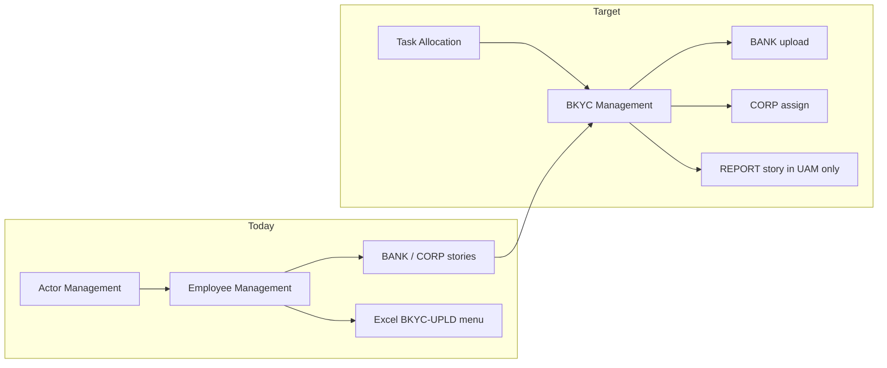

# Task Allocation UAM remount + menus

Product is locked on [HDP-8937 400531](https://novopay.atlassian.net/browse/HDP-8937?focusedCommentId=400531), [HDP-9031 400528](https://novopay.atlassian.net/browse/HDP-9031?focusedCommentId=400528), [HDP-9006 400530](https://novopay.atlassian.net/browse/HDP-9006?focusedCommentId=400530). No further product questions for this slice.

## Locked target tree

Role Management (left column = epic):

- **Task Allocation** (new epic, Title Case; code e.g. `TASK-ALLOC`)
  - **BKYC Management** (one new feature, code e.g. `TASK-ALLOC-BKYC`)
    - story `TASK-ALLOC-BKYC-BANK` → `UPLOAD` + `UPLOAD-VIEW`
    - story `TASK-ALLOC-BKYC-CORP` → `VIEW` + `ASSIGN`
    - story `TASK-ALLOC-BKYC-REPORT` → `REPORT-VIEW` (UAM tree only; portal Reports stay existing Superset)

Admin left-nav (different label, same stories):

- **Task Management**
  - Bank: Upload + history (`UPLOAD` / `UPLOAD-VIEW`)
  - Corporate CBC/CBF/BCFI: Assignment list + Assign/Reassign/Unassign (`VIEW` / `ASSIGN`)
  - Reports: **not** under this section

Do **not** rename permission/usecase codes. Do **not** move `TASK-BKYC` / `PRDCT-BKYC` (APK). Do **not** change TaskAlloc Java or gateway usecase mappings for this remount.

## Current QA (problem)

Stories `TASK-ALLOC-BKYC-BANK` / `CORP` / `REPORT` sit under feature `ORGN-EMPL` → epic `ACTOR-MGMT`. Admin sidebar still nests Excel `BKYC-UPLD` under Actor → Employee Management (`sidebar.data.ts`), not `TASK-ALLOC-BKYC-*`.

## Workstreams (order)

### 1. Auth Flyway remount (blocking)

Repo: `novopay-platform-authorization` on latest remote **`ddp-fea-common-scripts`** (discover tip seq; next unused after current `V4000125` or whatever is tip after fetch). Same `ddp-fea-*` branch name as other BKYC work for the PR.

New migration (code-based, idempotent):

- INSERT epic `TASK-ALLOC` / display **Task Allocation** if missing.
- INSERT feature `TASK-ALLOC-BKYC` / display **BKYC Management**, `epic_id` = that epic, if missing.
- UPDATE `user_story.feature_id` for `TASK-ALLOC-BKYC-BANK`, `TASK-ALLOC-BKYC-CORP`, `TASK-ALLOC-BKYC-REPORT` to the new feature (remove from `ORGN-EMPL`).
- `role_group__feature__mapping`: map new feature to the same role_groups that should see it in Role Management (at least EMPL / corporate groups used for CBC/CBF/BCFI + bank maker). Mirror Field Force pattern in `V4000079`. Do not invent numeric ids.
- Leave `permission`, `usecase`, `user_story__permission__mapping` rows as-is (already keyed by code).

Verify SELECT: stories’ feature/epic codes; zero BANK/CORP/REPORT still under `ORGN-EMPL`.

### 2. Default role grants (ops-safe Flyway)

Same auth migration or a second file if grants need a later seq.

INSERT `role__permission__mapping` **JOIN on `role.code` + `permission.code`**, `WHERE NOT EXISTS`. Personas from 400528:

- Bank maker: `UPLOAD` + `UPLOAD-VIEW` + `REPORT-VIEW`
- CBC / CBF / BCFI: `VIEW` + `ASSIGN` + `REPORT-VIEW`

**Discovery first (read-only):** map persona names to real `ddp_authorization.role.code` on QA (prior seed used `BC-CNTRL-MGR` / `BC-REGN-MGR` only if present; 0 rows OK). Do not hardcode role `id` 29 / permission `id` 707.

Grants remain UAM-attachable; this is default only. Missing role codes → 0 rows, not a failed migration.

### 3. Excel UAM template

Update `Role and Permission Management.xlsx` (UAM story, not Flyway) to the new epic/feature path. Rows by **code**. Owners: same as HDP-8937 Excel process.

### 4. Admin FE (HDP-9006) - `novopay-platform-webapp`

- New sidebar epic **Task Management** (i18n). Submenus: Upload (BANK story) vs Assignment (CORP story). Gate with `getApiKeyMappingValueForUserStory('TASK-ALLOC-BKYC-BANK'|'-CORP')` and permission codes `TASK-ALLOC-BKYC-*` in `permission-utility.service.ts`.
- **Remove** Manipal TaskAlloc upload from Actor → Employee (`US_BKYC_UPLD` / Excel `BKYC-UPLD`). Leave DVKYC as-is.
- Hide section if user has none of those permissions. Block routes/deep links the same way.
- Assignment screens: if `getTaskList` / assign UI is not in this repo yet, FE work is menu + route shells wired to existing ADM APIs (HDP-9007/9993). Do not invent APIs.
- Reports: keep existing Reports/Superset entry; gate with `REPORT-VIEW` there, not under Task Management.

FE branch: same `dsa-*` / BKYC FE line as other admin work (`dsa-qa` sync when needed).

### 5. Explicitly out of scope

- TaskAlloc Java, gateway `V4000044` usecase remaps, agent APK `TASK-BKYC`.
- Corporate-id config `V4000858` (separate masterdata track).
- Restoring QA gateway mapping DELETE (`QA_MANUAL_WRITES` #5) unless a 11017 reappears after remount.
- Central vs Regional PAN-India data filtering (older 9031 thread).

## Tickets / PRs

| Slice | Ticket | Repo |
| --- | --- | --- |
| UAM remount + grants | [HDP-8937](https://novopay.atlassian.net/browse/HDP-8937) follow-up (or new auth sub-task under HDP-8921) | authorization |
| Default personas | [HDP-9031](https://novopay.atlassian.net/browse/HDP-9031) | same Flyway + Excel |
| Admin menus | [HDP-9006](https://novopay.atlassian.net/browse/HDP-9006) | webapp |

PR bodies: `.cursor/rules/bkyc-pr-description.mdc` (`[QA]` title, mermaid, journey table). No Jira comments unless asked.

## Prove

- Role Management UI: Task Allocation group, not under Actor.
- Bank user: Task Management → Upload only; cannot open Assignment (UI + 11017/gateway).
- Corporate user: Assignment only; cannot upload.
- No permission: no Task Management.
- APK agent unchanged.
- Sticky QA pack Seq `141`-`142` still n/a until FE scored.

Do not run writes on QA until you approve the exact SQL.
