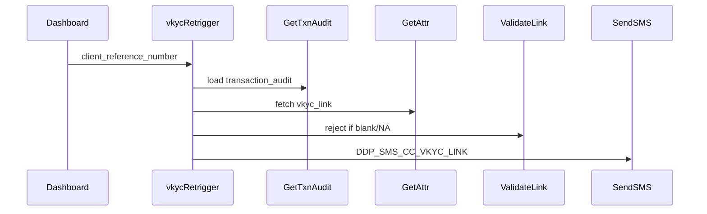
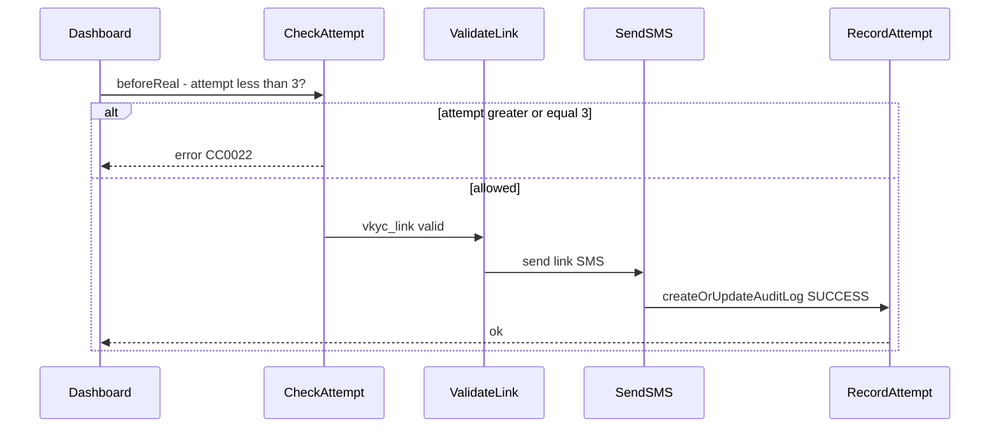

# VKYC link resend - 3 attempt limit (DSA CC)

## Scope (confirmed)

- **API:** [`vkycRetrigger`](deploy/application/orchestration/common_vkyc_retrigger.xml) only (`DDP_SMS_CC_VKYC_LINK`). **Out of scope:** `dvkycRetrigger`.
- **Counting:** Same model as exhausted OTP attempts in CC - track attempts in `transaction_audit_logs.attempt`, increment on each successful resend, block when limit reached. Initial submit SMS from `manageCreditCardApplication` does **not** count (only `vkycRetrigger` API calls).

## Current flow (no limit)



[`ValidateVkycLinkProcessor`](src/main/java/in/novopay/creditcard/common/processors/ValidateVkycLinkProcessor.java) only checks link presence. No attempt tracking exists today.

## Reference pattern (OTP / EKYC)

CC already limits retries via `transaction_audit_logs`:

| Flow | Where checked | When incremented | Limit |
|------|---------------|------------------|-------|
| EKYC OTP | `beforeReal`: `getAttempt() >= maxAttempt` | `createOrUpdateAuditLog` on success | config default 3 |
| Document upload | `beforeReal`: `getAttempt() >= maxAttempt` | `postReal` audit log | config default 3 |
| Fintech OTP (DSA) | Redis cache `OTP_ATTEMPT_{clientRef}_{mode}` | cache increment in `onReal` | hardcoded `> 3` |

**Use the audit-log pattern** (EKYC / document upload), not Redis. VKYC resend is a per-lead lifetime cap; OTP Redis TTL (`180000ms`) would incorrectly reset the counter.

Mechanics to mirror:

- **State key:** API name from [`TransactionAuditUtil.getServiceStage`](src/main/java/in/novopay/creditcard/utils/TransactionAuditUtil.java) default branch -> `vkycRetrigger` (no util change needed).
- **Read:** [`AbstractCreditCardManager.getAttempt()`](src/main/java/in/novopay/creditcard/transaction/processor/AbstractCreditCardManager.java) reads `transaction_audit_logs.attempt` for that state.
- **Increment:** [`createOrUpdateAuditLog`](src/main/java/in/novopay/creditcard/transaction/processor/AbstractCreditCardManager.java) -> [`TransactionAuditLogCapture.saveAuditTransactionLog`](src/main/java/in/novopay/creditcard/components/stages/TransactionAuditLogCapture.java) increments attempt on each SUCCESS save.
- **Guard:** `beforeReal`: `getAttempt() >= maxAttempts` -> throw (blocks 4th resend after 3 successful ones), same as [`UploadCreditCardDocumentProcessor.throwExceptionIfAttemptExceeded`](src/main/java/in/novopay/creditcard/transaction/processor/UploadCreditCardDocumentProcessor.java).



## Implementation

### 1. New processor - attempt guard

Add [`ValidateVkycLinkResendAttemptProcessor`](src/main/java/in/novopay/creditcard/common/processors/ValidateVkycLinkResendAttemptProcessor.java) extending `AbstractCreditCardManager`:

- `@NovopayConfig(key = "hdfc.cc.vkyc.link.resend.max.attempts", defaultValue = "3")`
- `beforeReal`: if `getAttempt(executionContext, transactionAudit) >= Integer.parseInt(maxAttempts.get())` throw `NovopayFatalException("CC0022", "Maximum VKYC link resend attempts reached.")`
- `onReal` / `postReal`: no-op

### 2. New processor - record successful resend

Add [`RecordVkycLinkResendAttemptProcessor`](src/main/java/in/novopay/creditcard/common/processors/RecordVkycLinkResendAttemptProcessor.java) extending `AbstractCreditCardManager`:

- `onReal`: `createOrUpdateAuditLog(executionContext, transactionAudit, TransactionAuditLogsStatus.SUCCESS)`
- Placed **after** `sendSMSProcessor` so failed SMS does not consume an attempt.

### 3. Orchestration update

Edit [`common_vkyc_retrigger.xml`](deploy/application/orchestration/common_vkyc_retrigger.xml):

```xml
<Processor bean="getTransactionAuditProcessor">...</Processor>
<Processor bean="validateVkycLinkResendAttemptProcessor"/>
<Processor bean="getTransactionAuditAttrProcessor">...</Processor>
<Processor bean="validateVkycLinkProcessor"/>
<Control method="regExp" pattern="${vkyc_link}" condition="!" value="NA">
    <Processor bean="sendSMSProcessor" .../>
    <Processor bean="recordVkycLinkResendAttemptProcessor"/>
</Control>
```

`record` stays inside the `vkyc_link != NA` control so NA links never increment.

### 4. Dashboard resume list - hide resend button

Update [`GetTnxResumeListProcessor`](src/main/java/in/novopay/creditcard/transaction/processor/GetTnxResumeListProcessor.java):

- When computed `vkyc_available` would be `YES` (VKYC pending, not expired), also load `transaction_audit_logs` for state `vkycRetrigger`.
- If `attempt >= maxAttempts` (inject same `@NovopayConfig`), set `vkyc_available` to `DISABLE` instead of `YES`.
- No change to `DVKYC` branch (`dvkycRetrigger` remains out of scope).

### 5. Masterdata

Add flyway in `novopay-platform-masterdata-management` for:

- Config row: `hdfc.cc.vkyc.link.resend.max.attempts` = `3`
- Error message for `CC0022` (notification/message catalog if that is how `CC0021` is resolved)

### 6. Tests (required per repo rules)

| Test class | Cases |
|------------|-------|
| `ValidateVkycLinkResendAttemptProcessorTest` | T1: attempt 0-2 allowed; T2: attempt 3 throws CC0022; T3: respects config override |
| `RecordVkycLinkResendAttemptProcessorTest` | T1: increments audit log on success |
| `GetTnxResumeListProcessorTest` | T1: pending+not expired+attempts exhausted -> DISABLE; T2: pending+attempts remaining -> YES (regression) |

Run targeted Gradle tests for touched packages.

### 7. Proof (post-build)

Bob E2E scenario:

1. Seed lead with `vkyc_status=PENDING`, valid `vkyc_link`, not expired.
2. Call `vkycRetrigger` 3 times -> SUCCESS.
3. 4th call -> FAIL `CC0022`.
4. `getTnxResumeList` -> `vkyc_available=DISABLE` for that lead.

## Files touched (summary)

- New: `ValidateVkycLinkResendAttemptProcessor.java`, `RecordVkycLinkResendAttemptProcessor.java` + tests
- Edit: `common_vkyc_retrigger.xml`, `GetTnxResumeListProcessor.java`
- Edit tests: `GetTnxResumeListProcessorTest.java`
- New flyway: masterdata config + `CC0022` message

## Out of scope

- `dvkycRetrigger` (expired VKYC / DVKYC link resend)
- Frontend changes (backend drives visibility via `vkyc_available` + API error)
- Counting initial submit VKYC SMS toward the limit
